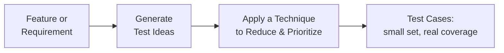

# Mermaid Guidelines

How to build a compliant TestAtlas diagram, start to finish. Full design reasoning lives in `docs/architecture/VISUAL_STANDARDS.md`; this document is the practical how-to.

## When to add a diagram at all

Use one when it makes a relationship, flow, or comparison genuinely easier to understand than prose or a table would. Don't add one because a module "should have a diagram" — a well-made table or a short example is often better. See `STYLE_GUIDE.md` section 7.

## The five-step process

### 1. Pick a diagram type that matches what you're showing

| You're showing... | Use |
|---|---|
| A sequence of steps or a process | `flowchart` (LR or TD) |
| A decision with branching outcomes | `flowchart` with `{decision}` diamond nodes |
| An object moving between states over time | `stateDiagram-v2` |
| A timeline or phased rollout | `timeline` or a `flowchart` styled as one — see `assets/diagrams/templates/timeline.mmd` |
| Two options scored on two independent axes | `quadrantChart` (see the styling warning below) |

### 2. Get the next Visual ID

Every diagram gets a sequential ID (`VIS-001`, `VIS-002`, ...) **within its learning path**, never reused. Check the highest existing ID in `assets/diagrams/<path>/` before assigning the next one. API Testing uses a `VIS-API-XXX` prefix to keep its sequence visually distinct from Manual Testing's plain `VIS-XXX` — follow whichever prefix convention your path has already established, or ask if starting a brand-new path.

### 3. Write the diagram with the two mandatory accessibility lines



`accTitle` and `accDescr` are always the first two lines after the diagram-type declaration, no exceptions. `accDescr` describes the *relationship or sequence*, not a flat list of node labels — write it as if narrating the diagram to someone who can't see it, the same discipline as real image alt text.

### 4. Don't style it — inherit the theme

TestAtlas's Mermaid theme (brand teal, both light and dark mode) is configured once, site-wide, in `docusaurus.config.ts`. Every diagram inherits it automatically. Don't add inline `style` directives or custom `classDef` colors — the one exception is when semantic color genuinely matters (e.g., a red "Reopened" defect state), and even then, prefer Mermaid's built-in `classDef` over ad hoc per-node styling, so it stays consistent if the theme ever changes.

### 5. Save the mirror file and validate

- Copy the exact diagram (including `accTitle`/`accDescr`) into `assets/diagrams/<path>/VIS-XXX-slug.mmd`, with a two-line header comment stating the Visual ID and which module uses it:
  ```
  %% VIS-XXX — Diagram Title
  %% Used in: NN-module-slug.md
  ```
- The inline fence in the `.md` file is authoritative; the `.mmd` file is a byte-identical mirror for indexing and reuse. If you ever edit one, edit both in the same commit — a drifted mirror is a defect, not a style nitpick.
- Run `npm run validate:diagrams`. This is the **only** thing that actually catches invalid Mermaid syntax — `npm run build` does not, because Mermaid renders entirely client-side after page load. A build can succeed with a broken diagram on the page. This already happened once for real (an unquoted, space-containing `quadrantChart` point label built clean and would have silently failed to render) — this is why the validator exists.

## Common syntax traps

- **`quadrantChart` point labels containing spaces must be quoted**: `"Payment confirmation failure": [0.85, 0.85]`, not `Payment confirmation failure: [0.85, 0.85]`. This is the exact bug that motivated building the validator.
- **`<br/>` for line breaks inside node labels**, not literal newlines.
- **Arrow labels with special characters** (`-->|"contains: comma"|`) need quoting the same way node labels do.

## Templates

Generic, unfilled starting points for each category live in `assets/diagrams/templates/` (`hero-illustration.mmd`, `process-flow.mmd`, `decision-tree.mmd`, `timeline.mmd`). Copy from there rather than starting from a blank file, so every module's diagrams share the same visual vocabulary.

## What NOT to do

- Don't reuse a Visual ID, even for a diagram you later delete — IDs are permanent within a path.
- Don't skip the mirror file "just this once" — it's how diagrams get indexed and reused across the knowledge graph.
- Don't hand-author raster images or import external diagram tools' exports — Mermaid or hand-authored SVG only, per `STYLE_GUIDE.md`.
- Don't add a diagram to a module that already makes its point clearly in prose or a table.
