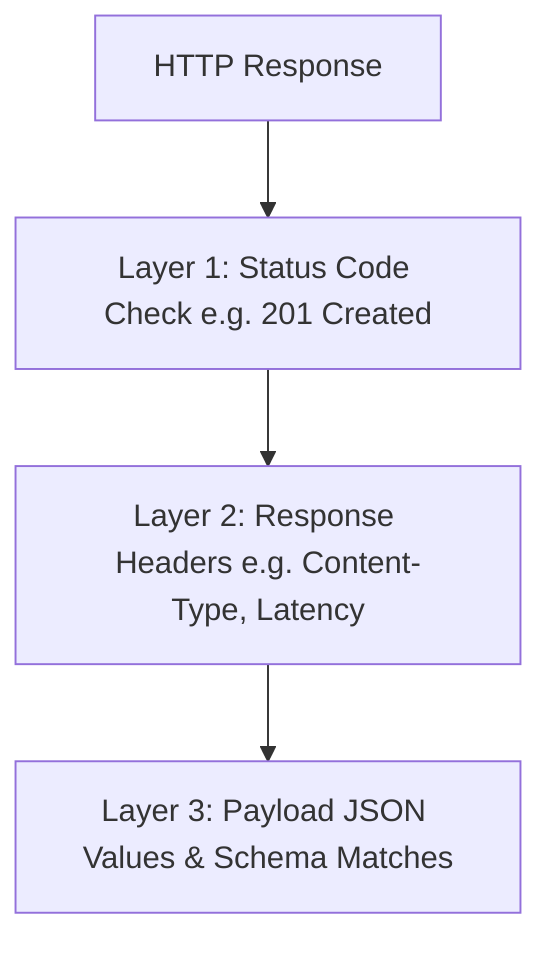

# The Art of API Assertions: Building Bulletproof API Test Suites in Postman

Many API tests stop at verifying a `200 OK` response status code. While checking status codes is a good start, it does not guarantee that the backend did its job. 

To build bulletproof API test suites, we must assert on the response body, data types, header configurations, and database integrations.

<!-- truncate -->

## 🧩 Why Status Codes Aren't Enough

An API endpoint can return a `200 OK` status code while serving an empty JSON body, throwing silent SQL errors, or outputting null user parameters.

Without assertions checking the structure and values of the payload, critical defects pass directly to client browsers.



## ⚙️ Writing Multi-Layered Postman Assertions

Here is a Postman JavaScript assertion script that validates status, structure, and values:

```javascript
// 1. Validate Status Code and Time limits
pm.test("Status code is 201 Created", function () {
    pm.response.to.have.status(201);
});

pm.test("Response time is under 800ms", function () {
    pm.expect(pm.response.responseTime).to.be.below(800);
});

// 2. Validate Essential Headers
pm.test("Content-Type is JSON", function () {
    pm.response.to.have.header("Content-Type");
    pm.expect(pm.response.headers.get("Content-Type")).to.include("application/json");
});

// 3. Validate JSON payload structure and properties
pm.test("Response contains correct user variables", function () {
    const jsonData = pm.response.json();
    pm.expect(jsonData).to.have.property("userId");
    pm.expect(jsonData.username).to.eql("ghanendra_sdet");
    pm.expect(jsonData.isActive).to.be.true;
});
```

> [!NOTE]
> Checking specific values (like username string equivalence) is great for smoke tests, but checking schemas is the key to scaling regression automation.

## 📐 Implementing JSON Schema Assertions

JSON Schema validation ensures that the keys, object structures, array listings, and data types return correctly, even when contents change dynamically.

Add a Ajv schema validation directly into your Postman tests:

```javascript
const schema = {
    "type": "object",
    "required": ["id", "email", "roles"],
    "properties": {
        "id": { "type": "integer" },
        "email": { "type": "string", "pattern": "^[^@]+@[^@]+\\.[^@]+$" },
        "roles": { "type": "array", "items": { "type": "string" } }
    }
};

pm.test("Schema is valid", function () {
    pm.response.to.have.jsonSchema(schema);
});
```

> [!WARNING]
> Running tests without schema validations makes it easy to miss when backend developers change integers to strings—which breaks frontend clients but passes simple status checks.
