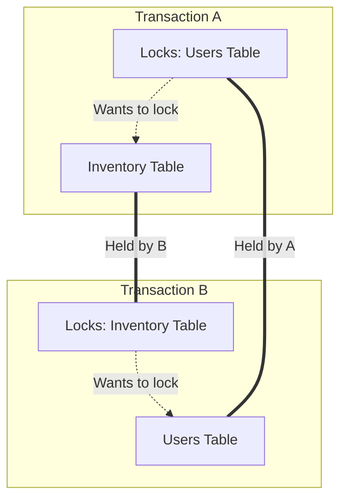

# Database Deadlocks in QA: How to Spot and Test Race Conditions under Load

Many backend bugs only surface when multiple actions occur at the exact same millisecond. Among these, database deadlocks are some of the most frustrating defects.

A deadlock occurs when two transactions hold locks on different resources, and each attempts to acquire a lock on the resource held by the other.

<!-- truncate -->

## 🔄 The Anatomy of a Deadlock

To understand deadlocks, consider an e-commerce inventory update during a flash sale:

- **Transaction A** locks the `Users` table to deduct account credit, then attempts to update the `Inventory` table.
- **Transaction B** locks the `Inventory` table to reserve stock, then attempts to update the `Users` table.

Neither transaction can complete, resulting in a deadlock that forces the database engine to terminate one of the sessions.



## 🔍 How to Identify Deadlocks in QA

When a database deadlock occurs, client APIs typically receive a `500 Internal Server Error`, while system consoles display transaction rollback exceptions.

Run this SQL query against your Postgres database to inspect active locks:

```sql
SELECT 
    blocked_locks.pid     AS blocked_pid,
    blocked_activity.usename  AS blocked_user,
    blocking_locks.pid    AS blocking_pid,
    blocking_activity.usename AS blocking_user,
    blocked_activity.query    AS blocked_statement,
    blocking_activity.query   AS blocking_statement
FROM  pg_catalog.pg_locks         blocked_locks
JOIN pg_catalog.pg_stat_activity blocked_activity ON blocked_activity.pid = blocked_locks.pid
JOIN pg_catalog.pg_locks         blocking_locks 
    ON blocking_locks.locktype = blocked_locks.locktype
    AND blocking_locks.database IS NOT DISTINCT FROM blocked_locks.database
    AND blocking_locks.relation IS NOT DISTINCT FROM blocked_locks.relation
JOIN pg_catalog.pg_stat_activity blocking_activity ON blocking_activity.pid = blocking_locks.pid
WHERE NOT blocked_locks.granted;
```

> [!NOTE]
> If a query hangs or fails with a state like `40P01` in Postgres or `Error 1205` in MySQL, it indicates a deadlock condition.

## 🛠️ Testing for Concurrency Defects

To expose deadlocks during testing, you must simulate concurrent user actions:

- **Use Thread Loops**: Set up JMeter or K6 to send concurrent requests to the same inventory SKU at the exact same millisecond.
- **Vary Data Order**: Test transactions executing processes in different orders (e.g. Transaction A updates table X then Y, while Transaction B updates Y then X).
- **Inspect Isolations**: Verify database transaction isolation levels (e.g., Read Committed vs. Serializable) match system specifications.

> [!TIP]
> Resolving deadlocks typically requires developers to update SQL query execution orders to acquire locks in a consistent sequence, or implement optimistic locking patterns.
