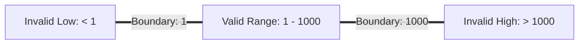

# Equivalence Partitioning: The Tester's Secret to Running 90% Fewer Tests

How do you test an input field that accepts values between `1` and `1000`? Testing every single number is impossible and redundant.

Equivalence Partitioning is a test-design technique that groups input ranges into equivalent classes, allowing you to test a single value from each group to cover the entire set.

<!-- truncate -->

## 📈 The Power of Class Simplification

The core assumption is that if one value in a class works, all other values in that same class will behave identically.

Instead of writing 1,000 test cases, we divide inputs into three primary classes:

| Class Type | Input Range | Expected Output | Sample Test Value |
| :--- | :--- | :--- | :--- |
| **Invalid Low** | Less than 1 | Error message | `0` or `-5` |
| **Valid Range** | 1 to 1000 | Successful input | `450` |
| **Invalid High** | Greater than 1000 | Error message | `1200` |

By selecting one value from each partition, we reduce our test suite size from 1,000 cases to **3 cases** while maintaining coverage.

## 🎯 Pairing with Boundary Value Analysis (BVA)

While Equivalence Partitioning handles standard ranges, programmers often make mistakes at the edges of those ranges (e.g. using `<` instead of `<=`).

To catch these defects, always pair Equivalence Partitioning with Boundary Value Analysis:

- **Invalid Low Boundary**: `0`
- **Valid Lower Edge**: `1`
- **Valid Upper Edge**: `1000`
- **Invalid High Boundary**: `1001`

> [!TIP]
> Testing values just inside and outside the boundaries of your partitions captures 80% of indexing bugs, array overflows, and loop conditions.

## ⚠️ Common Mistakes to Avoid

When applying this technique, look out for these pitfalls:

- **Assuming Uniform Behaviour**: Verify that the class partitions are truly equivalent in the backend logic.
- **Ignoring Null/Special Characters**: Always add separate test cases to verify empty strings, white spaces, and symbols.
- **Forgetting System Limits**: Check if integers or floats have storage limits that trigger exceptions at system thresholds.

> [!IMPORTANT]
> Equivalence Partitioning is a black-box testing strategy. If the backend implementation uses complex conditional trees, review code with developers to update your partitions.
