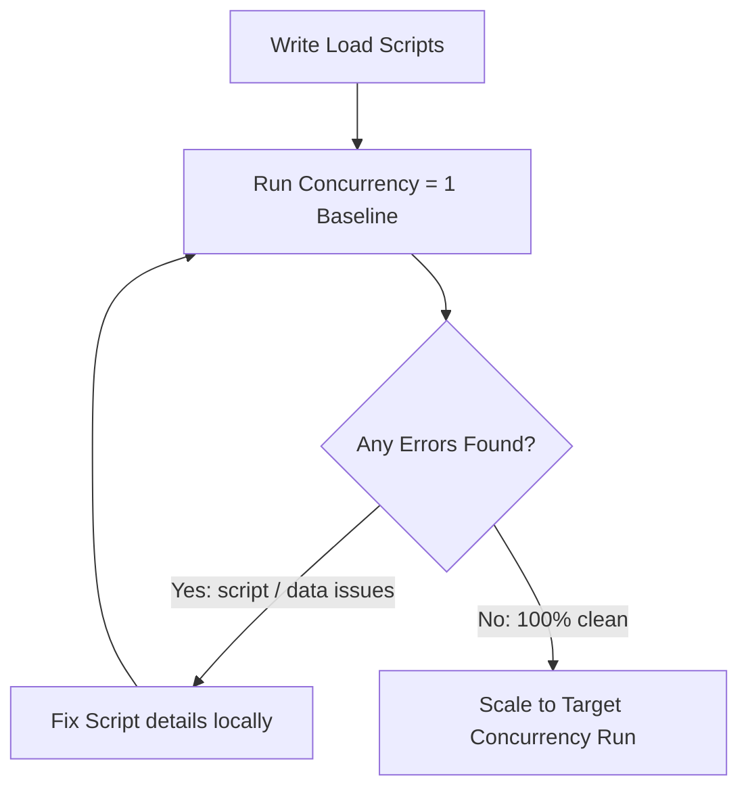

# JMeter Baseline Runs: Why You Must Start Load Tests at Concurrency = 1

When preparing a performance load test, the temptation is to immediately spin up 500 or 1,000 virtual users to see how the system handles the stress. 

However, scaling too quickly can result in debugging nightmares. A baseline run with a single user verifies script stability before scaling up.

<!-- truncate -->

## 🧩 The Danger of Scaling Too Quickly

If you launch a high-concurrency test and immediately get 100% errors, it is difficult to isolate the cause:
- Is it a script error (broken correlation or authentication)?
- Is the database experiencing locks under load?
- Is the network card bottlenecking?
- Has the environment crashed?

Running a single-user test helps you verify that your test configuration is working as expected.



## ⚙️ Running a Headless Baseline

To run a clean baseline, execute JMeter in non-GUI mode with minimal thread variables:

```bash
jmeter -n -t test-plan.jmx -l baseline-results.jtl -Jthreads=1 -Jrampup=1 -Jduration=60
```

*What to verify in the results*:
- **Error Rate**: Should be exactly `0.00%`.
- **Response Payloads**: Open your results file to verify that the HTML or JSON returned contains actual data rather than error messages.
- **Correlation Integrity**: Ensure that tokens, headers, and state keys are capturing and resolving dynamically.

> [!NOTE]
> A single-user baseline run also records your system's "ideal" latencies, providing a reference point to measure degradation as load increases.

## 📊 Establishing Performance Baselines

Once the single-user test is clean, establish a baseline by running a low-concurrency load test (e.g. 5–10 users):

- Run the test for 5–10 minutes to verify resource stability.
- Verify that backend servers maintain low CPU usage (< 20%).
- Ensure your database connection pools are closing connections correctly.

> [!TIP]
> Always verify that your load generation machines (generators) are not experiencing CPU bottlenecking before increasing concurrency.
