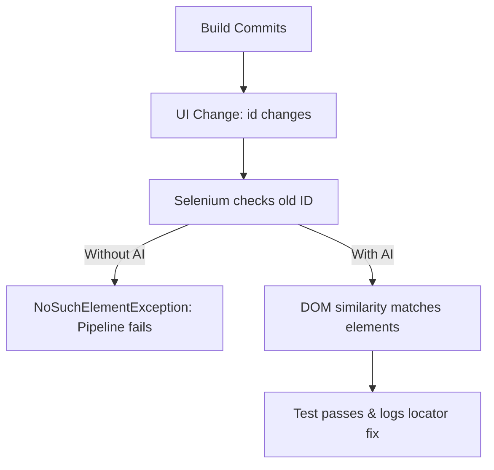

# Beyond XPath: How Self-Healing AI is Reshaping Test Automation Maintenance

Maintaining automated test suites is one of the most time-consuming tasks in software testing. As user interfaces evolve, static element locators (like XPaths, IDs, or CSS Selectors) break, causing automation runs to fail.

Traditional solutions involve manually inspecting DOM trees and updating selector hashes—a tedious process that slows down CI/CD loops.

<!-- truncate -->

## 🛠️ The Brittle Locator Problem

In a typical web application, developers rename elements, modify CSS classes, or restructure layouts to improve user experiences.

When a button with `id="submit-transaction"` changes to `id="btn-submit"`, standard WebDriver runs crash with a `NoSuchElementException`.



## 🧠 Enter Self-Healing Locators

Self-healing test automation bypasses this limitation. Instead of relying on a single selector string, the AI engine builds a **multi-dimensional DOM tree signature** during initial success runs.

When a test executes, the AI captures properties like:
- Parent and sibling DOM relationships
- CSS layout parameters (colors, sizes, alignments)
- Plain text content and labels
- Relative viewport coordinates

> [!NOTE]
> If the primary selector fails during execution, the engine runs a weighted similarity search. If a candidate matches 90% of the attributes, the script heals dynamically and proceeds.

## 💻 Visualizing a Self-Healing Selector Wrapper

Here is a Java wrapper concept that intercept failures and executes similarity fallbacks:

```java
public class SelfHealingWebDriver {
    private WebDriver driver;
    private DOMSignatureService signatureService;

    public WebElement findElement(By primaryLocator) {
        try {
            return driver.findElement(primaryLocator);
        } catch (NoSuchElementException e) {
            // Retrieve backup signatures
            DOMSignature backup = signatureService.getSignatureFor(primaryLocator);
            // Search active DOM using AI similarity logic
            By healedLocator = signatureService.findBestMatch(driver.getPageSource(), backup);
            
            System.out.println("[WARN] Self-healed: " + primaryLocator + " -> " + healedLocator);
            return driver.findElement(healedLocator);
        }
    }
}
```

## 🚀 Key Benefits for Engineering Teams

Implementing self-healing test automation delivers immediate quality lifecycle upgrades:

- **Stable CI/CD Pipelines**: False alerts are minimized, preventing build runs from failing due to minor color adjustments or label updates.
- **Lower Triage Time**: SDETs spend hours verifying real product regressions rather than patching broken XPaths.
- **Improved Test Scope**: Teams can run tests against rapid UI updates without fearing framework updates.

> [!TIP]
> While AI-driven self-healing saves execution time, it does not replace clean code principles. Always instruct developers to use dedicated, stable test attributes like `data-testid="submit-btn"`.
