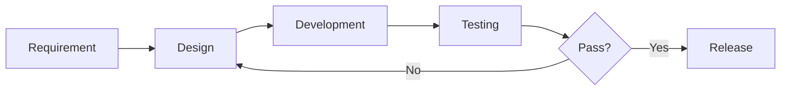

# Content Model

This document defines the standard structure for every page in TestAtlas: required sections, metadata, cross-linking strategy, and reusable content patterns.

## Design Principle

Every page follows a consistent structure so learners can navigate by pattern, not by memory. This also makes content scannable, maintainable, and compatible with future tools (search, AI indexing, translation).

## Standard Page Structure

### Frontmatter Metadata
Every `.md` file starts with YAML frontmatter:

```yaml
---
title: "The Page Title"
description: "One-sentence summary for search results and social sharing"
sidebar_label: "Short name for sidebar" # if different from title
keywords: ["keyword1", "keyword2", "keyword3"]
authors: ["contributor-name"]
last_reviewed: "2026-08-03"
difficulty: "intermediate" # beginner, intermediate, advanced
time_to_read: "8 min"
---
```

**Purpose**: Search indexing, social media sharing, sidebar navigation, and freshness tracking.

### Prerequisites Block (Learning Path Modules Only)
Immediately after frontmatter, before the opening paragraph, a learning module states its place in the dependency graph:

```markdown
**Prerequisites**: You should already understand [Module X](link), [Module Y](link).
**Leads to**: After this, you'll be ready for [Module Z](link), [Module W](link).
```

If a named module doesn't exist yet, write its title as plain text with "(coming soon)" instead of a link — never link to a page that doesn't exist. This makes the dependency graph visible on the page itself, not just in `LEARNING_PATHS.md`.

### Opening Paragraph (Hook)
Start with one paragraph that answers: **What is this page about, and why should you care?**

Not a summary. Not definitions. A direct statement of the page's purpose from the learner's perspective.

**Example** (for "What Is Software Testing?"):
> Testing is not about executing test cases. Testing is how a team answers a specific question: **Will this product work for its users?** Everything else follows from that one purpose.

### The Why-What-When-How Framework

Every learning chapter follows this progression:

#### 1. Why (2–3 paragraphs)
**Question**: Why does this matter? What risk, cost, or opportunity does it address?

- Start with concrete scenarios where this matters
- Use realistic failure modes (not toy examples)
- Connect to learner pain points (job interviews, production incidents, code reviews)
- Include specific costs if relevant (time, money, reputation)

**Format**: Open with 2–3 real scenarios, then pull out the underlying principle.

#### 2. What (2–4 paragraphs + optional table/diagram)
**Question**: What is it? Clear definition, not jargon-heavy.

- State the concept in plain language first
- Then add technical precision
- Use tables, diagrams, or lists to structure complexity
- Include any important distinctions or terminology
- Point out common misconceptions early

**Format**: Definition → Examples → Table/Diagram if it helps → Distinctions

#### 3. When (2–3 paragraphs + optional decision tree)
**Question**: When should it be used? What conditions trigger its use?

- What scenarios call for this approach?
- What are the prerequisites?
- When should you NOT use it?
- What are the trade-offs?
- Include a decision tree or checklist if it clarifies choices

**Format**: Scenario 1 → Scenario 2 → Prerequisites → Anti-Patterns → Trade-offs

#### 4. How (2–4 paragraphs + realistic example)
**Question**: How is it applied in real projects? Step-by-step or realistic scenario.

- Show how to do this in a realistic context
- Include preconditions and expected outcome
- Use fictional but realistic data (fictional-bank.com, user ID 123, API endpoint /api/v1/...)
- Explain why this approach is appropriate (not just "here's code that works")
- Include gotchas or common mistakes specific to this approach

**Format**: Setup → Steps/Scenario → Verification → Why This Works

#### 5. Common Mistakes (1–2 paragraphs + examples)
**Question**: What breaks when this is done wrong?

- Call out 3–5 specific mistakes
- Explain the consequence of each
- Avoid generic advice; be specific to this concept
- Include a realistic failure scenario if it helps

**Format**: Mistake 1: [what went wrong] → Consequence → Mistake 2: ...

#### 6. Best Practices (1–2 paragraphs + checklist)
**Question**: What principles should guide decisions?

- Call out 3–5 practices
- Provide a quick checklist
- Connect practices to principles from earlier sections
- Avoid one-liners; explain why each practice matters

**Format**: Practice 1: [guideline] → Why → Practice 2: ...

### Supporting Sections

#### Related Topics (Links Only)
List 3–5 related concepts with links to other learning paths.

**Format**: `- [Concept Name](link-to-page)` — brief reason why it's related

#### Glossary (If Needed)
Define 2–5 terms specific to this page.

Only include terms that:
- Are new to most learners
- Are used multiple times on the page
- Differ from everyday usage

**Format**: `**Term**: One-sentence definition`

#### Interview Questions (For Concept Pages Only)
Include 2–3 interview-style questions.

**Format**:
```
**Q: [Question that could come up in an interview]**

*What to look for*: [How an experienced engineer would approach this answer. What demonstrates real understanding vs. rote memorization?]
```

#### Resources (If Needed)
Link to external tools, templates, or reference materials.

Only include if they directly solve a problem mentioned on the page.

**Format**: `- [Tool/Resource Name](link)` — Brief description of what it does

---

## When to Split a Page

**Pages are split based on learning objectives, not word count.** A page splits when it is teaching more than one thing a learner could master independently of the other — not when it crosses a line count. "What testing is" and "when testing happens in delivery" are two different learning objectives; a learner could know one without the other. That is a real reason to split. Length alone is not.

Word count is a *symptom* worth checking, not the rule itself: a page that's genuinely trying to do two jobs will usually also be long, so an oversized page is a prompt to ask "is this actually two learning objectives?" — but a page can legitimately run long while still teaching one objective (a rich worked example, several failure scenarios), and a page can be short while still deserving its own file, if its objective is distinct enough to be linked to independently by other paths.

Before splitting a page, be able to state each resulting page's learning objective in one sentence. If you can't, it isn't ready to split — it's just been cut in half.

## Page Length Targets

Word count is a secondary check once a split is warranted on learning-objective grounds — use it to size the resulting pages, not to trigger the split.

- **Concept page**: 1,500–2,500 words (one atomic concept)
- **Topic page**: 2,500–4,000 words (collection of related concepts)
- **Tutorial/How-to**: 1,000–3,000 words (step-by-step walkthrough)
- **Overview/Intro**: 800–1,500 words (gateway to a learning path)

A target is guidance, not a law. Apply it with tolerance:

| Range | Meaning |
|---|---|
| 1,500–2,500 words | Target — no action needed |
| ~2,500–3,000 words | Acceptable — a page can legitimately run a bit long while still teaching one objective (a rich worked example, more than one failure scenario) |
| Beyond ~3,000 words | Review whether the page actually contains multiple learning objectives, using the one-sentence-per-objective test above — this is a prompt to check, not an automatic instruction to split |

Don't trim a page just to land under a number. If the one-sentence test says it's one objective, a page in the "acceptable" band is done, not overdue for editing.

**Example**: "Test Design Fundamentals" splits into child pages not because it's long, but because Boundary Value Analysis, Equivalence Partitioning, and Decision Table Testing are three separate techniques a learner can apply independently — and because other paths (API Testing, Security Testing) need to link to each one individually:
- Boundary Value Analysis (2,000 words)
- Equivalence Partitioning (2,000 words)
- Decision Table Testing (2,000 words)

See also: `KNOWLEDGE_GRAPH.md`'s **Progressive Extraction** principle, which applies this same objective-first logic to when a shared concept becomes its own standalone knowledge node.

---

## Code Examples Standards

Every code example must include:

1. **Setup**: Preconditions (what's already installed, what endpoint exists, etc.)
2. **Actual Code**: Safe to copy and run
3. **Expected Output**: What should happen
4. **Explanation**: Why this approach is appropriate
5. **Gotchas**: Common mistakes when adapting this

**Template**:
````
```language
// SETUP: [Preconditions]
// [Code]
```

Expected output:
```
[What should appear]
```

Why this works: [Why we chose this approach over alternatives]

Common mistake: [What breaks if you deviate]
````

**Data and Identifiers**:
- Use fictional names: fictional-bank.com, test-user@example.com
- Use realistic constraints: "payment amounts between $0.01 and $99,999.99"
- Never include real secrets, API keys, customer data, or private endpoints
- Use example values that reveal edge cases: empty strings, negative numbers, very large numbers, special characters

---

## Cross-Linking Strategy

### Internal Links
Links to pages within TestAtlas use relative paths rooted at that content type's own route — never nested under another content type's path.

```markdown
[Test Design Fundamentals](/learning-paths/manual-testing/test-design-fundamentals)
```

**Do not** use the full `/project/learning-paths/...` path; use `/learning-paths/...` instead.

### One Route Per Content Type
Each content type (learning paths, labs, projects, bug museum, case studies, etc.) gets its own top-level route, matching its top-level directory name 1:1 — `learning-paths/` serves at `/learning-paths/...`, `bug-museum/` will serve at `/bug-museum/...`, and so on. Never nest one content type's files inside another's directory (e.g., don't put a Bug Museum page under `docs/project/`).

Not every content type is wired into `docusaurus.config.ts` yet — a type must have a registered `@docusaurus/plugin-content-docs` instance (with matching `id`, `path`, and `routeBasePath`) before any page in it is reachable on the live site. See the **Routing Status** table in [README.md](./README.md) for what's currently wired versus planned. Check that table before writing content for a new type; if it's unwired, wiring it up is a prerequisite task, not an afterthought.

### External Links
All links outside TestAtlas include `target="_blank"` and `rel="noopener noreferrer"`:

```markdown
[Playwright Documentation](https://playwright.dev){:target="_blank" rel="noopener noreferrer"}
```

Or in HTML:
```html
<a href="https://example.com" target="_blank" rel="noopener noreferrer">Link Text</a>
```

### Related Topics Pattern
At the end of every concept page:

```markdown
## Related Topics

- [Concept A](/learning-paths/path/concept-a) — Why it matters here
- [Concept B](/learning-paths/path/concept-b) — Connection to this topic
```

Do not use `[[wikilinks]]` in published content; use standard markdown links.

---

## Metadata for Discovery

### Keywords
Include 3–5 keywords in frontmatter that capture how learners search for this content.

```yaml
keywords: ["test design", "boundary value", "edge cases", "QA techniques"]
```

### Author and Reviewers
If content is contributed, credit the author:

```yaml
authors: ["contributor-name"]
```

### Difficulty and Time
Help learners self-select:

```yaml
difficulty: "intermediate" # beginner, intermediate, advanced
time_to_read: "8 min"
```

### Last Reviewed
Mark when content was last verified:

```yaml
last_reviewed: "2026-08-03"
```

Trigger a review if the date is more than 1 year old.

---

## Reusable Content Patterns

### Scenarios
When explaining "when" or "how," use realistic scenarios with:
- A business context (banking, e-commerce, healthcare, etc.)
- Specific characters and roles
- Concrete data and constraints
- A failure mode or success outcome

**Template**:
> **Scenario**: [Company name] is [building/shipping] [feature]. [Role] needs to [accomplish goal]. Here's what happens: [walkthrough with specific details]

### Checklists
For procedures or reviews:

```markdown
**Before You Start**
- [ ] Precondition 1
- [ ] Precondition 2

**During Execution**
- [ ] Step 1
- [ ] Step 2

**After Completion**
- [ ] Verification 1
- [ ] Verification 2
```

### Decision Tables
For comparing options:

| Option | Best For | Trade-offs | Example |
|--------|----------|-----------|---------|
| A | Scenario 1 | Slower for scenario 2 | When X matters more than Y |
| B | Scenario 2 | Requires setup | When Y matters more than X |

### Diagrams
Use Mermaid for:
- Process flows (graph)
- Timelines (gantt)
- Relationships (graph)
- State machines (stateDiagram)

Do not embed external images; use Mermaid or inline SVG only.

**Example**:
````

````

### Warning/Note Callouts
Use Docusaurus admonitions for important context:

```markdown
:::note
This is a general note about the topic.
:::

:::warning
This is something that could go wrong if you're not careful.
:::

:::tip
This is a pro tip or best practice.
:::
```

---

## Terminology Consistency

**Must**: Check STYLE_GUIDE.md for approved terminology before writing.

If introducing a new term:
1. Define it on first use
2. Add it to the page's Glossary section
3. Propose it for STYLE_GUIDE.md

Example inconsistencies to avoid:
- "Test case" vs. "Test"
- "Bug" vs. "Defect" vs. "Issue"
- "QA" vs. "Quality Assurance" vs. "Tester"

Use one term consistently throughout the page.

---

## Navigation and Discoverability

### Sidebar Organization
Every learning path gets a `_category_.json` file that defines:
1. The path name and position
2. Whether sections are collapsed
3. The generated index page

**Example** (`learning-paths/manual-testing/_category_.json`):
```json
{
  "label": "Manual Testing and Test Design",
  "position": 2,
  "collapsed": false,
  "link": {
    "type": "generated-index",
    "title": "Manual Testing and Test Design"
  }
}
```

### Section Organization Within a Path
Pages with subsections use their own `_category_.json`:

```json
{
  "label": "Test Design Techniques",
  "position": 1,
  "collapsed": false
}
```

---

## Definition of Done

A learning module is complete only when every item below is true. This is the single checklist for every future page — use it instead of inventing per-page criteria.

- [ ] Learning objective is clearly stated in one sentence (see **When to Split a Page**)
- [ ] Frontmatter includes title, description, keywords, difficulty, time_to_read, last_reviewed
- [ ] Prerequisites block states what prior modules this assumes and what it leads to (learning path modules only)
- [ ] Why-What-When-How structure followed (or a stated, justified deviation)
- [ ] A realistic, production-inspired example is included — not a toy scenario
- [ ] Common mistakes section included
- [ ] Best practices section included
- [ ] Interview questions included, each with "what to look for" guidance
- [ ] Glossary included for any term introduced that a reader wouldn't already know
- [ ] Related Topics links to sibling and cross-path content
- [ ] Navigation updated: "What You Just Learned" summary + a real "Next" link if the next module exists
- [ ] No duplication with existing content (checked against `KNOWLEDGE_GRAPH.md`)
- [ ] Terminology is consistent with `STYLE_GUIDE.md`
- [ ] Page length: within target, or in the acceptable band with a stated reason (see **Page Length Targets**)
- [ ] All links validated; external links use `target="_blank"`
- [ ] Diagrams and tables render correctly in light and dark themes, and on mobile
- [ ] Site builds successfully with the new page (`npm run build`, zero broken links)
- [ ] Page appears correctly in the sidebar and the local search index
- [ ] Reviewed before merge
- [ ] **Cross-Link Resolution Check** (run before *every* module is marked complete, not just at the end of a path):
  - [ ] Search this module for `(coming soon)` — resolve any that now have a real target
  - [ ] Search this module for `](#)` — resolve or convert to plain "(coming soon)" text
  - [ ] Search every *prior* module for `(coming soon)` references to *this* module's title — resolve them now that this module exists
  - [ ] Update this module's own Prerequisites "Leads to" line once its target modules exist
  - [ ] Verify Related Topics links point to real, correct destinations
  - [ ] Run `npm run build` after all of the above

---

## Future Extensions

As TestAtlas grows, the content model may expand:
- **Versioning**: If content drifts between releases, add version markers
- **Translations**: i18n infrastructure exists; consider lang-specific metadata
- **Licensing**: If community contributions include specific licenses, add frontmatter
- **Interactive Elements**: Docusaurus supports sandboxed iframes (labs, playgrounds)
- **Feedback**: Consider a learner feedback mechanism tied to page version

Keep the core structure stable. Extend it, don't replace it.

---

## Examples of Compliant Pages

See [What Is Software Testing?](/learning-paths/foundations/what-is-software-testing) and [The Role of QA in Product Delivery](/learning-paths/foundations/role-of-qa-in-product-delivery) for complete examples following this model — including its own "What You Just Learned" navigation block.

The Foundations learning path demonstrates all patterns: Why-What-When-How progression, realistic scenarios, code-ready examples, related topics, interview questions, and proper cross-linking.
