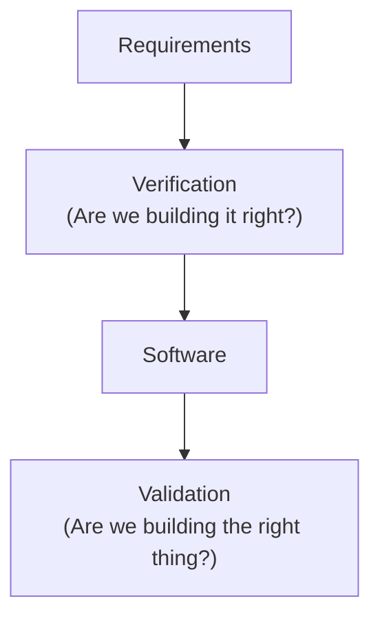
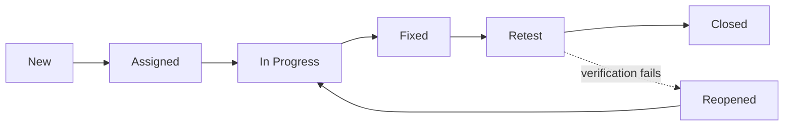
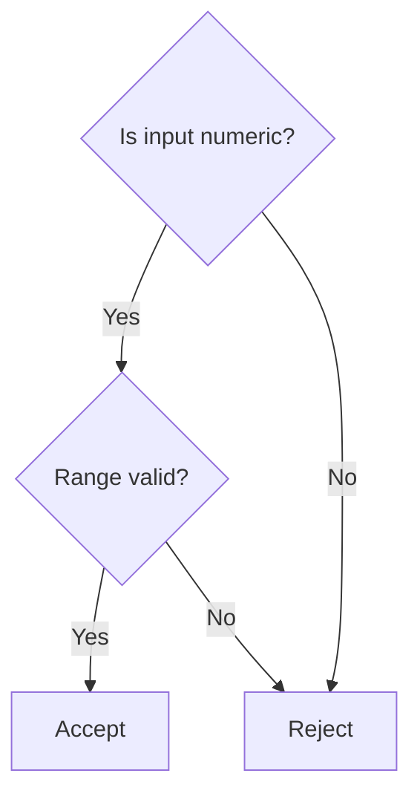
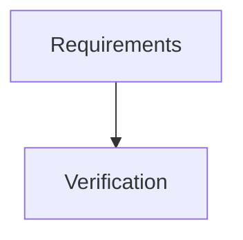

# Visual Standards

This document defines TestAtlas's visual design system: a consistent, reusable set of diagram and table patterns applied across every learning path, so the site reads as one coherent product instead of a collection of individually-styled articles.

## Design Principle

Every visual must answer a learning question, not decorate a page. A diagram earns its place by making a relationship, sequence, or decision easier to grasp than the same content in prose would be — never as a break from "walls of text" for its own sake. No stock photography, no decorative or unexplained imagery, ever (this was already implicit in `CONTENT_MODEL.md`'s "no external images" rule; this document makes it explicit and gives the alternative a real system to work from).

This standard was established before any retrofitting happened, then applied to Foundations in one dedicated Visual Sprint (15 of 17 modules; Common QA Terminology and Testing Myths deliberately skipped as list/recap modules with no real diagram to draw) rather than accumulating an inconsistent visual style module by module. New learning paths (starting with Manual Testing) apply this standard from their first module.

## Visual Decision Matrix

The fast answer to "which visual type do I reach for." Use this before defaulting to Mermaid — Mermaid is the right tool often, but not automatically.

| Content shape | Visual | Why |
|---|---|---|
| A process (ordered steps, no repeating states) | Mermaid `flowchart` | Sequence with a clear start and end |
| A lifecycle (states with transitions, possible loops) | Mermaid `stateDiagram-v2` | Purpose-built for states and transitions, including loops back |
| Decision logic (branching conditions) | Mermaid `flowchart` (decision tree shape) | Branches read naturally as a flowchart with diamond decision nodes |
| A two-axis comparison (e.g. severity × priority) | Mermaid `quadrantChart` | Only when both axes are genuinely continuous and the *relationship* between plotted items is the point — not for a simple two-column contrast |
| An ordered timeline | Mermaid `flowchart LR`, or `gantt` if duration matters | See category 5 below |
| A simple "X vs. Y" contrast | Markdown comparison table | Faster to scan than a diagram for two columns of attributes |
| A fixed set of independent, parallel concepts (not a process, not a hierarchy) | Structured cards (bulleted, bolded list) now; SVG infographic later | A mindmap of unrelated items doesn't teach a relationship that isn't there — see Software Testing Principles and Quality Attributes, both converted from Mermaid `mindmap` to cards after review found the mindmap added no comprehension benefit over a clean list |
| A framework or multi-part named concept | SVG infographic (planned; cards in the interim) | Genuinely benefits from custom layout Mermaid can't express, but not urgent enough to block on |
| A reference or recap page (glossary, myths, terminology) | No diagram | Nothing to diagram — the content itself isn't a relationship, sequence, or decision |

**The test before adding any diagram**: would a beginner understand this concept faster with the diagram than with the plain text next to it? If the honest answer is no, don't add it — this rule overrides every row above.

## The Eight Visual Categories

### 1. Hero Illustration (one per module, where genuinely useful)
A simple conceptual diagram introducing the module's core idea, placed near the top, after the opening hook paragraph. Not every module needs one — a module whose core idea is already a clean visual relationship (like Verification vs. Validation) benefits; a module that's fundamentally a list (like Common QA Terminology) doesn't.



### 2. Process Flow (0–2 per module)
For any module teaching a sequence or lifecycle — states, phases, steps.



### 3. Comparison Tables (2–4 per module)
Already an established pattern across every shipped module — this standard doesn't change the format, it confirms it as the default for any "X vs. Y" contrast. Plain Markdown tables, per `CONTENT_MODEL.md`'s existing Decision Tables pattern. No new syntax.

### 4. Decision Trees
Rendered as Mermaid flowcharts, never ASCII art in published content (ASCII is fine for sketching in a draft or a conversation — never in a merged module). Best fit for Decision Table Testing, Boundary Value Analysis, State Transition Testing, and any "which technique should I use" module like Manual Testing's Module 16.



### 5. Timelines
Mermaid `gantt` for duration-based timelines (a sprint, a release cycle), Mermaid `flowchart LR` for ordered-but-not-time-scaled sequences (most SDLC/STLC content actually wants this, not a literal gantt chart — pick based on whether relative *duration* is part of the point, not just order).

### 6. Real UI Screenshots (deferred — Phase 3+)
Annotated screenshots from the Banking, Healthcare, E-Commerce, and Insurance project simulations, once those exist (`PROJECT_ARCHITECTURE.md`). Not available yet — there's no built sample application to screenshot. Every screenshot must be annotated to show specifically what it's teaching; an unannotated screenshot doesn't meet this standard.

### 7. Mermaid Diagrams (the primary tool for categories 1, 2, 4, 5)
Version-controlled as plain text inside the module's own Markdown file — not a separate rendered image. This is the single biggest advantage over hand-drawn diagrams: a diagram is edited the same way as the prose around it, in the same PR, with the same review. See **Mermaid Styling** below for the brand-matched theme.

### 8. Infographics (occasional — for genuinely multi-part concepts)
Hand-authored inline SVG, per `CONTENT_MODEL.md`'s existing "Mermaid or inline SVG only" rule. Reserved for concepts that are a fixed small set of parallel items — the Seven Testing Principles, the Six Quality Attributes, QA Career Tracks — where a diagram of *relationships* (Mermaid's strength) doesn't fit, but a plain bullet list underuses the visual opportunity. Not for anything Mermaid can already express; reaching for hand-authored SVG when a flowchart would do is unnecessary maintenance burden for no reader benefit. Until an SVG is actually produced, these ship as structured cards (see the Visual Decision Matrix) — never as a forced Mermaid diagram with no real relationship to express.

## Accessibility

Every Mermaid diagram must include `accTitle` and `accDescr` as the first lines inside the diagram, immediately after the diagram-type declaration:



`accTitle` and `accDescr` are Mermaid's built-in accessibility hooks — they populate the rendered SVG's `<title>` and `<desc>` elements, which is what a screen reader actually announces. Without them, a screen reader either announces nothing meaningful or reads raw node IDs. `accDescr` should describe the *relationship or sequence*, not just list the node labels — write it as if describing the diagram to someone who can't see it, the same discipline as real alt text.

This applies retroactively to every diagram in `assets/diagrams/foundations/` (added during the Visual & SEO Enhancement Sprint) and is required for every new diagram going forward.

## Image and Diagram Metadata Standard

Applies to every visual asset — SVG infographics now, and any future rendered export.

**Filenames**: descriptive, lowercase, hyphenated, matching the concept — `software-testing-principles.svg`, not `image1.svg`, `diagram-final.svg`, or `test.svg`. For diagrams already tracked with a Visual ID, the ID stays in the `.mmd`/source filename (`VIS-005-testing-principles.mmd`); a rendered SVG export drops the ID prefix and uses the plain descriptive name, since the exported file is what a search engine or a reader encounters directly.

**Every image requires**:
- **Title** — the concept name, as it would appear in a figure caption
- **Alt text** — a full sentence describing what the image teaches, not just what it depicts (`"Illustration explaining the seven software testing principles, including defect clustering, exhaustive testing limitations, and context-dependent testing"` — not `"principles diagram"`)
- **Caption** — one sentence, placed under the image in the rendered page, stating the relationship the image shows
- **Figure number** — sequential within the module (`Figure 3`), for reference in surrounding prose ("as Figure 3 shows...")
- **Source** — `TestAtlas` for original diagrams; full attribution for anything adapted from elsewhere (should not normally happen, given the no-external-imagery rule)

**Example**:
> **Figure 3 — Seven Software Testing Principles**
> Alt: Illustration explaining the seven software testing principles, including defect clustering, exhaustive testing limitations, and context-dependent testing.
> Caption: The seven principles and how they relate to each other.
> Source: TestAtlas

This standard exists for two reasons at once: it's genuinely more accessible (a screen reader user gets the same understanding a sighted user gets from the caption), and it's how a diagram becomes discoverable through Google Image Search — a search for "Boundary Value Analysis diagram" only has a chance of surfacing TestAtlas if the image has a real, descriptive filename, alt text, and caption to be indexed against.

## Validating Diagrams

`npm run build` does **not** validate Mermaid syntax. `@docusaurus/theme-mermaid` renders every diagram entirely client-side, in the browser, after page load — a build can succeed with a broken diagram on the page, and static HTML inspection won't catch it either, since nothing Mermaid-related is present until JavaScript runs. This is not a hypothetical risk: it happened during the Foundations Visual Sprint (see `assets/diagrams/foundations/VIS-015-severity-priority-quadrant.mmd`'s history — an unquoted, space-containing point label in a `quadrantChart` built clean and would have failed silently at render time).

Run `npm run validate:diagrams` — it parses every `.mmd` file under `assets/diagrams/` with Mermaid's real parser (via `scripts/validate-diagrams.mjs`) and fails loudly with the exact file and line on a syntax error. Run this whenever a diagram is added or changed, in addition to `npm run build`. This is now part of `QUALITY_GATES.md`.

## Mermaid Styling

Docusaurus's Mermaid theme is now configured in `docusaurus.config.ts` to use TestAtlas's own brand teal instead of Mermaid's generic default palette, in both light and dark mode — see the `mermaid` key under `themeConfig`. Every diagram automatically inherits this; no per-diagram styling is needed or wanted. Do not override diagram colors inline (`style` directives, custom `classDef` colors) except in the rare case where semantic color genuinely matters (e.g., a red "Reopened" state) — and even then, prefer Mermaid's built-in `classDef` mechanism over ad hoc styling so it stays consistent across modules.

## Per-Module Visual Target (long-term goal, not a hard requirement)

- 1 conceptual (hero) diagram, where the module's core idea is a relationship diagram can express better than prose
- 1 process diagram, where the module teaches a sequence
- 2–4 comparison tables, for any "X vs. Y" contrast
- 1 real-world annotated example, once project simulations exist (category 6)

This is a target for new content, not a checklist every module must satisfy — a module with no natural sequence to diagram shouldn't force one in. The Definition of Done in `CONTENT_MODEL.md` will reference this standard once the first path built under it (Manual Testing) proves it out in practice.

## Diagram Source Organization

```
assets/
└── diagrams/
    ├── README.md              (this convention, in short form, for contributors)
    ├── templates/              (generic, unfilled snippets per category)
    ├── foundations/
    │   ├── VIS-001-testing-activities.mmd
    │   ├── VIS-002-cost-of-defect.mmd
    │   └── ...
    ├── manual-testing/
    ├── api-testing/
    ├── database-testing/
    ├── automation/
    ├── performance-testing/
    ├── security-testing/
    ├── ai-testing/
    ├── interview-preparation/
    ├── career/
    └── exports/
        ├── svg/                (rendered exports, for use outside Docusaurus — e.g. social cards, PDFs)
        └── png/
```

### Visual IDs

Every diagram gets a sequential ID within its learning path, assigned in the order it first appears across that path's modules: `VIS-001`, `VIS-002`, and so on. The ID is:
- Recorded as a comment on the first line of the diagram, in both the module's inline code fence and its mirrored `.mmd` file (`%% VIS-004 — QA's Position Relative to Product, Dev, and DevOps`)
- Reflected in the `.mmd` filename: `VIS-004-qa-position.mmd`
- Never reused, even if a diagram is later removed — IDs are stable references, not a dense count

This turns every diagram into a citable, reusable asset — a future page (a case study, a lab, a different learning path) can reference "Foundations VIS-014, the Defect Life Cycle state diagram" unambiguously, and a contributor scanning `assets/diagrams/foundations/` gets a complete visual index of the path at a glance.

**What goes here, and how it stays in sync**: unlike the original guidance in this document (superseded by the Visual ID system above), every diagram that appears inline in a module — not just SVG infographics — now also gets a matching `.mmd` file in `assets/diagrams/<path>/`. The module's own code fence is what actually renders and is therefore authoritative; the `.mmd` file is a byte-identical mirror kept for indexing, reuse, and future export. When a diagram changes, update both in the same commit — treat a drifted mirror file as a defect, the same way a stale cross-link is treated elsewhere in this project.

`assets/diagrams/templates/` is unaffected by this change — those stay generic, unfilled, and un-numbered, since they're starting points, not shipped diagrams.

## What This Does Not Do (yet)

- Does not begin Manual Testing Module 1 content. This document is infrastructure the first Manual Testing module will be written against, not content itself.
- Does not add screenshot tooling or a design tool integration — category 6 stays deferred until a real sample application exists to screenshot.
- Does not yet produce any actual SVG infographic — Software Testing Principles, Quality Attributes, and QA Career Tracks all ship as structured cards with a stated future-SVG note, not a finished infographic. Producing the actual SVGs (with real filenames, alt text, captions, and figure numbers per the standard above) is remaining work, not done work.
