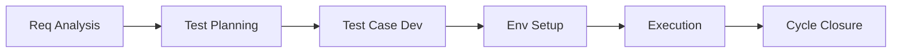
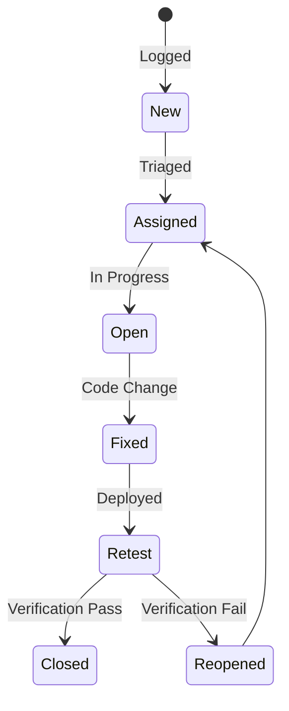

# Manual Testing Interview Questions

Welcome to the Manual Testing Interview Q&A bank. This module provides 100 comprehensive questions and answers designed to test your core testing knowledge, scenario reasoning, and defect management expertise.

Use the interactive toggles below to expand and study the answer to each question.

---

## Category 1 – Basics of Software Testing

<b>Q1: What is Software Testing?</b>

Software Testing is the process of evaluating and verifying that a software application or system meets the specified requirements and works as intended.
It involves executing the software to identify defects, ensuring it is free from critical bugs, and confirming that it delivers the expected business value.

The main goals are:
- **Verification**: Does the software meet the design specifications?
- **Validation**: Does the software meet the customer’s actual needs?

Testing is not only about finding defects; it is also about preventing defects and improving overall product quality.

<b>Q2: Difference between Verification and Validation.</b>

- **Verification** ensures the product is built according to the requirements and design specifications. It answers, "Are we building the product right?" Example: Reviewing documents, inspecting code, and walkthroughs.
- **Validation** ensures the product meets the actual needs and expectations of the user. It answers, "Are we building the right product?" Example: Executing the application with real-world scenarios.

Verification is a static process (no code execution), while Validation is a dynamic process (involves running the code).

<b>Q3: What is the Software Development Life Cycle (SDLC)?</b>

The SDLC is the process of planning, creating, testing, deploying, and maintaining software. It defines the stages a software project goes through from conception to retirement.

Phases include:
1. Requirement Gathering
2. Design
3. Development
4. Testing
5. Deployment
6. Maintenance

For example, in an e-commerce project, SDLC starts from collecting requirements (shopping cart, payment gateway) to designing the UI, developing the code, testing, deploying, and fixing post-release issues.

<b>Q4: What is the Software Testing Life Cycle (STLC)?</b>

STLC is the sequence of specific activities conducted during the testing process to ensure software quality.

Phases include:
1. Requirement Analysis
2. Test Planning
3. Test Case Development
4. Test Environment Setup
5. Test Execution
6. Test Cycle Closure

Each stage has its deliverables. For example, during Test Planning, we produce the Test Plan Document; during Test Execution, we produce Defect Reports and execution logs.

<b>Q5: What are the different levels of testing?</b>

1. **Unit Testing**: Testing individual components or functions (done by developers).
2. **Integration Testing**: Ensuring different modules work together correctly.
3. **System Testing**: Testing the complete system as a whole.
4. **Acceptance Testing**: Ensuring the system meets business needs and user expectations (UAT).

For example, in an ATM project, first test the PIN verification function (unit test), then combine it with balance checking (integration test), then test the whole ATM workflow (system test), and finally let users test before go-live (acceptance test).

<b>Q6: What are the types of testing?</b>

- **Functional Testing**: Validates the business logic, features, and user interface actions against requirements.
- **Non-Functional Testing**: Checks usability, performance under load, security, and reliability attributes.
- **Maintenance Testing**: Done after production changes or updates to ensure existing features still work (Regression Testing).

For example, testing a login form for valid/invalid credentials is functional testing, while testing the load speed of that login page is non-functional performance testing.

<b>Q7: Difference between Manual Testing and Automation Testing.</b>

- **Manual Testing**: Human testers execute test cases manually without tools or scripts. It is flexible, exploratory, and suitable for usability testing.
- **Automation Testing**: Uses scripts, test runs, and automation frameworks to run tests automatically. It is suitable for regression suites, performance runs, and repetitive validation tasks.

<b>Q8: What is a Test Case?</b>

A Test Case is a set of conditions, inputs, and steps that determine whether a software feature works as expected.

Includes:
- Test Case ID and Description
- Preconditions
- Steps to execute
- Expected Result
- Actual Result and Status (Pass/Fail)

For example, to test the "Forgot Password" feature: steps include entering an email, checking if a reset link is received, and validating the redirection.

<b>Q9: What is a Test Plan?</b>

A Test Plan is a detailed document outlining the testing strategy, scope, schedule, resources, tools, and objectives.

Key sections:
- Objective and Scope (In-Scope/Out-of-Scope)
- Test Strategy and levels
- Entry and Exit criteria
- Risks and Mitigation
- Schedule and Resource allocation

<b>Q10: What is the difference between Severity and Priority?</b>

- **Severity**: The technical impact of a defect on the system's functionality. A crash in the payment gateway is Critical Severity.
- **Priority**: The urgency of fixing the defect from a business or release standpoint. A spelling mistake on the homepage has low severity but high priority if it affects branding.

---

## Category 2 – Test Documentation & Defect Management

<b>Q11: What is the purpose of Test Documentation?</b>

Test documentation serves as a knowledge base for the testing process, ensuring that testing is structured, traceable, and repeatable.

Its main purposes are:
- To communicate testing scope, approach, and progress to stakeholders.
- To provide audit evidence that testing was carried out.
- To help in knowledge transfer to new team members.
- To track coverage and ensure all requirements are tested.

<b>Q12: What is a Test Scenario?</b>

A Test Scenario is a high-level description of what to test. It outlines what functionality or feature needs to be validated without going into detailed steps.

It focuses on user journeys rather than step-by-step execution. For an e-commerce site:
`Scenario: Verify that a user can place an order successfully.`
This scenario covers login, searching, adding to cart, payment, and order confirmation.

<b>Q13: What is a Test Case? How is it different from a Test Scenario?</b>

- **Test Scenario** is broad and defines *what* to test (e.g., Verify login functionality).
- **Test Case** is detailed and defines *how* to test step-by-step.

For example, a test case for login includes entering valid credentials, clicking submit, and expecting redirection to the dashboard.

<b>Q14: What is a Traceability Matrix (RTM) and why is it important?</b>

The Requirement Traceability Matrix (RTM) is a document that maps requirements to test cases.

Purpose:
- Ensure complete coverage (no missed requirements).
- Helps in impact analysis when requirements change.

If a requirement ID `REQ-101` is "User should reset password," the RTM links it to all test cases covering reset functionality.

<b>Q15: What is a Bug/Defect in Software Testing?</b>

A defect (or bug) is a deviation of the software from its expected behavior or requirement.

Key points:
- **Error**: Human mistake in code or requirements.
- **Defect**: Deviation found during testing.
- **Failure**: When the defect shows up in production.

Example: Expected: Clicking "Add to Cart" should increase count. Actual: Clicking does nothing. This is a defect.

<b>Q16: Explain the Defect Life Cycle.</b>

The Defect Life Cycle describes the stages a defect goes through from discovery to closure:
1. **New**: Tester logs the defect.
2. **Assigned**: Defect is assigned to a developer.
3. **Open**: Developer starts working on it.
4. **Fixed**: Developer fixes the defect.
5. **Retest**: Tester retests to verify the fix.
6. **Closed**: Defect is confirmed fixed.
7. **Reopened**: If the defect reappears.

<b>Q17: What is Defect Severity vs. Priority? Give examples.</b>

- **Severity**: Technical impact on system functionality.
- **Priority**: Urgency of fixing the defect.

Examples:
- Spelling mistake in company name: Low severity, High priority (branding issue).
- System crash when clicking "Checkout": High severity, High priority.
- Minor color mismatch in footer: Low severity, Low priority.

<b>Q18: How do you write a good Bug Report?</b>

A good bug report should be clear, concise, and complete.

Include:
- Bug ID & Title
- Steps to Reproduce
- Expected Result
- Actual Result
- Screenshots, video, or logs
- Environment details, severity, and priority

<b>Q19: What are Entry and Exit Criteria in Testing?</b>

- **Entry Criteria**: Conditions that must be met before testing begins (e.g., test environment ready, test data prepared, build deployed).
- **Exit Criteria**: Conditions that must be met before ending testing (e.g., all planned tests executed, critical defects fixed, test summary report prepared).

<b>Q20: What is a Test Summary Report?</b>

A Test Summary Report (TSR) is prepared at the end of the testing phase to summarize:
- Scope of testing completed.
- Test execution results (Pass/Fail stats).
- Defect details and their current status.
- Coverage analysis and risks.
- Recommendations for release.

---

## Category 3 – Test Design Techniques

<b>Q21: What are Test Design Techniques?</b>

Test Design Techniques are systematic approaches to creating test cases that ensure maximum coverage with minimum effort.

They are divided into:
1. **Black-Box Techniques**: Based on requirements, without looking at code structure.
2. **White-Box Techniques**: Based on internal code structure.
3. **Experience-Based Techniques**: Based on tester's knowledge.

<b>Q22: What is Equivalence Partitioning (EP)? Give an example.</b>

Equivalence Partitioning divides test data into groups (partitions) that are expected to be treated the same by the system. If one value in a group works, all should work.

Example: If a field accepts numbers from 1 to 100.
Partitions:
- Valid: 1 to 100 (e.g., test with 50).
- Invalid: < 1 (e.g., 0) and > 100 (e.g., 101).

Benefit: Reduces the number of test cases without losing coverage.

<b>Q23: What is Boundary Value Analysis (BVA)? Give an example.</b>

BVA focuses on testing at the edges of input ranges, as defects often occur at boundaries.

Example: If the valid input is 18–60 for age.
Test values: 17 (just below), 18 (minimum), 60 (maximum), 61 (just above).

This ensures that both lower and upper limits are tested, along with values just outside.

<b>Q24: Explain Decision Table Testing with an example.</b>

Decision Table Testing is used for systems with complex business rules. It helps ensure all possible combinations of inputs and outcomes are tested.

Example: Loan approval:
Conditions: Credit score > 700 AND Income > $30,000.
- Case 1: Credit > 700 (Y), Income > 30k (Y) -> Action: Approve.
- Case 2: Credit > 700 (Y), Income > 30k (N) -> Action: Reject.
- Case 3: Credit > 700 (N), Income > 30k (Y) -> Action: Reject.

<b>Q25: What is State Transition Testing? Give an example.</b>

State Transition Testing checks how the system behaves when changing from one state to another based on events or inputs.

Example: ATM machine:
- State: Card inserted -> Enter PIN -> Valid PIN -> Access account.
- Test: Enter invalid PIN thrice -> State changes to "Card blocked."

<b>Q26: What is Use Case Testing?</b>

Use Case Testing is based on user scenarios describing how the system will be used in real life.

- Focuses on end-to-end workflows.
- Helps find gaps in integration points.

Example: E-commerce "Place Order" use case includes login, product selection, adding to cart, payment, and confirmation.

<b>Q27: What is Error Guessing?</b>

Error Guessing relies on the experience, intuition, and historical knowledge of the tester to guess where defects are likely to be.

- Not a formal technique.
- Often used alongside other methods.

Example: A tester may guess that an email field might accept invalid formats like `test@.com` and try those inputs.

<b>Q28: What is Exploratory Testing?</b>

Exploratory Testing is simultaneous learning, test design, and execution without predefined test cases.

- Useful when time is short or documentation is incomplete.
- Requires skilled testers with domain knowledge.

Example: Testing a new chat application without test scripts—exploring features, sending random messages, trying special characters, etc.

<b>Q29: What is Pairwise Testing?</b>

Pairwise Testing is a combinatorial technique where testers create test cases covering all possible pairs of input parameters.

It reduces the total number of test cases while covering important interactions. For example, testing 3 browsers x 3 operating systems normally requires 9 combinations, but pairwise covers each pair in fewer runs.

<b>Q30: What is White-Box Testing? How is it different from Black-Box Testing?</b>

- **White-Box Testing**: Based on internal code structure, checking paths, branches, and loops (done by developers).
- **Black-Box Testing**: Based on requirements without looking at code structure.

White-box asks "How is it built?", whereas Black-box asks "Does it work as expected?"

---

## Category 4 – Functional Testing Types

<b>Q31: What is Functional Testing?</b>

Functional Testing verifies that the software’s features work according to the specified requirements. It focuses on what the system does rather than how it does it.

- Done using black-box techniques.
- Ensures business logic works correctly.

Example: For a banking app, functional testing ensures that money transfers, balance checks, and account statements work as expected.

<b>Q32: What is Smoke Testing? Why is it called so?</b>

Smoke Testing is a preliminary check to verify that the most critical functionalities of an application work before conducting more detailed testing.

- Also known as Build Verification Testing (BVT).
- Ensures the application is stable enough for further testing.

Why called "Smoke Testing"? In hardware testing, if a device smoked after powering on, it failed the initial test. The software analogy means, "If the build fails basic tests, it's not worth continuing."

<b>Q33: What is Sanity Testing? How is it different from Smoke Testing?</b>

Sanity Testing is a narrow, focused testing to verify specific bug fixes or minor changes in functionality.

- **Smoke Testing**: Broad, shallow, early build check.
- **Sanity Testing**: Narrow, deep check after bug fixes.

Example: If a bug in "password reset" is fixed, sanity testing will focus only on that functionality.

<b>Q34: What is Regression Testing? Why is it important?</b>

Regression Testing ensures that new changes (code updates, bug fixes, enhancements) have not broken existing features.

- It’s repeated after every change in the application.
- Often automated for efficiency.

Example: If a payment gateway's UI is updated, regression testing ensures that login, search, cart, and other existing features still work.

<b>Q35: What is User Acceptance Testing (UAT)?</b>

UAT is the final phase of testing where end users or clients verify that the software meets their business needs.

- Usually done in a staging environment.
- If UAT passes, the software is approved for production.

Example: For an HR payroll system, HR managers check if salary slips, tax deductions, and leave calculations match actual requirements.

<b>Q36: What is Integration Testing? What are its types?</b>

Integration Testing verifies that different modules or systems work together correctly.

Types:
1. **Big Bang**: All modules integrated at once.
2. **Incremental**: Modules integrated step-by-step.
   - *Top-Down*: Higher-level modules tested first.
   - *Bottom-Up*: Lower-level modules tested first.

Example: In a travel booking site, integrating the flight search module with the payment and ticket generation modules.

<b>Q37: What is System Testing?</b>

System Testing validates the entire application as a whole in a complete, integrated environment.

- Ensures the software meets both functional and non-functional requirements.
- Usually the last step before UAT.

Example: For an e-learning platform, system testing would check login, course enrollment, video streaming, payment, and certificate generation in a single end-to-end flow.

<b>Q38: What is End-to-End (E2E) Testing? How is it different from System Testing?</b>

E2E Testing checks the complete workflow of an application from start to finish, including interactions with external systems.

Difference:
- **System Testing**: Focuses on the application in isolation.
- **E2E Testing**: Includes external dependencies (e.g., third-party APIs).

Example: Booking a movie ticket—includes selecting a movie, seat booking, payment via a third-party gateway, receiving a confirmation email.

<b>Q39: What is Exploratory Testing? How is it different from Ad-hoc Testing?</b>

- **Exploratory Testing**: Structured with a charter or goal. Done by experienced testers to uncover unexpected defects.
- **Ad-hoc Testing**: Completely unstructured and random.

Example: While exploring a social media app, a tester tries unusual profile names or long status updates to see if the system handles them.

<b>Q40: What is Usability Testing? Why is it important?</b>

Usability Testing evaluates how easy and intuitive the application is for end users.

- Focuses on UI design, navigation, and user satisfaction.
- Often involves real users providing feedback.

Example: In a food delivery app, testers check if users can easily search for a restaurant, apply filters, and place an order without confusion.

---

## Category 5 – Non-Functional Testing Types

<b>Q41: What is Non-Functional Testing? How is it different from Functional Testing?</b>

Non-functional testing checks *how well* a system performs under specific conditions, rather than *what* it does.

- Functional -> "Does the login work?"
- Non-functional -> "Does the login happen within 2 seconds under 1,000 concurrent users?"

<b>Q42: What is Performance Testing?</b>

Performance Testing checks the speed, responsiveness, and stability of a system under expected workloads.

It identifies bottlenecks and ensures performance goals are met. Example: Testing if a banking site loads the account summary within 3 seconds for 500 concurrent users.

<b>Q43: What is Load Testing?</b>

Load Testing measures system performance under expected user load to ensure it can handle the planned usage.

Example: Simulating 1,000 users logging in simultaneously to see if the application slows down or triggers errors.

<b>Q44: What is Stress Testing?</b>

Stress Testing evaluates how the system behaves beyond its normal capacity until it breaks.

Example: Sending 5x expected traffic to see how the system fails and recovers.

<b>Q45: What is Scalability Testing?</b>

Scalability Testing checks whether the system can scale up or down to handle increased or decreased workloads.

Example: Increasing the number of transactions in a payment system from 100/sec to 1,000/sec and checking if it scales properly.

<b>Q46: What is Stability Testing?</b>

Stability Testing (soak testing) checks if the system runs without failure for a long period under a certain load.

Example: Running a live video stream for 72 hours to ensure no memory leaks or crashes occur.

<b>Q47: What is Security Testing?</b>

Security Testing ensures the system is protected against unauthorized access, vulnerabilities, and attacks.

Example: Testing if an e-commerce site prevents SQL Injection and Cross-Site Scripting (XSS).

<b>Q48: What is Compatibility Testing?</b>

Compatibility Testing ensures the application works across different devices, browsers, operating systems, and network environments.

Example: Checking if a travel booking site works on Chrome, Firefox, Safari, and Edge on both Windows and Mac.

<b>Q49: What is Localization Testing?</b>

Localization Testing verifies that the application is adapted for a specific region or language.

Example: Checking if the date format is DD/MM/YYYY in India and MM/DD/YYYY in the US.

<b>Q50: What is Accessibility Testing?</b>

Accessibility Testing ensures the application can be used by people with disabilities.

Example: Checking if a website supports screen readers and has proper alt text for images.

---

## Category 6 – Defect Management & Bug Reporting

<b>Q51: What is Defect Leakage?</b>

Defect Leakage happens when a bug escapes from one testing phase and is found in a later stage.

Example: A bug missed during system testing but found during UAT or by end users in production.

<b>Q52: What is Defect Density?</b>

Defect Density = Number of confirmed defects / Size of the software module. It helps measure the quality of code.

Example: 10 defects found in 500 lines of code -> Density = 0.02 defects per LOC.

<b>Q53: What is Defect Clustering?</b>

Defect Clustering means that most defects are found in a small number of modules due to high complexity or poor design (follows the 80-20 rule).

Example: 80% of bugs being in the payment gateway module.

<b>Q54: What is a Bug Triage?</b>

Bug Triage is a meeting to prioritize and assign defects based on severity, priority, resource availability, and business impact.

<b>Q55: What is a Showstopper Defect?</b>

A showstopper is a critical defect that blocks testing progress.

Example: Application crashes immediately after login.

<b>Q56: What is a Latent Defect?</b>

A defect that exists but is not detected during testing and appears later under specific conditions.

Example: A bug in a tax calculation system that only appears at year-end.

<b>Q57: What is a Masked Defect?</b>

A defect hidden by another defect.

Example: A crash in the payment page hides a bug in the discount calculation.

<b>Q58: What is Root Cause Analysis (RCA)?</b>

RCA identifies the underlying cause of a defect to prevent recurrence.

Example: Investigating why a login bug occurred -> Found incorrect password hashing logic.

<b>Q59: What is a Bug Life Cycle Tool? Give examples.</b>

Bug Life Cycle tools manage defects from logging to closure.

Examples: Jira, Bugzilla, Mantis, Azure DevOps.

<b>Q60: What is the purpose of logging defects early?</b>

Catching bugs early reduces the cost of fixing them, as the cost of a defect increases in later stages of the SDLC.

---

## Category 7 – Agile Testing Concepts

<b>Q61: What is Agile Testing?</b>

Agile Testing is testing that follows Agile principles, where testing and development happen simultaneously and iteratively.

<b>Q62: What are User Stories?</b>

User Stories describe features from the end-user perspective.

Example: "As a user, I want to reset my password so that I can regain access to my account."

<b>Q63: What is Acceptance Criteria in Agile?</b>

Conditions that a user story must meet to be considered complete and working.

<b>Q64: What is Sprint Testing?</b>

Sprint Testing is testing within a sprint cycle, including functional and regression tests on incremental features.

<b>Q65: What is Continuous Integration in Agile?</b>

Continuous Integration means developers frequently merge code changes into a shared repository, followed by automated builds and tests.

<b>Q66: What is Shift-Left Testing?</b>

Shift-Left means starting testing earlier in the SDLC to find bugs sooner and reduce correction costs.

<b>Q67: What is a Product Backlog?</b>

A prioritized list of all desired features, enhancements, and fixes for a project.

<b>Q68: What is a Sprint Retrospective?</b>

A meeting at the end of a sprint to discuss what went well and what to improve in the next iteration.

<b>Q69: What is a Definition of Done (DoD)?</b>

A checklist of requirements (e.g., code reviewed, tests passed, docs updated) that a product increment must meet to be considered complete.

<b>Q70: What is Pair Testing?</b>

Two testers (or a tester and a developer) work together on the same feature to increase coverage and find bugs faster.

---

## Category 8 – Test Metrics & Measurement

<b>Q71: What are Test Metrics?</b>

Test metrics are measurements that track the progress, quality, and effectiveness of testing.

Examples: Test coverage, defect density, test execution rate.

<b>Q72: What is Test Coverage?</b>

Test coverage measures how much of the application’s functionality is exercised by tests.

<b>Q73: What is Requirement Coverage?</b>

Requirement coverage ensures that all requirements have at least one test case linked.

<b>Q74: What is Code Coverage?</b>

Code coverage measures the percentage of source code executed during testing.

<b>Q75: What is Test Execution Status?</b>

It shows the percentage of planned tests that are executed and their pass/fail rates.

<b>Q76: What is Test Case Effectiveness?</b>

Measures the ability of test cases to detect defects in the system.

<b>Q77: What is Defect Removal Efficiency (DRE)?</b>

DRE = (Defects found in testing / Total defects) × 100.

<b>Q78: What is Test Productivity?</b>

Number of test cases created or executed per tester per day.

<b>Q79: What is Mean Time to Detect (MTTD)?</b>

Average time taken to detect a defect after it is introduced.

<b>Q80: What is Mean Time to Repair (MTTR)?</b>

Average time taken to fix a defect after it is reported.

---

## Category 9 – Common Testing Challenges

<b>Q81: What challenges do you face in Manual Testing?</b>

- Unclear or changing requirements.
- Limited time for regression runs.
- Incomplete test data.
- Handling complex dynamic UI changes.

<b>Q82: How do you handle requirement changes during testing?</b>

By performing impact analysis, updating test cases, and communicating testing scope changes with stakeholders.

<b>Q83: How do you test when requirements are unclear?</b>

By using exploratory testing, involving business analysts, and validating requirements against early prototypes.

<b>Q84: How do you prioritize test cases?</b>

Based on risk, business impact, usage frequency, and criticality.

<b>Q85: How do you ensure maximum coverage in less time?</b>

By using risk-based testing, prioritizing core features, and automation for regression suites.

<b>Q86: What do you do when a developer disagrees with a bug?</b>

Provide clear reproduction steps, screenshots/logs, and reference requirements to prove the defect.

<b>Q87: How do you manage testing under tight deadlines?</b>

Focus on critical features, run smoke tests first, and parallelize manual testing execution.

<b>Q88: How do you test with limited test data?</b>

Use data generation tools or create synthetic test data using equivalence partitioning.

<b>Q89: How do you report testing progress to management?</b>

Through daily status reports, test dashboards, and defect trend charts.

<b>Q90: How do you ensure quality when there’s pressure to release?</b>

Run smoke tests, critical regression tests, and communicate risks clearly to stakeholders.

---

## Category 10 – Miscellaneous Manual Testing Topics

<b>Q91: What is Ad-hoc Testing?</b>

Unstructured, informal testing without documented test cases or planning.

<b>Q92: What is Monkey Testing?</b>

Providing random inputs to the system without rules to check stability.

<b>Q93: What is Alpha Testing?</b>

Testing done by internal teams in a controlled environment before releasing to users.

<b>Q94: What is Beta Testing?</b>

Testing by a limited set of real end users in their actual environment before full release.

<b>Q95: What is Installation Testing?</b>

Verifying that the software installs, updates, and uninstalls correctly.

<b>Q96: What is Recovery Testing?</b>

Checking if the system recovers gracefully after a crash or hardware failure.

<b>Q97: What is Compliance Testing?</b>

Ensuring the software meets regulatory standards, laws, and policies.

<b>Q98: What is Internationalization Testing?</b>

Testing if the application supports multiple languages, locales, and cultural formats.

<b>Q99: What is Configuration Testing?</b>

Verifying the system works with different configurations (hardware, OS, browsers).

<b>Q100: What is the difference between Static Testing and Dynamic Testing?</b>

- **Static Testing**: Reviews, walkthroughs, inspections (no code execution).
- **Dynamic Testing**: Executing code to find defects under runtime conditions.

---

## Knowledge Check: Boundary Value Analysis

<TesterChallenge
  id="quiz_manual_bva"
  title="TEST DESIGN RECALL CHALLENGE"
  question="For an input field accepting ages between 18 and 60 (inclusive), which set represents the 2-point Boundary Value Analysis (BVA) test values?"
  options={[
    "17, 18, 60, 61",
    "1, 18, 30, 60, 99",
    "0, 18, 60, 100",
    "19, 20, 58, 59"
  ]}
  correctIndex={0}
  explanation="In 2-point Boundary Value Analysis, tests are chosen at the exact boundary edges (18, 60) and just outside the valid boundary limits (17, 61)."
/>
