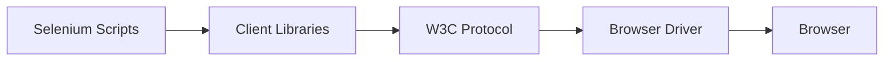
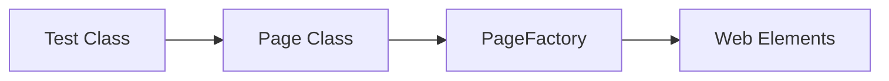

# Selenium with Java Interview Questions

This Q&A bank contains 100 questions and answers on Selenium WebDriver, Java automation, OOP concepts in frameworks, advanced driver operations, and debugging flaky tests.

Use the interactive details tags to expand and read the answers.

---

## Section 1 — Core Selenium Basics



<details>
<summary><b>Q1: What is Selenium, and what are its components?</b></summary>

Selenium is an open-source suite of tools for automating web browsers. It allows QA engineers to simulate user interactions like clicking buttons, entering text, and navigating between pages.

Selenium consists of four major components:
- **Selenium IDE**: A record-and-playback tool, mainly used for quick prototyping.
- **Selenium RC (Remote Control)**: An older tool, now deprecated.
- **Selenium WebDriver**: The current standard, allowing direct browser communication.
- **Selenium Grid**: Enables parallel test execution across multiple machines and browsers.
</details>

<details>
<summary><b>Q2: What are the advantages of Selenium over other automation tools?</b></summary>

- **Open-source and free**: No licensing costs.
- **Multi-language support**: Works with Java, Python, C#, Ruby, JavaScript.
- **Cross-browser compatibility**: Supports Chrome, Firefox, Safari, Edge, Opera.
- **Cross-platform execution**: Works on Windows, macOS, and Linux.
- **Integration**: Works with Maven, Jenkins, TestNG, Cucumber, Git, etc.
</details>

<details>
<summary><b>Q3: Difference between Selenium WebDriver and Selenium RC.</b></summary>

- **Selenium RC** requires a server to be running before executing tests. Its API is more verbose and slow due to JavaScript injection limitations.
- **Selenium WebDriver** interacts directly with the browser using native browser support, resulting in faster and more realistic test execution. It is the current industry standard.
</details>

<details>
<summary><b>Q4: Explain the architecture of Selenium WebDriver.</b></summary>

WebDriver architecture consists of four layers:
1. **Client Libraries/Bindings**: Language-specific jars (Java, Python, etc.).
2. **JSON Wire Protocol / W3C Protocol**: Defines standard REST communication.
3. **Browser Drivers**: Jars like ChromeDriver, GeckoDriver that act as interpreters.
4. **Browsers**: The actual browser instances being automated.
</details>

<details>
<summary><b>Q5: What are Locators in Selenium?</b></summary>

Locators are methods used to find elements on a web page. Selenium supports:
1. `id`
2. `name`
3. `className`
4. `tagName`
5. `linkText`
6. `partialLinkText`
7. `cssSelector`
8. `xpath`
</details>

<details>
<summary><b>Q6: What is XPath, and what are its types?</b></summary>

XPath is a query language for navigating through the XML/HTML document structure.
- **Absolute XPath**: Starts from the root node (e.g., `/html/body/div[1]/input`). Brittle.
- **Relative XPath**: Starts from anywhere in the DOM (e.g., `//input[@id='username']`). Flexible.
</details>

<details>
<summary><b>Q7: Difference between Absolute XPath and Relative XPath.</b></summary>

- **Absolute XPath** starts with a single slash `/` from the root. Any layout change breaks the path.
- **Relative XPath** starts with a double slash `//` from anywhere. It is robust, easy to read, and survives UI updates.
</details>

<details>
<summary><b>Q8: Explain the difference between findElement() and findElements().</b></summary>

- `findElement()` returns a single WebElement matching the locator. Throws `NoSuchElementException` if none found.
- `findElements()` returns a list of WebElements. Returns an empty list if no elements match, rather than throwing an exception.
</details>

<details>
<summary><b>Q9: How do you handle dynamic elements in Selenium?</b></summary>

Dynamic elements have attributes that change on refresh. Solutions:
- Use relative XPaths with functions like `contains()`, `starts-with()`, or `ends-with()`.
- Use logical operators in XPaths (`and`, `or`).
- Use CSS attribute selectors.
</details>

<details>
<summary><b>Q10: What are Waits in Selenium, and what types are there?</b></summary>

Waits handle timing differences between the script and browser:
1. **Implicit Wait**: Sets a global timeout for finding all elements.
2. **Explicit Wait**: Waits for a specific condition on a specific element.
3. **Fluent Wait**: An explicit wait that defines polling intervals and ignored exceptions.
</details>

<details>
<summary><b>Q11: Difference between Implicit Wait and Explicit Wait.</b></summary>

- **Implicit Wait** is set globally for the life of the WebDriver. It tells the driver to wait a fixed time before throwing an exception for any element lookup.
- **Explicit Wait** is target-specific. It evaluates conditions (e.g., clickable, visible) on demand and is highly customizable.
</details>

<details>
<summary><b>Q12: How do you handle popups in Selenium?</b></summary>

- **Alert popups**: Switch to alert and accept/dismiss:
  `driver.switchTo().alert().accept();`
- **OS popups**: Selenium cannot interact with OS windows directly. Use tools like Robot class or upload file paths using `.sendKeys()`.
</details>

<details>
<summary><b>Q13: How do you handle multiple browser windows in Selenium?</b></summary>

- Get the current parent window handle: `driver.getWindowHandle();`
- Get all open window handles: `driver.getWindowHandles();`
- Switch using a loop: `driver.switchTo().window(handle);`
</details>

<details>
<summary><b>Q14: How do you handle frames and iframes in Selenium?</b></summary>

- Switch by index: `driver.switchTo().frame(0);`
- Switch by name/id: `driver.switchTo().frame("frameName");`
- Switch by element: `driver.switchTo().frame(element);`
- Return to main window: `driver.switchTo().defaultContent();`
</details>

<details>
<summary><b>Q15: How do you handle dropdowns in Selenium?</b></summary>

Use the `Select` class for standard `<select>` elements:
```java
Select select = new Select(dropdownElement);
select.selectByVisibleText("Option 1");
select.selectByValue("val1");
select.selectByIndex(2);
```
</details>

<details>
<summary><b>Q16: What is Page Object Model (POM) in Selenium?</b></summary>

POM is a design pattern where each web page has a corresponding class.
Web elements are defined within the page class, and test cases invoke page methods to perform actions.
This promotes code reuse and separates test assertions from UI elements.
</details>

<details>
<summary><b>Q17: What is TestNG, and why is it used with Selenium?</b></summary>

TestNG is a testing framework for Java. It is used to:
- Organize tests using annotations (`@Test`, `@BeforeMethod`).
- Run tests in parallel.
- Parameterize test inputs (`@DataProvider`).
- Generate clean HTML test execution reports.
</details>

<details>
<summary><b>Q18: How do you capture screenshots in Selenium?</b></summary>

Cast the driver to `TakesScreenshot` and copy the file:
```java
File src = ((TakesScreenshot)driver).getScreenshotAs(OutputType.FILE);
FileUtils.copyFile(src, new File("screenshot.png"));
```
</details>

<details>
<summary><b>Q19: How do you run Selenium tests in multiple browsers?</b></summary>

- Configure browser choice using XML parameters in TestNG.
- Instantiate ChromeDriver, FirefoxDriver, or EdgeDriver dynamically based on parameters.
- Use cloud services like BrowserStack for scaling.
</details>

<details>
<summary><b>Q20: What are some limitations of Selenium?</b></summary>

- Cannot automate desktop apps (only web browsers).
- No built-in reporting or test management (requires TestNG/Extent Reports).
- Struggles with captcha and two-factor authentication (2FA).
- Brittle under heavy, dynamic UI rendering without proper waits.
</details>

---

## Section 2 — Java + OOP Concepts for Selenium



<details>
<summary><b>Q21: Why is Java preferred for Selenium automation?</b></summary>

Java is highly platform-independent, widely documented, and has rich frameworks.
It integrates seamlessly with Maven, TestNG, Jenkins, and Apache POI for Excel data parsing.
</details>

<details>
<summary><b>Q22: Explain the main OOP concepts and how they apply in Selenium.</b></summary>

- **Encapsulation**: Private WebElements exposed via public getter/action methods.
- **Inheritance**: Test classes extending a common `BaseTest` parent class.
- **Polymorphism**: Overloading element action methods (e.g., click by element vs click by locator).
- **Abstraction**: Using the `WebDriver` interface to represent various browser engines.
</details>

<details>
<summary><b>Q23: What is the difference between == and .equals() in Java?</b></summary>

- `==` compares object references (memory locations).
- `.equals()` compares the actual value or contents of the objects.
</details>

<details>
<summary><b>Q24: How do you handle exceptions in Java Selenium scripts?</b></summary>

Use `try-catch` blocks for recovery, `finally` for cleanup (e.g. `driver.quit()`), and `throws` to delegate exceptions to the test framework runner.
</details>

<details>
<summary><b>Q25: What is the difference between Checked and Unchecked exceptions?</b></summary>

- **Checked**: Verified at compile-time (e.g., `IOException`).
- **Unchecked**: Occur at runtime (e.g., `NullPointerException`, `NoSuchElementException`).
</details>

<details>
<summary><b>Q26: What are Access Modifiers in Java, and why are they important in Selenium framework design?</b></summary>

Access modifiers control visibility:
- `private` is used for WebElements in POM to enforce encapsulation.
- `public` exposes test methods and page helper interfaces.
- `protected` allows child classes in test packages to inherit BaseTest utilities.
</details>

<details>
<summary><b>Q27: What is a Constructor in Java, and how is it used in Selenium POM?</b></summary>

A constructor initializes class objects. In POM, constructors initialize elements with `PageFactory`:
```java
public LoginPage(WebDriver driver) {
  this.driver = driver;
  PageFactory.initElements(driver, this);
}
```
</details>

<details>
<summary><b>Q28: Difference between static and non-static methods in Java.</b></summary>

- **Static** methods belong to the class and are called directly (e.g., helper utilities).
- **Non-static** methods belong to instances, requiring object creation (e.g., Page actions).
</details>

<details>
<summary><b>Q29: What are Java Collections, and where do you use them in Selenium?</b></summary>

- `List`: Storing elements found by `findElements()`.
- `Set`: Storing unique window handles (`getWindowHandles()`).
- `Map`: Storing key-value pairs of test data config.
</details>

<details>
<summary><b>Q30: How do you read data from an Excel file in Java Selenium?</b></summary>

Use the Apache POI library:
- Create `FileInputStream`.
- Open `XSSFWorkbook`.
- Access `XSSFSheet` -> row -> cell -> string value.
</details>

<details>
<summary><b>Q31: How do you handle multiple classes in Selenium automation?</b></summary>

Implement inheritance for common setup, declare page object variables inside test classes, and instantiate page classes to call action steps sequentially.
</details>

<details>
<summary><b>Q32: Explain method overloading and overriding in Selenium context.</b></summary>

- **Overloading**: Writing `typeText(WebElement e, String text)` and `typeText(By loc, String text)`.
- **Overriding**: Subclass updating the `launchBrowser()` method to support custom profiles.
</details>

<details>
<summary><b>Q33: What is this keyword in Java, and where do you use it in Selenium?</b></summary>

`this` points to the current class instance. It is used in POM constructors to map the local driver instance to the page class instance variable.
</details>

<details>
<summary><b>Q34: Explain final, finally, and finalize() in Java.</b></summary>

- `final`: Declares constants, prevents overriding or inheritance.
- `finally`: A block following try-catch that executes cleanup code unconditionally.
- `finalize()`: Executed by garbage collection before object deletion.
</details>

<details>
<summary><b>Q35: How do you use super keyword in Selenium?</b></summary>

`super` references parent class objects. It calls `super.setup()` in test classes to trigger parent class browser configurations.
</details>

<details>
<summary><b>Q36: What is the difference between String, StringBuffer, and StringBuilder in Java?</b></summary>

- `String` is immutable.
- `StringBuffer` is mutable and thread-safe.
- `StringBuilder` is mutable, faster, and not thread-safe. Used to build dynamic XPaths.
</details>

<details>
<summary><b>Q37: How do you implement Data-Driven Testing in Selenium Java?</b></summary>

By reading test cases from Excel or CSV, mapping parameters, and passing them to `@Test` annotations via TestNG `@DataProvider`.
</details>

<details>
<summary><b>Q38: How do you use Interfaces in Selenium?</b></summary>

`WebDriver` itself is an interface. We code against it:
`WebDriver driver = new ChromeDriver();`
This allows swapping ChromeDriver for FirefoxDriver dynamically.
</details>

<details>
<summary><b>Q39: How do you use Abstract Classes in Selenium?</b></summary>

Define template methods for test execution:
`public abstract class BasePage { ... }`
Child page classes extend it to inherit standard wait mechanisms.
</details>

<details>
<summary><b>Q40: What is the difference between throw and throws in Java?</b></summary>

- `throw` throws an exception instance explicitly within the code.
- `throws` is part of the method signature declaring possible exceptions to the caller.
</details>

---

## Section 3 — Selenium Advanced & WebDriver Features

<details>
<summary><b>Q41: What is the Actions class in Selenium, and when do you use it?</b></summary>

The `Actions` class handles complex user interactions (mouse hover, drag-and-drop, right-click, double-click).
Actions are chained and executed using `.build().perform()`.
</details>

<details>
<summary><b>Q42: How do you perform Drag and Drop in Selenium?</b></summary>

Use the `Actions` class API:
```java
Actions actions = new Actions(driver);
actions.dragAndDrop(sourceElement, targetElement).perform();
```
</details>

<details>
<summary><b>Q43: What is JavaScriptExecutor in Selenium, and why is it used?</b></summary>

`JavaScriptExecutor` runs custom JavaScript inside the browser. It helps bypass clicks blocked by overlays or scroll pages dynamically:
```java
JavascriptExecutor js = (JavascriptExecutor) driver;
js.executeScript("arguments[0].click();", element);
```
</details>

<details>
<summary><b>Q44: How do you scroll a page in Selenium?</b></summary>

Use JavaScriptExecutor:
`js.executeScript("window.scrollBy(0, 500)");`
Or scroll to an element:
`js.executeScript("arguments[0].scrollIntoView(true);", element);`
</details>

<details>
<summary><b>Q45: How do you handle hidden elements in Selenium?</b></summary>

Bypass normal click actions by using `JavaScriptExecutor`, or use explicit waits until element visibility transitions to true.
</details>

<details>
<summary><b>Q46: How do you handle SSL certificate errors in Selenium?</b></summary>

Configure browser options before driver initialization:
```java
ChromeOptions options = new ChromeOptions();
options.setAcceptInsecureCerts(true);
WebDriver driver = new ChromeDriver(options);
```
</details>

<details>
<summary><b>Q47: How do you run Selenium tests in headless mode?</b></summary>

Configure arguments in options:
```java
ChromeOptions options = new ChromeOptions();
options.addArguments("--headless");
WebDriver driver = new ChromeDriver(options);
```
</details>

<details>
<summary><b>Q48: How do you handle file uploads in Selenium?</b></summary>

Locate the input element and send the absolute file path:
`driver.findElement(By.id("upload")).sendKeys("/path/file.txt");`
Avoid clicking the button as that triggers an OS file-selection modal.
</details>

<details>
<summary><b>Q49: How do you handle file downloads in Selenium?</b></summary>

Configure Chrome preferences before driver startup:
```java
HashMap<String, Object> prefs = new HashMap<>();
prefs.put("download.default_directory", "/downloads");
ChromeOptions options = new ChromeOptions();
options.setExperimentalOption("prefs", prefs);
```
</details>

<details>
<summary><b>Q50: How do you handle browser notifications in Selenium?</b></summary>

Disable notifications using options:
```java
ChromeOptions options = new ChromeOptions();
options.addArguments("--disable-notifications");
```
</details>

<details>
<summary><b>Q51: How do you run parallel tests in Selenium?</b></summary>

Set up parallel threads in TestNG `testng.xml`:
`<suite name="Suite" parallel="tests" thread-count="4">`
Use grid hub nodes to execute concurrently.
</details>

<details>
<summary><b>Q52: How do you use Selenium Grid?</b></summary>

Start the Selenium Hub, register Node servers pointing to the hub IP, and update test scripts to instantiate driver via `RemoteWebDriver` pointing to the Hub URL.
</details>

<details>
<summary><b>Q53: What is the difference between driver.close() and driver.quit()?</b></summary>

- `driver.close()` closes only the active browser tab.
- `driver.quit()` closes all browser tabs and kills the WebDriver server session safely.
</details>

<details>
<summary><b>Q54: How do you capture network traffic in Selenium?</b></summary>

Use Chrome DevTools Protocol (CDP) API:
```java
DevTools devTools = ((ChromeDriver) driver).getDevTools();
devTools.createSession();
devTools.send(Network.enable(Optional.empty(), Optional.empty(), Optional.empty()));
```
</details>

<details>
<summary><b>Q55: How do you handle cookies in Selenium?</b></summary>

Use manage cookie options:
- Add: `driver.manage().addCookie(new Cookie("k", "v"));`
- Get: `driver.manage().getCookies();`
- Delete: `driver.manage().deleteAllCookies();`
</details>

<details>
<summary><b>Q56: How do you maximize and resize browser windows in Selenium?</b></summary>

- Maximize: `driver.manage().window().maximize();`
- Resize: `driver.manage().window().setSize(new Dimension(1024, 768));`
</details>

<details>
<summary><b>Q57: How do you verify tooltips in Selenium?</b></summary>

Hover using the `Actions` class and assert on the `title` attribute value of the element.
</details>

<details>
<summary><b>Q58: How do you take full-page screenshots in Selenium?</b></summary>

Use Chrome-specific full page API:
`((ChromeDriver) driver).getFullPageScreenshotAs(OutputType.FILE);`
Or use libraries like AShot.
</details>

<details>
<summary><b>Q59: How do you handle shadow DOM elements in Selenium?</b></summary>

Use JavaScriptExecutor to retrieve the shadow root and locate sub-elements:
```java
WebElement root = (WebElement) js.executeScript("return arguments[0].shadowRoot", shadowHost);
root.findElement(By.cssSelector("#inner")).click();
```
</details>

<details>
<summary><b>Q60: How do you handle stale element exceptions in Selenium?</b></summary>

A stale element exception happens when the DOM is refreshed. Fix:
- Re-locate the element using `findElement()`.
- Use explicit waits with `ExpectedConditions.refreshed(...)`.
</details>

---

## Section 4 — Automation Frameworks & Tools

<details>
<summary><b>Q61: What is an automation framework, and why is it important in Selenium projects?</b></summary>

An automation framework is a structured guidelines and coding standard package.
It promotes reusability, simplifies reporting, reduces maintenance cost, and connects execution into CI/CD.
</details>

<details>
<summary><b>Q62: What are the types of Selenium automation frameworks?</b></summary>

- **Modular**: Break apps into separate functional classes.
- **Data-Driven**: Externalize parameters to Excel/CSV.
- **Keyword-Driven**: Maps operations to text keywords.
- **Hybrid**: Combined POM and data-driven behaviors.
- **Behavior-Driven (BDD)**: Written in plain Gherkin format (Cucumber).
</details>

<details>
<summary><b>Q63: What is TestNG, and why is it preferred over JUnit for Selenium?</b></summary>

TestNG offers better parallel threads execution, built-in grouping annotations, parameters options, `@DataProvider` support, and cleaner HTML reporting.
</details>

<details>
<summary><b>Q64: Explain the TestNG annotations used in Selenium.</b></summary>

- `@BeforeSuite` / `@AfterSuite`
- `@BeforeTest` / `@AfterTest`
- `@BeforeClass` / `@AfterClass`
- `@BeforeMethod` / `@AfterMethod`
- `@Test`
</details>

<details>
<summary><b>Q65: How do you implement Data-Driven Testing in TestNG?</b></summary>

Declare a method returning a 2D Object array annotated with `@DataProvider`, and reference it in the test method:
```java
@Test(dataProvider = "loginData")
public void test(String u, String p) { ... }
```
</details>

<details>
<summary><b>Q66: How do you run tests in multiple browsers using TestNG?</b></summary>

Map `@Parameters("browser")` to initialization blocks, and configure browser values under separate `<test>` tags in `testng.xml`.
</details>

<details>
<summary><b>Q67: What is Maven, and how is it used in Selenium projects?</b></summary>

Maven is a build automation tool that manages dependencies, libraries, compile phases, testing triggers, and project execution structures using a `pom.xml` configuration.
</details>

<details>
<summary><b>Q68: How do you create a Page Object Model (POM) in Selenium?</b></summary>

Write page classes defining WebElements using `@FindBy` annotations. Expose actions as public void methods, and keep test classes clean of locators.
</details>

<details>
<summary><b>Q69: What is PageFactory in Selenium?</b></summary>

`PageFactory` is a class that initializes elements defined by `@FindBy` annotations when page objects are instantiated.
</details>

<details>
<summary><b>Q70: What is Cucumber, and why is it used with Selenium?</b></summary>

Cucumber is a BDD tool mapping plain Gherkin scenarios (Given/When/Then) to Java step definitions. It bridges communication gaps with business analysts.
</details>

<details>
<summary><b>Q71: Explain the structure of a Cucumber project.</b></summary>

- **Feature Files**: Written in Gherkin containing scenarios.
- **Step Definitions**: Mapping steps to Java code.
- **Runner Class**: Configuration block executing paths.
</details>

<details>
<summary><b>Q72: What is Extent Reports, and how do you use it in Selenium?</b></summary>

A reporting framework providing HTML dashboards, screenshots on failures, and historical analytics of execution runs.
</details>

<details>
<summary><b>Q73: How do you integrate Selenium tests with Jenkins?</b></summary>

Commit project to Git repository, configure a freestyle/pipeline Jenkins job, trigger `mvn clean test`, and collect HTML reporting artifacts.
</details>

<details>
<summary><b>Q74: How do you use Git in Selenium projects?</b></summary>

Version control scripts. QA clones repositories, tracks changes on feature branches, commits fixes, and opens PRs to merge code.
</details>

<details>
<summary><b>Q75: What is CI/CD, and why is it important in automation?</b></summary>

Continuous Integration/Deployment. Runs regression testing suites automatically on every codebase commit, preventing regressions.
</details>

<details>
<summary><b>Q76: How do you parameterize tests in Cucumber?</b></summary>

Use Scenario Outline with Examples block variables mapping inputs to sequential runs.
</details>

<details>
<summary><b>Q77: How do you run Cucumber tests in parallel?</b></summary>

Use TestNG runner configuration with parallel parameters enabled.
</details>

<details>
<summary><b>Q78: What is the difference between JUnit and TestNG in Selenium?</b></summary>

- JUnit has basic reporting, lacks native parallel execution configurations, and has simple annotations.
- TestNG offers robust data-providers, parallel running configurations, and group setups.
</details>

<details>
<summary><b>Q79: How do you generate HTML reports in TestNG?</b></summary>

TestNG generates simple reports under `test-output/index.html`. For rich visual reporting, integrate Extent Reports listeners.
</details>

<details>
<summary><b>Q80: How do you create a Hybrid Framework in Selenium?</b></summary>

Integrate Page Object Model pattern for page classes, Maven for dependencies, TestNG for runners, Extent Reports for dashboards, and Apache POI for data parameters.
</details>

---

## Section 5 — Real-time Scenarios, Best Practices, and Troubleshooting

<details>
<summary><b>Q81: In your Selenium project, how do you decide what to automate and what not to automate?</b></summary>

- **Automate**: Repetitive regression tests, stable features, and data-driven paths.
- **Do NOT automate**: Frequently changing UI designs, exploratory testing, or CAPTCHA/2FA flows.
</details>

<details>
<summary><b>Q82: How do you handle dynamic waits in a slow-loading web application?</b></summary>

Use explicit or fluent waits targeting specific states like `visibilityOfElementLocated` instead of hardcoded `Thread.sleep()`.
</details>

<details>
<summary><b>Q83: What would you do if click() is not working on a button?</b></summary>

- Scroll into view using JavaScript.
- Use `Actions.moveToElement(btn).click().perform()`.
- Use `JavaScriptExecutor` direct click action:
  `js.executeScript("arguments[0].click();", btn);`
</details>

<details>
<summary><b>Q84: How do you automate CAPTCHA in Selenium?</b></summary>

CAPTCHA is designed to block bots. Bypass by:
- Disabling CAPTCHA on testing staging servers.
- Whitelisting testing credentials.
- Using OCR solver APIs (not recommended for stability).
</details>

<details>
<summary><b>Q85: How do you handle elements inside multiple nested iframes?</b></summary>

Switch to each frame in sequence:
```java
driver.switchTo().frame("frame1");
driver.switchTo().frame("frame2");
// perform action
driver.switchTo().defaultContent(); // Go back to root DOM
```
</details>

<details>
<summary><b>Q86: How do you handle “ElementClickInterceptedException” in Selenium?</b></summary>

This exception happens when another element overlaps the target. Fixes:
- Apply explicit wait until overlap closes.
- Scroll target into full view.
- Perform a click using `JavaScriptExecutor`.
</details>

<details>
<summary><b>Q87: What’s your approach to debugging a failed Selenium test?</b></summary>

1. Check logs and exceptions details.
2. Review failed step screenshots.
3. Manually trace steps on the UI.
4. Verify element locator stability.
5. Review waits synchronization.
</details>

<details>
<summary><b>Q88: How do you avoid flaky tests in Selenium?</b></summary>

- Avoid hardcoded sleeps; use explicit waits.
- Ensure unique dynamic XPaths.
- Stabilize test data setup and teardown.
- Avoid cross-test dependencies.
</details>

<details>
<summary><b>Q89: How do you handle a stale element after a page refresh?</b></summary>

Re-locate the element using `findElement` or wait until the stale state is resolved:
`wait.until(ExpectedConditions.refreshed(ExpectedConditions.visibilityOf(element)));`
</details>

<details>
<summary><b>Q90: How do you capture logs from the browser console?</b></summary>

```java
LogEntries logs = driver.manage().logs().get(LogType.BROWSER);
for (LogEntry entry : logs) {
  System.out.println(entry.getMessage());
}
```
</details>

<details>
<summary><b>Q91: How do you run Selenium tests in Docker?</b></summary>

Spin up standalone-chrome docker containers, and instantiate `RemoteWebDriver` pointing to the docker hub instance port.
</details>

<details>
<summary><b>Q92: How do you integrate API testing with Selenium UI tests?</b></summary>

Use RestAssured in setup hooks to configure preconditions (e.g., creating accounts) via APIs, saving execution time for UI tests.
</details>

<details>
<summary><b>Q93: How do you measure page load time in Selenium?</b></summary>

Use Navigation Timing API via JavaScriptExecutor:
```java
long loadTime = (Long) js.executeScript(
  "return performance.timing.loadEventEnd - performance.timing.navigationStart;"
);
```
</details>

<details>
<summary><b>Q94: How do you test responsive design in Selenium?</b></summary>

Resize browser views using `setSize(new Dimension(w, h))` or emulate mobile view devices using Chrome DevTools configuration options.
</details>

<details>
<summary><b>Q95: How do you take screenshots only on test failure?</b></summary>

Use TestNG listeners implementing `ITestListener`. In the `onTestFailure()` hook, trigger the TakesScreenshot method.
</details>

<details>
<summary><b>Q96: How do you avoid running all tests when only one fails in a suite?</b></summary>

Use dependency control mechanisms like `dependsOnMethods` in `@Test` annotations, causing subsequent dependent tests to skip automatically.
</details>

<details>
<summary><b>Q97: How do you run Selenium tests without installing a browser locally?</b></summary>

Execute tests in headless mode, run inside docker containers, or route execution through cloud grids like BrowserStack.
</details>

<details>
<summary><b>Q98: How do you validate broken links in Selenium?</b></summary>

Collect all `a` tags, retrieve their `href` values, send HTTP GET or HEAD requests using Java's `HttpURLConnection`, and check for status codes >= 400.
</details>

<details>
<summary><b>Q99: How do you test file uploads in remote execution (like Grid or Cloud)?</b></summary>

Set local file detector on the RemoteWebDriver instance:
`((RemoteWebDriver) driver).setFileDetector(new LocalFileDetector());`
This maps local files to remote grids.
</details>

<details>
<summary><b>Q100: What’s your strategy when Selenium cannot automate a specific step?</b></summary>

- Perform that specific setup action via database or direct API commands.
- Mock the dependent system state.
- Discuss boundaries with the development team.
</details>

## Section 11 — Modern Automation: Selenium vs Playwright

<details>
<summary><b>Q101: How does the architecture of Playwright differ from Selenium WebDriver?</b></summary>

**Core Answer**: Selenium uses HTTP JSON Wire / W3C WebDriver protocol over multiple HTTP request-response cycles, while Playwright uses a single bi-directional WebSocket connection via the Chrome DevTools Protocol (CDP).

**Architectural Comparison**:
- **Selenium**: Test Script → Language Bindings → HTTP Request → Browser Driver (chromedriver.exe) → Browser.
- **Playwright**: Test Script → Single Persistent WebSocket → Browser. This eliminates HTTP handshake latency, resulting in faster and more reliable execution.
</details>

<details>
<summary><b>Q102: How does Playwright handle element waiting compared to Selenium?</b></summary>

**Core Answer**: Playwright features built-in **Auto-Waiting** on every action, performing multiple actionable checks before clicking or typing, eliminating explicit wait boilerplate.

**Actionability Checks in Playwright**:
Before clicking an element, Playwright automatically ensures:
1. Element is attached to the DOM
2. Element is visible on the screen
3. Element is stable (not animating or transitioning)
4. Element receives pointer events (not obscured by overlays)
5. Element is enabled (not disabled)

In Selenium, you must write `wait.until(ExpectedConditions.elementToBeClickable(...))` explicitly for dynamic elements.
</details>

<details>
<summary><b>Q103: What are Browser Contexts in Playwright, and how do they improve parallel test isolation?</b></summary>

**Core Answer**: A Browser Context is an isolated, incognito-like session within a single browser instance that boots in milliseconds, allowing isolated parallel tests without launching new browser processes.

**Key Benefits**:
- **Lightning Fast Setup**: Launching a new browser in Selenium takes 2-4 seconds. Creating a Browser Context in Playwright takes ~10-20ms.
- **Complete Storage Isolation**: Cookies, localStorage, and sessionStorage are completely separate between contexts.
- **Multi-Role Testing**: Easily test Admin and Customer workflows simultaneously in the same test script using two independent contexts.
</details>

<details>
<summary><b>Q104: How do you mock network API responses in Playwright vs Selenium?</b></summary>

**Core Answer**: Playwright provides native, built-in network interception via `page.route()`, allowing you to mock API responses and test error states without external proxy servers.

**Playwright Mocking Example**:
```typescript
await page.route('**/api/v1/user/profile', async (route) => {
  await route.fulfill({
    status: 500,
    contentType: 'application/json',
    body: JSON.stringify({ error: 'Internal Server Error' }),
  });
});
```
In Selenium, network interception requires Chrome DevTools Protocol (CDP) listener setup via `DevTools` sessions, which is more verbose and browser-dependent.
</details>

<details>
<summary><b>Q105: What is the Playwright Trace Viewer and how does it revolutionize test failure debugging?</b></summary>

**Core Answer**: Playwright Trace Viewer is a GUI tool that records DOM snapshots, console logs, network requests, and action screencasts for every step of test execution.

**Why SDETs love it**:
- **Time-Travel Debugging**: Hover over any executed step to inspect the exact DOM state and visual rendering at that millisecond.
- **Zero Flakiness Guesswork**: Inspect exact network calls, request bodies, and console errors that happened before the test failed.
- **CI Artifacts**: Save `trace.zip` on Jenkins/GitHub Actions failure and open locally using `npx playwright show-trace trace.zip`.
</details>
