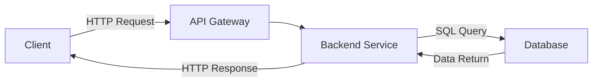
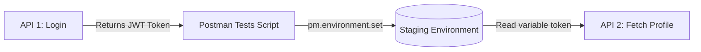

# API Testing with Postman Interview Questions

This Q&A bank contains 100 questions and answers on API testing foundations, Postman configurations, scripting assertions, dynamic environment variables, and CI/CD triggers.

Use the interactive details tags to expand and read the answers.

---

## A. API Basics & Fundamentals



<details>
<summary><b>Q1: What is API testing and why is it important?</b></summary>

API testing verifies that Application Programming Interfaces work as intended, meeting functional, security, and performance standards. It validates business logic directly without relying on a UI.

It is important because:
- APIs are the backbone of modern microservice architectures.
- Failures in backend APIs cascade to downstream apps.
- API tests run faster and provide quicker feedback than UI tests.
</details>

<details>
<summary><b>Q2: What are the different types of APIs?</b></summary>

- **Public APIs**: Available to any third-party developers (e.g., Google Maps API).
- **Private APIs**: Internal to an organization.
- **Partner APIs**: Exposed to specific business partners under contractual agreements.
- **Composite APIs**: Orchestrate multiple API calls into a single response.
</details>

<details>
<summary><b>Q3: What is the difference between SOAP and REST APIs?</b></summary>

- **SOAP (Simple Object Access Protocol)** is XML-based, strictly contracted via WSDL, heavy, and secure by default.
- **REST (Representational State Transfer)** uses standard HTTP methods, handles JSON, XML, or HTML formats, is lightweight, and is widely preferred.
</details>

<details>
<summary><b>Q4: Explain HTTP methods in API testing.</b></summary>

- `GET`: Retrieve data from the server.
- `POST`: Create a new resource.
- `PUT`: Update a resource completely.
- `PATCH`: Update a resource partially.
- `DELETE`: Remove a resource.
</details>

<details>
<summary><b>Q5: What is idempotency in HTTP methods?</b></summary>

Idempotency means sending the same request multiple times returns the same outcome.
- `GET`, `PUT`, `DELETE` are idempotent.
- `POST` is not idempotent (repeated calls create duplicate records).
</details>

<details>
<summary><b>Q6: Difference between URI, URL, and Endpoint.</b></summary>

- **URI (Uniform Resource Identifier)** is an identifier for a resource.
- **URL (Uniform Resource Locator)** defines the location and protocol to find the resource (e.g., `https://api.com/users`).
- **Endpoint** is the exact URL where an API resource is exposed to clients.
</details>

<details>
<summary><b>Q7: Categories of HTTP status codes.</b></summary>

- `1xx`: Informational.
- `2xx`: Success (e.g., `200 OK`, `201 Created`).
- `3xx`: Redirection.
- `4xx`: Client Error (e.g., `400 Bad Request`, `401 Unauthorized`, `404 Not Found`).
- `5xx`: Server Error (e.g., `500 Internal Server Error`).
</details>

<details>
<summary><b>Q8: What are headers in API requests and responses?</b></summary>

Headers carry metadata about the request or response (e.g., `Content-Type: application/json`, `Authorization: Bearer <token>`, `Accept-Language: en`).
</details>

<details>
<summary><b>Q9: What is JSON and why is it preferred over XML?</b></summary>

JSON is a lightweight key-value text format. It is preferred because it has smaller payloads, is parsed natively by JavaScript, and is easier for humans to read than XML.
</details>

<details>
<summary><b>Q10: How do you validate an API response?</b></summary>

Validate the HTTP status code, check the response headers (e.g., content-type), assert values in the response body, and verify the JSON schema matches the contract.
</details>

---

## B. Postman Features & Usage



<details>
<summary><b>Q11: What is Postman and why is it widely used in API testing?</b></summary>

Postman is an API platform for sending requests, writing scripts, and running automated tests. It is popular because of its user-friendly interface, environment switching, and Newman CLI integration for pipelines.
</details>

<details>
<summary><b>Q12: Explain the structure of a request in Postman.</b></summary>

A request in Postman includes:
- HTTP Method and URL/Endpoint.
- Params (Query parameters).
- Headers.
- Request Body (JSON, form-data).
- Authorization config.
- Pre-request and Test scripts.
</details>

<details>
<summary><b>Q13: What are Postman Collections and why are they important?</b></summary>

A Collection is a folder system that groups related API requests. It keeps tests organized, supports sharing, generates documentation, and runs batches via Collection Runner.
</details>

<details>
<summary><b>Q14: What are environments in Postman?</b></summary>

Environments store key-value variables specific to server contexts (e.g., `baseUrl` pointing to Dev, QA, or Staging), allowing testers to switch context without updating code.
</details>

<details>
<summary><b>Q15: What are variables in Postman and how do you use them?</b></summary>

Variables store reusable values. Scopes: Global, Collection, Environment, and Local. Used in endpoints and payloads using double curly braces: `{{baseUrl}}/users/{{userId}}`.
</details>

<details>
<summary><b>Q16: What is the difference between Pre-request Script and Tests in Postman?</b></summary>

- **Pre-request Script** executes before the HTTP request is sent (e.g., generating timestamps).
- **Tests** script executes after the response is received (e.g., checking assertions).
</details>

<details>
<summary><b>Q17: How do you write a basic test script in Postman?</b></summary>

Use Postman's JavaScript library (`pm`):
```javascript
pm.test("Status code is 200", function () {
    pm.response.to.have.status(200);
});
```
</details>

<details>
<summary><b>Q18: How do you send authentication credentials in Postman?</b></summary>

Under the Authorization tab, choose the auth type:
- Basic Auth (username/password).
- Bearer Token (token string).
- API Key or OAuth 2.0.
</details>

<details>
<summary><b>Q19: What is Collection Runner in Postman?</b></summary>

A built-in tool that runs all requests in a collection in sequence, supports iterating over CSV/JSON data files, and logs pass/fail results.
</details>

<details>
<summary><b>Q20: What is Newman and why is it used?</b></summary>

Newman is the NodeJS command-line runner for Postman collections. It allows running collections in headless environments and CI/CD build scripts.
</details>

<details>
<summary><b>Q21: How do you handle dynamic data in Postman tests?</b></summary>

Retrieve values from the response body and save them to environment variables:
```javascript
let token = pm.response.json().token;
pm.environment.set("token", token);
```
</details>

<details>
<summary><b>Q22: How do you import/export collections and environments in Postman?</b></summary>

- Export: Right-click a collection or environment -> Export (saves as JSON).
- Import: Use the Import button on the top-left to drag and drop JSON files.
</details>

<details>
<summary><b>Q23: What is a Monitor in Postman?</b></summary>

A cloud-based monitoring feature that schedules collection runs automatically at set intervals to verify API uptime and alert on failures.
</details>

<details>
<summary><b>Q24: How do you validate JSON schema in Postman?</b></summary>

Use the `pm.response.to.have.jsonSchema(schema)` assertion inside the Tests tab with a defined AJV schema structure.
</details>

<details>
<summary><b>Q25: How do you pass query parameters in Postman?</b></summary>

Either append parameters directly to the URL (`?status=active`) or add key-value rows in the Params tab below the address bar.
</details>

---

## C. API Testing in Depth

<details>
<summary><b>Q26: How do you approach testing a new API when no documentation is available?</b></summary>

1. Capture API traffic using browser DevTools or proxy tools (e.g. Fiddler).
2. Explore endpoints starting with `GET` calls.
3. Inspect error responses to identify required headers/parameters.
4. Interview developers to verify assumptions.
</details>

<details>
<summary><b>Q27: What are the most common API testing validations?</b></summary>

Validations should cover: HTTP status codes, payload fields and data types, content-type and security headers, response latency SLAs, and schema validation.
</details>

<details>
<summary><b>Q28: How do you test API error handling?</b></summary>

Perform negative testing: send missing required fields, send invalid data types, trigger authentication failures, and exceed rate limits to verify correct `4xx` and `5xx` error codes.
</details>

<details>
<summary><b>Q29: What is the difference between functional and non-functional API testing?</b></summary>

- **Functional**: Verifies logic correctness (e.g., correct response payload fields).
- **Non-functional**: Checks performance metrics (e.g., speed under load) and security policies (e.g., OWASP top 10).
</details>

<details>
<summary><b>Q30: How do you validate data integrity in API testing?</b></summary>

Use request sequencing: execute `POST` to create, run `GET` to verify, execute `PUT` to modify, and query the database directly to verify database records match.
</details>

<details>
<summary><b>Q31: How do you test API security in Postman?</b></summary>

Test accessing endpoints without tokens (should fail), use expired/tempered tokens (should fail), and check for CORS restrictions and sensitive plain text data exposure.
</details>

<details>
<summary><b>Q32: How do you test an API for performance using Postman?</b></summary>

Assert response time in test scripts:
`pm.expect(pm.response.responseTime).to.be.below(500);`
For heavy load validation, export the collection to JMeter or k6.
</details>

<details>
<summary><b>Q33: How do you chain API requests in Postman?</b></summary>

Chaining passes data from one response to the next. The tests tab of request A saves the variable, and request B references it using `{{variableName}}`.
</details>

<details>
<summary><b>Q34: How do you test APIs that have dependencies on other services?</b></summary>

Use Postman mock servers or stubs to simulate the dependencies, or design contract tests to validate interactions without full integration.
</details>

<details>
<summary><b>Q35: How do you handle dynamic tokens or session IDs in Postman?</b></summary>

Parse the token from the login response body using `pm.response.json().token` and set it as an environment variable in the Tests tab.
</details>

<details>
<summary><b>Q36: How do you ensure API backward compatibility?</b></summary>

Run regression test suites against old versions, check that deprecated fields still return correct data, and verify new properties are optional.
</details>

<details>
<summary><b>Q37: How do you test API pagination?</b></summary>

Send requests with limit and offset params (`?limit=10&offset=20`), check response sizes, and test limits (first, last, out-of-bounds pages).
</details>

<details>
<summary><b>Q38: How do you test sorting and filtering in APIs?</b></summary>

Send filter parameters (`?status=active`) and verify only matching records return. Send sort parameters (`?sort=name&order=asc`) and verify the list matches array sort logic.
</details>

<details>
<summary><b>Q39: How do you validate API contracts?</b></summary>

Compare responses against Swagger/OpenAPI files using contract assertions or AJV schema validations in Postman.
</details>

<details>
<summary><b>Q40: How do you test APIs that return asynchronous responses?</b></summary>

Submit the request to get a job ID, run a status polling API in a loop (using `postman.setNextRequest`), and validate the final payload once completed.
</details>

---

## D. Scripting & Automation in Postman

<details>
<summary><b>Q41: What scripting language does Postman use for automation?</b></summary>

Postman uses JavaScript. Pre-request scripts run before the call, while Test scripts execute after the response arrives.
</details>

<details>
<summary><b>Q42: How do you store and use dynamic values across requests?</b></summary>

In the Tests tab:
`pm.environment.set("myKey", pm.response.json().someValue);`
Use it in the URL of the next request as `{{myKey}}`.
</details>

<details>
<summary><b>Q43: How do you run data-driven tests in Postman?</b></summary>

Use a CSV or JSON file in Collection Runner. The variable names in the collection (e.g. `{{username}}`) must match the column headers in the data file.
</details>

<details>
<summary><b>Q44: How do you write assertions for status codes and response times?</b></summary>

```javascript
pm.test("Status code is 200", () => { pm.response.to.have.status(200); });
pm.test("Time < 500ms", () => { pm.expect(pm.response.responseTime).to.be.below(500); });
```
</details>

<details>
<summary><b>Q45: How do you validate JSON response body in Postman?</b></summary>

```javascript
let data = pm.response.json();
pm.test("Check name", () => { pm.expect(data.name).to.eql("John"); });
```
</details>

<details>
<summary><b>Q46: How do you validate a JSON schema in Postman tests?</b></summary>

```javascript
const schema = { "type": "object", "required": ["id"] };
pm.test("Schema check", () => { pm.response.to.have.jsonSchema(schema); });
```
</details>

<details>
<summary><b>Q47: How do you log output to Postman Console?</b></summary>

Write `console.log("val:", value);` and view output in the Postman Console panel (`Alt + Ctrl + C`).
</details>

<details>
<summary><b>Q48: How do you handle loops in Postman scripts?</b></summary>

Control flow dynamically using:
`postman.setNextRequest("Request Name");`
Set to null to stop execution loops: `postman.setNextRequest(null);`.
</details>

<details>
<summary><b>Q49: How do you call one request from another in Postman?</b></summary>

Sequencing is managed via `postman.setNextRequest("targetRequestName")`, which overrides Docusaurus/Postman default linear order.
</details>

<details>
<summary><b>Q50: How do you generate random test data in Postman?</b></summary>

Use dynamic variables: `{{$randomEmail}}`, `{{$randomFirstName}}`, or write JavaScript's random math in the pre-request script.
</details>

<details>
<summary><b>Q51: How do you handle conditional testing in Postman scripts?</b></summary>

Write conditional blocks in the Tests script to change assertions based on status codes:
```javascript
if (pm.response.code === 200) { ... }
```
</details>

<details>
<summary><b>Q52: How do you automate Postman tests in CI/CD pipelines?</b></summary>

Export the collection and environment as JSON files, and run them headlessly in your pipeline script using:
`newman run collection.json -e env.json`
</details>

<details>
<summary><b>Q53: How do you capture values from headers in Postman?</b></summary>

```javascript
let token = pm.response.headers.get("Authorization");
```
</details>

<details>
<summary><b>Q54: How do you validate arrays in Postman response?</b></summary>

```javascript
let items = pm.response.json().items;
pm.test("Array count", () => { pm.expect(items.length).to.be.above(0); });
```
</details>

<details>
<summary><b>Q55: How do you run only selected tests in a Postman collection?</b></summary>

Organize tests into subfolders and execute only specific folders in Newman or Collection Runner, or use `setNextRequest` to skip tests.
</details>

<details>
<summary><b>Q56: How do you use environment variables in scripts?</b></summary>

- Get: `pm.environment.get("variable_name");`
- Set: `pm.environment.set("variable_name", "value");`
</details>

<details>
<summary><b>Q57: How do you parameterize requests in Postman?</b></summary>

Place double curly brackets containing variable names in headers, URLs, or JSON body payloads (e.g. `{{user_name}}`).
</details>

<details>
<summary><b>Q58: How do you run Postman tests headlessly?</b></summary>

Install Newman CLI using npm (`npm install -g newman`) and execute runs via command line terminal commands.
</details>

<details>
<summary><b>Q59: How do you retry failed requests in Postman scripts?</b></summary>

Use a retry count variable in Staging environments:
```javascript
if (pm.response.code !== 200 && retryCount < 3) {
    postman.setNextRequest(pm.info.requestName);
}
```
</details>

<details>
<summary><b>Q60: How do you test APIs with file uploads in Postman?</b></summary>

Configure body type to `form-data`, add a key of type `file`, and choose files from your local storage.
</details>

---

## E. Advanced Testing Scenarios

<details>
<summary><b>Q61: How do you test versioned APIs?</b></summary>

Verify changes across routes (e.g., `/v1/` vs `/v2/`). Check that deprecated endpoints handle validation checks gracefully.
</details>

<details>
<summary><b>Q62: How do you test APIs in a microservices architecture?</b></summary>

Mock external service dependencies, focus on API schemas, and write contract tests to check service boundaries.
</details>

<details>
<summary><b>Q63: How do you test APIs that return asynchronous results?</b></summary>

Execute request, parse job ID, run a status query iteratively in the test script until status becomes `completed`, then perform assertions.
</details>

<details>
<summary><b>Q64: How do you test APIs with third-party integrations?</b></summary>

Mock third-party API payloads to prevent billing charges and bypass network instability during integration runs.
</details>

<details>
<summary><b>Q65: How do you test API rate limiting?</b></summary>

Trigger request bursts in a loop. Verify that the server returns a `429 Too Many Requests` code when thresholds are crossed.
</details>

<details>
<summary><b>Q66: How do you test webhooks in Postman?</b></summary>

Set up a Postman Mock Server endpoint, configure the webhook to send notifications to that mock URL, and check the received logs.
</details>

<details>
<summary><b>Q67: How do you test GraphQL APIs in Postman?</b></summary>

Configure the request type to `POST`, select GraphQL body payload, write queries/mutations, and assert JSON response attributes.
</details>

<details>
<summary><b>Q68: How do you test APIs with file downloads?</b></summary>

Assert that the `Content-Disposition` header matches the expected filename and check that the `Content-Length` matches target limits.
</details>

<details>
<summary><b>Q69: How do you test APIs that require digital signatures?</b></summary>

Use a Pre-request script to calculate HMAC hashes (using `CryptoJS`) and inject the signature value into the Authorization header dynamically.
</details>

<details>
<summary><b>Q70: How do you mock APIs in Postman?</b></summary>

Create a Mock Server in Postman, add endpoints, save response templates, and route your client calls to the mock server URL.
</details>

<details>
<summary><b>Q71: How do you handle API request sequencing in Postman?</b></summary>

Organize requests sequentially in collection folders, and configure conditional routing using `postman.setNextRequest()`.
</details>

<details>
<summary><b>Q72: How do you test APIs that have different behavior for different users?</b></summary>

Map different Bearer tokens (Admin, Standard User, Guest) to variables, and verify Role-Based Access Control permissions.
</details>

<details>
<summary><b>Q73: How do you test an API migration from monolith to microservices?</b></summary>

Run identical test scenarios on both environments, and compare response payloads and execution speeds to verify parity.
</details>

<details>
<summary><b>Q74: How do you test an API that returns streaming data?</b></summary>

Configure Postman WebSocket connections, subscribe to the event stream, and assert on incoming messages and connection durability.
</details>

<details>
<summary><b>Q75: How do you test APIs with scheduled jobs?</b></summary>

Configure cron schedules to execute frequently in QA environments, or trigger jobs manually using admin API routes.
</details>

<details>
<summary><b>Q76: How do you handle flaky APIs in automation?</b></summary>

Implement retry policies inside pre-request/test scripts, and handle dynamic delays instead of using hardcoded intervals.
</details>

<details>
<summary><b>Q77: How do you test localization in APIs?</b></summary>

Send headers (e.g. `Accept-Language: fr-FR`) and verify that description strings, currencies, and timestamps adjust.
</details>

<details>
<summary><b>Q78: How do you validate API caching behavior?</b></summary>

Verify headers like `Cache-Control`, `ETag`, and check if repeated requests yield fast response times.
</details>

<details>
<summary><b>Q79: How do you test APIs under failure scenarios?</b></summary>

Mock the target endpoints to return status codes like `500` or `503`, and verify client-side failover capabilities.
</details>

<details>
<summary><b>Q80: How do you test gRPC APIs in Postman?</b></summary>

Import the `.proto` service definition file, select the method to test, pass query values, and trigger execution.
</details>

---

## F. CI/CD & Integration Testing

<details>
<summary><b>Q81: How do you integrate Postman tests into CI/CD pipelines?</b></summary>

Export collections and environments to JSON format, and run them inside build stages (Jenkins, GitLab CI) using the Newman CLI.
</details>

<details>
<summary><b>Q82: What is Newman and why is it used?</b></summary>

Newman is the headless command-line runner for Postman collections, used in automated pipelines to run API assertions without a GUI.
</details>

<details>
<summary><b>Q83: How do you generate HTML reports from Newman?</b></summary>

Run Newman using the htmlextra reporter plugin:
`newman run col.json -r htmlextra`
This creates responsive dashboards.
</details>

<details>
<summary><b>Q84: How do you schedule Postman collections to run automatically?</b></summary>

Set up scheduled Jenkins cron jobs, or use Postman cloud Monitors to run checks at hourly intervals.
</details>

<details>
<summary><b>Q85: How do you pass dynamic environment variables in CI/CD?</b></summary>

Override variables using the Newman CLI flag:
`newman run col.json --env-var "baseUrl=https://qa.api.com"`
</details>

<details>
<summary><b>Q86: How do you run specific folders or requests from a collection in CI/CD?</b></summary>

Use the `--folder` argument in Newman:
`newman run col.json --folder "SmokeTests"`
</details>

<details>
<summary><b>Q87: How do you integrate Postman with version control (Git)?</b></summary>

Save and commit exported collection JSON files directly into your framework Git repositories, or sync using Postman Git integrations.
</details>

<details>
<summary><b>Q88: How do you test APIs automatically after deployment?</b></summary>

Configure post-deployment triggers in pipelines to run Newman scripts as verification gates before updating production environments.
</details>

<details>
<summary><b>Q89: How do you run Postman collections in parallel?</b></summary>

Configure your CI pipeline runner (e.g. Jenkins) to execute multiple Newman commands concurrently on parallel build nodes.
</details>

<details>
<summary><b>Q90: How do you publish API test results to a dashboard?</b></summary>

Configure Newman to export results in JUnit XML format, and import them into Jenkins or Azure DevOps reporting dashboards.
</details>

---

## G. Best Practices & Common Pitfalls

<details>
<summary><b>Q91: What are API testing best practices?</b></summary>

- Avoid hardcoded values; use variables.
- Write both positive and negative tests.
- Validate response times and schemas.
- Clean up test data afterwards.
</details>

<details>
<summary><b>Q92: How do you ensure API tests are maintainable?</b></summary>

Group requests logically, reuse code in Pre-request folders, and avoid hardcoding authentication tokens.
</details>

<details>
<summary><b>Q93: What is schema validation and why is it important?</b></summary>

It checks if response payloads conform to defined properties and types, catching breaking modifications early.
</details>

<details>
<summary><b>Q94: What’s the difference between smoke, regression, and load testing in APIs?</b></summary>

- **Smoke**: Quick ping to check if endpoints are alive.
- **Regression**: Running full suites to check functional changes.
- **Load**: Testing response times under heavy user traffic.
</details>

<details>
<summary><b>Q95: What are common mistakes in Postman testing?</b></summary>

- Hardcoding endpoints and tokens.
- Testing only success scenarios.
- Neglecting to assert on schema structures.
</details>

<details>
<summary><b>Q96: How do you handle API security testing in Postman?</b></summary>

Test endpoints without headers (should fail), use invalid tokens, and execute injection payloads inside parameter forms.
</details>

<details>
<summary><b>Q97: How do you manage large Postman collections efficiently?</b></summary>

Break large collections into smaller, feature-specific folders, and write shared scripts at the collection level.
</details>

<details>
<summary><b>Q98: How do you test APIs with complex JSON structures?</b></summary>

Parse the response using `pm.response.json()` and access deep nested fields using JavaScript dot notation or lodash methods.
</details>

<details>
<summary><b>Q99: How do you keep Postman environments in sync across teams?</b></summary>

Use shared workspaces in Postman, or version control environment JSON templates (excluding secret keys) in Git.
</details>

<details>
<summary><b>Q100: If an API test fails in CI/CD, how do you troubleshoot?</b></summary>

Check Newman execution logs, verify environment variable exports, check endpoints, and rerun manually in Postman.
</details>
