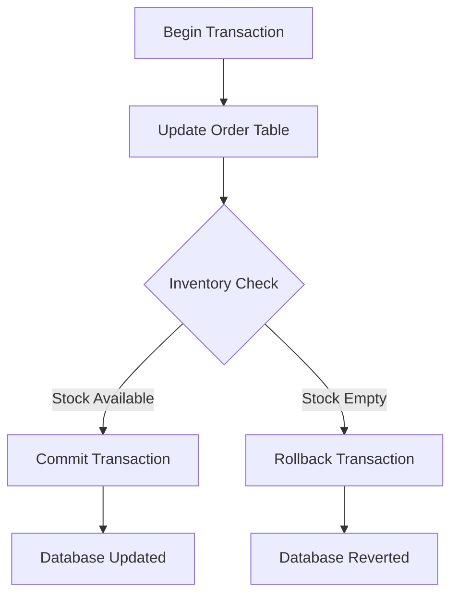

# SQL & Database Interview Questions

This Q&A bank contains 50 questions and answers on SQL query design, database validation, join logic, index optimization, and transaction handling.

Use the interactive details tags to expand and read the answers.

---

## SQL & Databases Basics



<details>
<summary><b>Q1: What is SQL and why is it important for a QA Engineer?</b></summary>

SQL (Structured Query Language) is the standard language used to store, manipulate, and retrieve data from relational databases.

For a QA Engineer, SQL is crucial because:
- Most applications store data in databases; verifying that backend records match UI entries is essential.
- It allows you to perform backend testing without relying on the UI.
- It helps in preparing and cleaning test data.
</details>

<details>
<summary><b>Q2: What is the difference between DELETE, TRUNCATE, and DROP?</b></summary>

- `DELETE` removes specific rows based on a `WHERE` clause. It is a DML command and can be rolled back.
- `TRUNCATE` removes all rows from a table and resets identity counters. It is a DDL command and cannot be rolled back easily.
- `DROP` completely removes the table structure and its data from the database schema.
</details>

<details>
<summary><b>Q3: What is a primary key? Can a table have multiple primary keys?</b></summary>

A primary key is a column or set of columns that uniquely identifies each row in a table. It does not allow duplicate or NULL values.
A table can have only one primary key constraint, but that key can be composed of multiple columns (a composite key).
</details>

<details>
<summary><b>Q4: What is a foreign key and why is it important in testing?</b></summary>

A foreign key is a column in one table that references the primary key in another, establishing a relationship.
It is important in testing because it enforces referential integrity, meaning you cannot insert a child record without a matching parent record.
</details>

<details>
<summary><b>Q5: What is the difference between INNER JOIN, LEFT JOIN, RIGHT JOIN, and FULL JOIN?</b></summary>

- `INNER JOIN`: Returns only matching rows from both tables.
- `LEFT JOIN`: Returns all rows from the left table and matching rows from the right.
- `RIGHT JOIN`: Returns all rows from the right table and matching rows from the left.
- `FULL JOIN`: Returns all rows from both tables, filling with NULL where there is no match.
</details>

<details>
<summary><b>Q6: How do you find duplicate records in a table?</b></summary>

Group by the duplicate column and filter groups using `HAVING COUNT(*) > 1`:
```sql
SELECT email, COUNT(*)
FROM users
GROUP BY email
HAVING COUNT(*) > 1;
```
</details>

<details>
<summary><b>Q7: What is the difference between WHERE and HAVING?</b></summary>

- `WHERE` filters rows before grouping or aggregations.
- `HAVING` filters groups after `GROUP BY` and aggregations are applied.
</details>

<details>
<summary><b>Q8: How do you find the second highest salary from a table?</b></summary>

Filter out the maximum salary and find the max of the remaining:
```sql
SELECT MAX(salary)
FROM employees
WHERE salary < (SELECT MAX(salary) FROM employees);
```
</details>

<details>
<summary><b>Q9: How do you update multiple columns in a single query?</b></summary>

Use a comma-separated list of updates in the SET clause:
```sql
UPDATE employees
SET salary = 90000, department = 'QA'
WHERE id = 5;
```
</details>

<details>
<summary><b>Q10: What is normalization and why is it important in databases?</b></summary>

Normalization is the process of organizing database tables to reduce data redundancy and improve data integrity (e.g. 1NF, 2NF, 3NF). It prevents anomalies during inserts, updates, and deletes.
</details>

<details>
<summary><b>Q11: What is denormalization, and when might QA encounter it?</b></summary>

Denormalization is the process of adding redundant data or combining tables to improve read performance. QA encounters this in reporting databases and data warehouses, where fast queries are critical.
</details>

<details>
<summary><b>Q12: How do you get the count of rows without using COUNT(*)?</b></summary>

You can fetch the maximum ID value if IDs are sequential, or verify row existence:
`SELECT MAX(id) FROM employees;`
Note that this can be inaccurate if rows were deleted.
</details>

<details>
<summary><b>Q13: Explain the difference between UNION and UNION ALL.</b></summary>

- `UNION` combines results from two queries and removes duplicate records.
- `UNION ALL` combines results and keeps all duplicate records, making it faster.
</details>

<details>
<summary><b>Q14: How do you retrieve the top 5 records from a table?</b></summary>

- In MySQL: `SELECT * FROM table LIMIT 5;`
- In SQL Server: `SELECT TOP 5 * FROM table;`
</details>

<details>
<summary><b>Q15: How do you check for NULL values in SQL?</b></summary>

Use the `IS NULL` operator (do not use `= NULL`):
`SELECT * FROM employees WHERE manager_id IS NULL;`
</details>

<details>
<summary><b>Q16: How do you replace NULL values with a default value?</b></summary>

Use function utilities like `COALESCE` or `ISNULL`:
`SELECT name, COALESCE(department, 'Not Assigned') FROM employees;`
</details>

<details>
<summary><b>Q17: What is the difference between CHAR and VARCHAR?</b></summary>

- `CHAR(n)` is fixed-length. It fills empty spaces with padding, using the same memory.
- `VARCHAR(n)` is variable-length. It uses only the memory required for the stored characters.
</details>

<details>
<summary><b>Q18: How do you retrieve the last inserted record?</b></summary>

Sort by auto-incrementing ID in descending order and limit the result:
`SELECT * FROM employees ORDER BY id DESC LIMIT 1;`
</details>

<details>
<summary><b>Q19: What is an index in SQL?</b></summary>

An index is a database object that improves query performance by enabling faster data retrieval.
Common types are Clustered (orders physical storage) and Non-clustered (lookup pointer structure).
</details>

<details>
<summary><b>Q20: How do you find the total salary for each department?</b></summary>

Group by department and apply the SUM function:
```sql
SELECT department, SUM(salary)
FROM employees
GROUP BY department;
```
</details>

---

## Intermediate SQL Queries

<details>
<summary><b>Q21: How do you fetch all records where a column contains a specific substring?</b></summary>

Use the `LIKE` operator with wildcard percentages:
`SELECT * FROM employees WHERE name LIKE '%John%';`
</details>

<details>
<summary><b>Q22: How do you find employees who don’t have any orders?</b></summary>

Use a `LEFT JOIN` and filter for where the child ID is null:
```sql
SELECT e.id, e.name
FROM employees e
LEFT JOIN orders o ON e.id = o.employee_id
WHERE o.id IS NULL;
```
</details>

<details>
<summary><b>Q23: How do you retrieve distinct department names from a table?</b></summary>

Use the `DISTINCT` keyword:
`SELECT DISTINCT department FROM employees;`
</details>

<details>
<summary><b>Q24: What’s the difference between BETWEEN and IN?</b></summary>

- `BETWEEN` filters values within an inclusive range (e.g., `BETWEEN 10 AND 50`).
- `IN` checks if values match a specific list (e.g., `IN ('HR', 'QA', 'Sales')`).
</details>

<details>
<summary><b>Q25: How do you find the number of employees hired each year?</b></summary>

Extract the year from the date column and count:
```sql
SELECT YEAR(hire_date), COUNT(*)
FROM employees
GROUP BY YEAR(hire_date);
```
</details>

<details>
<summary><b>Q26: How do you select records with salaries higher than the department average?</b></summary>

Use a correlated subquery:
```sql
SELECT * FROM employees e
WHERE salary > (SELECT AVG(salary) FROM employees WHERE department = e.department);
```
</details>

<details>
<summary><b>Q27: What is a self-join and when is it used?</b></summary>

A self-join is when a table is joined with itself. It is used to compare rows in the same table (e.g., matching employees to their managers stored in the same table).
</details>

<details>
<summary><b>Q28: How do you get all records except the highest salary?</b></summary>

Filter for values strictly less than the maximum:
`SELECT * FROM employees WHERE salary < (SELECT MAX(salary) FROM employees);`
</details>

<details>
<summary><b>Q29: What is a correlated subquery?</b></summary>

A correlated subquery is a subquery that depends on the outer query's values for its execution, running once for each row evaluated by the outer query.
</details>

<details>
<summary><b>Q30: How do you check if two tables have the same data?</b></summary>

Use the `EXCEPT` or `MINUS` set operations:
```sql
(SELECT * FROM table1 EXCEPT SELECT * FROM table2)
UNION ALL
(SELECT * FROM table2 EXCEPT SELECT * FROM table1);
```
If the output is empty, the tables are identical.
</details>

<details>
<summary><b>Q31: How do you find employees whose salary is within the top 3 highest salaries in the company?</b></summary>

```sql
SELECT * FROM employees
WHERE salary IN (
  SELECT DISTINCT salary FROM employees
  ORDER BY salary DESC LIMIT 3
);
```
</details>

<details>
<summary><b>Q32: How do you check if a table has any rows without fetching the data?</b></summary>

Use `EXISTS` with a constant query:
`SELECT CASE WHEN EXISTS (SELECT 1 FROM employees) THEN 'Yes' ELSE 'No' END;`
</details>

<details>
<summary><b>Q33: What is the difference between EXISTS and IN?</b></summary>

- `IN` fetches all subquery results first and checks for matches in memory.
- `EXISTS` returns true as soon as it finds a matching row, making it faster for large datasets.
</details>

<details>
<summary><b>Q34: How do you get the difference between two dates in SQL?</b></summary>

Use the `DATEDIFF` function:
- In MySQL: `DATEDIFF(end_date, start_date)`
- In SQL Server: `DATEDIFF(DAY, start_date, end_date)`
</details>

<details>
<summary><b>Q35: How do you find the highest salary in each department?</b></summary>

Use `GROUP BY` and the `MAX` aggregate function:
```sql
SELECT department, MAX(salary)
FROM employees
GROUP BY department;
```
</details>

<details>
<summary><b>Q36: What is a view in SQL, and why might QA use it?</b></summary>

A view is a virtual table representing the result of a saved query. QA uses views to simplify complex joins and access clean data for regression assertions.
</details>

<details>
<summary><b>Q37: How do you find records present in one table but not in another?</b></summary>

Use `NOT IN` or a `LEFT JOIN` where the child column is NULL:
```sql
SELECT * FROM t1 WHERE id NOT IN (SELECT id FROM t2);
```
</details>

<details>
<summary><b>Q38: How do you select random rows from a table?</b></summary>

- In MySQL: `SELECT * FROM table ORDER BY RAND() LIMIT 5;`
- In SQL Server: `SELECT TOP 5 * FROM table ORDER BY NEWID();`
</details>

<details>
<summary><b>Q39: How do you check for duplicate rows based on multiple columns?</b></summary>

Group by the columns and filter where the count is greater than one:
```sql
SELECT col1, col2, COUNT(*)
FROM table
GROUP BY col1, col2
HAVING COUNT(*) > 1;
```
</details>

<details>
<summary><b>Q40: How do you delete duplicate rows but keep one instance?</b></summary>

Join the table on itself and delete rows with higher IDs:
```sql
DELETE e1 FROM employees e1
INNER JOIN employees e2 ON e1.email = e2.email AND e1.id > e2.id;
```
</details>

---

## Advanced Database Concepts & Optimization

<details>
<summary><b>Q41: How do you convert a string to uppercase in SQL?</b></summary>

Use the `UPPER` function:
`SELECT UPPER(name) FROM employees;`
</details>

<details>
<summary><b>Q42: How do you find the length of a string in SQL?</b></summary>

- In MySQL: `SELECT LENGTH(name) FROM employees;`
- In SQL Server: `SELECT LEN(name) FROM employees;`
</details>

<details>
<summary><b>Q43: How do you find all employees hired in the last 30 days?</b></summary>

- In MySQL: `WHERE hire_date >= CURDATE() - INTERVAL 30 DAY;`
- In SQL Server: `WHERE hire_date >= DATEADD(day, -30, GETDATE());`
</details>

<details>
<summary><b>Q44: How do you use a case statement in SQL?</b></summary>

```sql
SELECT name,
  CASE
    WHEN salary > 10000 THEN 'High'
    ELSE 'Standard'
  END AS salary_level
FROM employees;
```
</details>

<details>
<summary><b>Q45: How do you handle special characters in SQL queries?</b></summary>

Escape the special characters using backslashes `\` or double quotes depending on the database engine.
</details>

<details>
<summary><b>Q46: How do you select only numeric values from a column containing mixed data?</b></summary>

Use a regular expression:
`SELECT * FROM table WHERE column REGEXP '^[0-9]+$';`
</details>

<details>
<summary><b>Q47: How do you join more than two tables in SQL?</b></summary>

Chain multiple `JOIN` clauses sequentially matching foreign keys:
```sql
SELECT o.id, c.name, p.title
FROM orders o
JOIN customers c ON o.customer_id = c.id
JOIN products p ON o.product_id = p.id;
```
</details>

<details>
<summary><b>Q48: How do you pivot data in SQL?</b></summary>

Use the `PIVOT` operator or conditional aggregation:
```sql
SELECT year,
  SUM(CASE WHEN month = 1 THEN sales END) AS Jan_Sales,
  SUM(CASE WHEN month = 2 THEN sales END) AS Feb_Sales
FROM sales
GROUP BY year;
```
</details>

<details>
<summary><b>Q49: How do you handle transactions in SQL for testing?</b></summary>

Wrap statements inside `BEGIN TRANSACTION` and call `ROLLBACK` after validation to prevent polluting the test database.
</details>

<details>
<summary><b>Q50: What are stored procedures and how can QA test them?</b></summary>

A stored procedure is a precompiled set of SQL statements stored in the database. QA tests stored procedures by calling them with boundary input parameters and verifying outputs match requirements.
</details>
