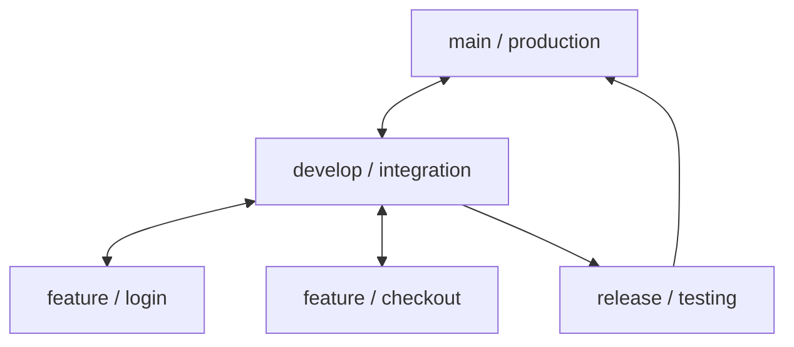

# Git & GitHub Interview Questions

This Q&A bank contains 20 detailed questions and answers on distributed version control, branching strategies, merge conflict resolution, stashing, and rollback mechanisms.

Use the details tags to toggle responses.

---

## Git & GitHub Q&A



<details>
<summary><b>Q1: What is Git and why is it important for QA engineers?</b></summary>

**Core Answer**: Git is a distributed version control system used to track source code changes over time, enabling teams to collaborate without overwriting each other's work.

**Why it matters for QA**:
- **Test Automation Management**: Reusable test scripts are code files; Git allows versioning and collaborating on framework developments.
- **CI/CD Integration**: Jenkins, GitHub Actions, or GitLab CI/CD pull test automation suites directly from Git branches.
- **Isolating Testing**: QA can pull specific developer feature branches to verify code changes in isolated local environments.
- **Rollbacks**: If a test suite becomes unstable due to configuration changes, you can instantly revert to a previous working commit.
</details>

<details>
<summary><b>Q2: What is the difference between Git and GitHub?</b></summary>

**Core Answer**: Git is the local version control software, while GitHub is a cloud-based service that hosts Git repositories.

**Key Differences**:
- **Git**: Installed locally. Manages commits, history, branches, and merges on your machine.
- **GitHub**: Cloud-hosted. Provides a UI to share repositories, manage Pull Requests (PRs), run automated checks (CI), track bug issues, and host project wikis.
</details>

<details>
<summary><b>Q3: Explain the Git branching model (Git Flow) commonly used in software projects.</b></summary>

**Core Answer**: Git Flow is a branching strategy that uses separate branches for development, release staging, and production to manage release stability.

**Branch Types & Roles**:
- `main` / `master`: Production-ready, stable code. Only merged during releases.
- `develop`: Integration branch where developers merge their completed stories.
- `feature/*`: Short-lived branches used by developers to work on single tasks.
- `release/*`: Staged branch used by QA to perform regression testing and bug fixes before releasing to main.
- `hotfix/*`: Branches created off `main` to patch critical production bugs immediately.
</details>

<details>
<summary><b>Q4: How do you resolve merge conflicts in Git?</b></summary>

**Core Answer**: A merge conflict occurs when Git cannot automatically reconcile differences in code changes made by two people to the same line of a file.

**Step-by-Step Resolution**:
1. Identify the conflict files during a merge or rebase.
2. Open the file and locate the conflict markers:
   ```text
   <<<<<<< HEAD
   // Your local changes
   =======
   // Incoming remote changes
   >>>>>>> branch-name
   ```
3. Discuss with the developer if necessary, delete the conflict markers, and edit the code to keep the correct lines.
4. Save the file and stage it: `git add <file_path>`
5. Complete the merge commit: `git commit -m "Resolved conflicts"`
</details>

<details>
<summary><b>Q5: How do you revert a commit that has already been pushed to a remote repository?</b></summary>

**Core Answer**: Use the `git revert` command, which creates a new commit that applies the exact opposite changes of the target commit, preserving the history.

**Command & Usage**:
```bash
git revert <commit-hash>
```
*Why this is preferred over resets in team environments*: Hard resets delete history and force pushes (`git push -f`), which can overwrite other developers' history and break remote branch synchronization.
</details>

<details>
<summary><b>Q6: What is the difference between git merge and git rebase?</b></summary>

**Core Answer**: Both combine changes from one branch into another, but they differ in how they write commit history.

**Key Differences**:
- `git merge`: Combines branches by creating a new "merge commit". It preserves the complete chronological history of branches, but can result in a complex, non-linear commit graph.
- `git rebase`: Moves the starting point of your feature branch to the tip of the target branch. It rewrites history by applying your commits one by one on top of the target branch, creating a clean, linear history.
</details>

<details>
<summary><b>Q7: How do you clone a repository from GitHub to your local machine?</b></summary>

**Core Answer**: Use the `git clone` command pointing to the remote repository's URL (either HTTPS or SSH).

**Command & Options**:
```bash
# Clone the default branch
git clone https://github.com/user/project.git

# Clone and switch to a specific branch immediately
git clone -b feature-payment https://github.com/user/project.git
```
This downloads all files, directories, branches, and commit histories to your local machine.
</details>

<details>
<summary><b>Q8: What is a Pull Request (PR), and what is its role in QA test automation?</b></summary>

**Core Answer**: A Pull Request is a request to merge code changes from a feature branch into a target branch (like `develop`). It allows team members to review changes before they are integrated.

**QA Role in PRs**:
- **Code Review**: QA reviews automation framework changes (e.g. check element selectors, ensure explicit waits are used).
- **Quality Gates**: PRs can trigger automated CI pipelines (like running smoke tests) to verify the build is stable before merging.
- **Traceability**: Links feature changes directly to JIRA tickets.
</details>

<details>
<summary><b>Q9: How do you stash changes in Git, and when is it useful?</b></summary>

**Core Answer**: Use `git stash` to temporarily shelf your local uncommitted changes so you can switch to a clean branch, and restore them later.

**Key Commands**:
- `git stash push -m "WIP on login UI"`: Saves active changes with a label.
- `git stash list`: Lists all stashed changes.
- `git stash pop`: Applies the latest stash and removes it from the list.
- `git stash apply`: Applies the latest stash but *retains* it in the list (safer).
</details>

<details>
<summary><b>Q10: What are Git Tags, and how are they used in release management?</b></summary>

**Core Answer**: Git Tags are markers assigned to specific commits in history, typically representing major release versions (e.g., `v1.0.0`).

**Usage & Commands**:
- **Create a Tag**: `git tag -a v1.0.0 -m "Release version 1.0.0"`
- **Push Tags**: `git push origin --tags`
- **QA usage**: QA uses tags to check out and run automation suites against specific build releases (e.g. `git checkout tags/v1.0.0`).
</details>

<details>
<summary><b>Q11: What is the difference between git fetch and git pull?</b></summary>

**Core Answer**: `git fetch` only downloads changes from the remote repository, whereas `git pull` downloads *and* merges those changes into your current local branch.

**Usage Relationship**:
`git pull` is effectively a combination of two commands:
```bash
git fetch origin
git merge origin/your-branch
```
Use `git fetch` when you want to review remote changes before merging them locally.
</details>

<details>
<summary><b>Q12: How do you view the commit history in Git?</b></summary>

**Core Answer**: Use the `git log` command to view the commit history of your branch.

**Common Formatting Options**:
- `git log --oneline`: Displays each commit on a single line (hash and commit message).
- `git log -n 5`: Shows only the last 5 commits.
- `git log --graph --oneline --all`: Displays a visual branch tree mapping commits.
</details>

<details>
<summary><b>Q13: How do you create and switch to a new branch in Git?</b></summary>

**Core Answer**: Use `git checkout -b` or `git switch -c` to create and switch to a branch in a single command.

**Commands**:
```bash
# Modern command (Git 2.23+)
git switch -c feature-test-cases

# Traditional command
git checkout -b feature-test-cases
```
</details>

<details>
<summary><b>Q14: How do you delete a branch in Git (locally and remotely)?</b></summary>

**Core Answer**: Delete local branches using `git branch -d`, and remote branches by pushing a delete command to the remote repository.

**Commands**:
```bash
# Delete a local branch (safe mode - fails if unmerged)
git branch -d branch-name

# Force delete local branch (unmerged changes will be lost)
git branch -D branch-name

# Delete a remote branch
git push origin --delete branch-name
```
</details>

<details>
<summary><b>Q15: How do you see the differences between two commits or branches?</b></summary>

**Core Answer**: Use the `git diff` command to inspect file differences.

**Common Scenarios**:
```bash
# Compare working directory to latest commit
git diff

# Compare two specific commits
git diff commitHash1 commitHash2

# Compare local branch to remote main
git diff origin/main
```
</details>

<details>
<summary><b>Q16: How do you undo the last commit but keep your changes in the working directory?</b></summary>

**Core Answer**: Use `git reset --soft HEAD~1`. This removes the latest commit but keeps your modifications staged in the staging area.

**Reset Types**:
- `--soft HEAD~1`: Undoes the commit, keeps modifications staged.
- `--mixed HEAD~1` (default): Undoes the commit and unstages changes, keeping files in the working directory.
- `--hard HEAD~1`: Undoes the commit, unstages changes, and **deletes all modifications** (destructive).
</details>

<details>
<summary><b>Q17: What is the .gitignore file and why is it crucial for automation frameworks?</b></summary>

**Core Answer**: A `.gitignore` file specifies untracked files and directories that Git should ignore and never commit to the repository.

**Crucial exclusions for QA**:
- IDE configurations (e.g. `.idea/`, `.vscode/`).
- Package dependencies (e.g. `node_modules/`, `target/`).
- Automated report outputs (e.g. `test-output/`, `allure-results/`).
- Secrets and tokens (e.g. `.env`, `credentials.json`).
</details>

<details>
<summary><b>Q18: How do you verify which branch you are on and check the status of your working files?</b></summary>

**Core Answer**: Use the `git status` command to view unstaged, staged, and untracked files, and to check your active branch.

**Command & Output**:
```bash
git status
```
It tells you if your branch is up-to-date with `origin`, list files modified but not staged, and files ready to be committed.
</details>

<details>
<summary><b>Q19: How do you rename a branch in Git?</b></summary>

**Core Answer**: Use the `git branch -m` command to rename branches locally.

**Commands**:
```bash
# Rename the current active branch
git branch -m new-branch-name

# Rename a different branch
git branch -m old-branch-name new-branch-name
```
If the branch was already pushed to remote, delete the old remote branch and push the new one.
</details>

<details>
<summary><b>Q20: How do you check who made specific line modifications in a file?</b></summary>

**Core Answer**: Use the `git blame` command to view line-by-line commit information for a file.

**Command & Usage**:
```bash
git blame src/test/java/LoginPageTest.java
```
This displays each line of the file prefixed with the commit hash, author, and timestamp. It helps identify which commit introduced a bug.
</details>
