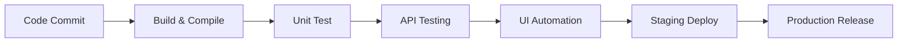
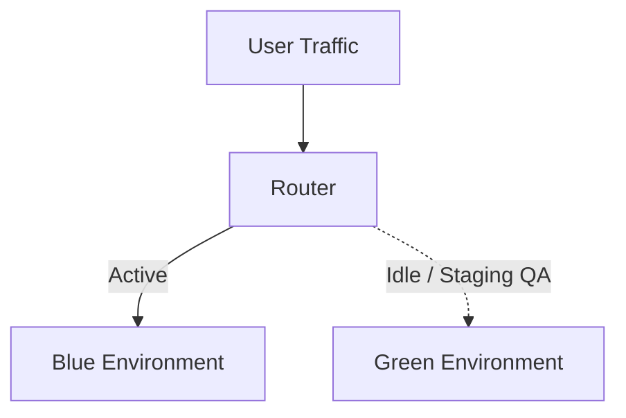

# CI/CD & Jenkins Interview Questions

This Q&A bank contains 30 questions and answers on continuous integration, deployment strategies, build validation gates, Jenkins configurations, and test reporting.

Use the details tags to toggle responses.

---

## CI/CD Pipelines Core Concepts

<b>Q1: What is CI/CD and why is it important for QA engineers?</b>

CI/CD stands for Continuous Integration and Continuous Delivery/Deployment.
- **Continuous Integration**: Frequently merging code changes into a shared repository, trigger-building, and running automated tests.
- **Continuous Delivery**: Automatically packaging builds for manual release triggers.
- **Continuous Deployment**: Automatically deploying every passed build to production.

It is important because it catches regressions early, eliminates manual deployment delays, and runs test suites consistently.

<b>Q2: What is the difference between Continuous Delivery and Continuous Deployment?</b>

- **Continuous Delivery** requires manual approval and verification before pushing a build to production, giving QA teams release control.
- **Continuous Deployment** automatically deploys passed code changes to production without human intervention.

<b>Q3: What is the role of QA in a CI/CD pipeline?</b>

QA is responsible for:
- Writing and integrating automated test scripts into pipeline stages.
- Configuring quality gates to fail builds if tests fail.
- Monitoring test runs to resolve flaky tests.
- Collaborating with DevOps to manage test environments.

<b>Q4: How does CI/CD improve software quality for QA teams?</b>

CI/CD shortens the feedback loop, allowing QA to discover defects minutes after a developer commits. It reduces manual regression testing, ensures identical environment setups, and increases release confidence.

<b>Q5: What are quality gates in CI/CD and how does QA use them?</b>

Quality gates are automated validation conditions that a build must satisfy to proceed in the pipeline. QA configures rules such as: 100% unit tests passed, at least 80% code coverage, and zero critical bugs.

<b>Q6: How do you integrate automated tests in a CI/CD pipeline?</b>

1. Push your test scripts to a Git repository.
2. Configure the CI tool (e.g. Jenkins) to pull changes on code updates.
3. Configure build execution steps to trigger tests (e.g., `mvn clean test`).
4. Set the pipeline state to fail if test executions exit with errors.

<b>Q7: How do you trigger a CI/CD pipeline automatically after code changes?</b>

By setting up webhooks in your Git provider (GitHub/GitLab) pointing to your CI server, or by configuring the CI server to poll the Git repository at regular intervals.

<b>Q8: What are the common stages of a CI/CD pipeline from a QA perspective?</b>

A typical pipeline includes: Build/Compile -> Unit Tests -> Integration/API Tests -> UI Automation -> Performance Verification -> Staging Deployment -> Production Release.

<b>Q9: What is a blue-green deployment and how does it help QA?</b>

A deployment strategy using two identical production environments:
- **Blue**: Currently active environment serving real traffic.
- **Green**: Staged environment containing the new build.

QA performs final validation on Green. Once passed, the router switches traffic from Blue to Green. This allows zero-downtime releases and instant rollbacks.

<b>Q10: How do you handle flaky tests in CI/CD pipelines?</b>

Identify flaky tests by checking failure trends, implement retry logic in test scripts, ensure proper synchronization (explicit waits), and isolate test data configurations.

<b>Q11: What tools can be used for CI/CD in QA automation?</b>

Common tools include Jenkins, GitHub Actions, GitLab CI/CD, CircleCI, and Azure DevOps.

<b>Q12: How do you run parallel tests in CI/CD?</b>

Run tests on cloud grids (e.g. BrowserStack), or configure the pipeline to split test files and run them concurrently on multiple parallel agent nodes.

<b>Q13: How do you generate and share test reports in CI/CD?</b>

Use reporting plugins like Allure or Extent Reports. Configure the pipeline to archive reports and publish them, or send links automatically to Slack/Teams channels.

<b>Q14: How do you manage test data in CI/CD?</b>

Store test parameters in dynamic JSON/CSV files, use environment variables to mask secrets, and run database cleanup scripts to reset tables before runs.

<b>Q15: What is the difference between CI/CD for backend APIs and frontend UI testing?</b>

- **Backend CI/CD** runs fast, validating API schemas, integrations, and database migrations.
- **Frontend CI/CD** checks layouts, browser compatibility, and workflows. It is slower and runs later in the pipeline.

---

## Jenkins Build Automation

<b>Q16: What is Jenkins and why is it important for QA engineers?</b>

Jenkins is an open-source automation server. For QA, it automates test executions, coordinates Git integrations, publishes reports, and schedules nightly regression runs.

<b>Q17: How do you create a basic Jenkins job to run automation tests?</b>

1. Click "New Item" on the Jenkins dashboard.
2. Select "Freestyle Project" and name it.
3. Configure the Git repository source.
4. Set build triggers (e.g., webhook or periodic).
5. Add a build step (e.g., Invoke top-level Maven targets: `clean test`).

<b>Q18: What is the difference between a Freestyle job and a Pipeline job in Jenkins?</b>

- **Freestyle** jobs are configured manually using the Jenkins web UI.
- **Pipeline** jobs use a `Jenkinsfile` (declarative or scripted code) stored in Git, which is version-controlled and supports complex multi-stage workflows.

<b>Q19: How do you configure Jenkins to trigger builds automatically from GitHub?</b>

Install the GitHub Integration plugin, configure a webhook in your GitHub repository settings pointing to your Jenkins endpoint, and enable "GitHub hook trigger for GITScm polling" in your Jenkins job.

<b>Q20: How do you integrate Selenium tests with Jenkins?</b>

Configure the Jenkins job to fetch your Selenium project from Git, run tests using Maven (`mvn clean test`), and use the HTML Publisher plugin to publish your test results.

<b>Q21: How do you parameterize a Jenkins build for QA testing?</b>

Enable "This project is parameterized" in the job settings. Add choices (e.g. `QA`, `Staging`, `Prod` environments) and reference them as environment variables in your test commands:
`mvn test -Denv=${ENV_PARAM}`

<b>Q22: What is a Jenkinsfile and why QA uses it?</b>

A `Jenkinsfile` defines your CI/CD pipeline as code. QA uses it to version control test pipeline configurations alongside automation scripts.

<b>Q23: How do you run tests in parallel in Jenkins?</b>

Use the `parallel` block in a Declarative Pipeline, instructing Jenkins to run multiple stages concurrently across available agent nodes.

<b>Q24: How do you integrate Postman API tests in Jenkins?</b>

Install Newman on the Jenkins build server, and configure a shell build step to run your exported collection:
`newman run MyCollection.json -e MyEnv.json`

<b>Q25: How do you schedule a nightly regression run in Jenkins?</b>

Configure the job's Build Triggers to "Build periodically" and write a cron schedule (e.g. `H 2 * * *` to trigger runs daily at 2:00 AM).

<b>Q26: How do you publish HTML test reports in Jenkins?</b>

Install the HTML Publisher plugin, and add a post-build step pointing to your reports directory (e.g. `target/site/allure-report`) and entry file (`index.html`).

<b>Q27: How do you handle failed builds in Jenkins for QA tests?</b>

Configure email or Slack notification plugins to trigger on build failures, and archive screenshots of failed test runs as build artifacts.

<b>Q28: How do you use Jenkins to test across multiple environments?</b>

Use string or choice parameters for environment URLs, and pass the active parameter value to your test execution script targets.

<b>Q29: How do you secure Jenkins for QA projects?</b>

Enable Role-Based Access Control, encrypt credentials using the Jenkins Credentials plugin, and mask password variables in execution logs.

<b>Q30: How do you archive test artifacts in Jenkins?</b>

Use the "Archive the artifacts" post-build step, and configure patterns (e.g., `**/screenshots/*.png`) to save logs and images for easy downloading.

