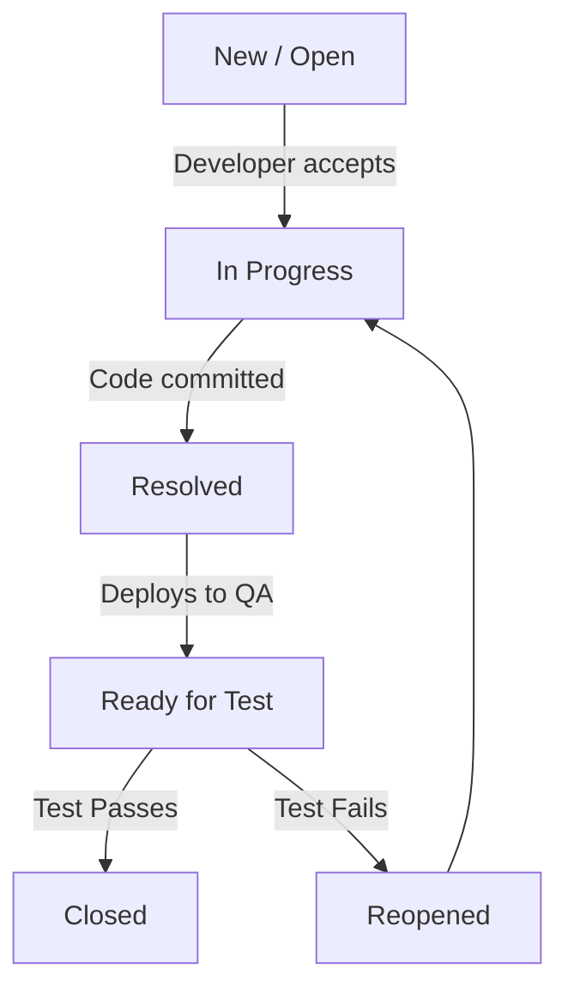

# Jira Interview Questions

This Q&A bank contains 10 highly detailed questions and answers on Jira issue tracking, custom workflow states, bug logging guidelines, issue linking, and Agile reporting.

Use the details tags to toggle responses.

---

## Jira Q&A

<b>Q1: What is JIRA, and how does a QA engineer interact with it on a daily basis?</b>

JIRA, developed by Atlassian, is a leading project management and issue-tracking platform widely used in Agile environments. 

QA engineers interact with Jira daily by:
- **Managing Sprints**: Reviewing active user stories on Scrum/Kanban boards to plan testing tasks.
- **Reporting Bugs**: Logging detected defects with complete steps to reproduce, environment specs, and log attachments.
- **Test execution tracking**: Integrating test cases via plugins like Xray or Zephyr and linking results directly to user stories.
- **Collaborating**: Replying to developers regarding bug fixes and updating ticket states (e.g. from *Ready for QA* to *Closed*).

<b>Q2: What is an Issue in JIRA? Explain the hierarchy of issues QA encounters.</b>

An "Issue" is the basic unit of work in JIRA. It represents any task, requirement, or defect that needs tracking. 

The standard hierarchy is:
1. **Epic**: A large body of work that spans multiple sprints and contains many user stories (e.g., "Implement Checkout System").
2. **User Story / Requirement**: A specific feature described from an end-user perspective (e.g., "As a user, I want to pay using credit cards").
3. **Bug / Defect**: A problem that impairs product functionality (e.g., "Checkout crashes on VISA input").
4. **Task**: General engineering work not tied to user features (e.g., "Configure Postgres DB replica").
5. **Sub-Task**: Breakouts of a Story or Task assigned to individuals (e.g., "Write UI automation test script for Visa checkout").

<b>Q3: What is a JIRA Workflow? Describe a typical defect lifecycle workflow in Jira.</b>

A JIRA Workflow is the set of statuses and transitions an issue moves through from creation to completion. 

A standard defect lifecycle workflow includes:
- **Open / New**: The defect is logged by QA and is waiting for triage.
- **In Progress**: A developer is actively working on reproducing and fixing the bug.
- **Resolved**: The developer has committed code and marked the fix as complete.
- **Ready for Test / Staged**: The fix is deployed to the test environment, and QA is assigned to verify it.
- **Closed**: QA verifies the fix works, updates test cases, and closes the ticket.
- **Reopened**: QA finds the bug is still reproducible, logs details, and assigns it back to the developer.

<b>Q4: How do you write a professional, high-quality Bug Report in JIRA? Provide a template.</b>

A high-quality bug report must be clear, actionable, and structured. 

**Standard QA Bug Template:**
*   **Summary**: Concise description of the issue (e.g., `[Checkout] Visa card verification fails with 500 error on payment submission`).
*   **Environment**: Details on OS, browser version, application build, and test environment (e.g., `Staging v1.4.2, macOS Sonoma, Chrome 122`).
*   **Steps to Reproduce**:
    1. Navigate to `/cart`.
    2. Add any item to the cart and click "Proceed to Checkout".
    3. Input a valid VISA card number, expiry, and CVV.
    4. Click the "Submit Payment" button.
*   **Expected Result**: Payment processes successfully, redirecting the user to `/order-confirmation`.
*   **Actual Result**: Spinner loader freezes, and API returns a `500 Internal Server Error`.
*   **Attachments**: Attached console logs (`console.log`) and a screen recording showing the error.
*   **Epic Link**: Linked to Epic `EX-101 (Payment Integration)`.

<b>Q5: What is the difference between Priority and Severity in JIRA? Provide a 2x2 comparison matrix.</b>

In Jira, Severity is the technical impact on the application, while Priority is the business urgency to fix the issue.

| Severity / Priority | High Priority (Fix Immediately) | Low Priority (Fix Later) |
| :--- | :--- | :--- |
| **High Severity** | **Critical Blocker**: The login page returns a `500 Server Error`, preventing all users from accessing the application. | **Edge Case Crash**: The app crashes when a user attempts to export logs in XML format, but only 0.01% of users use this feature. |
| **Low Severity** | **Brand Blocker**: The company logo on the homepage is misspelled or displays an offensive image. No system crash, but high reputational impact. | **Minor cosmetic issue**: A button's border is misaligned by 2px, or a tooltip contains a minor typo. |

<b>Q6: How do QA teams use JIRA Boards (Scrum vs. Kanban) during active cycles?</b>

Jira boards visualize team workflows and help manage tasks:
- **Scrum Boards**: Used for sprint-based development. QA tracks progress using the Sprint Backlog, moves user stories and bugs through columns, and participates in monitoring Sprint Burndown charts. The goal is to finish all active tasks within the sprint timeframe.
- **Kanban Boards**: Used for continuous delivery. QA monitors Work in Progress (WIP) limits. When tickets accumulate in the "Ready for QA" column, the team resolves bottlenecks immediately to maintain a smooth flow of releases.

<b>Q7: How do you integrate Test Case Management with JIRA? Contrast Xray and Zephyr.</b>

JIRA does not manage test cases out of the box, so teams use plugins:
- **Xray**: Integrates natively by using standard Jira issue types. A "Test Case", "Test Set", and "Test Execution" are all tracked as Jira tickets. This enables full integration with Jira search queries (JQL) and native dashboards.
- **Zephyr**: Operates as a separate module inside Jira. It provides custom tabs to organize test steps and cycles. It is highly structured but does not rely entirely on standard Jira issue configurations.

Both plugins provide REST APIs, allowing CI/CD tools (like Jenkins) to post automation test results directly back to Jira.

<b>Q8: What is Issue Linking in JIRA, and why is it important for QA traceability?</b>

Issue Linking connects two tickets in Jira to represent dependencies. 

Common link types include:
- **is blocked by** / **blocks**: Tells the team that a feature cannot be tested or released until a prerequisite bug or task is resolved.
- **relates to**: Connects similar tasks or bugs to avoid duplicate work.
- **duplicates** / **is duplicated by**: Marks identical bug reports to keep the backlog clean.

Linking enables full traceability, allowing QA leads to verify that all bugs linked to a user story are closed before approving the story for release.

<b>Q9: What is JQL (Jira Query Language)? Provide 5 useful JQL examples for QA.</b>

JQL is Atlassian's query language used to search and filter issues in Jira.

**5 Essential QA JQL Queries:**
1. *Find unresolved bugs in a specific project:*
   `project = "PAY" AND issuetype = Bug AND status != Closed`
2. *Find bugs assigned to me in the current active sprint:*
   `assignee = currentUser() AND status = "Ready for Test" AND sprint in openSprints()`
3. *Find critical bugs created in the last 24 hours:*
   `created >= -24h AND priority in (Critical, Blocker) AND issuetype = Bug`
4. *Find bugs linked to a specific release version:*
   `fixVersion = "v2.1.0" AND status = Reopened`
5. *Find stories missing linked test case coverage:*
   `issuetype = Story AND "Test Coverage" = EMPTY`

<b>Q10: What Agile reports can QA generate in JIRA to monitor quality and release health?</b>

QA utilizes several Jira reports:
- **Burndown Chart**: Shows the amount of work remaining in the sprint. QA uses it to verify if testing tasks will be completed on schedule.
- **Velocity Chart**: Tracks the amount of work (story points) completed sprint-over-sprint. It helps QA estimate how many features can be tested in future cycles.
- **Created vs. Resolved Issues Report**: Shows the rate at which bugs are being found versus fixed. If the "Created" line spikes while "Resolved" plateaus, QA alerts leadership that quality is declining.
- **Cumulative Flow Diagram (CFD)**: Visualizes bottleneck trends in columns like "Ready for Test" or "In Progress" over time.

