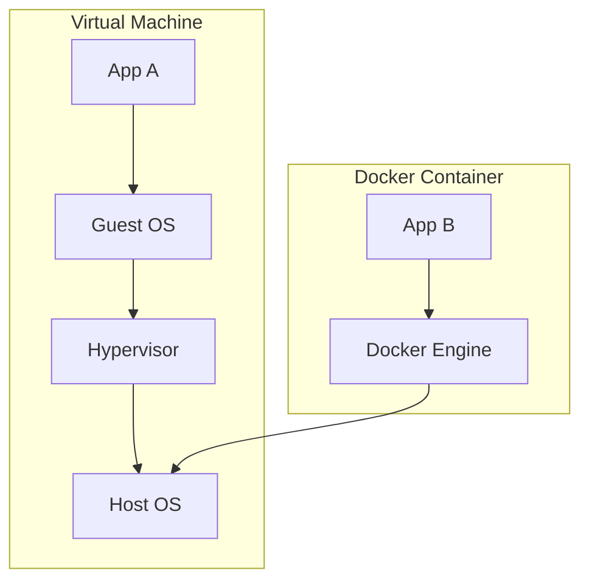

# Docker Interview Questions

This Q&A bank contains 20 detailed questions and answers on virtualization, containerization, Dockerfile configurations, volume mounting, and container-based grids.

Use the details tags to toggle responses.

---

## Docker Q&A



<details>
<summary><b>Q1: What is Docker, and why is it useful in QA testing?</b></summary>

**Core Answer**: Docker is a platform that runs applications inside lightweight, isolated containers, packaging the code, libraries, and runtime dependencies together.

**Why it matters for QA**:
- **Consistent Test Environments**: Prevents "works on my machine" issues by ensuring tests run in the exact same environment on your local machine, staging, and CI servers.
- **Fast Startup**: Containers share the host kernel and boot in seconds, making them perfect for spinning up temporary browser grids or mock APIs.
- **Easy Dependency Management**: Eliminates manual installation of Java, Python, databases, or Chrome versions on testing machines.
- **Clean Execution**: Isolated execution environments prevent tests from polluting other files or configurations.
</details>

<details>
<summary><b>Q2: What is the difference between Docker Containers and Virtual Machines (VMs) for QA?</b></summary>

**Core Answer**: Virtual Machines require a full guest OS and run on a hypervisor, while Docker Containers share the host OS kernel and run as isolated processes.

**Comparison**:
- **Resource Footprint**: VMs require gigabytes of RAM and disk space. Containers share resources and are megabytes in size.
- **Boot Time**: VMs take minutes to spin up. Containers boot in milliseconds.
- **Isolation**: VMs have complete physical-level isolation. Containers have process-level isolation.
- **QA Impact**: You can run 20 browser containers on a laptop, whereas running 20 VMs would crash the system.
</details>

<details>
<summary><b>Q3: What is the difference between a Docker Image and a Docker Container?</b></summary>

**Core Answer**: A Docker Image is a read-only template that acts as the blueprint, while a Docker Container is a running, writeable instance of that image.

**Key Differences**:
- **Docker Image**: Stored in a registry (like Docker Hub). Created using a `Dockerfile`. It is static and immutable.
- **Docker Container**: Spawned by running an image. It has an active writable layer, runs code in real time, and consumes CPU/RAM.
</details>

<details>
<summary><b>Q4: How do you create and run a browser container for automation testing?</b></summary>

**Core Answer**: Pull an official Selenium standalone image and run it, mapping the internal container port `4444` to your host machine's port.

**Commands & Script configuration**:
1. Start the container in your terminal:
   ```bash
   docker run -d -p 4444:4444 --name grid-chrome selenium/standalone-chrome:latest
   ```
2. Configure your test automation script (Java Selenium example):
   ```java
   ChromeOptions options = new ChromeOptions();
   WebDriver driver = new RemoteWebDriver(new URL("http://localhost:4444/wd/hub"), options);
   ```
</details>

<details>
<summary><b>Q5: What is Docker Hub, and how do QA engineers utilize it?</b></summary>

**Core Answer**: Docker Hub is a public cloud registry where teams can share container images.

**QA Use Cases**:
- **Pulling standard services**: Pulling official, pre-configured images for databases (MySQL, Postgres), browser grids (Selenium, Selenoid), or CLI tools.
- **Publishing test frameworks**: Packaging test automation suites into custom images and pushing them to private Docker Hub repositories for team-wide use.
</details>

<details>
<summary><b>Q6: How do you write a Dockerfile for a QA automation project? Provide an example.</b></summary>

**Core Answer**: A `Dockerfile` is a text document containing all the commands a user could call on the command line to assemble an image.

**Example for a Pytest Automation Framework**:
```dockerfile
# Start from a lightweight Python base image
FROM python:3.10-slim

# Install system dependencies (e.g. git, curl)
RUN apt-get update && apt-get install -y git && rm -rf /var/lib/apt/lists/*

# Set the working directory inside the container
WORKDIR /app

# Copy dependency list and install them
COPY requirements.txt .
RUN pip install --no-cache-dir -r requirements.txt

# Copy test scripts into the container
COPY tests/ ./tests/

# Define default execution command to run tests
CMD ["pytest", "tests/"]
```
Build it: `docker build -t my-test-image .`
</details>

<details>
<summary><b>Q7: How do you share and configure multi-container test environments using Docker Compose?</b></summary>

**Core Answer**: Use `docker-compose.yml` to define multi-container services, networks, and volumes in a single file, allowing you to spin up the entire stack with one command.

**Example: Selenium Grid with Chrome/Firefox Nodes**:
```yaml
version: '3'
services:
  selenium-hub:
    image: selenium/hub:latest
    ports:
      - "4444:4444"

  chrome-node:
    image: selenium/node-chrome:latest
    depends_on:
      - selenium-hub
    environment:
      - SE_EVENT_BUS_HOST=selenium-hub
      - SE_EVENT_BUS_PUBLISH_PORT=4442
      - SE_EVENT_BUS_SUBSCRIBE_PORT=4443

  firefox-node:
    image: selenium/node-firefox:latest
    depends_on:
      - selenium-hub
    environment:
      - SE_EVENT_BUS_HOST=selenium-hub
      - SE_EVENT_BUS_PUBLISH_PORT=4442
      - SE_EVENT_BUS_SUBSCRIBE_PORT=4443
```
Execution: `docker-compose up -d` (stops with `docker-compose down`).
</details>

<details>
<summary><b>Q8: What is the difference between docker run and docker exec?</b></summary>

**Core Answer**: `docker run` starts a brand-new container instance from an image, whereas `docker exec` runs a command inside an already running container.

**Usage Examples**:
- **Create and start a new DB**:
  `docker run -d --name test-db mysql:latest`
- **Enter the database container to inspect tables**:
  `docker exec -it test-db mysql -u root -p`
</details>

<details>
<summary><b>Q9: How do you persist and extract test reports/logs from inside a Docker container?</b></summary>

**Core Answer**: Use bind mounts or Docker Volumes to map a folder on your host machine to the folder where the container writes reports.

**Command & Usage**:
```bash
docker run -v $(pwd)/local-reports:/app/reports my-test-image
```
*Why this is important*: Containers have ephemeral storage; when a container stops or is deleted, all internal reports (e.g. `allure-report/`) are lost unless mounted to the host machine.
</details>

<details>
<summary><b>Q10: How do you optimize Docker images for faster CI/CD test execution?</b></summary>

**Core Answer**: Minimize build size and layer counts to speed up download and build times.

**Best Practices**:
- **Use lightweight base images**: Prefer `python:alpine` or `openjdk:11-slim` over full-blown OS images.
- **Chain commands**: Combine multiple RUN commands (e.g., `RUN apt-get update && apt-get install -y git`) to reduce image layers.
- **Clean caches**: Run package manager cleanups (like `rm -rf /var/lib/apt/lists/*`) in the same layer.
- **Use `.dockerignore`**: Exclude large directories like `node_modules` or `.git` from the build context.
</details>

<details>
<summary><b>Q11: How do you debug test automation failures occurring inside a Docker container?</b></summary>

**Core Answer**: Inspect console output, view container logs, run interactive shells inside the container, or mount screenshots directories.

**Debugging Workflow**:
1. Check stdout/stderr logs: `docker logs <container-id>`
2. Execute interactive bash shell inside the container:
   `docker exec -it <container-id> /bin/bash`
3. Inspect system resources: `docker stats <container-id>` (verifies if browser crashes are due to memory limits).
</details>

<details>
<summary><b>Q12: How do you integrate Docker with Jenkins pipelines for automated testing?</b></summary>

**Core Answer**: Declare Docker agents in your Jenkinsfile to spin up testing environments dynamically for each stage.

**Declarative Pipeline Example**:
```groovy
pipeline {
    agent {
        docker { image 'maven:3.8.1-openjdk-11' }
    }
    stages {
        stage('Run Unit Tests') {
            steps {
                sh 'mvn test'
            }
        }
    }
}
```
This guarantees that Jenkins does not require Java or Maven installed on the physical node; it runs entirely within the container.
</details>

<details>
<summary><b>Q13: How can Docker help in cross-browser testing?</b></summary>

**Core Answer**: Docker allows you to run multiple browser versions (Chrome, Firefox, Edge) simultaneously on the same physical host without configuration conflicts.

**How it works**:
Instead of installing different browser binaries locally (which often overwrite each other), you spin up standalone containers (e.g., Chrome v110 and Chrome v120) and redirect test configurations to the corresponding container port.
</details>

<details>
<summary><b>Q14: What is a Docker Volume, and why is it important for database test automation?</b></summary>

**Core Answer**: A Docker Volume is a storage mechanism managed by Docker that persists data independently of container lifecycles.

**Database Testing Importance**:
When spinning up database containers (like MySQL) for backend integration tests, volumes ensure that test seed data is preserved across container restarts, preventing you from having to run long database initialization scripts for every test run.
</details>

<details>
<summary><b>Q15: How do you run database containers for backend API integration tests?</b></summary>

**Core Answer**: Start the database image, pass credentials as environment variables, and map the database port to your host machine.

**Command Example**:
```bash
docker run -d -p 3306:3306 -name mock-db -e MYSQL_ROOT_PASSWORD=root -e MYSQL_DATABASE=users_test mysql:8.0
```
API tests can connect to `jdbc:mysql://localhost:3306/users_test` to verify backend data updates.
</details>

<details>
<summary><b>Q16: What is the difference between docker ps and docker images?</b></summary>

**Core Answer**: `docker ps` lists active container instances, while `docker images` lists local cached images.

**Command Extensions**:
- `docker ps`: Lists only running containers.
- `docker ps -a`: Lists all containers, including stopped and failed ones.
- `docker images`: Lists images with their tags and virtual sizes.
</details>

<details>
<summary><b>Q17: How do you remove unused containers and images to free up space on testing nodes?</b></summary>

**Core Answer**: Use the prune commands to delete stopped containers, dangling images, and unused volumes.

**Cleanup Commands**:
- Remove stopped containers: `docker container prune`
- Remove unused images: `docker image prune`
- Clean all unused resources at once:
  ```bash
  docker system prune -a --volumes
  ```
</details>

<details>
<summary><b>Q18: How do you use Docker for headless API test execution?</b></summary>

**Core Answer**: Run API test execution tools (like Newman) directly from their official Docker images, passing collection files via volumes.

**Postman/Newman Example**:
```bash
docker run -v $(pwd):/etc/newman postman/newman run collection.json -e environment.json
```
This runs the API collections without installing Node.js or Newman on the host machine.
</details>

<details>
<summary><b>Q19: List 5 essential Docker commands every QA automation engineer should know.</b></summary>

**Core Answer**: The core lifecycle commands are `pull`, `run`, `ps`, `logs`, and `exec`.

**Commands List**:
1. `docker pull <image>`: Download image from registry.
2. `docker run -d -p <host>:<container> <image>`: Run container in background.
3. `docker ps -a`: List all container statuses.
4. `docker logs <container-id>`: Print container output.
5. `docker exec -it <container-id> bash`: Log into running container.
</details>

<details>
<summary><b>Q20: How do you handle environment configurations and secrets in Docker for test automation?</b></summary>

**Core Answer**: Pass environment variables to the container using the `-e` flag, or reference a `.env` configuration file.

**Commands Examples**:
```bash
# Pass variables inline
docker run -e ENV=Staging -e THREADS=5 my-test-image

# Reference a config file containing variables
docker run --env-file test-env.list my-test-image
```
Test scripts read these variables to dynamically adjust API endpoints or database connections.
</details>
