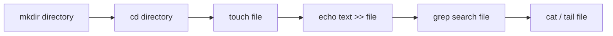

# CLI & Linux Command Interview Questions

This Q&A bank contains 20 detailed questions and answers on Linux terminal operations, search patterns, log monitoring, process tracking, and connectivity validations.

Use the details tags to toggle responses.

---

## CLI & Linux Q&A



<details>
<summary><b>Q1: What is the CLI (Command Line Interface) and why is it important for QA engineers?</b></summary>

**Core Answer**: The CLI is a text-based interface used to run programs, manage files, and execute scripts by typing commands instead of clicking a graphical interface.

**Why it matters for QA**:
- **Headless Servers**: Most testing and staging environments (including CI/CD agents and cloud servers) are headless Linux machines with no GUI.
- **Log Inspection**: Diagnosing server crashes or checking API events requires logging in via SSH and running commands.
- **Automation Runs**: Executing test suites locally or in containers often requires running command runners (e.g. `npm test`, `pytest`, `mvn test`).
</details>

<details>
<summary><b>Q2: How do you list files and directories in a folder? List common flags.</b></summary>

**Core Answer**: Use the `ls` command to list files.

**Common Options & Meanings**:
- `ls -l`: Displays a detailed list including file permissions, owner, size, and modification date.
- `ls -a`: Lists all files, including hidden configuration files (prefixed with a dot, e.g. `.gitignore`).
- `ls -lh`: Displays details with human-readable file sizes (e.g. `2K`, `45M`, `3G`).
- `ls -t`: Sorts files by modification time (newest first).
</details>

<details>
<summary><b>Q3: How do you check the absolute path of your current working directory?</b></summary>

**Core Answer**: Run the `pwd` command, which stands for **Print Working Directory**.

**Command Output Example**:
```bash
$ pwd
/Users/paywize/projects/test-framework/src/test
```
This is useful when configuring relative file paths in your automation framework scripts.
</details>

<details>
<summary><b>Q4: How do you change directories? What do dots represent?</b></summary>

**Core Answer**: Use the `cd` (Change Directory) command followed by your target path.

**Navigation Shortcodes**:
- `cd ..`: Move up one level to the parent directory.
- `cd .`: Refers to the current directory.
- `cd ~`: Returns to the user's home directory.
- `cd -`: Toggles back to the previous directory path.
</details>

<details>
<summary><b>Q5: How do you create a new directory? How do you create nested folders?</b></summary>

**Core Answer**: Use the `mkdir` (Make Directory) command.

**Commands**:
- Create a single directory: `mkdir reports`
- Create nested subdirectories at once:
  ```bash
  mkdir -p target/surefire-reports/screenshots
  ```
  The `-p` flag creates any missing parent directories automatically.
</details>

<details>
<summary><b>Q6: How do you create a new file from the command line?</b></summary>

**Core Answer**: Use the `touch` command to create an empty file, or use redirections (`>` or `>>`) with `echo` or `cat`.

**Commands**:
- Create empty file: `touch test-data.csv`
- Create file with content: `echo "env=staging" > config.properties`
- Append content: `echo "threads=4" >> config.properties`
</details>

<details>
<summary><b>Q7: What is the difference between cat, less, and more commands?</b></summary>

**Core Answer**: All are used to view file contents, but they differ in how they display data.

**Key Differences**:
- `cat`: Prints the entire file content directly to the terminal screen at once. Best for short configuration files.
- `less`: Opens an interactive reader allowing you to scroll up and down using arrow keys, search keywords, and quit (`q`). It does not load the entire file into memory, making it fast for large logs.
- `more`: An older utility that displays file contents page by page, allowing forward scrolling only.
</details>

<details>
<summary><b>Q8: How do you search for a specific keyword in a file? Explain grep options.</b></summary>

**Core Answer**: Use the `grep` command, which searches text files for lines matching a regular expression.

**Common Commands**:
- Search word: `grep "NullPointerException" test-run.log`
- Case-insensitive search: `grep -i "error" server.log`
- Count occurrences: `grep -c "Failed" regression.log`
- Print line numbers: `grep -n "TimeoutException" app.log`
</details>

<details>
<summary><b>Q9: How do you copy, move, and delete files/directories in Linux?</b></summary>

**Core Answer**: Use `cp` to copy, `mv` to move/rename, and `rm` to delete.

**Commands**:
- Copy file: `cp config.env backup.env`
- Copy directory: `cp -r src/ backup-src/` (the `-r` flag copies recursively)
- Move/Rename: `mv report.html old-reports/`
- Delete file: `rm temp.log`
- Delete directory: `rm -rf temp-dir/` (the `-f` flag forces deletion without confirmation). **Use with caution.**
</details>

<details>
<summary><b>Q10: How do you monitor running processes on a Linux machine?</b></summary>

**Core Answer**: Use `ps` for snapshots and `top` or `htop` for real-time CPU/memory process usage.

**Commands**:
- Snapshot of all running processes: `ps aux`
- Find a specific process by name: `ps aux | grep "java"`
- Interactive monitoring: `top` (displays resource usage, sorted by CPU consumption). Press `q` to exit.
</details>

<details>
<summary><b>Q11: How do you check available disk space on your server?</b></summary>

**Core Answer**: Run the `df` command (Disk Free).

**Flag usage**:
```bash
df -h
```
The `-h` (human-readable) flag formats output columns into gigabytes (G), megabytes (M), and percentages, helping QA identify if automation builds are failing because the disk is full.
</details>

<details>
<summary><b>Q12: How do you check memory (RAM) usage on a Linux system?</b></summary>

**Core Answer**: Run the `free` command.

**Flag usage**:
```bash
free -h
```
This displays total, used, free, shared, buffer/cache, and available RAM configurations. It is crucial for debugging out-of-memory errors on build agents.
</details>

<details>
<summary><b>Q13: How do you monitor application logs in real time? Provide a QA search example.</b></summary>

**Core Answer**: Use the `tail` command with the follow `-f` flag.

**QA Commands**:
- Stream logs live: `tail -f app.log`
- Stream logs filtering for specific errors:
  ```bash
  tail -f app.log | grep -i "500 Internal Error"
  ```
This is useful during manual exploratory testing to verify if user actions trigger errors in the backend.
</details>

<details>
<summary><b>Q14: How do you find files in the filesystem?</b></summary>

**Core Answer**: Use the `find` command, specifying the search directory and name pattern.

**Command Examples**:
- Find files matching name: `find . -name "*.json"`
- Find files modified in the last 24 hours: `find /var/log -mtime -1`
- Find directories: `find . -type d -name "screenshots"`
</details>

<details>
<summary><b>Q15: How do you test network connectivity to an external API or server?</b></summary>

**Core Answer**: Use `ping` to test basic reachability, and `curl` or `telnet` to check HTTP endpoints and port access.

**Commands**:
- Test server ping: `ping -c 4 api.github.com`
- Fetch response headers: `curl -I https://api.com/users`
- Check if port 8080 is open: `nc -zv localhost 8080` (netcat).
</details>

<details>
<summary><b>Q16: How do you change file permissions in Linux?</b></summary>

**Core Answer**: Use the `chmod` (Change Mode) command to edit read (`r`), write (`w`), and execute (`x`) permissions.

**Command Examples**:
- Make a script executable: `chmod +x run-tests.sh`
- Grant read-write permissions to everyone: `chmod 666 config.json`
- Full access to owner, read-only to others: `chmod 755 gradlew`
</details>

<details>
<summary><b>Q17: How do you check which process is listening on a specific port?</b></summary>

**Core Answer**: Use the `lsof` (List Open Files) or `netstat` command to trace active ports.

**Commands**:
- Find process on port 8080: `lsof -i :8080`
- Alternative: `netstat -tulnp | grep 8080`
This helps you identify and terminate processes blocking your local web or database servers.
</details>

<details>
<summary><b>Q18: How do you print only the beginning or the end of a log file?</b></summary>

**Core Answer**: Use `head` to read the top of a file, and `tail` to read the bottom of a file.

**Commands**:
- Print first 15 lines: `head -n 15 app.log`
- Print last 30 lines: `tail -n 30 app.log`
</details>

<details>
<summary><b>Q19: How do you chain multiple command executions together?</b></summary>

**Core Answer**: Chain commands using operators like `;`, `&&`, or redirect them using piping `|`.

**Operations**:
- `;` (Run sequentially): `mkdir test; cd test` (runs second even if first fails).
- `&&` (Logical AND): `mvn clean compile && mvn test` (runs test only if compile succeeds).
- `|` (Piping): `cat logs.txt | grep "ERROR"` (sends stdout of first as stdin to second).
</details>

<details>
<summary><b>Q20: How do you download files from a remote server using the CLI?</b></summary>

**Core Answer**: Use `wget` or `curl` to download files via HTTP/HTTPS protocols.

**Commands**:
- Download using wget: `wget https://example.com/testdata.zip`
- Download and rename using curl: `curl -o data.zip https://example.com/testdata.zip`
</details>
