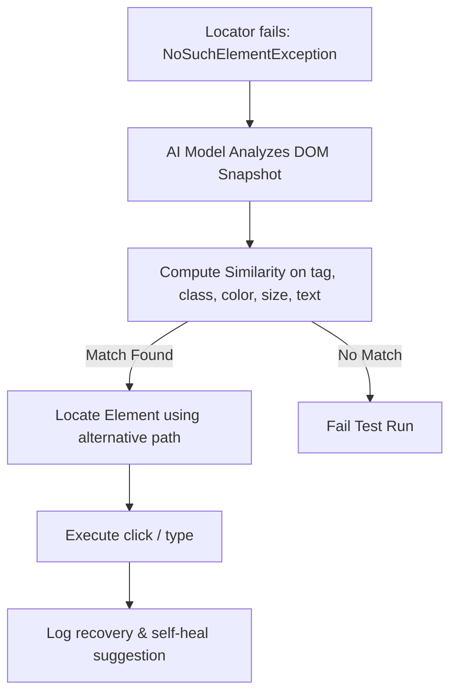

# AI for QA Interview Questions

This Q&A bank contains 25 detailed questions and answers on integrating AI and Machine Learning in testing, self-healing element locators, automated visual comparisons, NLP-based scripting, and anomaly detection.

Use the details tags to toggle responses.

---

## AI for QA Q&A



<details>
<summary><b>Q1: What is AI in software testing, and why is it transforming the industry?</b></summary>

**Core Answer**: AI in software testing refers to the application of machine learning, neural networks, and natural language processing to automate test generation, execution, and maintenance.

**Key Transformations**:
- **Drastically Reduced Maintenance**: AI automates the upkeep of flaky, broken test scripts via self-healing mechanisms.
- **Cognitive Testing Tasks**: Translates plain-English test descriptions into executable automation scripts.
- **Predictive Quality Analytics**: Highlights code segments with high regression risks by analyzing commit history.
</details>

<details>
<summary><b>Q2: How is AI-based test automation different from traditional test automation?</b></summary>

**Core Answer**: Traditional automation relies on hardcoded scripts and rules (which break easily), while AI-based automation dynamically learns element relationships and system states to adapt.

**Comparison**:
- **Locators**: Traditional uses static XPaths/IDs. AI uses multi-property DOM mapping and self-heals.
- **Creation**: Traditional requires manual scripting. AI uses natural language commands or automated recording models.
- **Maintenance**: Traditional requires manual code fixes for minor layout updates. AI detects shifts and auto-corrects locators.
</details>

<details>
<summary><b>Q3: What is the role of Machine Learning (ML) in QA?</b></summary>

**Core Answer**: Machine Learning allows testing tools to train on large historical datasets (like bug databases, execution logs, and commit logs) to identify quality patterns and make predictions.

**QA Applications**:
- **Defect Prediction**: Flagging code changes likely to contain regressions.
- **Flaky Test Recognition**: Identifying tests that fail and pass inconsistently.
- **Test Case Prioritization**: Scheduling high-impact test suites first during staging runs.
</details>

<details>
<summary><b>Q4: What are some leading AI-powered testing tools, and what are their focus areas?</b></summary>

**Core Answer**: AI tools cover visual testing, functional test execution, and analytics.

**Leading Tools**:
- **Applitools Eyes**: AI-driven visual regression validation that ignores rendering noise (scrollbars, minor anti-aliasing) to find actual layout shifts.
- **Mabl / Testim**: Low-code test automation with built-in self-healing element tracking.
- **ReportPortal**: Clusters test failure logs automatically using ML models to find root causes.
- **Functionize**: Plain-English test scripting using NLP.
</details>

<details>
<summary><b>Q5: How does self-healing locator technology work in AI automation?</b></summary>

**Core Answer**: When a script fails to find a button by its primary locator (e.g. ID), self-healing technology uses a weighted similarity algorithm to locate the element using backup properties.

**How it works**:
1. During normal runs, the AI captures a complete snapshot of the DOM, saving multiple properties for each element (tags, parent nodes, coordinates, CSS classes, text content).
2. If `NoSuchElementException` is thrown on `id="submit-btn"` (perhaps because developers renamed it to `id="btn-submit"`), the AI computes a similarity score for all DOM elements.
3. If an element matches 95% of the backup properties, the AI redirects the click to it, logs the warning, and suggests a code fix.
</details>

<details>
<summary><b>Q6: How does AI help in defect prediction during development?</b></summary>

**Core Answer**: AI models analyze commit histories, complexity metrics, and past bug records to identify high-risk modules before code is deployed.

**How it works**:
By training on metrics such as change frequency (churn), code density, developer experience, and past bug hotspots, the AI estimates a "risk score" for new pull requests, allowing QA to schedule targeted exploratory tests.
</details>

<details>
<summary><b>Q7: What is Visual AI testing, and how does it differ from pixel-by-pixel comparison?</b></summary>

**Core Answer**: Visual AI mimics human vision to detect visible layout anomalies, while pixel comparison compares screenshots pixel-by-pixel.

**Key Differences**:
- **Pixel-by-pixel**: Fails on minor changes (anti-aliasing, browser rendering differences, time stamps, dynamic content), leading to false positives.
- **Visual AI**: Groups regions into logical components (buttons, headers, inputs). It ignores minor shifts and alerts QA only when text overlaps, elements go missing, or layouts break.
</details>

<details>
<summary><b>Q8: How does AI enhance exploratory testing?</b></summary>

**Core Answer**: AI observes user interactions on staging or production systems, maps usage paths, and highlights untested edge cases.

**Practical Benefits**:
- **Session Mapping**: AI tools record real user sessions and automatically convert them into regression automation scripts.
- **Blindspot Identification**: Visualizes user navigation paths and flags areas with low test coverage.
</details>

<details>
<summary><b>Q9: What are the main challenges and limitations of AI in QA?</b></summary>

**Core Answer**: AI requires high-quality training datasets, is subject to model hallucination, and lacks business context.

**Key Challenges**:
- **Data Quality**: If training data (test logs, bug history) is dirty or incomplete, the AI's predictions will be inaccurate.
- **Lack of Domain Knowledge**: AI can verify system states but cannot determine if a complex business rule is correct without context.
- **Flakiness in AI**: Self-healing might click the wrong element, passing the test when it should have failed.
</details>

<details>
<summary><b>Q10: How does AI assist in log analysis and root cause identification?</b></summary>

**Core Answer**: AI log clustering engines read massive build console logs, strip out variable strings (timestamps, thread IDs), and group identical failure stack traces.

**Practical Benefits**:
Instead of a QA lead reading 500 failed build logs in Jenkins, an AI engine (like ReportPortal) groups them: "450 failures are due to DB Connection Timeout; 50 are due to NoSuchElementException on the login button," saving hours of triage time.
</details>

<details>
<summary><b>Q11: What is AI-based test prioritization?</b></summary>

**Core Answer**: AI prioritizes and schedules automated tests that are most likely to fail based on recent code commits.

**How it works**:
The AI analyzes which files changed in a git commit and checks historical code coverage data to map dependencies. It executes high-risk tests first, shortening the feedback loop in CI pipelines.
</details>

<details>
<summary><b>Q12: How does AI analyze and report test coverage?</b></summary>

**Core Answer**: AI maps requirements, code execution paths, and API traffic records to identify gaps in coverage.

**How it works**:
It monitors incoming requests to staging environments, maps the endpoints hit by tests, and alerts QA: "30% of user profile API endpoints are never invoked by the automation test suite," pointing out test suite gaps.
</details>

<details>
<summary><b>Q13: How can AI optimize CI/CD pipelines?</b></summary>

**Core Answer**: AI monitors pipeline metrics to identify build instability, fail unstable builds early, and skip redundant test execution.

**Benefits**:
- **Early Failure Detection**: Predicts test suite outcomes and stops runs early if a critical stage fails.
- **Smart Retries**: Distinguishes between infrastructure flakiness and true code regressions, retrying tests only when necessary.
</details>

<details>
<summary><b>Q14: Explain the role of NLP (Natural Language Processing) in AI test design.</b></summary>

**Core Answer**: NLP allows testers to write test scripts in plain English, which the AI parses to generate and execute browser commands automatically.

**Example step translation**:
- *Tester writes*: `Enter 'admin' into username and click login`
- *NLP Parser*: Extracts search inputs (target: `username` input, action: input `'admin'`) and buttons (target: element containing text `login`, action: trigger click).
</details>

<details>
<summary><b>Q15: How does AI help identify and reduce flaky tests?</b></summary>

**Core Answer**: AI tracks test executions over time, analyzing execution times, status changes, and network activity to flag unstable tests.

**How it works**:
It monitors test runs on the same build version. If a test passes on attempt 1, fails on attempt 2, and passes on attempt 3 under identical environment conditions, the AI flags the test, quarantines it from blocking release pipelines, and alerts QA.
</details>

<details>
<summary><b>Q16: What is predictive analytics in QA?</b></summary>

**Core Answer**: The practice of using historical testing metrics and developer behavior to forecast release quality, defect density, and readiness timelines.

**Key Metrics Tracked**:
- Defect resolution velocity.
- Code churn and test case failure rates.
- AI estimations of post-release defect escapes.
</details>

<details>
<summary><b>Q17: How does AI support performance testing?</b></summary>

**Core Answer**: AI models production traffic loads, simulates realistic virtual user behaviors, and detects performance anomalies.

**Benefits**:
- **Traffic Simulation**: Automatically generates load test patterns matching real user behaviors.
- **Bottleneck Diagnostics**: Correlates spikes in user response times with backend server resource utilization to find slow database queries.
</details>

<details>
<summary><b>Q18: How can AI generate test data automatically?</b></summary>

**Core Answer**: AI generates synthetic, realistic test datasets (e.g. credit card numbers, billing addresses) that mock production data layouts without exposing sensitive customer info.

**How it works**:
Generative models (like GANs) analyze production database distributions to generate dummy records that maintain referential integrity, matching data formats, length, and relationships.
</details>

<details>
<summary><b>Q19: How does AI improve regression testing efficiency?</b></summary>

**Core Answer**: AI runs only the subset of tests impacted by code changes, replacing large, time-consuming daily regression runs.

**Benefits**:
It maps code commits to specific automated test cases. If a developer modifies payment validation code, the AI runs only the payment test suite, skipping unrelated login or search tests.
</details>

<details>
<summary><b>Q20: How can Generative AI be used for test case generation?</b></summary>

**Core Answer**: Generative AI (like LLMs) processes user stories or requirements and generates positive, negative, and edge-case test descriptions.

**Example Prompt & Output**:
*   *Prompt*: `Write test cases for user registration: username must be 5-15 characters, email must be valid, and password must have 1 number.`
*   *Output*: Generates test cases covering valid registrations, boundary limits (4 and 16 characters), invalid emails, and passwords missing numbers.
</details>

<details>
<summary><b>Q21: What is AI-driven anomaly detection in production monitoring?</b></summary>

**Core Answer**: AI monitors production metrics (latencies, error rates, DB connections) to flag unusual deviations, even if system health endpoints return status 200 OK.

**How it works**:
It establishes a dynamic baseline of system behavior. If API response latency spikes from 100ms to 400ms at 2 PM (an hour when load is normally low), the AI flags it as an anomaly, alerting teams before systems go down.
</details>

<details>
<summary><b>Q22: How can AI integrate with Selenium frameworks?</b></summary>

**Core Answer**: Through AI wrapper libraries that intercept Selenium element lookup commands (like `driver.findElement`) and inject self-healing algorithms.

**How it works**:
If the standard locator fails, the wrapper catches the exception, calls its AI locator database, finds the alternative locator path, and proceeds with the test execution, preventing pipeline blockages.
</details>

<details>
<summary><b>Q23: Why can Generative AI (like ChatGPT) not replace human QA engineers?</b></summary>

**Core Answer**: Generative AI tools lack domain-specific business understanding, are prone to hallucinating facts, and cannot perform exploratory testing.

**Limitations**:
- **Hallucinations**: AI can generate code that appears correct but calls non-existent libraries.
- **Context Gap**: AI does not understand customer business models or UX preferences.
- **Exploratory Verification**: AI cannot perform physical device tests or manual verification of complex user journeys.
</details>

<details>
<summary><b>Q24: What is an AI-driven defect management system?</b></summary>

**Core Answer**: An issue tracking system that automatically reads bug reports, categorizes them, assigns severity, and routes them to developers.

**How it works**:
Using NLP classifiers, it reads logged bugs, assigns category components, routes tickets to the developer who worked on that file, and flags duplicates to keep the backlog clean.
</details>

<details>
<summary><b>Q25: What skills should a QA engineer learn to prepare for AI-driven software testing?</b></summary>

**Core Answer**: QA engineers should focus on data analysis, prompt engineering, Python scripting, and gain experience using AI testing platforms.

**Core Skills**:
- **Prompt Engineering**: Writing precise requirements for code generators.
- **Data Engineering Basics**: Cleaning and feeding testing data to ML engines.
- **AI Tool Proficiencies**: Gaining certifications in platforms like Applitools, Mabl, or Testim.
</details>

<details>
<summary><b>Q26: What is a production-ready AI Prompt Template for generating BDD Gherkin Feature files from User Stories?</b></summary>

**Core Answer**: Use a role-based prompt with strict output constraints, concrete acceptance criteria, and edge-case requirements.

**Prompt Template**:
```text
Act as a Senior QA Automation Architect. 
Analyze the following User Story and Acceptance Criteria, and output a production-ready BDD Gherkin Feature file following standard Cucumber conventions.

[User Story]: As a registered banking customer, I want to transfer funds internationally so that I can send money to overseas recipients.
[Acceptance Criteria]:
1. User must select recipient currency and input amount.
2. If transfer amount exceeds daily limit ($5,000), block with error ERR_LIMIT_EXCEEDED.
3. If balance is insufficient, return ERR_INSUFFICIENT_FUNDS.
4. Calculate exchange fee (1.5%) dynamically before confirmation.

Requirements:
- Include 1 Positive Scenario, 2 Negative Scenarios, and 1 Scenario Outline with an Examples table covering edge amounts ($0.01, $4999.99, $5000.00, $5000.01).
- Format using proper Feature, Background, Scenario, Given, When, Then, And syntax.
```
</details>

<details>
<summary><b>Q27: What is an AI Prompt Template for synthesizing edge-case mock JSON test datasets?</b></summary>

**Core Answer**: Provide the target JSON schema and explicitly instruct the LLM to generate boundary, unicode, null, and SQL-injection edge records.

**Prompt Template**:
```text
Act as an SDET specializing in API security and boundary testing.
Generate a JSON array of 5 distinct test payloads for an API endpoint that accepts user profiles.

Schema:
- username (string, 3-20 chars, alphanumeric)
- email (valid RFC-5322 email string)
- age (integer, 18-99)
- address (object with street, zipCode, country)

Provide exactly 5 test cases:
1. Valid Standard Case (typical user)
2. Boundary Edge Case (username exactly 3 chars, age exactly 18)
3. Internationalization & Unicode Edge Case (Accents and non-Latin names e.g. "Renée Müller")
4. Security XSS Payload Case (embedded <script> alert inside street address)
5. Type Mismatch / Malformed Case (null values and empty strings)
```
</details>

<details>
<summary><b>Q28: What is an AI Prompt Template for generating a Boundary Value Analysis (BVA) test matrix?</b></summary>

**Core Answer**: Feed the numerical or string field rules into the LLM and request a structured markdown matrix showing 2-point and 3-point boundary values with expected results.

**Prompt Template**:
```text
Act as a Lead QA Analyst. 
Given the input validation rule: "Order quantity must be an integer between 1 and 99 items per checkout":

Construct a complete Boundary Value Analysis (BVA) test matrix.
Output a Markdown table with the following columns:
| Test ID | Test Scenario | Input Value | Boundary Type (Just Below Min / Min / Max / Just Above Max) | Expected Result |
```
</details>
