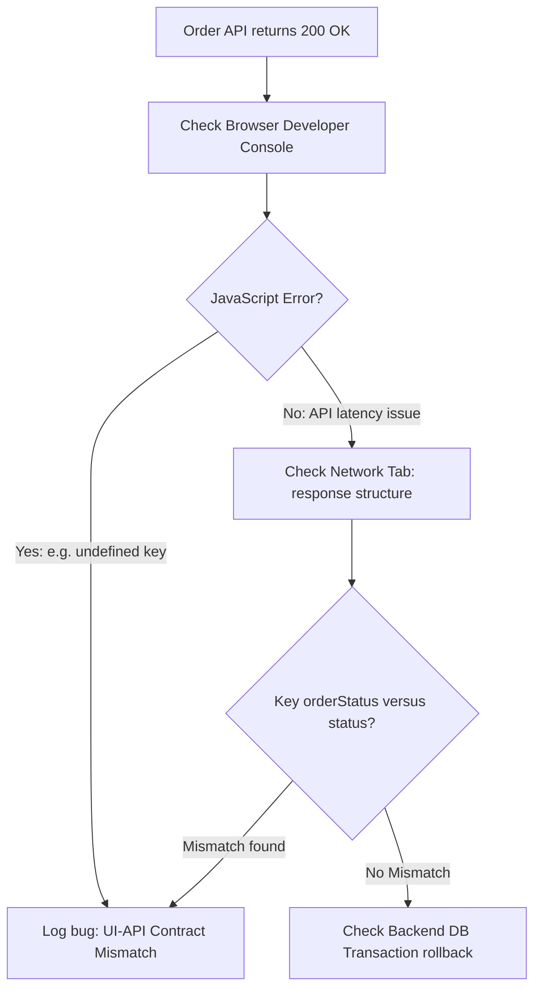

# Tricky & Real-Time QA Scenario Interview Questions

This Q&A bank contains 40 advanced questions and answers on handling team conflicts, troubleshooting integration failures, testing under tight deadlines, and validating e-commerce cart, search, and checkout flows.

Use the details tags to toggle responses.

---

## Scenario-Based QA Diagnostics



<details>
<summary><b>Q1: How do you decide when to stop testing?</b></summary>

**Core Answer**: Testing is stopped when the pre-defined exit criteria specified in the Test Plan are met, representing an acceptable level of product risk.

**Exit Criteria Checklist**:
- **Requirement Coverage**: 100% of planned requirements have been covered by test cases.
- **Defect Density**: The defect find rate has plateaued, and all critical, blocker, and high-priority bugs are resolved and verified.
- **Automation Execution**: Regression automation test suites run with a 98%+ pass rate.
- **Risk Sign-off**: Remaining low-priority bugs are documented, and their release risk is officially accepted by stakeholders.
</details>

<details>
<summary><b>Q2: What would you do if a developer rejects your bug report, claiming "it works on my machine"?</b></summary>

**Core Answer**: Resolve the disagreement objectively by providing empirical evidence (logs, screen recordings) and verifying environment configurations.

**Step-by-Step Resolution**:
1. **Re-Verify Locally**: Run the test steps again to ensure it is not a test script error.
2. **Collect Logs**: Capture browser console exceptions, network payloads, database states, and backend logs.
3. **Compare Environments**: Check if the developer is using a different branch, configuration profile, or database state.
4. **Collaborate**: If the issue persists, schedule a quick call to reproduce it on a clean staging container or walk through the code together.
</details>

<details>
<summary><b>Q3: How do you approach testing a new feature when there are no formal requirements documents?</b></summary>

**Core Answer**: Leverage exploratory testing, perform competitive analysis, and interview key stakeholders to build a baseline of expected behavior.

**Testing Strategy**:
- **Stakeholder Interviews**: Ask the product owner or developer for high-level user flows and the problem the feature solves.
- **Competitive Analysis**: Look at how competitors implement similar features to understand standard workflows.
- **Create a Mind Map**: Document the user journey and system states as you interact with the software.
- **Draft Baseline Test Cases**: Share documented findings with developers to align on the expected behavior.
</details>

<details>
<summary><b>Q4: How do you run verification tests when the testing environment is highly unstable?</b></summary>

**Core Answer**: Isolate your test execution by mocking backend API dependencies, focusing on core flows, and separating environment issues from code defects.

**QA Checklist**:
- **Mocking**: Use API virtualization tools (like Postman or WireMock) to simulate backend services, removing environment dependency.
- **Smoke Subset**: Run only critical smoke tests to check core application sanity.
- **Isolate Logs**: Save system infrastructure logs alongside test reports to prove when failures are caused by environment timeouts.
</details>

<details>
<summary><b>Q5: How would you test a physical elevator?</b></summary>

**Core Answer**: Structure the test suite using positive, negative, boundary, and stress testing across functional and non-functional requirements.

**Test Case Categories**:
- **Functional**: Door sensor triggers, floor selector buttons, display indicators, and weight sensor alarms.
- **Safety / Boundary**: Behaviour at maximum weight limit, emergency brake buttons, and power outage backup systems.
- **Performance**: Cabin travel speed, leveling precision at floors, and noise decibels.
- **Usability**: Accessibility buttons, braille indicators, and emergency speaker clarity.
</details>

<details>
<summary><b>Q6: How do you verify that your written test cases are effective and not redundant?</b></summary>

**Core Answer**: Use a Requirements Traceability Matrix (RTM) to map test cases directly to requirements and run test reviews with developers.

**Best Practices**:
- **RTM Coverage**: Ensure every feature requirement is mapped to at least one positive and one negative test case.
- **Equivalence Partitioning**: Group inputs to ensure you aren't testing identical values.
- **Review Sessions**: Run peer reviews with developers to ensure test logic aligns with code structure.
</details>

<details>
<summary><b>Q7: How would you test a user login page beyond checking normal username and password fields?</b></summary>

**Core Answer**: Focus on boundary conditions, session security vulnerabilities, error handling, and performance limits.

**Advanced Test Cases**:
- **Security**: Check for SQL injection payloads, cross-site scripting (XSS), password masking, and encryption of credentials in the network payload.
- **Account Lockout**: Verify the system locks the account after 5 consecutive failed login attempts and unlocks after 15 minutes.
- **Session Control**: Verify a user is logged out after 15 minutes of inactivity, and check that session tokens are invalidated after logging out.
- **Concurrency**: Verify that logging in on device B terminates or updates the session on device A.
</details>

<details>
<summary><b>Q8: How do you perform QA validation when the user interface (UI) is not yet developed?</b></summary>

**Core Answer**: Perform API testing to validate the backend business logic and run direct database queries to verify data updates.

**QA Workflow**:
- **Contract Verification**: Inspect the Swagger/OpenAPI definition schemas.
- **Postman Execution**: Write assertions for response status codes, JSON payload keys, and response time latency.
- **Database Checking**: Use SQL queries to verify that API requests correctly update database tables.
</details>

<details>
<summary><b>Q9: How do you manage your testing scope when project timelines are suddenly cut in half?</b></summary>

**Core Answer**: Apply Risk-Based Testing to prioritize critical user journeys, and leverage test automation for regression testing.

**Execution Plan**:
1. **Define Critical Paths**: Focus on paths that directly generate revenue or are used by 80% of users (e.g., checkout, login).
2. **Postpone Edge Cases**: De-prioritize cosmetic checks and complex edge cases.
3. **Run Automation**: Use parallel test runs to quickly verify regression status.
4. **Communicate Risks**: Formally document untested features and raise them to the release manager.
</details>

<details>
<summary><b>Q10: What metrics do you look at to evaluate if a feature is ready for production release?</b></summary>

**Core Answer**: Monitor defect density, test execution status, test coverage metrics, and the status of blocking bugs.

**Key Release Metrics**:
- **Test execution rate**: 100% of planned test cases executed.
- **Defect status**: Zero Open Severity 1 (Blocker) or Severity 2 (Critical) bugs.
- **Bug fix rate**: The number of newly created bugs is plateauing.
- **Code coverage**: Unit test coverage satisfies project standards (e.g. >80%).
</details>

<details>
<summary><b>Q11: You find an intermittent bug that only occurs roughly 1 out of 20 times. How do you handle it?</b></summary>

**Core Answer**: Isolate the defect by gathering system logs, recording the screen, and checking for race conditions or database deadlocks.

**Action Plan**:
- **Capture Logs**: Check browser console logs, backend system CPU metrics, and database transaction locks during the failure.
- **Automation Loop**: Write a simple automation script to run the action 100 times in a loop, recording details for each run.
- **Log the Ticket**: Log the bug in JIRA, documenting the exact frequency, system timestamps, and logs collected.
</details>

<details>
<summary><b>Q12: How do you prioritize your test suites during daily build updates?</b></summary>

**Core Answer**: Prioritize test cases using a tiered structure: Smoke tests run first, followed by High-Impact functional tests, and lastly full Regression suites.

**Tiered Execution**:
- **Tier 1 (Smoke - 15 mins)**: Verifies basic build sanity (e.g. login, payment page loads).
- **Tier 2 (Sanity - 1 hour)**: Focuses on features impacted by recent code commits.
- **Tier 3 (Regression - Nightly)**: Runs the entire test suite to catch regressions across the application.
</details>

<details>
<summary><b>Q13: How do you handle intermittent test failures in your automation pipeline?</b></summary>

**Core Answer**: Isolate flaky tests immediately to keep pipelines green, investigate dynamic waits, and clean up test data.

**Flakiness Resolution**:
- **Quarantine**: Move the flaky test to a separate pipeline so it doesn't block developers.
- **Avoid Thread.sleep()**: Replace static pauses with explicit waits targeting specific element states.
- **Clean State**: Ensure each test case is self-contained and cleans up its own test database changes.
</details>

<details>
<summary><b>Q14: Explain the difference between Smoke Testing and Sanity Testing using an E-Commerce example.</b></summary>

**Core Answer**: Smoke testing verifies basic application build sanity, while Sanity testing verifies specific bug fixes or minor features.

**Example Comparison**:
- **Smoke Testing**: Verifies a user can search, add a product to the cart, check out, and purchase. If this fails, the build is rejected.
- **Sanity Testing**: A bug is fixed in the promo code discount logic. Sanity testing verifies the promo code calculates discounts correctly, focusing only on checkout calculation modules.
</details>

<details>
<summary><b>Q15: How do you manage testing when requirements change mid-sprint?</b></summary>

**Core Answer**: Assess the impact of the changes, update the test cases and RTM, and align with the product owner on sprint goals.

**QA Action Plan**:
1. **Impact Analysis**: Identify which test cases need to be updated or archived.
2. **Re-estimate**: Communicate if the new scope changes require more time, which may require shifting other stories out of the sprint.
3. **Document**: Update JIRA story descriptions and test cases to match the updated scope.
</details>

<details>
<summary><b>Q16: What is an Escape Defect? How do you prevent them?</b></summary>

**Core Answer**: An escape defect is a bug found in production that was missed during testing phases.

**Prevention Strategy**:
- **Post-Mortem Analysis**: Investigate why the bug was missed. Was it a testing gap, environment issue, or missing requirement?
- **Add Tests**: Write new manual and automated regression tests to cover the scenario.
- **Improve environments**: Mirror production configurations and datasets as closely as possible.
</details>

<details>
<summary><b>Q17: How do you structure a performance and load testing execution plan for a web app?</b></summary>

**Core Answer**: Define performance targets, establish baseline metrics under standard loads, and run stress tests to identify bottlenecks.

**Workflow**:
1. **Identify KPI targets**: Average response time (e.g. &lt; 2s), throughput (requests/sec), and maximum error rate.
2. **Base Load**: Run baseline tests with expected daily user volumes.
3. **Stress Testing**: Increase load beyond capacity limits to verify the system handles stress gracefully (e.g., auto-scales, returns 503 instead of crashing).
4. **Log Review**: Identify slow queries, resource bottlenecks, or memory leaks.
</details>

<details>
<summary><b>Q18: What is the most challenging bug you have ever found? How did you debug it?</b></summary>

**Core Answer**: *Use this template to describe a real-world scenario (e.g., a memory leak or database deadlock).*

**Example Scenario**:
- **The Issue**: A memory leak that caused server containers to crash after running on production for 4 hours.
- **Diagnosis**: Monitored RAM usage metrics, noting memory climbed linearly without returning to baseline.
- **Resolution**: Used Chrome DevTools heap snapshots to compare memory allocation, identifying that event listeners were not being cleaned up when updating list items, leading to a build fix.
</details>

<details>
<summary><b>Q19: How do you test an e-commerce website? What are the key modules?</b></summary>

**Core Answer**: Divide the site into logical user journeys: Catalog Search, Shopping Cart, Payment Gateway, and Order Tracking.

**Key Modules to Validate**:
- **Search & Filters**: Sorting by price/rating and filtering by category/brand.
- **Cart Management**: Item updates, pricing calculations, currency conversions, and promo code applications.
- **Checkout & Payment**: Validation of credit cards, card expiry boundaries, payment confirmation, and refund processing.
- **Shipping**: Address validation and order updates.
</details>

<details>
<summary><b>Q20: How many test cases would you write to test an e-commerce shopping cart?</b></summary>

**Core Answer**: A standard shopping cart requires roughly 30-40 test cases covering functional, boundary, security, and edge-case scenarios.

**Test Categories**:
- **Positive**: Adding/removing items, updating quantities, and preserving cart state when logging in from another device.
- **Negative/Boundary**: Adding negative quantities, exceeding maximum stock limits, and purchasing out-of-stock items.
- **Session state**: Clearing cookies, checking out as a guest, and managing expired sessions.
</details>

<details>
<summary><b>Q21: What if the API request returns a success status (200 OK), but the UI displays a checkout failure?</b></summary>

**Core Answer**: This indicates a contract mismatch between the API response payload and the UI parsing layer.

**Troubleshooting Steps**:
1. Open the browser Console to check for JavaScript rendering exceptions.
2. Inspect the Network tab to check the API response JSON structure.
3. Verify if the UI is looking for a specific key (e.g. `orderStatus`) that has been renamed or omitted in the API response.
</details>

<details>
<summary><b>Q22: A developer rejects your bug, claiming "the user will never perform this action." How do you handle it?</b></summary>

**Core Answer**: Support your case with user analytics, business impact metrics, and alignment with project requirements.

**Communication Strategy**:
- **Refer to Requirements**: Verify if the requirement is explicitly documented in the user story.
- **Provide Analytics**: If live, use analytics tools (like Google Analytics) to show how many users navigate this path daily.
- **Collaborate**: Discuss the bug's priority with the Product Owner to determine if it is a blocker or can be deferred.
</details>

<details>
<summary><b>Q23: What do you do if your automation pull request is rejected or blocked?</b></summary>

**Core Answer**: Review the comments, address any formatting issues or styling concerns, and run the tests locally to verify.

**Resolution Steps**:
1. Inspect the reviewer comments to identify failures (e.g., hardcoded XPaths, missing assertions).
2. Refactor the code following page object model patterns and update the PR.
3. If there is a disagreement on the design, discuss it collaboratively with the team.
</details>

<details>
<summary><b>Q24: How do you test the "Add to Cart" functionality in an e-commerce application?</b></summary>

**Core Answer**: Verify adding products from search, item details, and recommendations, and check that quantities recalculate correctly.

**Test Scenarios**:
- **Functional**: Click "Add to Cart" from multiple pages, verifying the cart badge updates.
- **Calculations**: Adding 5 items of price $10 recalculates the total to $50, applying correct taxes.
- **Persistent State**: Verify that items added while logged out persist after logging in.
</details>

<details>
<summary><b>Q25: How do you handle finding a high-severity bug just 2 hours before a major production release?</b></summary>

**Core Answer**: Alert stakeholders immediately with a clear risk assessment, and support the team in making a rollback or hotfix decision.

**Incident Response**:
1. **Document**: Log the defect in JIRA with steps, logs, and screenshots.
2. **Notify**: Ping the Product Owner, Tech Lead, and Release Manager.
3. **Assess Risks**: Explain the business impact (e.g., "70% of users will crash during checkout").
4. **Discuss Alternatives**: Collaborate to decide if we should delay the release, hotfix the code, or disable the feature flag.
</details>

<details>
<summary><b>Q26: How do you test API rate limiting (throttling) in your test suites?</b></summary>

**Core Answer**: Write load loops using Postman Collection Runner or JMeter to hit endpoints at a high frequency, verifying the server rejects requests after exceeding limits.

**Assertions Checklist**:
- Verify HTTP status code returns `429 Too Many Requests`.
- Check that response headers include `Retry-After: <seconds>`.
- Verify the system allows requests again after the timeout period.
</details>

<details>
<summary><b>Q27: How do you verify that email notifications are sent correctly after checkout?</b></summary>

**Core Answer**: Use mock SMTP mail servers (like Mailosaur or Mailhog) to programmatically check inbox arrivals, validating HTML templates and email header values.

**QA Checklist**:
- **Routing**: Verify the email is routed to the correct buyer address.
- **Data Match**: Verify that the purchase item details, tax, and order ID inside the email body match the database values.
- **Links**: Click on all email links (e.g., order tracking) to verify they resolve.
</details>

<details>
<summary><b>Q28: How do you ensure your UI test scripts run stably on Chrome without breaking due to rendering latency?</b></summary>

**Core Answer**: Avoid Thread.sleep. Instead, configure explicit waits targeting element visibility, clickable states, or DOM stability.

**Best Practices**:
```java
// Avoid this:
Thread.sleep(5000);

// Use this instead:
WebDriverWait wait = new WebDriverWait(driver, Duration.ofSeconds(10));
WebElement element = wait.until(ExpectedConditions.elementToBeClickable(By.id("checkout-btn")));
```
</details>

<details>
<summary><b>Q29: A critical production issue is reported, but you had checked that exact feature before release. How do you handle it?</b></summary>

**Core Answer**: Isolate the gap immediately, find out what environment or test data difference caused the escape, fix the defect, and add it to the regression test suite.

**Incident Response**:
- **Replicate**: Get the exact user data payload, browser version, and OS to replicate the crash.
- **Triage**: Check if the staging environment was missing database seeds or configurations that were present in production.
- **Regression**: Update your test automation suite with this case to prevent regression.
</details>

<details>
<summary><b>Q30: How do you test multi-currency payments in an e-commerce application?</b></summary>

**Core Answer**: Verify currency conversions, check correct symbol formatting, and test payment gateway processing for local currencies.

**Test Cases**:
- **Formatting**: Selecting Euro displays currency symbols as `€` and formats prices correctly (e.g. `12,50 €`).
- **Conversion**: Verify conversions match the current exchange rate.
- **Gateway**: Verify payment gateways capture and settle the transaction in the correct currency.
</details>

<details>
<summary><b>Q31: How do you test product search with complex filters (e.g., category, price ranges, brand, rating)?</b></summary>

**Core Answer**: Test individual filter applications, verify multi-filter combinations, check boundary conditions, and test reset actions.

**Test Scenarios**:
- **Boundary**: Set the price range filter to match the exact price of an item.
- **Combinations**: Combine 3 filters (e.g. Brand = Apple, Price = $800-$1200, Rating = 4+), verifying only matching items display.
- **Reset**: Verify that clearing filters restores the initial product listing.
</details>

<details>
<summary><b>Q32: Two developers are arguing about an integration defect, each blaming the other's module. How do you resolve it?</b></summary>

**Core Answer**: Run API and network log validations to isolate which side of the integration contract is failing.

**Troubleshooting Steps**:
1. Check the network payload returned by developer A's API.
2. If developer A's API returns incorrect data formats according to the API contract, developer A is responsible.
3. If developer A's API returns correct data formats, but developer B's UI fails to parse it, developer B is responsible.
</details>

<details>
<summary><b>Q33: How do you test mobile responsiveness for an e-commerce application?</b></summary>

**Core Answer**: Test layouts using responsive design viewport tools in browsers, and verify flows on real devices using cloud grids.

**Test Checklist**:
- **Layouts**: Check for layout breakage, overlapping text, or cut-off buttons on standard viewports (320px, 375px, 768px).
- **Interactions**: Verify touch targets are large enough to tap easily.
- **Responsive Elements**: Verify that desktop navigation bars switch to hamburger menus on mobile viewports.
</details>

<details>
<summary><b>Q34: How do you troubleshoot a failed build in your Jenkins pipeline?</b></summary>

**Core Answer**: Open the console output, check the build failure logs, inspect screenshots of failed tests, and verify environment stability.

**Troubleshooting Workflow**:
1. Go to the failed build page in Jenkins and open the Console Output.
2. Search for keyword errors (e.g., `BUILD FAILURE`, `AssertionError`, `WebDriverException`).
3. Check the screenshots folder to see the application state during the failure.
4. Verify if database connections or third-party APIs were down.
</details>

<details>
<summary><b>Q35: How do you prioritize test cases when you are given only 4 hours to run regression before a release?</b></summary>

**Core Answer**: Prioritize critical user journeys first, check recently modified areas, and run automated regression suites in parallel.

**Prioritization Plan**:
1. **Smoke Tests (1 hour)**: Verify basic app sanity (e.g., login, payment).
2. **Impacted Areas (2 hours)**: Test modules affected by recent commits.
3. **High-Risk Regression (1 hour)**: Test critical business logic (e.g., database updates).
</details>

<details>
<summary><b>Q36: How do you test the refund flow in an e-commerce application?</b></summary>

**Core Answer**: Validate both full and partial refunds, check database record updates, and verify that refunds clear correctly through payment gateways.

**Test Cases**:
- **Full Refund**: Refund the total amount including taxes and shipping fees.
- **Partial Refund**: Refund a single item from a multi-item order, verifying taxes recalculate.
- **Status Updates**: Verify order status changes to `Refunded` or `Partially Refunded` in the database.
</details>

<details>
<summary><b>Q37: How do you test database concurrency when multiple users attempt to purchase the same inventory item?</b></summary>

**Core Answer**: Use tools like JMeter to send concurrent purchase API requests for the last available item, verifying that only one transaction succeeds.

**Verifications**:
- User A's transaction succeeds, creating the order.
- User B's transaction is rejected, returning a `409 Conflict` or an "Out of Stock" message.
- Verify the database inventory count remains at `0` and is not negative.
</details>

<details>
<summary><b>Q38: How do you test security on user login forms?</b></summary>

**Core Answer**: Test input sanitation, verify session parameters, check encryption, and verify account lockout rules.

**Test Scenarios**:
- **Input Sanitation**: Input SQL injection payloads (e.g. `' OR 1=1 --`) to verify they are rejected.
- **Encryption**: Verify passwords are encrypted in transit using HTTPS, and checked in headers as masked characters.
- **Brute Force**: Verify that the account is locked after 5 consecutive failed login attempts.
</details>

<details>
<summary><b>Q39: How do you test user registration with email and mobile number?</b></summary>

**Core Answer**: Verify valid registration paths, check error handling for duplicates, and validate email and mobile formats.

**Test Cases**:
- **Duplicate Prevention**: Register with an email or mobile number that already exists, verifying the system rejects it with an error.
- **Format Validation**: Test invalid email formats (e.g., missing `@`) and invalid mobile number lengths.
- **OTP Verification**: Verify registration is blocked if OTP validation fails.
</details>

<details>
<summary><b>Q40: How do you test a shopping cart when the user has multiple browser tabs open?</b></summary>

**Core Answer**: Verify that cart modifications in one tab sync automatically across all open tabs, and check that checking out in one tab invalidates cart states in the others.

**Test Scenarios**:
- **Sync**: Open tab A and tab B. Add an item in tab A. Verify the cart badge in tab B updates to show the item.
- **Removal**: Remove the item in tab B. Verify tab A reflects the update.
- **Invalidation**: Proceed to checkout and complete the purchase in tab A. In tab B, click checkout to verify the system prevents checking out an empty cart.
</details>
