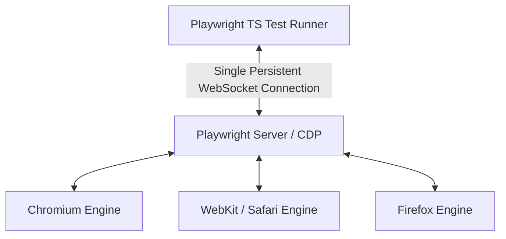

# Playwright with TypeScript Interview Questions

This Q&A bank contains 25 in-depth questions and answers on modern browser automation using Playwright, TypeScript type safety, custom fixtures, network interception, Trace Viewer debugging, and CI/CD sharding.

Use the details tags to expand and read the responses.

---

## Playwright & TypeScript Q&A



<details>
<summary><b>Q1: What is Playwright, and why is it rapidly replacing older automation frameworks?</b></summary>

**Core Answer**: Playwright is an open-source test automation library created by Microsoft that provides fast, reliable, and cross-browser end-to-end testing with built-in auto-waiting and network control.

**Why teams choose Playwright**:
- **Single WebSocket Connection**: Communicates directly over Chrome DevTools Protocol (CDP) and browser internal protocols without HTTP polling latency.
- **Built-in Auto-Waiting**: Eliminates arbitrary `Thread.sleep` and explicit wait boilerplate by checking element actionability automatically.
- **True Multi-Browser Support**: Tests Chromium, Firefox, and WebKit (Safari engine) with identical APIs across Windows, macOS, and Linux.
- **Trace Viewer**: Provides post-mortem DOM snapshots, action screencasts, and network logs for every test step.
</details>

<details>
<summary><b>Q2: How does Playwright handle element auto-waiting before performing actions?</b></summary>

**Core Answer**: Playwright automatically performs a series of **Actionability Checks** on the target element before executing actions like `.click()`, `.fill()`, or `.check()`.

**Actionability Checks Performed**:
1. **Attached**: Element is present in the DOM.
2. **Visible**: Element has non-empty bounding box and no `display: none` / `visibility: hidden`.
3. **Stable**: Element has finished CSS transitions and animations.
4. **Receives Events**: Element is not obscured or covered by loading spinners or modals.
5. **Enabled**: Element does not have the `disabled` attribute.

If checks do not pass within the timeout (default 30s), Playwright throws a `TimeoutError` with detailed actionability logs.
</details>

<details>
<summary><b>Q3: What are Custom Fixtures in Playwright, and how do they replace traditional Before/After hooks?</b></summary>

**Core Answer**: Fixtures in Playwright are modular, reusable setup and teardown environments that are lazily initialized and automatically torn down per test based on dependency injection.

**Custom Fixture Example**:
```typescript
import { test as base } from '@playwright/test';
import { LoginPage } from './pages/LoginPage';
import { DashboardPage } from './pages/DashboardPage';

type TestFixtures = {
  authenticatedPage: DashboardPage;
};

export const test = base.extend<TestFixtures>({
  authenticatedPage: async ({ page }, use) => {
    const loginPage = new LoginPage(page);
    await loginPage.navigate();
    await loginPage.login('admin@test.com', 'Secret123');
    const dashboard = new DashboardPage(page);
    
    // Pass control to the test
    await use(dashboard);
    
    // Automatic Teardown / Cleanup
    await dashboard.logout();
  },
});
```
*Why this is superior*: Tests request only the fixtures they need; fixtures are isolated per test worker and eliminate messy static state in global hooks.
</details>

<details>
<summary><b>Q4: How do you implement the Page Object Model (POM) with TypeScript type safety in Playwright?</b></summary>

**Core Answer**: Encapsulate page locators as readonly `Locator` properties and page actions as asynchronous methods returning promises.

**TypeScript POM Implementation**:
```typescript
import { Page, Locator, expect } from '@playwright/test';

export class CheckoutPage {
  readonly page: Page;
  readonly cardInput: Locator;
  readonly submitButton: Locator;
  readonly confirmationBadge: Locator;

  constructor(page: Page) {
    this.page = page;
    this.cardInput = page.getByLabel('Card Number');
    this.submitButton = page.getByRole('button', { name: 'Complete Order' });
    this.confirmationBadge = page.locator('.order-success-badge');
  }

  async fillPaymentDetails(cardNumber: string) {
    await this.cardInput.fill(cardNumber);
    await this.submitButton.click();
  }

  async verifyOrderSuccess() {
    await expect(this.confirmationBadge).toBeVisible();
    await expect(this.confirmationBadge).toContainText('Confirmed');
  }
}
```
</details>

<details>
<summary><b>Q5: What are Playwright Locators, and why are User-Facing Locators (getBys) recommended over raw XPaths?</b></summary>

**Core Answer**: `Locator` is a lazy view of an element that re-evaluates on every action, making it resilient to DOM re-renders. Playwright recommends user-facing locators (`getByRole`, `getByText`, `getByLabel`) because they reflect how real users and assistive technologies interact with the page.

**Recommended Locator Hierarchy**:
1. `page.getByRole('button', { name: 'Submit' })` (Semantic HTML accessibility role)
2. `page.getByLabel('Email Address')` (Form inputs linked to labels)
3. `page.getByPlaceholder('Search products...')`
4. `page.getByText('Welcome back')`
5. `page.getByTestId('checkout-cta')` (Dedicated test ID attribute)
*Avoid brittle deep CSS or XPath selectors like `div > div.col-md-4 > span:nth-child(2)`.*
</details>

<details>
<summary><b>Q6: How do you mock and intercept network API requests in Playwright?</b></summary>

**Core Answer**: Use `page.route()` to intercept matching network URLs, modify headers, abort requests, or fulfill mock JSON responses.

**Examples**:
```typescript
// 1. Mock API 500 Error Response
test('Handles payment gateway 500 error gracefully', async ({ page }) => {
  await page.route('**/api/v1/payments', async (route) => {
    await route.fulfill({
      status: 500,
      contentType: 'application/json',
      body: JSON.stringify({ errorCode: 'GATEWAY_TIMEOUT', message: 'Bank unreachable' }),
    });
  });

  await page.goto('/checkout');
  await page.getByRole('button', { name: 'Pay Now' }).click();
  await expect(page.getByText('Bank unreachable')).toBeVisible();
});

// 2. Abort heavy third-party tracking scripts to speed up test execution
await page.route('**/*{google-analytics,hotjar}*', route => route.abort());
```
</details>

<details>
<summary><b>Q7: How do you perform Visual Regression Testing in Playwright?</b></summary>

**Core Answer**: Use the built-in `expect(page).toHaveScreenshot()` assertion to compare pixel-perfect rendered screenshots against golden baseline images.

**Example**:
```typescript
test('Homepage visual layout match', async ({ page }) => {
  await page.goto('/');
  // Mask dynamic elements (like timestamps or live clocks)
  await expect(page).toHaveScreenshot('homepage-baseline.png', {
    maxDiffPixels: 20,
    mask: [page.locator('.dynamic-clock'), page.locator('.live-ticker')],
  });
});
```
To update golden baselines after an approved design update, run:
`npx playwright test --update-snapshots`
</details>

<details>
<summary><b>Q8: How do you perform API testing using Playwright without opening a browser?</b></summary>

**Core Answer**: Use the `request` fixture (`APIRequestContext`) to send direct HTTP GET, POST, PUT, and DELETE requests.

**Example**:
```typescript
import { test, expect } from '@playwright/test';

test('Direct API CRUD verification', async ({ request }) => {
  const response = await request.post('/api/v1/users', {
    data: {
      name: 'Ghanendra SDET',
      role: 'QA Architect',
    },
    headers: {
      'Authorization': 'Bearer test-token-123',
    },
  });

  expect(response.status()).toBe(201);
  const body = await response.json();
  expect(body).toHaveProperty('id');
  expect(body.name).toBe('Ghanendra SDET');
});
```
</details>

<details>
<summary><b>Q9: What is the Playwright Trace Viewer, and how do you configure it in CI?</b></summary>

**Core Answer**: Trace Viewer is a post-mortem debugging tool that records full DOM snapshots, network payloads, console logs, and action timelines.

**Configuration in `playwright.config.ts`**:
```typescript
export default defineConfig({
  use: {
    // Record trace only on first retry after failure to save disk space
    trace: 'on-first-retry',
    screenshot: 'only-on-failure',
    video: 'retain-on-failure',
  },
});
```
To inspect a generated trace file:
```bash
npx playwright show-trace test-results/trace.zip
```
</details>

<details>
<summary><b>Q10: How do you test multiple browser tabs / popups in Playwright?</b></summary>

**Core Answer**: Use `page.waitForEvent('popup')` concurrently with the action that triggers the new tab.

**Example**:
```typescript
test('Verify payment invoice opens in new tab', async ({ page }) => {
  await page.goto('/orders/1024');

  // Listen for popup event before clicking
  const [newPage] = await Promise.all([
    page.waitForEvent('popup'),
    page.getByRole('link', { name: 'View PDF Invoice' }).click(),
  ]);

  await newPage.waitForLoadState();
  await expect(newPage).toHaveTitle(/Invoice #1024/);
  await expect(newPage.getByText('Total Paid: $150.00')).toBeVisible();
  
  // Close the popup tab
  await newPage.close();
});
```
</details>

<details>
<summary><b>Q11: How do you handle iframes in Playwright?</b></summary>

**Core Answer**: Use `page.frameLocator()` to chain locators inside an embedded iframe with full auto-waiting support.

**Example**:
```typescript
test('Enter Stripe credit card inside iframe', async ({ page }) => {
  await page.goto('/checkout');

  // Locate the Stripe iframe element
  const stripeFrame = page.frameLocator('iframe[name="__privateStripeFrame"]');
  
  // Interact with inputs inside the iframe
  await stripeFrame.getByPlaceholder('Card number').fill('4242424242424242');
  await stripeFrame.getByPlaceholder('MM / YY').fill('12/28');
  await stripeFrame.getByPlaceholder('CVC').fill('123');
});
```
</details>

<details>
<summary><b>Q12: How does Playwright execute tests in parallel across worker processes?</b></summary>

**Core Answer**: Playwright runs test files in parallel across multiple OS worker processes by default. Each worker process launches its own browser instance with isolated Browser Contexts.

**Commands & Configuration**:
```typescript
// playwright.config.ts
export default defineConfig({
  fullyParallel: true,
  workers: process.env.CI ? 4 : undefined,
});
```
To run tests with 6 parallel workers:
```bash
npx playwright test --workers=6
```
</details>

<details>
<summary><b>Q13: How do you shard Playwright tests across multiple CI machines?</b></summary>

**Core Answer**: Use the `--shard=x/y` flag to divide the total test suite evenly across independent CI runners (e.g. GitHub Actions matrix).

**Example**:
- Runner 1: `npx playwright test --shard=1/4`
- Runner 2: `npx playwright test --shard=2/4`
- Runner 3: `npx playwright test --shard=3/4`
- Runner 4: `npx playwright test --shard=4/4`

After execution, use `npx playwright merge-reports` to combine the individual blob reports into a single unified HTML test report.
</details>

<details>
<summary><b>Q14: How do you handle authentication / saved login state (Storage State) in Playwright to speed up test execution?</b></summary>

**Core Answer**: Perform login once in a setup project, save the cookies and localStorage to a `storageState.json` file, and reuse it across all tests.

**Example**:
```typescript
// auth.setup.ts
import { test as setup } from '@playwright/test';

setup('authenticate', async ({ page }) => {
  await page.goto('/login');
  await page.getByLabel('Username').fill('testuser');
  await page.getByLabel('Password').fill('password123');
  await page.getByRole('button', { name: 'Log in' }).click();
  await page.waitForURL('/dashboard');

  // Save auth state
  await page.context().storageState({ path: 'playwright/.auth/user.json' });
});
```
All subsequent tests start already logged in, saving 3–5 seconds per test.
</details>

<details>
<summary><b>Q15: How do you upload and download files in Playwright?</b></summary>

**Core Answer**: Use `locator.setInputFiles()` for file uploads (even if the input is hidden), and `page.waitForEvent('download')` for downloads.

**Examples**:
```typescript
// 1. File Upload
await page.getByLabel('Upload KYC Document').setInputFiles('test-data/passport.pdf');

// 2. File Download
const [download] = await Promise.all([
  page.waitForEvent('download'),
  page.getByRole('button', { name: 'Export CSV' }).click(),
]);

const downloadPath = await download.path();
console.log('Downloaded file temporarily saved at:', downloadPath);
// Save to permanent path
await download.saveAs('./downloads/exported_orders.csv');
```
</details>

<details>
<summary><b>Q16: What is the difference between soft assertions and standard assertions in Playwright?</b></summary>

**Core Answer**: Standard assertions (`expect()`) terminate the test immediately upon failure, while Soft Assertions (`expect.soft()`) log the failure and continue running subsequent steps.

**Example**:
```typescript
test('Validate all profile card fields', async ({ page }) => {
  await page.goto('/profile');

  // If name fails, email and phone checks will STILL run
  await expect.soft(page.getByTestId('user-name')).toHaveText('Ghanendra');
  await expect.soft(page.getByTestId('user-email')).toHaveText('qa@testatlas.com');
  await expect.soft(page.getByTestId('user-role')).toHaveText('Lead Architect');
  
  // At end of test, if any soft assertion failed, the test is marked failed
});
```
</details>

<details>
<summary><b>Q17: How do you test geolocation, permissions, and timezone emulation in Playwright?</b></summary>

**Core Answer**: Configure permissions and emulation overrides in `test.use()` or inside `browser.newContext()`.

**Example**:
```typescript
test.use({
  geolocation: { latitude: 37.7749, longitude: -122.4194 }, // San Francisco
  permissions: ['geolocation'],
  timezoneId: 'America/Los_Angeles',
  locale: 'en-US',
});

test('Displays localized pricing in USD', async ({ page }) => {
  await page.goto('/store');
  await expect(page.getByTestId('currency-symbol')).toHaveText('$');
});
```
</details>

<details>
<summary><b>Q18: How do you test drag and drop in Playwright?</b></summary>

**Core Answer**: Use the built-in `locator.dragTo()` method, which automatically tracks coordinates and dispatches drag, hover, and drop events.

**Example**:
```typescript
const sourceItem = page.locator('#item-101');
const targetColumn = page.locator('#done-column');

await sourceItem.dragTo(targetColumn);
await expect(targetColumn.locator('#item-101')).toBeVisible();
```
</details>

<details>
<summary><b>Q19: How do you test accessibility (a11y) in Playwright using `@axe-core/playwright`?</b></summary>

**Core Answer**: Inject the `axe-core` accessibility engine into the page and assert zero WCAG violations.

**Example**:
```typescript
import { test, expect } from '@playwright/test';
import AxeBuilder from '@axe-core/playwright';

test('Homepage meets WCAG 2.2 AA accessibility standards', async ({ page }) => {
  await page.goto('/');

  const accessibilityScanResults = await new AxeBuilder({ page })
    .withTags(['wcag2a', 'wcag2aa', 'wcag21aa'])
    .analyze();

  expect(accessibilityScanResults.violations).toEqual([]);
});
```
</details>

<details>
<summary><b>Q20: What is Playwright Component Testing (CT)?</b></summary>

**Core Answer**: Playwright CT allows you to mount and test individual frontend components (React, Vue, Svelte, Angular) in real browsers without running the entire backend application.

**Key Advantages**:
- Runs in real Chromium/WebKit browsers rather than simulated JSDOM environments.
- Tests real browser CSS rendering, layout shifts, and visual appearances.
- Executes in milliseconds compared to full end-to-end user flows.
</details>

<details>
<summary><b>Q21: How do you configure retries and flaky test handling in Playwright?</b></summary>

**Core Answer**: Set `retries` in `playwright.config.ts` (e.g. `retries: 2` on CI), and inspect retry logs in the HTML report.

**Configuration**:
```typescript
export default defineConfig({
  retries: process.env.CI ? 2 : 0,
});
```
If a test fails on attempt 1 and passes on attempt 2, Playwright marks it with a distinct **"Flaky"** status in the report rather than a misleading green pass.
</details>

<details>
<summary><b>Q22: How do you handle alert dialogs, prompts, and confirms in Playwright?</b></summary>

**Core Answer**: Playwright automatically dismisses dialogs by default so they don't hang tests; use `page.on('dialog')` to accept or verify dialog text.

**Example**:
```typescript
test('Accept delete confirmation alert', async ({ page }) => {
  page.on('dialog', async (dialog) => {
    expect(dialog.message()).toBe('Are you sure you want to delete this order?');
    await dialog.accept(); // Or dialog.dismiss()
  });

  await page.getByRole('button', { name: 'Delete' }).click();
});
```
</details>

<details>
<summary><b>Q23: How do you execute JavaScript inside the browser context using `page.evaluate()`?</b></summary>

**Core Answer**: Use `page.evaluate()` to run arbitrary JavaScript functions directly inside the webpage DOM.

**Example**:
```typescript
// Read dynamic document title or local storage
const localStorageToken = await page.evaluate(() => {
  return localStorage.getItem('auth_token');
});

// Scroll element into center of view
await page.evaluate(() => {
  window.scrollTo(0, document.body.scrollHeight);
});
```
</details>

<details>
<summary><b>Q24: How do you generate code automatically using Playwright Codegen?</b></summary>

**Core Answer**: Run `npx playwright codegen <URL>` to launch an interactive browser that records user clicks and generates clean TypeScript locators and assertions in real time.

**Commands**:
```bash
# Generate code targeting iPhone 13 emulation
npx playwright codegen --device="iPhone 13" https://testatlas.com

# Generate code and save auth state
npx playwright codegen --save-storage=auth.json https://testatlas.com/login
```
</details>

<details>
<summary><b>Q25: Compare Playwright vs Cypress for enterprise test automation.</b></summary>

**Core Answer**: Playwright runs out-of-process via WebSocket CDP supporting multiple tabs, iframes, and languages, while Cypress runs in-process inside the browser supporting only JavaScript/TypeScript with iframe and multi-tab limitations.

**Comparison Matrix**:
- **Multi-Tab & Popup**: Playwright has native first-class support; Cypress has architectural limitations.
- **Multiple Browsers**: Playwright supports WebKit (Safari engine) natively on all OSes; Cypress uses experimental WebKit.
- **Languages**: Playwright supports TypeScript, JavaScript, Python, Java, and C#; Cypress supports JS/TS only.
- **Speed**: Playwright parallel execution across Browser Contexts is significantly faster and uses less RAM.
</details>

---

## Knowledge Check: Playwright Recall

<TesterChallenge
  id="quiz_playwright_ws"
  title="PLAYWRIGHT RECALL CHALLENGE"
  question="Why is Playwright generally faster and less flaky than traditional Selenium WebDriver in parallel test execution?"
  options={[
    "Playwright ignores all network timeouts and skips failing assertions",
    "Playwright uses a single persistent WebSocket connection over CDP with built-in auto-waiting and isolated lightweight browser contexts",
    "Playwright compiles TypeScript directly to native machine assembly before running",
    "Playwright only tests Chromium and skips testing Safari/Firefox"
  ]}
  correctIndex={1}
  explanation="Playwright operates over a persistent WebSocket connection directly communicating with browser engines (CDP), executes built-in actionability checks before actions, and boots lightweight Browser Contexts in milliseconds with full storage isolation."
/>
