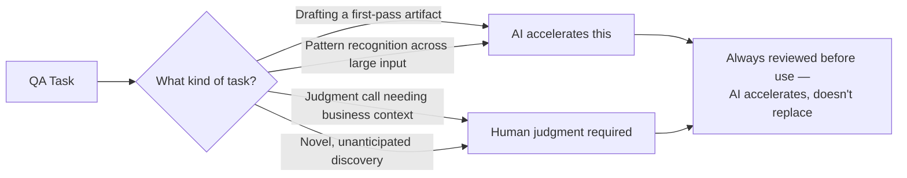

# AI in Software Testing

**Prerequisites**: You should already have completed Foundations, plus at least one of [Manual Testing](/learning-paths/manual-testing/test-design-fundamentals), [API Testing](/learning-paths/api-testing/what-is-api-testing), or [Automation Testing](/learning-paths/automation/introduction-to-automation-testing).
**Leads to**: After this, you'll be ready for [Responsible AI Usage and Human-in-the-Loop QA](/learning-paths/ai-for-qa/responsible-ai-usage-and-human-in-the-loop-qa).

Two opposite, equally wrong reactions to AI show up in QA teams today: treating it as a replacement for testers, or dismissing it as irrelevant to real testing work. Neither survives contact with what AI actually does well and poorly at. This module sets this path's real scope — and its central, recurring theme, true of every module that follows: **AI accelerates testing; it does not replace engineering judgment.**

## Why This Matters

**A team that treats AI as a replacement.** A QA team, excited by AI's ability to generate test cases instantly, starts accepting AI-drafted test cases into their suite without review — the volume of tests grows quickly, and the team reports "AI tripled our test coverage" in a status update. Months later, a real production defect ships in a feature whose AI-generated tests all technically "passed" — because the AI had drafted tests for behavior the feature was never actually supposed to have, based on a plausible but incorrect assumption about the requirement, and nobody had reviewed closely enough to catch it. The tests were confidently wrong, at scale.

**A team that dismisses AI entirely.** A different QA team, wary of AI-generated mistakes, refuses to use AI tooling for anything beyond casual reference, insisting that "real testing" requires everything hand-written. Their test case authoring, test data generation, and defect-triage work all stay exactly as slow as they were five years ago, while comparable teams elsewhere use AI to draft first-pass artifacts and spend their actual expertise on review and judgment — covering more ground with the same headcount, not less carefully.

Neither team is using AI well. The first team confused *fast* with *trustworthy*. The second team confused *risky if misused* with *not worth using at all*. This path's entire premise is the position between them: AI is a genuine productivity tool for QA work, used deliberately, with review built in as a non-negotiable step — never a replacement for the judgment that decides what's actually correct.

## What This Path Covers, and What It Doesn't

This path is scoped narrowly and deliberately:

**This is a QA engineering course.** Every technique taught here is in service of testing better, faster — not in service of understanding AI systems for their own sake.

**This is not a prompt-engineering course.** Effective prompting is touched on where directly relevant (per [Prompt Testing and Evaluation](/learning-paths/ai-for-qa/prompt-testing-and-evaluation) later in this path), but this path doesn't teach prompt design as its own discipline.

**This is not a machine-learning course.** How a language model is trained, its architecture, or its internals are out of scope entirely — this path treats AI tools the way [Performance Testing](/learning-paths/performance-testing/what-is-performance-testing) treats JMeter: a tool applied with judgment, not a system to be understood from the inside.

## Where AI Genuinely Helps QA Work

AI tools are strong at **drafting** — producing a first-pass test case, a first-pass test data set, a first-pass automation script, from a clear input — fast, at volume, without fatigue. This is the same shape of value automation itself provides for repeated, deterministic execution ([Introduction to Automation Testing](/learning-paths/automation/introduction-to-automation-testing)), applied one level earlier, to the *authoring* step rather than the *running* step.

AI tools are also strong at **pattern recognition across large volumes of text or data** — summarizing a long log file, suggesting a plausible root cause from a stack trace, spotting a structural similarity between a new defect and past ones.

## Where AI Falls Short

AI tools are weak at **judgment calls requiring genuine business context** — whether a specific edge case actually matters for this specific customer segment, whether a "technically passing" result actually reflects the intended behavior. AI tools are weak at **genuinely novel discovery** — finding the specific, unanticipated edge case nobody thought to ask about, the same value [Exploratory Testing Fundamentals](/learning-paths/manual-testing/exploratory-testing-fundamentals) already established as a distinctly human skill. And AI tools carry **no accountability** — a wrong AI-drafted test case is still the tester's responsibility once it ships, the same way a developer remains responsible for code they copied from anywhere else.

| | AI Is Strong Here | AI Is Weak Here |
|---|---|---|
| **Drafting a first-pass artifact** (test case, test data, script) | ✅ Fast, high-volume | |
| **Summarizing or pattern-matching across large input** (logs, past defects) | ✅ Genuinely useful | |
| **Judgment calls needing business context** | | ❌ Structurally can't know what it wasn't told |
| **Discovering a genuinely novel, unanticipated edge case** | | ❌ Exploratory testing's value, not AI's |
| **Accountability for what ships** | | ❌ Always the human's, regardless of what tool drafted it |

## How This Works on a Real Project

AtlasBank's QA team, evaluating whether and how to adopt AI tooling, explicitly maps their own workflow against this module's distinction rather than adopting AI uniformly or rejecting it uniformly. Drafting test cases from a written requirement, generating realistic test data matching an existing schema, and producing a first-pass automation script from an already-designed test case are identified as strong AI-acceleration candidates — bounded, draftable tasks with a clear human review step already built into the team's existing process.

Deciding whether a specific compliance edge case needs its own dedicated test, or exploring a newly redesigned screen for behavior nobody explicitly specified, are explicitly kept as human-owned work — not because AI couldn't produce *something* for either task, but because both require judgment and context AI structurally doesn't have. The team's resulting policy is specific and actionable, not a vague "use AI where helpful": a named list of task types where AI drafts first, and a named list where a human starts from scratch — precisely the distinction this module exists to teach.

## Common Mistakes

**Mistake 1: Accepting AI-drafted testing artifacts without review, mistaking speed for trustworthiness.**
This module's opening scenario is exactly this — a tripled test count that included confidently wrong tests, discovered only after a real defect shipped.

**Mistake 2: Refusing to use AI tooling at all, out of general wariness rather than a specific, evaluated risk.**
This module's second opening scenario shows the real cost of this position — falling behind on genuine productivity gains available to teams making a more deliberate choice.

**Mistake 3: Treating this path as a prompt-engineering or machine-learning course.**
Both are explicitly out of scope — conflating this path's actual QA-engineering focus with either wastes time on content this path was never designed to cover.

**Mistake 4: Assuming AI's accountability-free draft output removes the tester's own responsibility for what ships.**
A wrong AI-drafted test case is exactly as much the tester's responsibility as a wrong hand-written one — the drafting tool doesn't change who's accountable for the final result.

## Best Practices

**Practice 1: Map your own team's specific tasks against the drafting-vs-judgment distinction explicitly, rather than adopting or rejecting AI uniformly.**
This is the specific practice that produced AtlasBank's team a real, actionable policy instead of a vague intention.

**Practice 2: Treat every AI-drafted artifact as a first pass requiring review, never a finished product.**
This principle — *AI accelerates, it doesn't replace judgment* — is this path's central theme, and it applies without exception to every technique taught in every later module.

**Practice 3: Reserve genuinely novel, judgment-heavy work for human testers explicitly.**
Exploratory testing, edge-case discovery requiring business context, and final accountability all stay human-owned, not because AI can't attempt them, but because attempting isn't the same as being trustworthy at them.

**Practice 4: Keep this path's scope in mind — QA engineering with AI as a tool, not prompt engineering or ML.**
This keeps every later module's content genuinely applicable to your actual QA work, rather than drifting into adjacent but different disciplines.

:::note From the Field
An e-commerce company's QA team, under pressure to demonstrate AI adoption, began measuring their AI initiative's success by the raw number of AI-generated test cases added to their suite each sprint — mirroring the same metric-optimization trap [Introduction to Automation Testing](/learning-paths/automation/introduction-to-automation-testing) warned against for automation counts. The team optimized directly for the number, adding hundreds of low-value, AI-drafted tests for simple, low-risk paths, while the genuinely complex checkout flow — exactly the area needing the most careful human judgment — received the least attention, since it was the hardest area to draft AI test cases for quickly.
:::

:::tip Senior QA Insight
A newer tester treats AI output as either fully trustworthy or entirely suspect, an all-or-nothing judgment. A senior tester treats every AI output the same specific way regardless of how confident it sounds — as a draft, to be verified against the same standards any other draft would be held to, no more and no less.
:::

## Mini Challenge

**Scenario**: Your team lead asks you to identify three testing tasks on your current project that are strong candidates for AI-assisted drafting, and two that should stay entirely human-owned.

**Your task**: Using this module's drafting-vs-judgment distinction, name your five tasks and state the specific reasoning behind each classification — not just a gut-feel list.

## Key Takeaways

- AI in QA work is a genuine productivity tool for drafting and pattern recognition — neither a replacement for testers nor irrelevant to real testing work.
- This path's central theme, true of every module that follows: AI accelerates testing; it does not replace engineering judgment.
- AI is strong at drafting first-pass artifacts and pattern-matching across large input; it's weak at judgment calls requiring business context, novel discovery, and it carries no accountability for what ships.
- This path is explicitly scoped to QA engineering with AI as a tool — not prompt engineering, not machine learning.

---

## What You Just Learned

- Why "AI replaces testers" and "AI is irrelevant to testing" are both wrong, and what the real, useful position looks like
- Where AI genuinely accelerates QA work (drafting, pattern recognition) and where it structurally can't (judgment, novel discovery, accountability)
- This path's explicit scope: QA engineering, not prompt engineering or machine learning
- How AtlasBank's QA team turned this module's distinction into a specific, actionable AI-adoption policy

**Next:** [Responsible AI Usage and Human-in-the-Loop QA](/learning-paths/ai-for-qa/responsible-ai-usage-and-human-in-the-loop-qa)

## Related Topics

- [Introduction to Automation Testing](/learning-paths/automation/introduction-to-automation-testing) — The same "accelerates execution, doesn't replace judgment" distinction, applied there to test automation
- [Exploratory Testing Fundamentals](/learning-paths/manual-testing/exploratory-testing-fundamentals) — The distinctly human discovery skill this module identifies as outside AI's reach
- [Responsible AI Usage and Human-in-the-Loop QA](/learning-paths/ai-for-qa/responsible-ai-usage-and-human-in-the-loop-qa) — Where this module's central theme becomes a concrete, practiced review discipline

## Interview Questions

**Q1: What's your view on how AI should be used in QA work?**

*What to look for*: A candidate who avoids both extremes (AI replaces testers; AI has no place in testing) and instead names specific task types where AI accelerates work (drafting, pattern recognition) versus where human judgment stays essential (novel discovery, business-context decisions, accountability).

:::note Common Interview Mistake
Many candidates give an enthusiastic but vague answer ("AI is the future of testing!") without naming any specific task distinction. A strong answer gives concrete examples of what AI drafts well and what still requires human judgment, showing a considered position rather than general enthusiasm or general skepticism.
:::

**Q2: If an AI tool drafts a test case that turns out to be wrong, who's responsible?**

*What to look for*: A candidate who states clearly that the tester remains responsible for anything that ships, regardless of what tool drafted it — recognizing that AI assistance doesn't transfer accountability away from the human reviewing and approving the work.

---

## Glossary

**AI-Assisted Drafting**: Using an AI tool to produce a first-pass testing artifact (test case, test data, script) that a human then reviews and refines — not a finished, trusted output.

**Human-in-the-Loop**: A workflow where AI output is systematically reviewed by a person before being trusted or used, rather than accepted automatically.

## Quick Revision

Remember these five points:

✓ AI accelerates testing; it does not replace engineering judgment — this path's central, recurring theme.

✓ AI is strong at drafting first-pass artifacts and pattern recognition across large input.

✓ AI is weak at judgment calls needing business context, novel discovery, and carries no accountability for what ships.

✓ This path is QA engineering with AI as a tool — not prompt engineering, not machine learning.

✓ Map your own team's tasks explicitly against the drafting-vs-judgment distinction, rather than adopting or rejecting AI uniformly.
