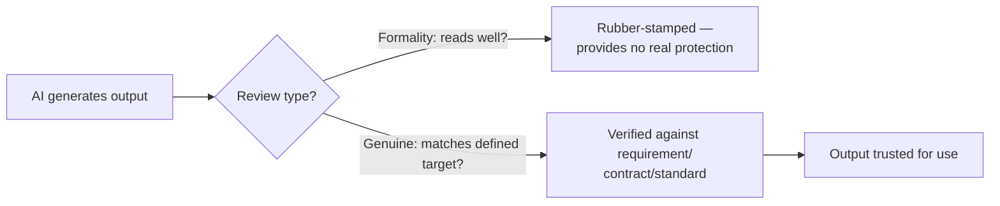

# Responsible AI Usage and Human-in-the-Loop QA

**Prerequisites**: You should already have completed [AI in Software Testing](/learning-paths/ai-for-qa/ai-in-software-testing).
**Leads to**: After this, you'll be ready for [Reviewing AI Output and Recognizing Hallucinations](/learning-paths/ai-for-qa/reviewing-ai-output-and-recognizing-hallucinations).

"We review all AI-generated content before it ships" sounds like a real safeguard — until the actual review is a fast skim that rubber-stamps anything that reads fluently. This module is about the difference between a human-in-the-loop process that exists on paper and one that actually catches something, continuing directly from [AI in Software Testing](/learning-paths/ai-for-qa/ai-in-software-testing)'s central theme: AI accelerates testing, it does not replace engineering judgment — this module is where that principle becomes a concrete, practiced discipline rather than a slogan.

## Why This Matters

**A team with human-in-the-loop as a formality.** AtlasBank's QA team adopts a policy requiring every AI-generated test case to be "reviewed" before merging into the suite — a real, documented process. In practice, the reviewer's actual habit is a quick read-through checking that the test case looks coherent and well-formatted, not a genuine check against the actual requirement it's supposed to test. A batch of AI-drafted test cases for a new KYC verification flow all pass this fast review — they read fluently, use correct terminology, and look like real test cases — but three of them test a validation rule the requirement never actually specified, confidently invented by the AI to fill a gap in an ambiguous prompt. The review step existed; it simply never had a real chance of catching this.

**A team with genuine human-in-the-loop verification.** A different QA process treats review as a specific, defined activity: comparing each AI-drafted test case directly against the written requirement, line by line, not just checking that the test case reads well. The same KYC test-case batch, reviewed this way, immediately surfaces the three invented-rule test cases — because the reviewer is actively checking "does the requirement actually say this," not just "does this look like a real test case."

Both teams had a "review AI output" policy. Only one of them had a review that actually verified something, rather than confirming the output was well-formatted and confident-sounding.

## What Human-in-the-Loop Actually Requires

**A defined verification target.** Review isn't generic "does this look right" — it's checking AI output against something specific: the actual requirement, the actual API contract, the actual existing test standard. This module's opening scenario's failure is exactly a missing verification target — "reads well" was the only implicit standard being checked against.

**A structural moment where output can't proceed without it.** If review is optional, skippable under time pressure, or happens after output is already in use, it isn't really in the loop — it's a formality applied after the fact, if at all.

**Skepticism proportional to the artifact's actual risk**, not to how confident the AI output sounds. AI output is often written in a fluent, assured tone regardless of whether it's actually correct — [AI in Software Testing](/learning-paths/ai-for-qa/ai-in-software-testing) already established that AI has no real accountability mechanism forcing accuracy, so confidence in tone is not evidence of correctness and shouldn't be treated as such.

| Review Type | What It Actually Checks | What It Misses |
|---|---|---|
| **Formality review** | Does this read fluently and look well-formatted? | Whether the content is actually, factually correct |
| **Genuine verification** | Does this match the specific requirement, contract, or standard it's supposed to reflect? | Nothing structural — this is the actual check needed |

## How This Works on a Real Project

Following this module's opening scenario, AtlasBank's QA team redesigns its human-in-the-loop policy with a specific, structural change: every AI-drafted test case must include an explicit citation of the requirement line or acceptance criterion it's testing, and the reviewer's actual sign-off step requires confirming that citation is accurate — not just that the test case itself reads well. This turns "review" from an implicit, skippable habit into a specific, checkable action with a defined target.

Applied to the next batch of AI-drafted KYC test cases, this structural change catches the same class of defect immediately: a test case citing "Acceptance Criterion 4.2" for a rule that criterion never actually states is flagged the moment a reviewer checks the citation against the real document — a check the team's original, vaguer "review it" policy never structurally forced anyone to actually perform.

## Common Mistakes

**Mistake 1: Defining a review step without a specific, defined verification target.**
This module's opening scenario's entire failure traces to this gap — "review it" with no defined target collapses into "does it read well," which catches almost nothing.

**Mistake 2: Trusting AI output more because it sounds confident.**
Fluent, assured phrasing is a property of how the AI writes, not evidence that the content is correct — treating tone as a signal of accuracy is exactly backward.

**Mistake 3: Making review skippable or optional under deadline pressure.**
A review step that can be bypassed when time is short isn't a real structural safeguard — it's a habit that will predictably erode exactly when the stakes (rushed decisions) are highest.

**Mistake 4: Applying the same light-touch review to every AI output regardless of risk.**
A low-stakes, easily-reversible artifact and a compliance-critical test case don't need the same review depth — treating them identically either wastes effort on the former or under-protects the latter.

## Best Practices

**Practice 1: Define a specific verification target for every category of AI-assisted work — the requirement, the contract, the existing standard.**
This is the single change that turned AtlasBank's formality review into a genuine one.

**Practice 2: Require an explicit citation or reference from AI output back to its source, and make verifying that citation the actual review action.**
This structural change is what made the review checkable, not just a stated intention.

**Practice 3: Calibrate review depth to the artifact's actual risk, per [AI in Software Testing](/learning-paths/ai-for-qa/ai-in-software-testing)'s own risk-aware framing.**
A compliance-critical test case deserves deeper verification than a low-stakes exploratory suggestion.

**Practice 4: Treat AI output's confident tone as irrelevant to its correctness, and review accordingly.**
This is a deliberate discipline — actively resisting the instinct to trust fluent, assured-sounding content more than the same claim stated tentatively.

:::note From the Field
A healthcare software company's engineering team adopted a policy requiring "code review" for all AI-generated code before merging — a real, enforced process in their pull-request workflow. Reviewers, however, were evaluating AI-generated pull requests the same fast way they evaluated routine, low-risk changes from trusted teammates, checking style and obvious bugs but not systematically verifying the code's logic against the actual specification. A subtle, AI-introduced logic error in patient-data handling passed several PR reviews this way before being caught in a later, unrelated audit — the review process existed and was followed, but was never actually structured to catch what it needed to.
:::

:::tip Senior QA Insight
A newer tester considers AI output "reviewed" once someone has read through it and it seemed fine. A senior tester asks a more specific question before trusting any review — reviewed *against what*, specifically — because a review with no defined verification target isn't really checking anything, no matter how carefully someone reads.
:::

## Mini Challenge

**Scenario**: Your team currently has a policy stating "all AI-generated test data must be reviewed before use in a shared test environment," with no further detail.

**Your task**: Redesign this policy into a genuine human-in-the-loop checkpoint, per this module's framework — name the specific verification target, and describe what the reviewer would concretely check.

## Key Takeaways

- A human-in-the-loop review step only provides real protection if it checks AI output against a specific, defined verification target — not just whether the output reads well.
- AI output's confident, fluent tone is not evidence of correctness and shouldn't be treated as a trust signal.
- Review needs to be a structural checkpoint output can't bypass, not an optional habit that erodes under time pressure.
- Review depth should scale with the artifact's actual risk, not be applied uniformly regardless of stakes.

---

## What You Just Learned

- The difference between a human-in-the-loop review that's a real safeguard and one that's a formality
- Why AI output's confident tone should never be treated as evidence of correctness
- How to design a review step with a specific, checkable verification target instead of a vague "review it" policy
- How AtlasBank's QA team redesigned its review process to require citation verification, catching a real class of confidently-invented test cases

**Next:** [Reviewing AI Output and Recognizing Hallucinations](/learning-paths/ai-for-qa/reviewing-ai-output-and-recognizing-hallucinations)

## Related Topics

- [AI in Software Testing](/learning-paths/ai-for-qa/ai-in-software-testing) — This path's central theme, which this module turns into a concrete review discipline
- [Reviewing Test Cases](/learning-paths/manual-testing/reviewing-test-cases) — The general test-case review discipline this module applies specifically to AI-generated content
- [Reviewing AI Output and Recognizing Hallucinations](/learning-paths/ai-for-qa/reviewing-ai-output-and-recognizing-hallucinations) — The specific, practiced skill this module's verification principle requires

## Interview Questions

**Q1: Your team has a policy that all AI-generated content gets reviewed before use. How would you evaluate whether that review is actually effective?**

*What to look for*: A candidate who asks what specific target the review checks against, rather than accepting "it gets reviewed" as sufficient on its own — recognizing that a review with no defined verification target provides little real protection.

:::note Common Interview Mistake
Many candidates treat "we have a review process" as sufficient evidence of responsible AI usage on its own, without probing what the review actually verifies. A strong answer explicitly asks what specific standard or source the review checks output against, and how skippable or enforced that review actually is in practice.
:::

**Q2: Why might a reviewer be more likely to miss an error in AI-generated content than in human-written content?**

*What to look for*: A candidate who names the confidence/fluency effect specifically — AI output tends to read assured and polished regardless of correctness, which can lower a reviewer's guard compared to reviewing a colleague's more visibly tentative first draft.

---

## Glossary

**Verification Target**: The specific requirement, contract, or standard a review step checks AI output against — without one, a "review" has nothing concrete to verify.

**Rubber-Stamp Review**: A review step that exists procedurally but doesn't actually check content against a meaningful standard, providing little real protection.

## Quick Revision

Remember these five points:

✓ A review step only protects against errors if it checks against a specific, defined verification target.
✓ AI output's confident, fluent tone is not evidence of correctness.
✓ Review must be a structural checkpoint that can't be bypassed under time pressure.
✓ Calibrate review depth to the artifact's actual risk, not uniformly.
✓ Requiring an explicit citation back to the source (requirement, contract, standard) makes review genuinely checkable.
