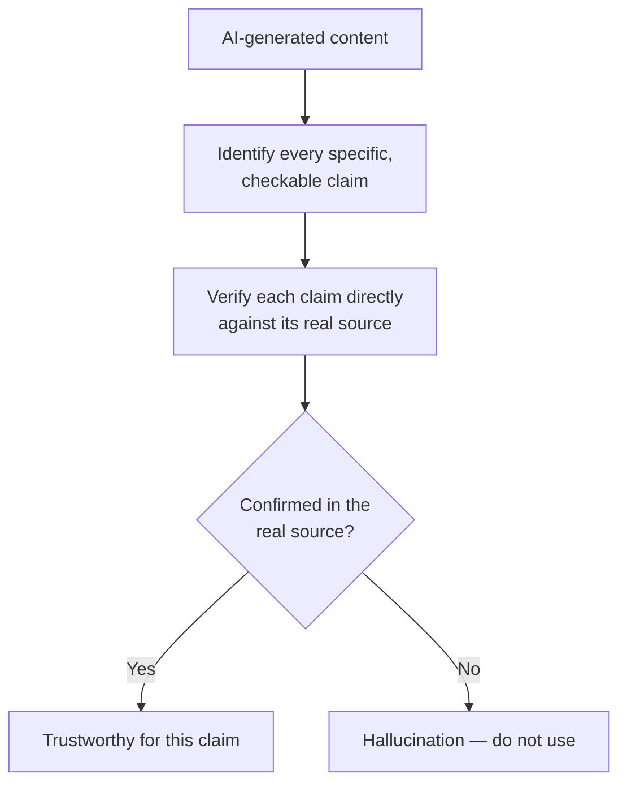

# Reviewing AI Output and Recognizing Hallucinations

**Prerequisites**: You should already have completed [Responsible AI Usage and Human-in-the-Loop QA](/learning-paths/ai-for-qa/responsible-ai-usage-and-human-in-the-loop-qa).
**Leads to**: After this, you'll be ready for [Section 1 Review](/learning-paths/ai-for-qa/section-1-review), then Section 2 — AI-Assisted Testing Techniques.

[Responsible AI Usage and Human-in-the-Loop QA](/learning-paths/ai-for-qa/responsible-ai-usage-and-human-in-the-loop-qa) established that review needs a specific verification target. This module builds the actual, practiced skill that review depends on: recognizing a **hallucination** — a fabricated, invented detail an AI tool presents with the same fluent confidence as something genuinely true — before it enters a test suite, an automation script, or a defect report. Every later module in this path assumes this skill; it's taught once, here, not re-taught.

## Why This Matters

**A tester who doesn't catch a hallucination.** A tester asks an AI tool to draft an automation script testing AtlasBank's beneficiary-management API, based on a brief description of the endpoint. The generated script includes a call to a `/beneficiaries/validate-iban` endpoint, complete with a plausible-looking request body and expected response fields — confidently written, matching the style of every other real endpoint in the script. The endpoint doesn't exist; the AI, filling a gap in its understanding of the actual API surface, invented a plausible name following the same naming convention as real endpoints. The script fails when run — not because of a real defect, but because a fabricated endpoint was never going to work, wasting debugging time before anyone realizes the endpoint itself was never real.

**A tester who catches it.** A different tester, applying a specific habit before trusting any AI-generated script, cross-checks every referenced endpoint against the actual, current API documentation before running anything. The `/beneficiaries/validate-iban` call is flagged in under a minute — it's not in the documented API surface at all — caught before any time is spent debugging a script that was never going to work for a real reason.

Both testers received the identical hallucinated endpoint. Only one of them had a specific, practiced habit for catching it — not general skepticism, but an actual, repeatable check.

## What a Hallucination Actually Looks Like in QA Work

A hallucination isn't marked as uncertain or hedged — that's what makes it dangerous. It's presented with the exact same fluent confidence as accurate content, often following the real patterns and conventions of genuine content closely enough to look completely plausible.

**Fabricated technical details**: an API endpoint, a field name, a library function, or a configuration option that doesn't actually exist, invented to plausibly fill a gap — this module's opening scenario's exact failure mode.

**Invented requirements or rules**: a business rule or validation constraint the AI states confidently, that the actual requirement document never specified — the same failure class [Responsible AI Usage and Human-in-the-Loop QA](/learning-paths/ai-for-qa/responsible-ai-usage-and-human-in-the-loop-qa)'s own KYC example described.

**Confidently wrong root-cause claims**: an AI-suggested explanation for a defect or test failure that sounds mechanistically plausible but doesn't actually match the real logs or code path, stated with the same certainty as a genuinely correct diagnosis.

**Non-existent library or dependency references**: generated automation code referencing a package, method, or import that doesn't exist in the actual project or library version being used.

| Hallucination Type | Where It Shows Up | How to Catch It |
|---|---|---|
| Fabricated endpoint/field/function | Generated test scripts, automation code | Cross-check against actual, current API docs or schema |
| Invented requirement or rule | Generated test cases | Cross-check against the actual written requirement, line by line |
| Confidently wrong root cause | AI-assisted defect triage | Verify the claim directly against the actual logs/code, don't accept the explanation on tone alone |
| Non-existent library/function | Generated automation code | Attempt to actually run it, and check the reference against real, current documentation |

## The Core Recognition Habit

The single most reliable check, across every hallucination type above, is the same: **verify the specific, checkable claim directly against its real source**, rather than judging the output by how plausible or well-written it reads. This is deliberately not about "developing a sense" for what AI gets wrong — tone and plausibility are exactly what a hallucination is good at faking. The check is mechanical and specific: does this endpoint actually exist in the documented API? Does this requirement actually say this? Does this function actually exist in this library version?

## How This Works on a Real Project

AtlasBank's QA team, applying this module's core habit as a standard step before merging any AI-assisted automation code, reviews a generated script for the loan-application feature. The script includes a call to check `loan.preApprovalStatus`, a field name that reads completely plausibly given the feature's domain — a reviewer skimming for fluency alone would have no reason to question it.

Applying the direct-verification habit instead of a plausibility judgment, the reviewer checks the actual API schema and finds the real field is named `loan.preliminaryApprovalStatus` — a subtly different name the AI had approximated rather than gotten exactly right, confidently, with no indication of uncertainty. This is caught in the same review pass that would have missed it entirely under a "does this look right" standard, specifically because the team's practiced habit is checking the specific, checkable claim against the real schema, not judging the code's overall plausibility.

## Common Mistakes

**Mistake 1: Judging AI output's trustworthiness by how plausible or well-written it reads.**
This module's opening scenario and its AtlasBank example both hinge on exactly this — a hallucination is specifically good at reading plausibly, which is why plausibility is not a valid check.

**Mistake 2: Reviewing for style and fluency instead of verifying specific, checkable claims.**
A script or test case can be perfectly well-formatted and still reference something that doesn't exist — formatting quality says nothing about factual accuracy.

**Mistake 3: Trusting an AI-suggested root cause without checking it against the actual logs or code.**
A confidently-stated wrong explanation can send an investigation in the wrong direction entirely, costing more time than starting the investigation from scratch.

**Mistake 4: Assuming a hallucination will look obviously wrong or out of place.**
The AtlasBank field-name example specifically shows a hallucination can be a subtle, close approximation of something real — not an obviously fabricated, unusual-looking claim.

## Best Practices

**Practice 1: For every AI-generated artifact, identify the specific, checkable claims it makes and verify each one directly.**
This is the single, mechanical habit both this module's worked examples depend on — not a general sense of caution, an actual per-claim check.

**Practice 2: Cross-check technical references (endpoints, fields, functions) against current, authoritative documentation — not memory or assumption.**
Documentation can itself be out of date, but it's still a more reliable source than trusting an AI's confident phrasing.

**Practice 3: Treat subtle, close-but-wrong details as a real hallucination pattern, not just obviously fabricated ones.**
The AtlasBank field-name example (`preApprovalStatus` vs. the real `preliminaryApprovalStatus`) shows hallucinations often approximate real content closely, which is exactly what makes them dangerous.

**Practice 4: Actually run or execute AI-generated code/scripts as part of verification, not just read them.**
A fabricated endpoint or function reference often only reveals itself on execution — reading alone can miss it if the surrounding code looks otherwise correct.

:::note From the Field
A fintech company's support team used an AI tool to help draft responses to customer questions about fee structures, with a human agent reviewing each drafted response before sending. Reviewers, trained to check for tone and clarity, approved a batch of responses stating a specific international transfer fee percentage that sounded exactly like the real, official rate structure — confidently and precisely worded — but was actually a slightly incorrect number the AI had generated by extrapolating a plausible-sounding pattern from other fee types, rather than the actual documented rate. The error was caught only when a customer disputed a charge that didn't match what they'd been told, tracing back to several approved responses that had never been checked against the actual, authoritative fee schedule.
:::

:::tip Senior QA Insight
A newer tester asks "does this look right?" when reviewing AI output. A senior tester asks a narrower, more useful question for every specific, checkable claim inside it — "is this actually true, verified against the real source?" — because "looks right" is exactly the standard a hallucination is built to pass.
:::

## Mini Challenge

**Scenario**: An AI tool generates a test case for AtlasBank's password-reset flow, stating: "The system should lock the account after 5 failed reset attempts within a 10-minute window."

**Your task**: Describe the specific verification step you'd take before trusting this test case, and name what source you'd check it against.

## Key Takeaways

- A hallucination is a fabricated detail presented with the same fluent confidence as accurate content — plausibility and tone are not evidence of correctness.
- Hallucinations show up as fabricated technical details, invented requirements, confidently wrong root causes, and non-existent library references.
- The core recognition habit is mechanical: identify every specific, checkable claim and verify it directly against its real source.
- Hallucinations often closely approximate real content rather than being obviously fabricated — a subtle, close-but-wrong detail is a real pattern to watch for, not an edge case.

---

## What You Just Learned

- What a hallucination concretely looks like across different types of QA artifacts
- The core, mechanical recognition habit: verify every specific, checkable claim directly against its real source
- Why plausibility and confident tone are never valid evidence of AI output's correctness
- How AtlasBank's QA team caught a subtle, closely-approximated hallucinated field name by checking the actual schema rather than judging the code's overall plausibility

**Next:** [Section 1 Review](/learning-paths/ai-for-qa/section-1-review)

## Related Topics

- [Responsible AI Usage and Human-in-the-Loop QA](/learning-paths/ai-for-qa/responsible-ai-usage-and-human-in-the-loop-qa) — The verification-target principle this module turns into a specific, practiced skill
- [Database Defect Investigation](/learning-paths/database-testing/database-defect-investigation) and [Performance Defect Investigation](/learning-paths/performance-testing/performance-defect-investigation) — The same "verify directly, don't trust a plausible-sounding explanation" discipline, applied there to root-cause investigation generally
- [AI-Assisted Test Case Generation](/learning-paths/ai-for-qa/ai-assisted-test-case-generation) — Where this module's recognition skill gets applied directly, starting in Section 2

## Interview Questions

**Q1: How would you check whether an AI-generated test script contains a hallucinated API endpoint?**

*What to look for*: A candidate who describes cross-checking every referenced endpoint against actual, current API documentation and/or attempting to run the script — not a vague "I'd read through it carefully," which doesn't describe an actual verification method.

:::note Common Interview Mistake
Many candidates describe catching AI hallucinations by "using good judgment" or "AI usually makes obvious mistakes," without naming a specific, mechanical verification method. A strong answer names the actual habit — identifying specific, checkable claims and verifying each against its real source — and recognizes that hallucinations are often subtle, not obviously wrong.
:::

**Q2: Why can't you rely on an AI-generated explanation "sounding right" to judge whether it's correct?**

*What to look for*: A candidate who explains that AI output is written with the same fluent confidence regardless of accuracy, so tone and plausibility provide no real signal — and that hallucinations specifically tend to closely approximate real, correct-sounding content.

---

## Glossary

**Hallucination**: A fabricated, invented detail an AI tool presents with the same confident fluency as genuinely accurate content.

**Verification Habit**: The mechanical practice of identifying every specific, checkable claim in AI output and confirming it directly against its real, authoritative source.

## Quick Revision

Remember these five points:

✓ A hallucination is presented with the same confident tone as accurate content — plausibility is not evidence of correctness.
✓ Hallucinations show up as fabricated technical details, invented requirements, wrong root causes, and non-existent library references.
✓ The core habit: identify every specific, checkable claim and verify it directly against its real source.
✓ Hallucinations often closely approximate real content — watch for subtle, close-but-wrong details, not just obvious fabrications.
✓ Actually run or execute AI-generated code as part of verification, not just read it.
