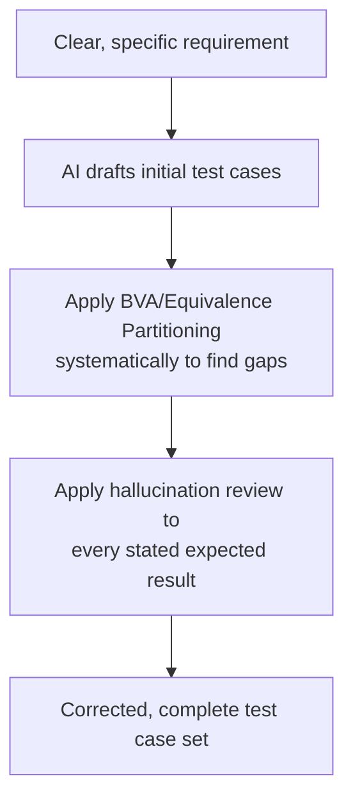

# AI-Assisted Test Case Generation

**Prerequisites**: You should already have completed [Section 1 Review](/learning-paths/ai-for-qa/section-1-review) and Section 1 in full.
**Leads to**: After this, you'll be ready for [AI-Assisted Test Data Creation](/learning-paths/ai-for-qa/ai-assisted-test-data-creation).

An AI tool can draft a plausible-looking set of test cases from a requirement in seconds — the question this module answers is what to do with that draft. The answer isn't "trust it" or "ignore it," per this path's central theme — it's applying [Test Design Fundamentals](/learning-paths/manual-testing/test-design-fundamentals)'s existing technique, systematically, to evaluate and correct what AI produces.

## Why This Matters

**A team that accepts AI-drafted test cases wholesale.** A tester asks an AI tool to draft test cases for AtlasBank's new $15,000 daily transfer limit, based on the written requirement. The AI produces a reasonable-looking set: a test for a transfer under the limit, one for a transfer over the limit, and one for exactly at the limit. It looks thorough — three cases covering the obvious shape of the requirement. What's missing: $14,999.99 and $15,000.01, the actual boundary values [Boundary Value Analysis](/learning-paths/manual-testing/boundary-value-analysis) identifies as where real defects concentrate — the AI's draft covered the requirement's *obvious* shape without applying that specific technique, because drafting plausible-looking cases and applying boundary analysis are different skills.

**A team that reviews the draft against BVA systematically.** A different tester takes the identical AI-drafted starting point, then explicitly checks it against [Boundary Value Analysis](/learning-paths/manual-testing/boundary-value-analysis)'s standard set for this limit — the values immediately below, at, and above the boundary. The gap is immediate and specific: $14,999.99 and $15,000.01 are both missing, added directly, closing exactly the coverage gap a purely AI-drafted set left open.

Both testers started from the identical AI draft. Only one of them treated it as a draft requiring a specific, technique-driven review — not just a glance for obvious gaps.

## The AI-Assisted Test Case Workflow

**Step 1 — Provide a clear, well-scoped input.** AI drafts against what it's given; a vague or incomplete requirement produces a vague or incomplete draft, the same "unclear input in, unclear output out" dynamic true of any drafting tool. Provide the actual, specific requirement or acceptance criteria, not a paraphrased summary.

**Step 2 — Let AI produce an initial draft.** This is where AI's drafting strength (per [AI in Software Testing](/learning-paths/ai-for-qa/ai-in-software-testing)) applies directly — a fast first pass covering the requirement's obvious shape.

**Step 3 — Apply Boundary Value Analysis and Equivalence Partitioning systematically to the draft.** Don't scan for "does this look complete" — explicitly check the draft against [Boundary Value Analysis](/learning-paths/manual-testing/boundary-value-analysis)'s and [Equivalence Partitioning](/learning-paths/manual-testing/equivalence-partitioning)'s own standard checklists. This is where this module's opening scenario's gap gets caught — a systematic technique check finds what a general "does this look thorough" read misses.

**Step 4 — Apply hallucination review to every stated expected result.** Per [Reviewing AI Output and Recognizing Hallucinations](/learning-paths/ai-for-qa/reviewing-ai-output-and-recognizing-hallucinations), verify each test case's expected behavior against the actual requirement — not just its input values, but whether the AI's stated expected outcome is genuinely what the requirement specifies.

## Why AI's Draft Tends to Cover the Obvious Shape, Not the Real Boundaries

AI drafting a test case from a requirement tends to produce cases that mirror the requirement's own stated structure — "under the limit," "over the limit," "at the limit" directly mirrors how the $15,000 requirement in this module's opening scenario was likely phrased. Boundary Value Analysis's actual insight — that defects concentrate specifically at the values *immediately adjacent* to a boundary, not just at the boundary itself — is a deliberate testing technique, not something drafting from a requirement's plain-language description naturally produces. This is exactly why Step 3 above isn't optional: the systematic technique check is doing real, necessary work an AI draft doesn't do on its own.

| AI Draft Alone Tends to Produce | BVA/Equivalence Partitioning Review Adds |
|---|---|
| A case for each obviously distinct scenario the requirement describes | The specific boundary-adjacent values (one below, one above) BVA identifies |
| Plausible expected results matching the requirement's stated behavior | Verification that each expected result is genuinely, not just plausibly, correct |
| Coverage that "looks complete" on a read-through | Coverage checked against a specific, named technique's actual criteria |

## How This Works on a Real Project

AtlasBank's QA team, applying this module's workflow to a new requirement — a $500 minimum balance rule for a savings account type — uses AI to draft an initial test case set from the written requirement. The draft covers a balance well above the minimum and a balance well below it, both reasonable, obvious cases.

Applying Step 3's systematic BVA check, the team adds the two missing boundary-adjacent cases: exactly $500 (should be allowed) and $499.99 (should be rejected) — neither present in the AI's initial draft. Running the added $499.99 case against the actual feature reveals a real defect: the system incorrectly allows a balance of $499.99, because the underlying check uses `<=` where the requirement specifies a strict `<` comparison — a defect that would have shipped invisibly if the team had trusted the AI's initial, requirement-shape-mirroring draft as complete.

## Common Mistakes

**Mistake 1: Treating an AI-drafted test case set as complete because it covers the requirement's obvious cases.**
This module's opening scenario and its AtlasBank example both hinge on exactly this — "covers the obvious shape" and "covers the actual boundaries" are different, and only the second is real BVA coverage.

**Mistake 2: Skipping the systematic technique-check step because the draft "looks thorough."**
A plausible-looking draft is not the same as one verified against BVA/Equivalence Partitioning's specific criteria — this module's entire point is that the check has to be explicit and systematic, not a general impression.

**Mistake 3: Providing a vague or paraphrased input instead of the actual requirement.**
A vague input produces a vaguer draft, giving the review step more gaps to close and increasing the risk something real gets missed in the process.

**Mistake 4: Reviewing test case inputs for BVA coverage but skipping hallucination review of the stated expected results.**
Per [Reviewing AI Output and Recognizing Hallucinations](/learning-paths/ai-for-qa/reviewing-ai-output-and-recognizing-hallucinations), a test case can have the right boundary input and a confidently wrong expected result — both need independent verification.

## Best Practices

**Practice 1: Always apply Boundary Value Analysis and Equivalence Partitioning explicitly to an AI-drafted test case set, not just a general completeness read.**
This is the single practice both this module's worked examples depend on to find a real, otherwise-missed coverage gap.

**Practice 2: Provide the actual, specific requirement as AI's input, not a paraphrase.**
A precise input gives AI's draft the best chance of covering what the requirement actually says, before the systematic review closes the remaining gap.

**Practice 3: Verify every stated expected result against the real requirement, not just each case's input values.**
Boundary coverage alone doesn't catch a hallucinated expected outcome — both need independent checking.

**Practice 4: Treat this workflow as accelerating test design, not skipping it.**
The technique (BVA, Equivalence Partitioning) doesn't change — AI accelerates getting to a first draft faster, but the actual test-design discipline still has to be applied deliberately afterward.

:::note From the Field
A subscription-billing company used AI to draft test cases for a new prorated-refund calculation feature, based on a written requirement describing refund eligibility "within the first 14 days" of a subscription. The AI-drafted cases covered day 5 (eligible) and day 20 (not eligible) — reasonable, obvious cases — but missed day 14 and day 15, the actual boundary. A tester applying Boundary Value Analysis explicitly added both, and day 15 revealed a real off-by-one defect: the feature's eligibility check used `<= 15` instead of the specified `<= 14`, silently extending the refund window by a full day for every customer, undetected until the boundary-specific test case was added.
:::

:::tip Senior QA Insight
A newer tester considers an AI-drafted test case set finished once it reads as covering the requirement well. A senior tester treats the draft as exactly that — a draft — and runs the same systematic BVA/Equivalence Partitioning check they'd apply to their own hand-written first pass, because the technique doesn't become less necessary just because a tool produced the starting point faster.
:::

## Mini Challenge

**Scenario**: An AI tool drafts test cases for AtlasBank's password field, based on a requirement stating passwords must be "between 8 and 20 characters."

**Your task**: List the specific boundary values you'd expect a properly BVA-reviewed test case set to include that a "looks complete" AI draft might miss.

## Key Takeaways

- AI-assisted test case generation accelerates getting to a first draft — it doesn't replace applying Boundary Value Analysis and Equivalence Partitioning explicitly to that draft.
- AI's draft tends to mirror a requirement's obvious, stated shape rather than the specific boundary-adjacent values BVA identifies as where real defects concentrate.
- Every stated expected result needs independent hallucination review, separate from checking input-value coverage.
- A clear, specific requirement as AI's input produces a better starting draft, reducing (but not eliminating) the gap the systematic review step needs to close.

---

## What You Just Learned

- The four-step AI-assisted test case generation workflow: clear input, AI draft, systematic BVA/Equivalence Partitioning review, hallucination review of expected results
- Why an AI draft tends to cover a requirement's obvious shape rather than its actual boundary values
- How AtlasBank's QA team caught a real off-by-one defect by adding boundary-adjacent test cases an AI draft alone had missed
- Why this workflow accelerates test design without replacing the actual test-design discipline

**Next:** [AI-Assisted Test Data Creation](/learning-paths/ai-for-qa/ai-assisted-test-data-creation)

## Related Topics

- [Boundary Value Analysis](/learning-paths/manual-testing/boundary-value-analysis) — The technique this module applies explicitly to AI-drafted test cases, not re-taught here
- [Equivalence Partitioning](/learning-paths/manual-testing/equivalence-partitioning) — The second technique this module's systematic review step applies
- [Reviewing AI Output and Recognizing Hallucinations](/learning-paths/ai-for-qa/reviewing-ai-output-and-recognizing-hallucinations) — The verification skill this module applies to every AI-stated expected result

## Interview Questions

**Q1: How would you use AI to help draft test cases without missing real coverage gaps?**

*What to look for*: A candidate who describes explicitly applying an existing test-design technique (BVA, Equivalence Partitioning) to the AI's draft, not just reading it for general completeness — recognizing that an AI draft tends to mirror a requirement's obvious shape, not its actual boundaries.

:::note Common Interview Mistake
Many candidates describe using AI to "speed up" test case writing without describing any specific review step afterward. A strong answer names the specific technique (BVA/Equivalence Partitioning) applied systematically to the draft, and explains why an AI draft alone tends to miss boundary-adjacent values specifically.
:::

**Q2: If an AI-drafted test case has the right boundary values but a wrong expected result, would a BVA-focused review catch that?**

*What to look for*: A candidate who recognizes that boundary-coverage review and hallucination review of expected results are two separate checks — BVA coverage alone doesn't verify whether a stated expected outcome is actually correct.

---

## Glossary

No new terms are introduced in this module — every concept used above is defined in its linked source module.

## Quick Revision

Remember these five points:

✓ AI-assisted test case generation accelerates drafting — it doesn't replace applying BVA/Equivalence Partitioning explicitly afterward.
✓ AI's draft tends to cover a requirement's obvious shape, not its actual boundary-adjacent values.
✓ Apply the systematic technique check explicitly — a "looks thorough" read isn't the same as real BVA coverage.
✓ Verify every stated expected result independently, separate from checking input-value coverage.
✓ A clear, specific requirement as input improves the starting draft but doesn't remove the need for systematic review.
