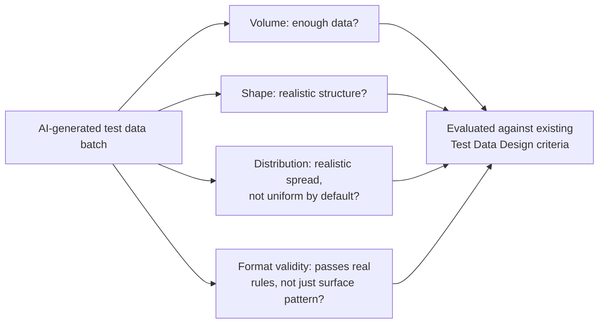

# AI-Assisted Test Data Creation

**Prerequisites**: You should already have completed [AI-Assisted Test Case Generation](/learning-paths/ai-for-qa/ai-assisted-test-case-generation).
**Leads to**: After this, you'll be ready for [AI-Assisted API and Automation Authoring](/learning-paths/ai-for-qa/ai-assisted-api-and-automation-authoring).

AI can generate a batch of test data — customer records, account numbers, transaction histories — in seconds, and every record can look individually plausible. Whether that batch is actually *realistic*, in the way [Test Data Design](/learning-paths/manual-testing/test-data-design) and [Test Data for Performance](/learning-paths/performance-testing/test-data-for-performance) already defined realistic test data, is a separate question this module answers — continuing this path's central theme, AI accelerates generating data, it doesn't replace evaluating whether that data is actually good.

## Why This Matters

**A team that accepts AI-generated test data at face value.** A tester asks an AI tool to generate 500 sample AtlasBank customer accounts for a new feature's test environment. The output looks immediately usable — plausible names, plausible account numbers, plausible balances, all individually well-formed. What the tester doesn't check: every account has a near-identical transaction history shape (a handful of similar-sized transactions, evenly spaced), because the AI generated 500 independent, individually-plausible records without being asked to vary their *distribution* — exactly the artificial-uniformity gap [Test Data for Performance](/learning-paths/performance-testing/test-data-for-performance) already identified as a real defect-hiding pattern. A feature that specifically breaks on accounts with unusually large or unusually skewed transaction histories ships untested, because no generated record resembled one.

**A team that evaluates the generated data against real criteria.** A different tester, applying [Test Data Design](/learning-paths/manual-testing/test-data-design)'s and [Test Data for Performance](/learning-paths/performance-testing/test-data-for-performance)'s existing volume/shape/distribution criteria explicitly to the AI-generated batch, notices the same uniformity immediately — every account's transaction count and size cluster in an unrealistically narrow range. The tester re-prompts with an explicit distribution requirement (a small share of accounts with unusually large or frequent transactions, matching AtlasBank's real customer shape), producing a batch that actually exercises the edge of the feature's real usage.

Both testers generated data with the same tool. Only one of them checked whether "looks plausible, record by record" was the same thing as "realistic, as a whole batch" — and it isn't.

## Evaluating AI-Generated Test Data Against Existing Criteria

This module doesn't introduce new evaluation criteria — it applies what [Test Data Design](/learning-paths/manual-testing/test-data-design) and [Test Data for Performance](/learning-paths/performance-testing/test-data-for-performance) already established, specifically to AI-generated batches:

**Volume**: does the generated batch actually contain enough data, matching what the test scenario needs — not just an arbitrarily requested count.

**Shape**: does each individual record have realistic structure — plausible field lengths, plausible relationships between fields — not just superficially well-formatted values.

**Distribution**: does the batch, taken as a whole, match a realistic spread — per this module's opening scenario, AI-generated data defaults toward uniformity unless explicitly told otherwise, since generating 500 independently plausible records is a different task from generating 500 records that collectively resemble a real, often-skewed population.

**Format validity beyond surface plausibility**: a generated value can look correctly formatted (the right number of digits, the right pattern) while still failing a real validation rule (a checksum, a real routing-number registry) the AI has no way to actually verify against — a hallucination-adjacent risk specific to structured data, per [Reviewing AI Output and Recognizing Hallucinations](/learning-paths/ai-for-qa/reviewing-ai-output-and-recognizing-hallucinations).

| Criterion | Default AI-Generation Risk | What to Explicitly Request or Check |
|---|---|---|
| Volume | Arbitrary count, not tied to what the scenario needs | State the actual scenario-driven volume requirement |
| Shape | Individually plausible, but not verified against real field constraints | Check field lengths/types/relationships against the real schema |
| Distribution | Defaults toward uniformity across generated records | Explicitly request realistic skew, matching known real-population shape |
| Format validity | Surface-plausible but not checksum/registry-valid | Run generated values through actual validation logic, don't trust the pattern alone |

## How This Works on a Real Project

AtlasBank's QA team, generating test data for a new beneficiary-management feature, asks an AI tool for a batch of sample beneficiary records including bank account numbers formatted for AtlasBank's IBAN-style validation. The generated account numbers all have the correct length and character pattern — they look completely valid at a glance.

Applying this module's format-validity check — running each generated account number through AtlasBank's actual IBAN checksum validation, rather than trusting the pattern — reveals that none of the AI-generated numbers actually pass the real checksum: the AI reproduced the correct *shape* of a valid IBAN without the underlying mathematical relationship that makes a real one valid, since it has no way to actually compute or verify a checksum the way the real validation logic does. Every test using this data would have exercised only the *invalid-format* code path, never the valid one — the opposite of what the test data was supposed to provide, caught only because the team checked against real validation logic instead of trusting the pattern's surface plausibility.

## Common Mistakes

**Mistake 1: Accepting AI-generated data as realistic because individual records look well-formatted.**
This module's opening scenario and its AtlasBank example both hinge on exactly this — surface plausibility, checked record by record, misses both distribution problems and format-validity problems.

**Mistake 2: Not explicitly requesting realistic distribution, and getting artificially uniform data by default.**
AI-generated batches default toward each record being independently plausible, not toward the batch collectively resembling a realistic, often-skewed population — this has to be requested explicitly.

**Mistake 3: Trusting a generated value's format pattern without checking it against real validation logic.**
The AtlasBank IBAN example shows a value can have the exact right shape and still fail real validation — pattern-matching plausibility and actual validity are different properties.

**Mistake 4: Generating test data once and reusing it indefinitely without re-checking it against evolving real criteria.**
As the underlying schema or validation rules change, previously-generated data can silently become unrepresentative — the same ongoing-verification discipline [Backup, Recovery, and Audit Validation](/learning-paths/database-testing/backup-recovery-and-audit-validation) applied to periodic restore testing.

## Best Practices

**Practice 1: Apply Test Data Design's and Test Data for Performance's existing volume/shape/distribution criteria explicitly to every AI-generated batch.**
This module introduces no new criteria — it's the same standard, applied deliberately to a new generation method.

**Practice 2: Explicitly request realistic distribution and skew when generating data, rather than accepting default uniformity.**
This is what closed the real gap in this module's opening scenario — AI generates realistic *records* readily; realistic *distribution* needs to be asked for.

**Practice 3: Run generated structured values (account numbers, IDs, codes) through actual validation logic, not just visual inspection.**
The AtlasBank IBAN example specifically required this check — surface pattern-matching alone would have missed a real, consequential gap.

**Practice 4: Treat AI-generated test data as needing the same ongoing scrutiny as hand-crafted data, not a one-time trust decision.**
Schemas and validation rules evolve — previously-good generated data can become stale in the same way any test asset can.

:::note From the Field
An insurance company generated a large batch of AI-created sample policy records for load-testing a new claims-processing feature, with policy numbers following the company's real numbering convention closely. Weeks into using this data, the team discovered the AI-generated policy numbers occasionally collided with real, existing policy numbers in a shared staging database that had been seeded with anonymized production data for an unrelated purpose — because the AI had no way to know which numbers within the valid format range were already in use, generating what looked like fresh, unique test data that sometimes wasn't.
:::

:::tip Senior QA Insight
A newer tester evaluates AI-generated test data by scanning a few sample records and confirming they look reasonable. A senior tester evaluates the batch the same way they'd evaluate any test data — checking volume, shape, and distribution as a whole, and running structured values through real validation logic — because "look reasonable" is exactly the standard that misses both a uniformity problem and a format-validity problem.
:::

## Mini Challenge

**Scenario**: You ask an AI tool to generate 200 sample AtlasBank transaction records for a reporting feature's test environment.

**Your task**: List the specific checks you'd run against this generated batch before trusting it, covering volume, shape, distribution, and format validity — not just a visual scan of a few sample records.

## Key Takeaways

- AI-generated test data should be evaluated against the same volume/shape/distribution criteria Test Data Design and Test Data for Performance already established — no new criteria are needed, just deliberate application.
- AI-generated batches default toward artificial uniformity unless realistic distribution is explicitly requested.
- A generated value can have the exact right surface format and still fail real validation logic (a checksum, a uniqueness constraint) — check against the real logic, not just the pattern.
- Treat AI-generated test data with the same ongoing scrutiny as any other test asset, not a one-time trust decision.

---

## What You Just Learned

- How to evaluate AI-generated test data against existing volume/shape/distribution criteria, rather than trusting surface plausibility
- Why AI-generated batches default toward uniformity, and how to explicitly request realistic distribution instead
- Why format-plausible generated values (like a correctly-shaped but invalid IBAN) need checking against real validation logic
- How AtlasBank's QA team caught a real checksum-validity gap in AI-generated account numbers by testing against actual validation logic instead of trusting the pattern

**Next:** [AI-Assisted API and Automation Authoring](/learning-paths/ai-for-qa/ai-assisted-api-and-automation-authoring)

## Related Topics

- [Test Data Design](/learning-paths/manual-testing/test-data-design) — The general test-data criteria this module applies specifically to AI-generated batches
- [Test Data for Performance](/learning-paths/performance-testing/test-data-for-performance) — The volume/shape/distribution framework this module reuses directly, not re-teaches
- [Reviewing AI Output and Recognizing Hallucinations](/learning-paths/ai-for-qa/reviewing-ai-output-and-recognizing-hallucinations) — The format-plausible-but-invalid risk this module identifies as a hallucination-adjacent pattern in structured data

## Interview Questions

**Q1: What would you check before trusting a batch of AI-generated test data?**

*What to look for*: A candidate who names volume, shape, and distribution explicitly — not just "does it look realistic" — and who mentions checking structured values (like account numbers) against real validation logic, not just visual format.

:::note Common Interview Mistake
Many candidates describe evaluating AI-generated test data by spot-checking a few sample records for plausibility, without checking the batch's overall distribution or running structured values through real validation. A strong answer explicitly separates individual-record plausibility from batch-level distribution and format validity as three different things needing three different checks.
:::

**Q2: Why might AI-generated test data default toward being unrealistically uniform?**

*What to look for*: A candidate who explains that generating many individually plausible records is a different task from generating a batch that collectively resembles a real, often-skewed population — and that realistic distribution needs to be explicitly requested, not assumed as a default behavior.

---

## Glossary

No new terms are introduced in this module — every concept used above is defined in its linked source module.

## Quick Revision

Remember these five points:

✓ Evaluate AI-generated test data against the same existing volume/shape/distribution criteria — no new standard is needed.
✓ AI-generated batches default toward artificial uniformity unless realistic distribution is explicitly requested.
✓ A generated value can have the right surface format and still fail real validation logic — check against the real logic.
✓ Treat AI-generated test data with the same ongoing scrutiny as any other test asset, not a one-time trust decision.
✓ "Looks plausible, record by record" is not the same standard as "realistic, as a whole batch."
