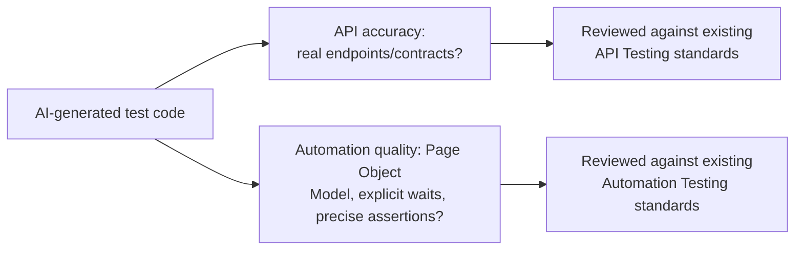

# AI-Assisted API and Automation Authoring

**Prerequisites**: You should already have completed [AI-Assisted Test Data Creation](/learning-paths/ai-for-qa/ai-assisted-test-data-creation).
**Leads to**: After this, you'll be ready for [AI-Assisted Defect Analysis and Exploratory Testing](/learning-paths/ai-for-qa/ai-assisted-defect-analysis-and-exploratory-testing).

AI can draft an API test script or an automation test in seconds, syntactically correct and immediately runnable. This module isn't about a new framework or a new way of writing automation — it's about reviewing AI-generated code against the exact standards [API Testing](/learning-paths/api-testing/what-is-api-testing) and [Automation Testing](/learning-paths/automation/introduction-to-automation-testing) already established, since AI-generated code is exactly as capable of violating those standards as human-written code, in ways that are easy to miss when the code runs successfully.

## Why This Matters

**A team that accepts AI-generated automation code as-is.** A tester asks an AI tool to draft an automation script for AtlasBank's login flow. The generated script runs successfully in testing — it logs in, confirms the dashboard loads, and passes. Buried in the generated code is a `Thread.sleep(3000)` between the login submission and the dashboard check — a hardcoded pause, not the explicit wait [Synchronization and Wait Strategies](/learning-paths/automation/synchronization-and-wait-strategies) established as the correct pattern. The script works today, in the current environment, where the actual wait happens to complete faster than three seconds. It becomes a genuinely flaky test the moment real-world timing varies even slightly — exactly the anti-pattern that module already taught testers to avoid, now silently reintroduced by AI-generated code nobody checked against that specific standard.

**A team that reviews AI-generated code against existing standards.** A different tester, applying a specific review step before merging any AI-generated automation code, checks it against [Synchronization and Wait Strategies](/learning-paths/automation/synchronization-and-wait-strategies)'s own established pattern — explicit waits, never hardcoded pauses. The `Thread.sleep(3000)` is flagged immediately and replaced with a proper explicit wait for the dashboard's actual load-complete condition, closing the exact flakiness risk the unreviewed version would have reintroduced.

Both testers received the identical AI-generated script. Only one of them checked it against the team's own already-established, hard-won automation standards — not because the AI wrote obviously bad code, but because AI-generated code can violate a specific, known-important standard while still running successfully today.

## Two Review Surfaces, Two Existing Standards

**API accuracy**, reviewed against [API Testing](/learning-paths/api-testing/what-is-api-testing)'s own standards: does the generated script reference real, currently-documented endpoints, headers, and payload shapes — the same hallucination check [Reviewing AI Output and Recognizing Hallucinations](/learning-paths/ai-for-qa/reviewing-ai-output-and-recognizing-hallucinations)'s own fabricated-endpoint example described, applied here specifically to API test scripts.

**Automation quality**, reviewed against [Automation Testing](/learning-paths/automation/introduction-to-automation-testing)'s own established standards: does the generated code follow [Page Object Model](/learning-paths/automation/page-object-model) structure rather than inline, unmaintainable locators; does it use [Synchronization and Wait Strategies](/learning-paths/automation/synchronization-and-wait-strategies)'s explicit-wait pattern rather than hardcoded pauses; does it assert with [Assertions and Verification Strategies](/learning-paths/automation/assertions-and-verification-strategies)'s precision (exact values, not just presence) rather than a weaker, easier-to-generate check.

| Review Area | What to Check | Existing Standard |
|---|---|---|
| API endpoint/contract accuracy | Does every referenced endpoint/field actually exist? | [API Testing](/learning-paths/api-testing/what-is-api-testing), [Reviewing AI Output](/learning-paths/ai-for-qa/reviewing-ai-output-and-recognizing-hallucinations) |
| Structural pattern | Page Object Model, not inline locators | [Page Object Model](/learning-paths/automation/page-object-model) |
| Timing | Explicit waits, not hardcoded pauses | [Synchronization and Wait Strategies](/learning-paths/automation/synchronization-and-wait-strategies) |
| Assertion precision | Exact expected values, not just presence checks | [Assertions and Verification Strategies](/learning-paths/automation/assertions-and-verification-strategies) |

## Why AI-Generated Code Tends to Default Toward the Weaker Pattern

AI-generated automation code, drafted without explicit instruction to follow a specific project's conventions, tends to produce generic, widely-common patterns — and a hardcoded `sleep()` or a loosely-worded "element exists" assertion are both extremely common in general automation code across the internet, which is exactly the kind of pattern an AI tool trained broadly is likely to reproduce by default. This isn't a flaw specific to AI — it's the same reason [Common Mistakes in Test Automation](/learning-paths/automation/common-mistakes-in-test-automation) named hardcoded waits and weak assertions as *the* two most common automation anti-patterns in the first place. AI-generated code doesn't introduce a new risk; it reproduces an old, well-documented one at higher volume and speed, which is exactly why the review step matters more, not less.

## How This Works on a Real Project

AtlasBank's automation team, reviewing an AI-generated script for the fund-transfer confirmation flow, applies both review surfaces from this module. The API-accuracy check confirms every referenced endpoint matches the real, documented transfer API — clean on this pass. The automation-quality check finds two issues: a hardcoded three-second pause after the transfer submission (the exact anti-pattern this module's opening scenario describes), and an assertion checking only that a confirmation *element exists* on the page, not that it displays the *correct* transfer amount — the same weak-assertion gap [Assertions and Verification Strategies](/learning-paths/automation/assertions-and-verification-strategies) already warned against.

Both issues are fixed before the script is merged: the hardcoded pause replaced with an explicit wait for the confirmation's actual load-complete state, and the assertion tightened to check the exact confirmed amount against the submitted one. The fixed version catches a real, previously undetected rounding defect in the confirmation display during the team's next test run — a defect the original, AI-generated "element exists" assertion could never have caught, regardless of how it was reviewed for anything else.

## Common Mistakes

**Mistake 1: Merging AI-generated automation code because it runs successfully, without checking it against known-important standards.**
This module's opening scenario and its AtlasBank example both hinge on exactly this — code that runs today can still violate a standard that makes it fragile or weak in ways that only show up later.

**Mistake 2: Reviewing AI-generated code for general readability but not against the team's specific, established conventions.**
Readable code and code that follows Page Object Model, explicit-wait, and precise-assertion standards are different properties — reviewing for one doesn't confirm the other.

**Mistake 3: Assuming AI-generated code is less likely to contain known automation anti-patterns because it's "professionally" generated.**
Per this module's own reasoning, AI-generated code is exactly as likely — arguably more likely by default — to reproduce common, well-documented anti-patterns like hardcoded waits and weak assertions.

**Mistake 4: Checking API accuracy but skipping the separate automation-quality review, or vice versa.**
These are two distinct review surfaces catching two distinct problem classes — checking only one leaves the other's risk unaddressed.

## Best Practices

**Practice 1: Review AI-generated automation code against your project's specific, established standards explicitly — Page Object Model, explicit waits, precise assertions.**
This is the exact practice that caught both real issues in AtlasBank's fund-transfer example.

**Practice 2: Treat hardcoded waits and weak assertions as the first two things to check in any AI-generated automation code.**
Per [Common Mistakes in Test Automation](/learning-paths/automation/common-mistakes-in-test-automation)'s own findings, these are the most common anti-patterns generally — and AI-generated code has no special immunity to reproducing them.

**Practice 3: Verify every API endpoint and contract detail in generated scripts against real, current documentation.**
The same hallucination-recognition habit from [Reviewing AI Output and Recognizing Hallucinations](/learning-paths/ai-for-qa/reviewing-ai-output-and-recognizing-hallucinations), applied specifically to generated test code.

**Practice 4: Re-run the fixed version of any corrected AI-generated script to confirm the fix actually improved coverage, not just style.**
The AtlasBank example's tightened assertion didn't just look more correct — it caught a real, previously invisible defect, confirming the fix had genuine value beyond following convention.

:::note From the Field
A logistics company's engineering team used AI to generate a batch of API automation tests for a shipment-tracking service. The generated tests all asserted only that each API call returned a 200 status code, never checking the actual response body content — a common, generic pattern for quickly-generated API tests. A production incident where the tracking API began returning 200 responses with empty or malformed tracking data went completely undetected by this test suite for weeks, since every test technically "passed" by the only standard it actually checked.
:::

:::tip Senior QA Insight
A newer tester reviews AI-generated automation code by confirming it runs and passes. A senior tester reviews it the same way they'd review a teammate's pull request against the team's actual, hard-won standards — checking specifically for the anti-patterns (hardcoded waits, weak assertions, unverified endpoints) the team has already learned, the hard way, to watch for.
:::

## Mini Challenge

**Scenario**: An AI tool generates an automation script for AtlasBank's beneficiary-deletion flow, including the line `driver.findElement(By.id("confirm-btn")).click(); Thread.sleep(2000); assert driver.findElement(By.className("success-message")).isDisplayed();`

**Your task**: Identify the specific issues in this generated code against this module's two review surfaces, and describe what each corrected version should look like instead.

## Key Takeaways

- AI-generated API and automation code is reviewed against the exact same standards already established — Page Object Model, explicit waits, precise assertions, real endpoint accuracy — not a new set of criteria.
- AI-generated code tends to default toward common, generic patterns, which frequently means reproducing well-documented anti-patterns like hardcoded waits and weak assertions.
- Code that runs successfully today can still violate a known-important standard that makes it fragile or weak — passing is not the same as following convention.
- API-accuracy review and automation-quality review are two distinct checks, both needed, catching two distinct problem classes.

---

## What You Just Learned

- How to review AI-generated API and automation code against existing, established standards rather than accepting it because it runs
- Why AI-generated code tends to default toward common automation anti-patterns like hardcoded waits and weak assertions
- The two distinct review surfaces this kind of code needs: API accuracy and automation quality
- How AtlasBank's automation team caught both a hardcoded pause and a weak assertion in AI-generated code, and how the fixed version caught a real, previously invisible defect

**Next:** [AI-Assisted Defect Analysis and Exploratory Testing](/learning-paths/ai-for-qa/ai-assisted-defect-analysis-and-exploratory-testing)

## Related Topics

- [Synchronization and Wait Strategies](/learning-paths/automation/synchronization-and-wait-strategies) — The explicit-wait standard this module checks AI-generated code against
- [Assertions and Verification Strategies](/learning-paths/automation/assertions-and-verification-strategies) — The precise-assertion standard this module's AtlasBank example applies
- [Common Mistakes in Test Automation](/learning-paths/automation/common-mistakes-in-test-automation) — The exact anti-patterns this module identifies AI-generated code as prone to reproducing

## Interview Questions

**Q1: What would you specifically check before merging an AI-generated automation test into your suite?**

*What to look for*: A candidate who names specific, established standards — Page Object Model structure, explicit waits over hardcoded pauses, precise assertions over presence checks, real endpoint verification — not a vague "I'd review it carefully."

:::note Common Interview Mistake
Many candidates say they'd "test that it passes" as their main verification step for AI-generated automation code, without recognizing that a passing test can still contain known anti-patterns (hardcoded waits, weak assertions) that make it fragile or ineffective. A strong answer explicitly separates "does it run" from "does it follow our established quality standards."
:::

**Q2: Why might AI-generated automation code be more likely to contain a hardcoded wait than to use a proper explicit wait?**

*What to look for*: A candidate who explains that AI tends to reproduce common, widely-seen patterns by default, and that hardcoded waits are extremely common in general automation code — the same reason this anti-pattern was already well-documented before AI-assisted authoring existed at all.

---

## Glossary

No new terms are introduced in this module — every concept used above is defined in its linked source module.

## Quick Revision

Remember these five points:

✓ Review AI-generated API/automation code against existing standards — Page Object Model, explicit waits, precise assertions, real endpoint accuracy.

✓ AI-generated code tends to default toward common, generic patterns, often reproducing well-documented anti-patterns.

✓ Code that runs successfully today can still violate a known-important standard, becoming fragile later.

✓ API-accuracy review and automation-quality review are two distinct, both-necessary checks.

✓ Re-run a corrected script to confirm the fix improved actual coverage, not just style.
