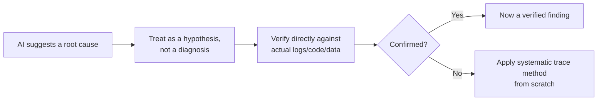

# AI-Assisted Defect Analysis and Exploratory Testing

**Prerequisites**: You should already have completed [AI-Assisted API and Automation Authoring](/learning-paths/ai-for-qa/ai-assisted-api-and-automation-authoring).
**Leads to**: After this, you'll be ready for [Section 2 Review](/learning-paths/ai-for-qa/section-2-review), then Section 3 — Testing AI-Driven Features.

This module closes Section 2 with two of AI's most tempting, and most risk-prone, applications: suggesting why a defect happened, and suggesting where to explore next. Both are genuinely useful as a *starting point* — and both are exactly the kind of confident-sounding, unverified claim [Reviewing AI Output and Recognizing Hallucinations](/learning-paths/ai-for-qa/reviewing-ai-output-and-recognizing-hallucinations) already warned about if trusted without verification.

## Why This Matters

**A team that trusts an AI-suggested root cause.** A tester, investigating why an AtlasBank fund-transfer request intermittently fails, feeds the error stack trace to an AI tool. The AI suggests a plausible, technically detailed explanation: a race condition in the transfer confirmation handler. The explanation reads confidently and uses the right terminology — the tester passes it directly to the development team as the likely cause. Two days of investigation into the confirmation handler find nothing, because the actual cause, eventually found through [Database Defect Investigation](/learning-paths/database-testing/database-defect-investigation)'s systematic trace chain, is an unrelated connection-pool timeout at the data layer — a completely different part of the system the AI's plausible-sounding suggestion never pointed toward.

**A team that treats the AI suggestion as a hypothesis.** A different tester, receiving the identical AI-suggested race-condition explanation, treats it exactly as [Reviewing AI Output and Recognizing Hallucinations](/learning-paths/ai-for-qa/reviewing-ai-output-and-recognizing-hallucinations) recommends for any confidently-stated claim — verify it directly, don't act on it. A quick check of the confirmation handler's actual logs shows no evidence of the suggested race condition at all. Rather than escalating a wrong lead, the tester applies [Database Defect Investigation](/learning-paths/database-testing/database-defect-investigation)'s own systematic trace from scratch, reaching the real connection-pool cause directly — without ever losing two days chasing a plausible-sounding dead end.

Both testers received the identical AI suggestion. Only one of them treated it as what it actually was — an unverified hypothesis, not a diagnosis — before acting on it.

## AI-Assisted Defect Triage: A Hypothesis, Not a Diagnosis

AI is genuinely useful for **generating a starting hypothesis** from a stack trace or log excerpt — summarizing what an error message technically indicates, or suggesting a plausible category of cause based on similar patterns. It is not a substitute for the systematic verification [Database Defect Investigation](/learning-paths/database-testing/database-defect-investigation) and [Performance Defect Investigation](/learning-paths/performance-testing/performance-defect-investigation) both already established: confirm any suggested cause against the actual logs, code, or data, before treating it as the answer rather than a starting point.

## AI-Assisted Exploratory Testing: A Starting List, Not a Session

AI can suggest exploratory testing charters — plausible areas to probe, based on a feature's description — genuinely useful for generating a starting list when a tester isn't sure where to begin. What AI cannot do is the actual value [Exploratory Testing Fundamentals](/learning-paths/manual-testing/exploratory-testing-fundamentals) and [AI in Software Testing](/learning-paths/ai-for-qa/ai-in-software-testing) both already identified as distinctly human: noticing something unexpected *during* a session that nobody, including the AI generating a charter list in advance, thought to ask about. An AI-suggested charter list is a reasonable starting point for session structure — it is not, and cannot be, a substitute for the discovery that happens once a human is actually exploring.

| Use | What AI Provides | What Still Requires a Human |
|---|---|---|
| Defect triage | A plausible starting hypothesis from a stack trace/log | Verification against real logs/code/data before trusting it |
| Exploratory testing | A starting list of charters/areas to probe | The actual, in-session discovery of something unexpected |

## How This Works on a Real Project

Following this module's opening scenario, AtlasBank's QA team, having learned to treat AI-suggested root causes as hypotheses, applies the same discipline to exploratory testing for a newly redesigned loan-application screen. An AI tool suggests a reasonable starting charter list: test form validation, test file upload behavior, test navigation between steps.

A tester uses this list as a genuine starting point — but during the file-upload charter session, notices something the list never mentioned: submitting the form twice in quick succession (a real, plausible user action nobody explicitly charted for) creates two duplicate loan applications instead of one. This is exactly the kind of discovery [Exploratory Testing Fundamentals](/learning-paths/manual-testing/exploratory-testing-fundamentals) describes — a human noticing an unanticipated condition mid-session, not following a pre-generated list. The AI-suggested charters got the session started productively; the actual, valuable finding came from the human exploring, not from anything the AI had suggested to look for.

## Common Mistakes

**Mistake 1: Passing an AI-suggested root cause to a development team without independent verification.**
This module's opening scenario cost two real days of misdirected investigation, exactly the risk [Reviewing AI Output and Recognizing Hallucinations](/learning-paths/ai-for-qa/reviewing-ai-output-and-recognizing-hallucinations) already warned about for confidently-stated wrong explanations.

**Mistake 2: Treating an AI-generated exploratory charter list as a complete session plan rather than a starting point.**
The AtlasBank duplicate-application defect was found specifically *outside* what the AI-suggested list covered — treating the list as complete would have meant stopping before the real discovery.

**Mistake 3: Assuming a technically detailed AI explanation is more likely to be correct than a vaguer one.**
Per [Reviewing AI Output and Recognizing Hallucinations](/learning-paths/ai-for-qa/reviewing-ai-output-and-recognizing-hallucinations), technical detail and confident phrasing are not evidence of accuracy — a wrong explanation can be exactly as detailed as a right one.

**Mistake 4: Skipping exploratory testing sessions entirely because an AI-generated charter list feels sufficient on its own.**
This directly contradicts [AI in Software Testing](/learning-paths/ai-for-qa/ai-in-software-testing)'s own established distinction — genuine exploratory discovery is specifically outside what AI can substitute for.

## Best Practices

**Practice 1: Treat every AI-suggested root cause as a hypothesis requiring direct verification, using the systematic trace methods already taught.**
[Database Defect Investigation](/learning-paths/database-testing/database-defect-investigation) and [Performance Defect Investigation](/learning-paths/performance-testing/performance-defect-investigation) both already provide the actual verification method — apply it, don't skip straight to trusting the AI's suggestion.

**Practice 2: Use AI-generated exploratory charters as a starting point for session structure, not a ceiling on what gets explored.**
The AtlasBank duplicate-application example's real value came from exploring beyond the suggested list, not from following it exactly.

**Practice 3: Don't weight an AI explanation's credibility by how technically detailed or confident it sounds.**
This is the same discipline [Reviewing AI Output and Recognizing Hallucinations](/learning-paths/ai-for-qa/reviewing-ai-output-and-recognizing-hallucinations) established generally, applied specifically to defect triage.

**Practice 4: Keep dedicated exploratory testing sessions in the process even when AI tooling is heavily used elsewhere.**
Exploratory testing's value is structurally distinct from anything AI assistance provides — it doesn't get replaced by better AI tooling anywhere else in the workflow.

:::note From the Field
A payments company's on-call engineer, investigating an urgent production incident, asked an AI tool to analyze an error log and received a confident, detailed explanation pointing to a specific third-party payment gateway timeout as the cause. The team spent the first critical hour of the incident contacting the payment gateway's support team and reviewing gateway-side dashboards, based on the AI's suggestion — before a team member, applying direct log verification instead of continuing to trust the explanation, found the actual cause was an internal certificate expiration, unrelated to the payment gateway entirely, visible in the same logs the AI had already analyzed but described incorrectly.
:::

:::tip Senior QA Insight
A newer tester treats an AI-suggested root cause as the likely answer, worth acting on directly. A senior tester treats it as one unverified lead among possibly several, worth investigating quickly — but never worth escalating or acting on until it's actually confirmed against the real logs, code, or data, the same standard applied to any other unverified claim.
:::

## Mini Challenge

**Scenario**: An AI tool, given a stack trace from a failing AtlasBank API test, suggests the cause is "a null pointer exception due to an unhandled missing authentication token."

**Your task**: Describe the specific verification steps you'd take before accepting this explanation, referencing this path's and this project's own systematic investigation methods.

## Key Takeaways

- An AI-suggested root cause is a starting hypothesis, not a diagnosis — always verify it directly against real logs, code, or data before acting on it.
- AI-generated exploratory testing charters are a useful starting point for session structure, not a substitute for the in-session, human discovery exploratory testing's actual value depends on.
- Technical detail and confident phrasing in an AI explanation are not evidence of correctness — the same principle from hallucination recognition applies directly to defect triage.
- Dedicated exploratory testing sessions remain essential even with heavy AI tool usage elsewhere, since AI structurally cannot replace genuine, unanticipated discovery.

---

## What You Just Learned

- Why an AI-suggested root cause needs direct verification before being trusted or escalated
- How AI-generated exploratory testing charters function as a useful starting point, not a complete session plan
- Why a technically detailed, confident AI explanation is no more trustworthy than a vaguer one without verification
- How AtlasBank's QA team found a real duplicate-application defect specifically by exploring beyond an AI-suggested charter list

**Next:** [Section 2 Review](/learning-paths/ai-for-qa/section-2-review)

## Related Topics

- [Database Defect Investigation](/learning-paths/database-testing/database-defect-investigation) and [Performance Defect Investigation](/learning-paths/performance-testing/performance-defect-investigation) — The systematic verification methods this module applies to check any AI-suggested root cause
- [Exploratory Testing Fundamentals](/learning-paths/manual-testing/exploratory-testing-fundamentals) — The distinctly human discovery skill this module confirms AI cannot substitute for
- [Reviewing AI Output and Recognizing Hallucinations](/learning-paths/ai-for-qa/reviewing-ai-output-and-recognizing-hallucinations) — The core recognition habit this module applies specifically to root-cause suggestions

## Interview Questions

**Q1: An AI tool suggests a root cause for a defect you're investigating. What would you do next?**

*What to look for*: A candidate who describes treating the suggestion as an unverified hypothesis and checking it directly against real logs, code, or data — not passing it along or acting on it without independent confirmation.

:::note Common Interview Mistake
Many candidates describe using an AI-suggested root cause as their primary investigation path without describing a verification step, especially if the explanation sounds technically plausible. A strong answer explicitly separates "AI suggested this" from "I confirmed this," and describes the specific verification method used.
:::

**Q2: Can AI replace exploratory testing? Why or why not?**

*What to look for*: A candidate who explains that AI can suggest a useful starting charter list but cannot replace the actual, in-session human discovery of something unanticipated — recognizing this as a structural limitation, not a current tooling gap likely to close with better AI.

---

## Glossary

No new terms are introduced in this module — every concept used above is defined in its linked source module.

## Quick Revision

Remember these five points:

✓ An AI-suggested root cause is a hypothesis requiring direct verification — never a diagnosis to act on directly.

✓ AI-generated exploratory charters are a useful starting point, not a complete session plan.

✓ Technical detail and confidence in an AI explanation are not evidence it's correct.

✓ Use existing systematic trace methods (Database/Performance Defect Investigation) to verify any AI-suggested cause.

✓ Dedicated exploratory testing sessions remain essential — AI cannot replace genuine, in-session human discovery.
