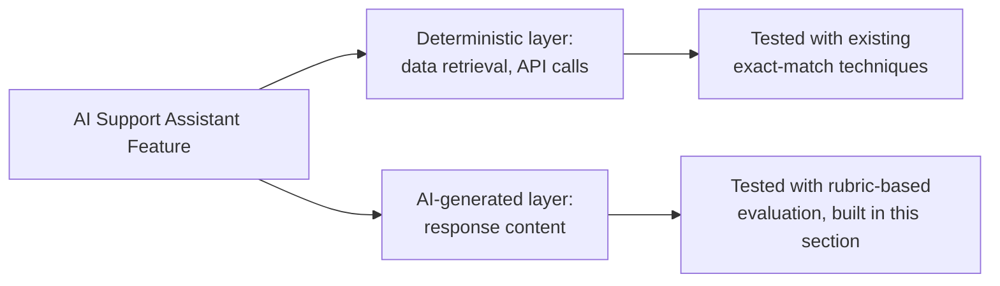

# Testing AI-Driven Features

**Prerequisites**: You should already have completed [Section 2 Review](/learning-paths/ai-for-qa/section-2-review) and Section 2 in full.
**Leads to**: After this, you'll be ready for [Prompt Testing and Evaluation](/learning-paths/ai-for-qa/prompt-testing-and-evaluation).

Sections 1–2 taught using AI to accelerate testing *other* features. This section shifts to testing AI itself as a feature — starting with AtlasBank's own AI Support Assistant, a customer-support tool scoped specifically to transaction questions, card support, loan FAQs, KYC guidance, account information, and payment help. This module makes the single distinction the rest of this section depends on: a deterministic software defect and an AI quality issue are genuinely different problem classes, and testing an AI feature like a deterministic one misses exactly the defects specific to it.

## Why This Matters

**A team that tests an AI feature like a deterministic one.** AtlasBank's QA team tests the AI Support Assistant's "what's my loan status?" question the way they'd test any other feature — submit the input, assert the exact expected output string, mark pass or fail. The test passes once, then starts "failing" on the next run, and the run after that, even though nothing about the underlying loan-status data or the API it calls has changed — because the Assistant phrases a functionally identical, factually correct answer slightly differently each time it's asked. The team, confused by results that don't behave like any deterministic test they've worked with before, either abandons testing the Assistant's responses entirely or keeps "fixing" a test that was never actually broken.

**A team that recognizes the different problem class.** A different QA process tests the same question but separates two things explicitly: whether the underlying data retrieval is correct (a deterministic check — did the Assistant call the right API and retrieve the right loan record, testable with the exact-match precision [Assertions and Verification Strategies](/learning-paths/automation/assertions-and-verification-strategies) already established) from whether the *generated response* is accurate, complete, and appropriately toned (an AI-quality check, needing a rubric-based evaluation rather than an exact-match assertion, since correct phrasing can legitimately vary run to run). The retrieval check runs cleanly, every time, as a normal deterministic test. The response-quality check uses a different method entirely — one this section builds starting with the next module.

Both teams tested the same feature. Only one of them recognized that "the AI Support Assistant" is actually two different testing surfaces layered together, each needing its own approach.

## Two Different Problem Classes, Not One

A **deterministic software defect** is a defect in the traditional sense every prior TestAtlas path already taught how to find: a wrong API response, an incorrect database update, a missing validation, a performance bottleneck. Given the same input and the same system state, the defect reproduces the same way every time — the entire foundation [Writing Effective Bug Reports](/learning-paths/manual-testing/writing-effective-bug-reports)'s reproducibility discipline depends on.

An **AI quality issue** is a different kind of problem, specific to AI-generated output: a hallucination (per [Reviewing AI Output and Recognizing Hallucinations](/learning-paths/ai-for-qa/reviewing-ai-output-and-recognizing-hallucinations), now applied to a shipped feature's own output rather than a QA tool's), prompt sensitivity (the same underlying question, phrased slightly differently, producing a meaningfully different quality of answer), inconsistent responses (the same exact input producing different, sometimes contradictory, output across repeated runs), bias, safety failures, and grounding failures (a response not actually anchored in real, retrieved data). These often don't reproduce identically run to run, and "correct" isn't always a binary pass/fail the way a deterministic assertion expects.

| | Deterministic Software Defect | AI Quality Issue |
|---|---|---|
| **Examples** | Wrong API response, incorrect database update, missing validation, performance bottleneck | Hallucination, prompt sensitivity, inconsistent responses, bias, safety failures, grounding failures |
| **Reproducibility** | Same input + same state → same result, every time | Can vary run to run, even with identical input |
| **Evaluation** | Exact-match assertion — pass or fail against a known-correct value | Rubric-based evaluation — accuracy, completeness, tone, appropriateness, scored rather than binary |
| **Where it's tested** | Every prior TestAtlas path's own established techniques apply directly | New evaluation strategy, built starting with the next two modules |

## The AtlasBank AI Support Assistant: This Section's System Under Test

The AI Support Assistant is deliberately, permanently scoped to six question categories: transaction questions, card support, loan FAQs, KYC guidance, account information, and payment help. It is not, and never becomes, a general-purpose chatbot — every example in this section stays within these categories, the same way every AtlasBank feature exists to illustrate a testing concept, not to be a product in its own right.

## How This Works on a Real Project

AtlasBank's QA team, applying this module's distinction to the Assistant's "check my card's daily spending limit" question, separates their test plan into two explicit tracks. The deterministic track verifies: does the Assistant correctly call the card-limits API, does it correctly identify the right card for the authenticated customer, does it correctly handle a customer with multiple cards — all testable with the same exact-match precision the team already applies everywhere else, and all genuinely reproducible defects if something's wrong.

The AI-quality track asks a different question: when the underlying data is correct, does the Assistant's *generated response* actually state the right limit clearly, without hedging language that makes the number ambiguous, and without occasionally omitting the limit entirely in favor of a vaguer, unhelpful answer — a real pattern the team observes across repeated identical queries, with the same correct underlying data producing a genuinely correct response most of the time and a vaguer, less useful one occasionally. This is not a deterministic defect (the retrieval and API layer worked correctly every time) — it's an AI quality issue in the generated response itself, and the team's plan explicitly tracks it separately, using the evaluation approach [Prompt Testing and Evaluation](/learning-paths/ai-for-qa/prompt-testing-and-evaluation) (next) provides.

## Common Mistakes

**Mistake 1: Testing an AI-generated response with an exact-match assertion.**
This module's opening scenario's entire failure traces to this — expecting deterministic reproducibility from a layer that doesn't provide it produces a test that "fails" for reasons that aren't actual defects.

**Mistake 2: Concluding an AI feature "can't be tested" after a deterministic-style test produces confusing, inconsistent results.**
The first team in this module's opening scenario nearly reached this conclusion — the actual problem was the test *method*, not the feature's fundamental testability.

**Mistake 3: Treating every quality problem in an AI feature as the same kind of issue.**
The AtlasBank spending-limit example specifically separates a deterministic retrieval concern from an AI-quality response concern — conflating them means applying the wrong fix to the wrong layer.

**Mistake 4: Expanding the AI Support Assistant's scope informally to test a broader range of questions than its documented six categories.**
Per this path's approved scope, the Assistant stays within transaction questions, card support, loan FAQs, KYC guidance, account information, and payment help — testing outside that scope tests a feature that doesn't actually exist.

## Best Practices

**Practice 1: Separate every AI-feature test plan into a deterministic track and an AI-quality track explicitly.**
This is the single practice that turned AtlasBank's confusing, inconsistent test results into two clear, correctly-diagnosed findings.

**Practice 2: Apply existing TestAtlas techniques directly to the deterministic layer of any AI feature.**
Data retrieval, API calls, and database updates behind an AI feature are still fully deterministic and testable with everything this project already teaches — nothing new is needed there.

**Practice 3: Recognize inconsistency across repeated identical inputs as a signal to check the AI-quality track, not the deterministic one.**
If the same input and same underlying data produce genuinely different results, the deterministic layer is very unlikely to be the cause.

**Practice 4: Keep every AI Support Assistant example and test within its documented six-category scope.**
This keeps the curriculum's own system under test consistent and prevents scope drift into an undocumented, informally-expanded feature.

:::note From the Field
A travel booking company's QA team, testing a new AI-powered itinerary assistant, initially filed dozens of "defect" tickets when the assistant's phrasing of flight recommendations varied between test runs against identical search criteria — treating each variation as a reproducibility failure the way any other software bug would be treated. A senior engineer reviewing the ticket backlog recognized none of these were actual defects: the underlying flight data and ranking logic were correct and consistent every time; only the natural-language *phrasing* of the response varied, a normal property of the AI-generation layer that needed a completely different evaluation approach, not a bug-fix process.
:::

:::tip Senior QA Insight
A newer tester, encountering an AI feature that produces different output for the same input, assumes something is broken. A senior tester's first move is diagnostic, not corrective — checking whether the *underlying data and logic* stayed consistent (a deterministic-layer question) before concluding anything about the *generated response* itself (an AI-quality-layer question), because the two require completely different next steps.
:::

## Mini Challenge

**Scenario**: A tester finds that the AI Support Assistant, asked "what documents do I need for KYC verification?" twice in a row, gives two answers that list a slightly different set of documents each time.

**Your task**: Describe how you'd determine whether this is a deterministic defect (e.g., the underlying KYC-requirements data itself is inconsistent) or an AI quality issue (e.g., the data is consistent but the generated response varies) — and what you'd check first.

## Key Takeaways

- Deterministic software defects (wrong data, wrong API calls) and AI quality issues (hallucination, inconsistency, bias, safety) are genuinely different problem classes, needing different evaluation strategies.
- A deterministic defect reproduces identically given the same input and state; an AI quality issue can vary even with identical input, and isn't always a binary pass/fail.
- Every AI-driven feature has (at least) two testing layers: a deterministic layer, testable with existing TestAtlas techniques, and an AI-generation layer, needing the rubric-based evaluation this section builds.
- The AtlasBank AI Support Assistant stays within its documented six-category scope in every example and test — never a general-purpose chatbot.

---

## What You Just Learned

- Why deterministic software defects and AI quality issues are different problem classes requiring different testing strategies
- How to separate an AI feature's deterministic layer from its AI-generation layer in a test plan
- The AtlasBank AI Support Assistant's documented, permanent scope: transaction questions, card support, loan FAQs, KYC guidance, account information, payment help
- How AtlasBank's QA team correctly diagnosed a spending-limit response issue as an AI-quality concern, not a deterministic retrieval defect

**Next:** [Prompt Testing and Evaluation](/learning-paths/ai-for-qa/prompt-testing-and-evaluation)

## Related Topics

- [Reviewing AI Output and Recognizing Hallucinations](/learning-paths/ai-for-qa/reviewing-ai-output-and-recognizing-hallucinations) — The recognition skill this module applies to a shipped feature's own output, not just QA-tool output
- [Assertions and Verification Strategies](/learning-paths/automation/assertions-and-verification-strategies) — The exact-match precision this module confirms still applies directly to an AI feature's deterministic layer
- [Prompt Testing and Evaluation](/learning-paths/ai-for-qa/prompt-testing-and-evaluation) — Where this module's AI-quality track gets an actual, structured evaluation method

## Interview Questions

**Q1: How is testing an AI-driven feature different from testing a traditional, deterministic feature?**

*What to look for*: A candidate who explains that an AI feature has two layers — a deterministic layer (still testable with standard techniques) and an AI-generation layer (needing rubric-based evaluation, since output can legitimately vary run to run) — not a vague "AI is harder to test" without naming the actual structural reason.

:::note Common Interview Mistake
Many candidates describe AI features as simply "unpredictable" or "hard to test" without separating which specific layer is actually non-deterministic. A strong answer explicitly distinguishes the deterministic data/logic layer from the AI-generated response layer, and explains that only the second needs a fundamentally different evaluation approach.
:::

**Q2: A test asserting an exact string match against an AI-generated response keeps failing inconsistently. What's your first diagnostic step?**

*What to look for*: A candidate who checks whether the underlying data and logic are actually consistent first, before concluding the AI response itself is the problem — recognizing that exact-match assertions are simply the wrong tool for testing generated response content, not evidence of an underlying defect.

---

## Glossary

**Deterministic Software Defect**: A defect that reproduces identically given the same input and system state — a wrong API response, an incorrect database update, a missing validation, a performance bottleneck.

**AI Quality Issue**: A problem specific to AI-generated output — hallucination, prompt sensitivity, inconsistent responses, bias, safety failures, or grounding failures — that can vary even with identical input and isn't always a binary pass/fail.

## Quick Revision

Remember these five points:

✓ Deterministic defects and AI quality issues are different problem classes needing different evaluation strategies.
✓ A deterministic defect reproduces identically; an AI quality issue can vary even with identical input.
✓ Every AI-driven feature has a deterministic layer (existing techniques apply) and an AI-generation layer (needs rubric-based evaluation).
✓ Inconsistent results from an exact-match assertion against AI output usually mean the wrong test method, not necessarily a real defect.
✓ The AtlasBank AI Support Assistant stays within its documented six-category scope in every example — never a general-purpose chatbot.
