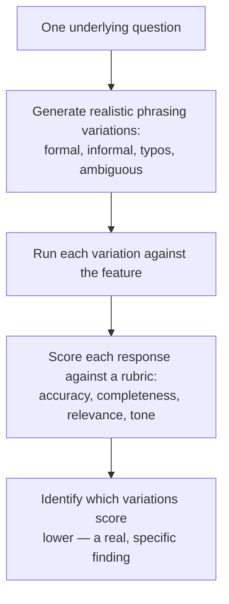

# Prompt Testing and Evaluation

**Prerequisites**: You should already have completed [Testing AI-Driven Features](/learning-paths/ai-for-qa/testing-ai-driven-features).
**Leads to**: After this, you'll be ready for [Hallucinations, Bias, Safety, and Reliability](/learning-paths/ai-for-qa/hallucinations-bias-safety-and-reliability).

[Testing AI-Driven Features](/learning-paths/ai-for-qa/testing-ai-driven-features) established that an AI feature's generated-response layer needs a different evaluation approach than an exact-match assertion. This module builds that approach in two parts: testing across realistic *input* variation (prompt testing), and scoring the resulting *output* with a structured rubric (evaluation) — together, the AI-quality-layer equivalent of what [Boundary Value Analysis](/learning-paths/manual-testing/boundary-value-analysis) and [Assertions and Verification Strategies](/learning-paths/automation/assertions-and-verification-strategies) already provide for deterministic testing.

## Why This Matters

**A team that tests one clean phrasing.** AtlasBank's QA team tests the AI Support Assistant's loan-status question using one clean, well-formed phrasing: "What is my current loan status?" The response is accurate, complete, and clearly worded — the team marks this capability verified. In production, real customers ask the same underlying question dozens of different ways — "loan status??", "hey is my loan approved yet", "can u tell me about my loan pls" — and a meaningful share of these informally-phrased, real-world variations produce noticeably worse responses: vaguer, missing key details, occasionally misunderstanding the question entirely. The single clean test case never had any chance of catching this, because it never tested anything resembling how the feature is actually used.

**A team that tests across realistic variation.** A different QA process tests the identical underlying question across a deliberately varied set of realistic phrasings — formal, informal, containing typos, ambiguously worded — the same way [Boundary Value Analysis](/learning-paths/manual-testing/boundary-value-analysis) tests at the edges of an input range rather than only its comfortable middle. Each response is scored against a structured rubric (accuracy, completeness, relevance, tone) rather than a binary pass/fail. The informally-phrased variations reveal a real, specific gap: responses to typo-containing or very casual phrasing score noticeably lower on accuracy, caught before real customers using exactly that phrasing style experience it.

Both teams tested "the loan status question." Only one of them tested it the way it's actually going to be asked, and scored the result with a method suited to genuinely varying, non-binary output.

## Prompt Testing: Realistic Input Variation

The same principle that makes [Boundary Value Analysis](/learning-paths/manual-testing/boundary-value-analysis) effective — testing at the edges, not just the comfortable middle — applies directly to prompt testing: the "edges" of an AI feature's input space are realistic variations in how a real user actually phrases a question, not just the one clean, well-formed version a tester might naturally write first.

**Phrasing variation**: formal vs. informal, complete sentences vs. fragments.

**Typos and imprecise language**: real users make typos and use imprecise terms; a robust feature should degrade gracefully, not catastrophically.

**Ambiguity**: a question that could reasonably mean two different things — does the response ask for clarification appropriately, or confidently guess wrong?

**Multi-part questions**: a single message asking about two different things at once (per this path's scope, staying within the Assistant's six categories — e.g., a card and a loan question together).

## Evaluation: A Structured Rubric, Not Pass/Fail

Because AI-generated output isn't reliably binary-correct the way a deterministic assertion expects, evaluation uses a **rubric** — named dimensions, each scored, rather than a single pass/fail verdict. This is the concept behind AI evaluation frameworks like DeepEval or RAGAS-style approaches: structured, repeatable scoring criteria, not a single tool this path treats as canonical — the same concept-first framing [Performance Testing Tools](/learning-paths/performance-testing/performance-testing-tools) already applied to JMeter.

| Rubric Dimension | What It Scores |
|---|---|
| **Accuracy** | Is the factual content correct, per [Reviewing AI Output and Recognizing Hallucinations](/learning-paths/ai-for-qa/reviewing-ai-output-and-recognizing-hallucinations)'s verification discipline? |
| **Completeness** | Does the response actually address everything the question asked? |
| **Relevance** | Does the response stay within the Assistant's documented scope and actually answer what was asked, not a related-but-different question? |
| **Tone** | Is the response appropriately clear and professional for a banking support context? |

## How This Works on a Real Project

AtlasBank's QA team, testing the AI Support Assistant's KYC-guidance capability, generates five realistic phrasing variations of "what documents do I need to complete KYC verification?" — the original clean phrasing, an informal version, a version containing a common typo, an ambiguous version that could apply to either individual or business KYC, and a version combining the KYC question with an unrelated card question in the same message.

Scoring each response against the four-dimension rubric reveals a specific, actionable pattern: accuracy stays high across all five variations (the underlying document requirements are retrieved correctly regardless of phrasing), but the ambiguous variation scores low on completeness — the response confidently answers only the individual-KYC case without acknowledging the business-KYC possibility the ambiguous phrasing could also have meant. This is a specific, rubric-identified gap the single-clean-phrasing test from this module's opening scenario would never have surfaced — not a hallucination, not a deterministic defect, but a real gap in how the feature handles genuine ambiguity.

## Common Mistakes

**Mistake 1: Testing an AI feature with only one clean, well-formed phrasing of each question.**
This module's opening scenario's entire gap traces to exactly this — a single clean test case has no chance of catching problems specific to realistic, informal, or ambiguous real-world phrasing.

**Mistake 2: Scoring AI responses with a binary pass/fail instead of a structured rubric.**
A response can be partially correct, complete but poorly toned, or accurate but irrelevant to what was actually asked — a binary verdict collapses these genuinely different, independently actionable findings into one undifferentiated result.

**Mistake 3: Treating rubric dimensions as interchangeable rather than independently meaningful.**
The AtlasBank example's finding was specifically about completeness, with accuracy staying high — collapsing the rubric into a single overall score would have hidden this specific, useful distinction.

**Mistake 4: Testing prompt variation without covering ambiguous phrasing specifically.**
The AtlasBank example's most useful finding came from the ambiguous variation — a category of test input that's easy to skip if variation testing only covers typos and formality, not genuine ambiguity.

## Best Practices

**Practice 1: Generate realistic phrasing variations deliberately, covering formal, informal, typo-containing, and ambiguous inputs — not just one clean version.**
This is the single practice that surfaced a real, specific gap in AtlasBank's KYC-guidance example.

**Practice 2: Score every response against a structured, multi-dimension rubric, not a single pass/fail.**
This is what let AtlasBank's team isolate a completeness-specific problem while confirming accuracy stayed strong — information a binary verdict would have discarded.

**Practice 3: Include genuinely ambiguous phrasing in prompt-variation testing, not just informal or typo-laden versions.**
Ambiguity testing specifically probes whether a feature handles genuine uncertainty appropriately (asking for clarification) versus confidently guessing wrong.

**Practice 4: Treat evaluation frameworks (DeepEval, RAGAS-style approaches) as implementations of the rubric concept, not the concept itself.**
The same concept-first discipline [Performance Testing Tools](/learning-paths/performance-testing/performance-testing-tools) applied to JMeter — the rubric dimensions matter more than which specific tool scores them.

:::note From the Field
A retail company's AI product-search assistant was tested extensively with well-formed, grammatically correct search queries during development, scoring well across the board. Real customer queries, analyzed after launch, were overwhelmingly informal, fragmentary, and typo-laden — "cheep runing shoes," "gift for mom bday" — a phrasing style the pre-launch testing had never represented. The assistant's actual production performance on these realistic queries was measurably worse than its clean-query test scores had suggested, a gap invisible until real usage data was compared against what had actually been tested.
:::

:::tip Senior QA Insight
A newer tester writes one well-formed test question per capability and considers that capability tested. A senior tester treats that one clean question as a starting point, then deliberately varies its phrasing the way real users actually would — because a feature that works on a tester's own carefully-worded input says very little about how it performs against the messier, more varied input real usage actually produces.
:::

## Mini Challenge

**Scenario**: You're testing the AI Support Assistant's card-support capability, specifically the question "how do I report my card as lost or stolen?"

**Your task**: Write four realistic phrasing variations of this question (formal, informal, containing a typo, ambiguous), and describe what you'd specifically look for in each response using this module's four-dimension rubric.

## Key Takeaways

- Prompt testing generates realistic input variation — formal, informal, typo-containing, ambiguous — the AI-quality-layer equivalent of Boundary Value Analysis testing at the edges of an input range.
- A structured, multi-dimension rubric (accuracy, completeness, relevance, tone) scores AI-generated responses more usefully than a binary pass/fail, since a response can be strong on one dimension and weak on another.
- Testing genuinely ambiguous phrasing specifically probes whether a feature asks for clarification appropriately or confidently guesses wrong.
- Evaluation frameworks (DeepEval, RAGAS-style tools) implement the rubric concept — the concept, not any single tool, is what this module teaches.

---

## What You Just Learned

- How to design realistic prompt variation for testing an AI feature, beyond one clean, well-formed test case
- How a structured, multi-dimension rubric scores AI-generated responses more usefully than a binary pass/fail
- Why testing genuinely ambiguous phrasing specifically matters, distinct from testing typos or informality
- How AtlasBank's QA team found a real, completeness-specific gap in the AI Support Assistant's handling of ambiguous KYC questions

**Next:** [Hallucinations, Bias, Safety, and Reliability](/learning-paths/ai-for-qa/hallucinations-bias-safety-and-reliability)

## Related Topics

- [Boundary Value Analysis](/learning-paths/manual-testing/boundary-value-analysis) — The edge-testing principle this module applies to realistic prompt variation instead of numeric boundaries
- [Testing AI-Driven Features](/learning-paths/ai-for-qa/testing-ai-driven-features) — The deterministic-vs-AI-quality distinction this module's rubric-based evaluation is specifically built for
- [Performance Testing Tools](/learning-paths/performance-testing/performance-testing-tools) — The same concept-first, no-canonical-tool framing this module applies to AI evaluation frameworks

## Interview Questions

**Q1: How would you test an AI feature's response quality beyond a single, well-formed test question?**

*What to look for*: A candidate who describes generating realistic phrasing variation (formal, informal, typos, ambiguous) deliberately, rather than relying on one clean test case — recognizing that real usage rarely matches a tester's own carefully-worded input.

:::note Common Interview Mistake
Many candidates describe evaluating an AI response as simply "checking if it looks right," without naming specific rubric dimensions. A strong answer names concrete, independent dimensions (accuracy, completeness, relevance, tone) and explains why scoring them separately is more useful than a single overall judgment.
:::

**Q2: Why might a binary pass/fail be the wrong way to evaluate an AI-generated response?**

*What to look for*: A candidate who explains that a response can be correct on one dimension (accuracy) and weak on another (completeness or tone) — collapsing this into one verdict discards genuinely useful, independently actionable information.

---

## Glossary

**Prompt Testing**: Testing an AI feature across realistic variations in how an input might actually be phrased — formal, informal, typo-containing, ambiguous.

**Rubric**: A set of named, independently-scored evaluation dimensions (e.g., accuracy, completeness, relevance, tone) used to assess AI-generated output instead of a binary pass/fail.

## Quick Revision

Remember these five points:

✓ Prompt testing covers realistic phrasing variation — formal, informal, typos, ambiguous — not just one clean test question.

✓ Score AI responses against a structured, multi-dimension rubric, not a binary pass/fail.

✓ Test genuinely ambiguous phrasing specifically, distinct from informality or typos.

✓ A response can score well on one rubric dimension and poorly on another — track them independently.

✓ Evaluation frameworks (DeepEval, RAGAS-style tools) implement the rubric concept — no single tool is canonical.
