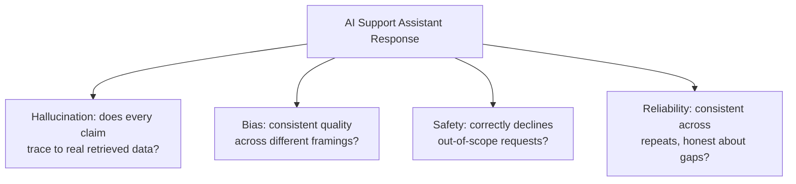

# Hallucinations, Bias, Safety, and Reliability

**Prerequisites**: You should already have completed [Prompt Testing and Evaluation](/learning-paths/ai-for-qa/prompt-testing-and-evaluation).
**Leads to**: After this, you'll be ready for [Section 3 Review](/learning-paths/ai-for-qa/section-3-review), then Section 4 — AI Governance and Security.

[Reviewing AI Output and Recognizing Hallucinations](/learning-paths/ai-for-qa/reviewing-ai-output-and-recognizing-hallucinations) taught hallucination recognition for AI-assisted *QA tooling* output. This module applies the same underlying discipline — and three related defect classes — to a *shipped feature's* own output: what a real customer sees when the AI Support Assistant answers them. These four defect classes are deliberately combined into one module, the same consolidation reasoning [Performance Testing Types](/learning-paths/performance-testing/performance-testing-types) applied to its five test types — each is a variation on "is this response actually trustworthy," best understood together.

## Why This Matters

**A team that doesn't test for grounding.** A customer asks the AI Support Assistant about the interest rate on a discontinued loan product no longer in AtlasBank's active data. Rather than recognizing the data isn't available and saying so, the Assistant generates a confident, specific-sounding interest rate — plausible, following the exact pattern of real rates for similar products, and completely fabricated. AtlasBank's QA team, having tested the Assistant extensively against questions with real, available data, never specifically tested what happens when the data *isn't* available — the exact condition that exposed this hallucination.

**A team that tests grounding explicitly.** A different QA process includes a specific test category: asking about data the team knows isn't available, and checking whether the response correctly acknowledges the gap rather than confidently fabricating an answer. The same discontinued-loan-product question, tested this way before launch, immediately reveals the Assistant's tendency to fabricate rather than admit uncertainty — caught in a controlled test, not by a real customer receiving a real, fabricated interest rate.

Both scenarios involve the identical underlying tendency. Only one team specifically tested for it — because "test with the data you have" and "test what happens when the data doesn't exist" are different, both-necessary test categories.

## Hallucination: Grounding Verification

At the feature level, a **hallucination** is a factual claim the response makes that doesn't actually trace back to real, retrieved data — the product-feature version of the same fabrication pattern [Reviewing AI Output and Recognizing Hallucinations](/learning-paths/ai-for-qa/reviewing-ai-output-and-recognizing-hallucinations) already taught for QA-tool output. Testing for this means **grounding verification**: for every factual claim in a response, confirm it traces back to something actually retrieved from AtlasBank's real systems — not just that it sounds plausible or matches the style of real data.

## Bias: Consistent Quality Across Framing

**Bias** testing checks whether the Assistant provides equivalent-quality answers to the same underlying question, regardless of how it's framed or who appears to be asking. Within the Assistant's own documented scope, this means testing the same question with different, realistic framings (formal business language vs. casual phrasing, different apparent customer contexts) and confirming response quality — accuracy, completeness, tone — stays consistent, not favoring one framing style over another for reasons unrelated to the actual question being asked.

## Safety: Staying Within Documented Scope

**Safety** testing, for a narrowly-scoped feature like the AI Support Assistant, centers specifically on scope boundaries: does the Assistant correctly decline or redirect a question outside its six documented categories (transaction questions, card support, loan FAQs, KYC guidance, account information, payment help), rather than attempting to answer it anyway. A request for general investment advice, or a question entirely unrelated to banking, should be recognized as out of scope and handled accordingly — not answered as if the Assistant were the general-purpose tool it's explicitly not.

## Reliability: Consistency and Appropriate Uncertainty

**Reliability** testing checks two related things: whether repeated, identical queries produce consistent, non-contradictory answers, and — this module's opening scenario's central concern — whether the Assistant correctly expresses uncertainty ("I don't have that information") when data genuinely isn't available, rather than confidently generating a plausible-sounding fabrication to fill the gap.

| Defect Class | What to Test | Real Example (this module) |
|---|---|---|
| Hallucination | Ask about data known to be unavailable; check for grounding, not confident fabrication | Discontinued loan product's interest rate |
| Bias | Same question, varied framing; compare response quality | Formal vs. casual phrasing of the same question |
| Safety | A request outside the six documented categories | General investment advice request |
| Reliability | Identical query, repeated; compare for consistency and honest uncertainty | Repeated loan-status queries |

## How This Works on a Real Project

Following this module's opening scenario, AtlasBank's QA team builds a dedicated grounding test suite specifically targeting known-unavailable data — discontinued products, a customer with genuinely no KYC record on file, a card type AtlasBank never actually issued. Every one of these deliberately targets the exact gap the original discontinued-loan-product incident exposed.

The suite finds the pattern is broader than the original incident: the Assistant fabricates a plausible answer in four of six tested "unavailable data" scenarios, correctly expressing uncertainty in only two. This becomes a specific, prioritized fix target — not "the AI hallucinates sometimes," but a precise, reproducible pattern (confident fabrication specifically when asked about data outside its retrieval scope) with a concrete test suite that can verify the eventual fix and prevent regression, the same reproducibility discipline every prior TestAtlas path has applied to its own defect classes.

## Common Mistakes

**Mistake 1: Only testing an AI feature with questions the underlying data can actually answer.**
This module's opening scenario's entire gap traces to exactly this — never testing the "data doesn't exist" condition means never seeing how the feature behaves when it should honestly say so.

**Mistake 2: Treating bias testing as only relevant to features with explicit demographic inputs.**
Bias in framing-sensitivity (formal vs. casual phrasing producing different quality) is a real, testable pattern even in a feature with no explicit demographic data at all.

**Mistake 3: Assuming a narrowly-scoped feature is automatically safe because its scope is documented.**
Documentation alone doesn't enforce behavior — safety testing has to actively verify the feature *behaves* within its documented scope, not just that the scope is written down somewhere.

**Mistake 4: Testing reliability only for consistency, not for appropriate uncertainty.**
A feature that consistently fabricates the same wrong answer every time is "reliable" in the narrow sense but still fails the more important test — whether it's honest about what it doesn't know.

## Best Practices

**Practice 1: Build a dedicated test set specifically targeting known-unavailable data, separate from tests using real, available data.**
This is the exact practice that turned AtlasBank's one-off incident into a systematic, reproducible finding covering the pattern's real scope.

**Practice 2: Test the same question across varied, realistic framings and compare response quality directly.**
This is how bias testing becomes concrete and checkable, rather than a vague concern with no actual test method.

**Practice 3: Actively test scope boundaries with real, plausible out-of-scope requests, not just trust the documented scope.**
Safety testing needs to verify actual behavior, the same "trust but verify" discipline this project has applied to constraints and configuration throughout.

**Practice 4: Treat "correctly expresses uncertainty" as a positive, testable requirement, not just the absence of a wrong answer.**
A feature passing this test should be recognized as correctly working, not just as failing to fabricate — appropriate uncertainty is itself a feature to verify, not a fallback with no test coverage of its own.

:::note From the Field
A retail company's AI shopping assistant confidently recommended a specific product configuration that didn't actually exist in the company's current catalog, generated by blending plausible attributes from several real, similar products — discovered when a customer tried to order the recommended, non-existent configuration and the order failed. The company's pre-launch testing had exclusively used product questions the catalog could genuinely answer, never testing what the assistant would do when asked to recommend something at the edge of or outside the catalog's actual current inventory.
:::

:::tip Senior QA Insight
A newer tester tests an AI feature by confirming it gives good answers to questions it can genuinely answer. A senior tester specifically, deliberately tests what happens at the edges — data that doesn't exist, questions outside documented scope, the same phrasing framed differently — because a feature that performs well only within its comfortable, well-supported cases hasn't actually been tested for the conditions where it's most likely to fail a real customer.
:::

## Mini Challenge

**Scenario**: You're testing the AI Support Assistant's payment-help category. You want to verify it doesn't fabricate an answer when asked about a payment method AtlasBank has never actually supported (e.g., a specific cryptocurrency payment option).

**Your task**: Describe the specific test you'd run, what response would indicate correct behavior (per this module's reliability criterion), and what response would indicate a hallucination.

## Key Takeaways

- Hallucination, bias, safety, and reliability are four related but distinct quality defect classes for a shipped AI feature, each needing its own specific test category.
- Grounding verification — confirming every factual claim traces to real, retrieved data — is the core hallucination test for a shipped feature, the same discipline applied earlier to QA-tool output.
- Safety testing for a narrowly-scoped feature centers on actively verifying scope boundaries are actually enforced in behavior, not just documented.
- A feature correctly expressing uncertainty when data is unavailable is a positive, testable requirement — not just the absence of a wrong answer.

---

## What You Just Learned

- Four related AI quality defect classes for a shipped feature: hallucination, bias, safety, and reliability, and how to test for each specifically
- Why testing only with genuinely available data misses exactly the condition where hallucination risk concentrates
- How to test bias through framing variation, and safety through active scope-boundary verification
- How AtlasBank's QA team turned a single hallucination incident into a systematic, reproducible grounding test suite covering the pattern's real scope

**Next:** [Section 3 Review](/learning-paths/ai-for-qa/section-3-review)

## Related Topics

- [Reviewing AI Output and Recognizing Hallucinations](/learning-paths/ai-for-qa/reviewing-ai-output-and-recognizing-hallucinations) — The same recognition discipline this module applies to a shipped feature's own output
- [Testing AI-Driven Features](/learning-paths/ai-for-qa/testing-ai-driven-features) — The deterministic-vs-AI-quality distinction this module's four defect classes all fall under
- [Prompt Testing and Evaluation](/learning-paths/ai-for-qa/prompt-testing-and-evaluation) — The rubric-based evaluation method this module's four defect classes get scored against

## Interview Questions

**Q1: How would you test an AI feature for hallucination risk specifically?**

*What to look for*: A candidate who describes grounding verification — deliberately asking about data known to be unavailable and checking whether the response honestly acknowledges the gap rather than fabricating a plausible answer — not a vague "check if the answers seem accurate."

:::note Common Interview Mistake
Many candidates describe hallucination testing as reviewing responses for anything that "sounds wrong," without describing a specific, deliberate test method. A strong answer names testing with known-unavailable data specifically, since that's the condition where confident fabrication is most likely and most testable.
:::

**Q2: What does "safety testing" mean for a narrowly-scoped AI feature like a customer-support assistant limited to specific question categories?**

*What to look for*: A candidate who describes actively testing scope boundaries — submitting realistic out-of-scope requests and confirming the feature correctly declines or redirects them — rather than assuming documented scope is automatically enforced in actual behavior.

---

## Glossary

**Grounding**: Whether a response's factual claims trace back to real, retrieved data, as opposed to being generated without a real data source.

**Bias** (in this context): Inconsistent response quality across different framings of the same underlying question, unrelated to the actual content of what's being asked.

## Quick Revision

Remember these five points:

✓ Hallucination, bias, safety, and reliability are four related but distinct AI quality defect classes, each with its own test category.

✓ Grounding verification — testing with known-unavailable data — is the core hallucination test for a shipped feature.

✓ Bias testing checks consistent response quality across different, realistic question framings.

✓ Safety testing actively verifies scope boundaries are enforced in behavior, not just documented.

✓ Correctly expressing uncertainty when data is unavailable is a positive, testable requirement, not just an absence of fabrication.
