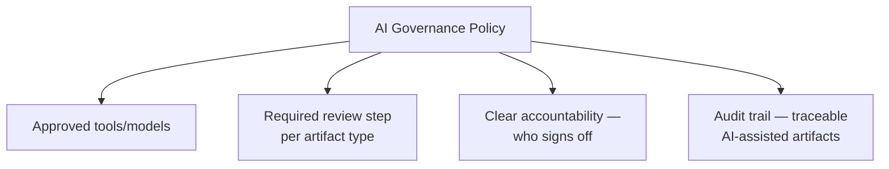

# AI Governance for QA

**Prerequisites**: You should already have completed [Section 3 Review](/learning-paths/ai-for-qa/section-3-review) and Section 3 in full.
**Leads to**: After this, you'll be ready for [AI Security and Privacy Awareness](/learning-paths/ai-for-qa/ai-security-and-privacy-awareness).

Sections 2 and 3 taught specific AI-assisted techniques and AI-feature testing, each with its own review discipline. This module is about the layer above any single technique: what a QA *team* needs in place — as policy, not just individual habit — before AI tool usage scales beyond one careful tester's personal practice.

## Why This Matters

**A team with no governance.** AtlasBank's QA team adopts AI tooling organically — different testers use different AI tools, apply review with varying rigor, and nobody tracks which test artifacts in the shared suite were AI-assisted versus hand-written. When a defect traces back to an AI-drafted test case that was never properly reviewed against [Reviewing AI Output and Recognizing Hallucinations](/learning-paths/ai-for-qa/reviewing-ai-output-and-recognizing-hallucinations)'s own standard, nobody can quickly determine who wrote it, what tool assisted, or whether it was reviewed at all — the team has no accountability trail, because nothing was ever tracked.

**A team with an explicit governance policy.** A different QA team establishes a written policy before AI tool usage scales: which AI tools are approved for use, which categories of work require which specific review step (mapped directly to this path's own Sections 1–3 techniques), and a lightweight tag or note in each AI-assisted artifact identifying who reviewed it and against what standard. When a similar defect surfaces, the team traces it in minutes — the specific artifact, its author, its reviewer, and the review standard applied are all recorded, immediately clarifying whether the process broke down or was never followed.

Both teams adopted AI tooling. Only one of them could actually answer "what happened here" when something needed tracing back — because only one of them treated governance as a deliberate policy, not an assumed byproduct of individual good habits.

## What an AI Governance Policy Needs to State

**Approved tools and models.** Which AI tools a team is actually authorized to use for QA work — not a ban on AI broadly, but a deliberate, reviewed list, the same way a team might standardize on specific testing frameworks rather than letting every individual choose independently.

**Required review steps per artifact type.** Directly mapping [Responsible AI Usage and Human-in-the-Loop QA](/learning-paths/ai-for-qa/responsible-ai-usage-and-human-in-the-loop-qa)'s verification-target principle into policy: AI-drafted test cases require BVA/Equivalence Partitioning review; AI-generated automation code requires the two-surface review from [AI-Assisted API and Automation Authoring](/learning-paths/ai-for-qa/ai-assisted-api-and-automation-authoring); each artifact type gets its specific, named standard, not a generic "review it" instruction.

**Accountability.** Who is responsible for an AI-assisted artifact once it ships — per [AI in Software Testing](/learning-paths/ai-for-qa/ai-in-software-testing)'s own established principle, this is always the human who used and approved the tool, and governance makes that explicit and traceable rather than implicit and easy to lose track of.

**An audit trail.** A lightweight, consistent way to identify which artifacts were AI-assisted, by whom, reviewed against what standard — not bureaucratic overhead, but the specific mechanism that let this module's second scenario trace a defect in minutes instead of never.

## How This Works on a Real Project

Following this module's opening scenario, AtlasBank's QA team formalizes a governance policy directly mapping to this path's own structure: AI-drafted test cases require the BVA/Equivalence Partitioning review from [AI-Assisted Test Case Generation](/learning-paths/ai-for-qa/ai-assisted-test-case-generation); AI-generated automation code requires the API-accuracy and automation-quality review from [AI-Assisted API and Automation Authoring](/learning-paths/ai-for-qa/ai-assisted-api-and-automation-authoring); AI-suggested root causes require direct verification per [AI-Assisted Defect Analysis and Exploratory Testing](/learning-paths/ai-for-qa/ai-assisted-defect-analysis-and-exploratory-testing) before being escalated. Every AI-assisted artifact merged into the shared suite carries a short, standardized note: which tool assisted, who reviewed it, against which named standard.

Three months later, a test case is found to contain the exact requirement-mismatch pattern [AI-Assisted Test Case Generation](/learning-paths/ai-for-qa/ai-assisted-test-case-generation) originally warned about. The audit trail immediately shows it was merged without the required BVA review being logged — a genuine process gap, identified specifically and correctable directly (a reminder to the specific reviewer, not a vague "be more careful" sent to the whole team), rather than a mystery requiring investigation before any fix could even begin.

## Common Mistakes

**Mistake 1: Adopting AI tools without any written governance policy, relying on individual habit alone.**
This module's opening scenario's entire problem traces to exactly this — good individual practice by some testers doesn't substitute for a team-wide, trackable standard.

**Mistake 2: Writing a governance policy with only a generic "review AI output" requirement, not mapped to specific standards per artifact type.**
This repeats [Responsible AI Usage and Human-in-the-Loop QA](/learning-paths/ai-for-qa/responsible-ai-usage-and-human-in-the-loop-qa)'s own central warning at the policy level — a vague requirement provides as little real protection as a vague individual habit.

**Mistake 3: Treating accountability as implicit rather than explicitly recorded.**
Knowing, in principle, that "the tester is responsible" isn't the same as being able to quickly identify *which* tester, for a *specific* artifact, when something needs tracing — the AtlasBank example's fast resolution depended specifically on this being recorded, not just true in principle.

**Mistake 4: Treating governance policy as a one-time document, never revisited as AI tools and team practice evolve.**
New AI tools, new use cases, and lessons from real incidents (like the AtlasBank example's own gap) should feed back into an updated policy, not sit static indefinitely.

## Best Practices

**Practice 1: Map governance review requirements directly to the specific standards this path already established, per artifact type.**
This is what turned AtlasBank's policy from a vague intention into a specific, checkable requirement per artifact type.

**Practice 2: Record a lightweight, consistent audit trail on every AI-assisted artifact — tool used, reviewer, standard applied.**
This is the specific mechanism that made a real defect traceable in minutes rather than requiring an open-ended investigation.

**Practice 3: Make accountability explicit and recorded, not just generally understood.**
The principle "the human remains responsible" needs a concrete, trackable expression in policy, not just shared understanding.

**Practice 4: Revisit governance policy periodically as tools and practice evolve, incorporating lessons from real incidents.**
The AtlasBank example's own gap, once found, should update the policy or its enforcement — not just get fixed once and forgotten.

:::note From the Field
A software company's engineering organization adopted AI coding assistants broadly with encouragement but no formal policy, resulting in wildly inconsistent practices across teams — some teams reviewed every AI-generated line rigorously, others merged AI-generated pull requests with only a cursory glance. A significant security vulnerability, later traced to AI-generated code that had never been properly reviewed, prompted the organization to retroactively realize it had no way to even determine which of its thousands of recent commits had been AI-assisted at all, since no tracking had ever been put in place — making the actual scope of potential exposure impossible to assess quickly.
:::

:::tip Senior QA Insight
A newer tester treats AI governance as a compliance burden imposed from outside their actual work. A senior tester recognizes it as the same discipline that makes any of their individual review habits actually mean something at team scale — a policy that's specific, mapped to real standards, and tracked is what turns "I always review carefully" from one person's practice into something the whole team, and anyone auditing later, can actually rely on.
:::

## Mini Challenge

**Scenario**: Your team currently has no written AI governance policy — usage has grown organically over the past six months.

**Your task**: Draft the four core elements this module identifies (approved tools, required review per artifact type, accountability, audit trail) at a high level for your own team's actual AI-assisted work.

## Key Takeaways

- AI governance is a team-level policy layer above individual review habits — good individual practice alone doesn't provide team-wide accountability or traceability.
- A real governance policy names approved tools, maps a specific required review step to each artifact type, makes accountability explicit, and maintains a lightweight audit trail.
- A recorded audit trail is what turns "something went wrong somewhere" into a traceable, specific finding in minutes rather than an open-ended investigation.
- Governance policy should be revisited periodically, incorporating lessons from real incidents, not treated as a static, one-time document.

---

## What You Just Learned

- Why individual review discipline alone doesn't provide team-wide AI governance
- The four elements a real AI governance policy needs to state: approved tools, per-artifact-type review requirements, accountability, and an audit trail
- How to map governance review requirements directly to this path's own established standards
- How AtlasBank's QA team traced a real process gap in minutes because of a recorded audit trail, rather than facing an open-ended investigation

**Next:** [AI Security and Privacy Awareness](/learning-paths/ai-for-qa/ai-security-and-privacy-awareness)

## Related Topics

- [Responsible AI Usage and Human-in-the-Loop QA](/learning-paths/ai-for-qa/responsible-ai-usage-and-human-in-the-loop-qa) — The individual verification-target principle this module scales into team-wide policy
- [AI in Software Testing](/learning-paths/ai-for-qa/ai-in-software-testing) — The accountability principle (the human remains responsible) this module makes explicit and trackable
- [AI Security and Privacy Awareness](/learning-paths/ai-for-qa/ai-security-and-privacy-awareness) — The next governance-adjacent concern, specific to data safety rather than review process

## Interview Questions

**Q1: What should an AI governance policy for a QA team actually include?**

*What to look for*: A candidate who names specific elements — approved tools, review requirements mapped per artifact type, clear accountability, and an audit trail — not a vague "guidelines for using AI responsibly" with no concrete structure.

:::note Common Interview Mistake
Many candidates describe AI governance in terms of restricting or banning AI tool usage, rather than describing a structure that enables responsible, trackable adoption. A strong answer frames governance as enabling accountable use, not primarily as a restriction.
:::

**Q2: Why is an audit trail important for AI-assisted QA work specifically?**

*What to look for*: A candidate who explains that it makes tracing a defect back to its origin (which artifact, which reviewer, which standard) fast and specific, rather than requiring an open-ended investigation — citing a concrete benefit, not just "it's good practice."

---

## Glossary

**AI Governance Policy**: A team-level policy defining approved AI tools, required review steps per artifact type, accountability, and an audit trail for AI-assisted work.

**Audit Trail**: A recorded, traceable history of which artifacts were AI-assisted, by whom, and reviewed against what standard.

## Quick Revision

Remember these five points:

✓ AI governance is a team-level policy layer — individual review habits alone don't provide team-wide accountability.
✓ A real policy names approved tools, maps review requirements per artifact type, states accountability, and maintains an audit trail.
✓ Map governance review requirements directly to this path's own established, specific standards.
✓ A recorded audit trail turns a vague problem into a fast, specific, traceable finding.
✓ Revisit governance policy periodically, incorporating lessons from real incidents.
