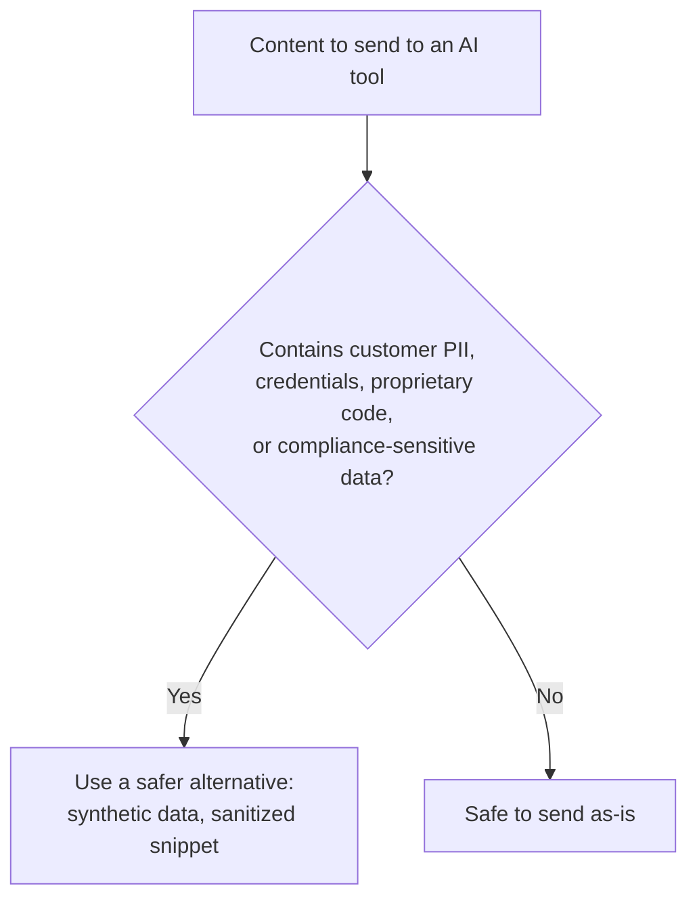

# AI Security and Privacy Awareness

**Prerequisites**: You should already have completed [AI Governance for QA](/learning-paths/ai-for-qa/ai-governance-for-qa).
**Leads to**: After this, you'll be ready for [Human Review Workflows and AI Quality Assurance](/learning-paths/ai-for-qa/human-review-workflows-and-ai-quality-assurance).

Sending the wrong data to an external AI tool can be a real data-exposure incident, not just a testing mistake — and it's exactly the kind of thing a busy tester can do without thinking twice, since pasting content into a helpful tool feels routine. This module is scoped, per this path's own explicit boundary, to QA-relevant security and privacy awareness — not a security-specialist treatment, the same discipline [Database Security Testing](/learning-paths/database-testing/database-security-testing) already applied to its own QA-level scope.

## Why This Matters

**A tester who pastes real data into an external AI tool.** A tester debugging a failing test case for AtlasBank's fund-transfer feature copies a real, production-derived transaction record — including a real customer's name, account number, and transaction history — into a public, external AI tool, asking it to help identify why the test's expected behavior doesn't match. The AI tool processes the request normally; the tester gets a helpful answer. What the tester hasn't considered: that real customer data has now left AtlasBank's systems entirely, sent to a third-party service under terms the tester never checked, a genuine data-exposure incident regardless of how helpful or well-intentioned the request was.

**A tester who uses safe data by default.** A different tester, debugging the identical test failure, uses the synthetic, AtlasBank-shaped test data from [AI-Assisted Test Data Creation](/learning-paths/ai-for-qa/ai-assisted-test-data-creation) — data that resembles the real shape and structure of a production record without containing any actual customer information — to ask the AI tool the same debugging question. The AI tool provides an equally helpful answer, since the debugging question depends on the data's *shape*, not on it being real, and no genuine customer information ever left AtlasBank's systems.

Both testers got the help they needed. Only one of them created a real, genuine data-exposure incident to get it — and the difference wasn't the AI tool's capability, it was what data the tester chose to send it.

## What's Unsafe to Send to an External AI Tool

**Customer data (PII)**: names, account numbers, transaction details, KYC information — anything that identifies or describes a real customer, the same category [Database Security Testing](/learning-paths/database-testing/database-security-testing) already flagged as requiring protection at rest, now equally relevant to what leaves an organization's systems via a third-party tool.

**Credentials and secrets**: API keys, passwords, tokens, connection strings — pasting these into an external tool, even accidentally as part of a larger code snippet or config file, can expose them well beyond their intended scope.

**Proprietary or unreleased code and business logic**: code for a feature not yet public, or business logic representing real competitive or strategic value, sent to a third-party service outside the organization's control.

**Compliance-sensitive data**: anything subject to a specific regulatory requirement (financial records, health information) where third-party data handling itself may violate the actual compliance obligation, independent of whether the AI tool handles the data responsibly.

| Category | Example | Safer Alternative |
|---|---|---|
| Customer PII | A real customer's name, account number, transaction history | Synthetic, AtlasBank-shaped test data (per [AI-Assisted Test Data Creation](/learning-paths/ai-for-qa/ai-assisted-test-data-creation)) |
| Credentials/secrets | An API key embedded in a config snippet | A placeholder value, or a redacted/sanitized version of the snippet |
| Proprietary code | Unreleased feature logic | A minimal, isolated reproduction of the specific issue, stripped of proprietary context |
| Compliance-sensitive data | Real financial or health records | Anonymized or synthetic equivalents matching the same real shape |

## Prompt Injection Awareness for QA Workflows

A related, QA-specific risk: when an AI tool is used to process or summarize content that includes real user-generated input (support tickets, log files containing user-submitted data), that content could contain text specifically crafted to manipulate the AI tool's behavior — a **prompt injection** attempt embedded in data the tool wasn't expecting to treat as instructions. This matters directly for QA workflows that use AI to summarize or analyze real support tickets or logs as part of defect triage — the same class of risk [Injection and Input-Based Attacks](/learning-paths/api-testing/injection-and-input-based-attacks) already taught for traditional injection, now relevant to AI-assisted analysis specifically. This path's scope, matching that module's own precedent, stops at recognition and awareness — not exploit construction or deep security-specialist treatment.

## How This Works on a Real Project

Following this module's opening scenario, AtlasBank's QA team incorporates data-safety review directly into the AI governance policy from [AI Governance for QA](/learning-paths/ai-for-qa/ai-governance-for-qa): any AI-assisted debugging or analysis task must use synthetic or sanitized data by default, with real production data usage requiring explicit, logged approval — the same audit-trail discipline that module already established, applied specifically to data-safety decisions.

When a tester later needs AI assistance summarizing a batch of real customer support tickets for a defect-triage effort, the policy prompts a specific check before proceeding: the tickets are reviewed and sanitized (customer-identifying details removed) before being sent to the AI tool, and the team separately confirms the sanitized batch doesn't contain any embedded, unusual instruction-like text that could represent a prompt injection attempt — a quick, specific check that costs a few minutes and closes both real risks this module identifies, before either becomes a genuine incident.

## Common Mistakes

**Mistake 1: Pasting real customer data into an external AI tool without considering where that data actually goes.**
This module's opening scenario's entire risk traces to exactly this — a routine-feeling action that's actually a genuine data-exposure incident.

**Mistake 2: Assuming synthetic test data is less useful for AI-assisted debugging than real data.**
The second tester in this module's opening scenario got an equally helpful answer — the debugging value came from the data's shape, not from it being real.

**Mistake 3: Not checking for embedded prompt-injection-style content when feeding real user-generated data (tickets, logs) into an AI tool.**
This is a real, specific risk for AI-assisted defect triage and analysis workflows, not a hypothetical concern — the same injection-awareness discipline already taught for traditional systems applies here too.

**Mistake 4: Treating data-safety awareness as separate from the governance policy, rather than integrated into it.**
The AtlasBank example's resolution specifically folded data-safety checks into the same governance and audit-trail structure [AI Governance for QA](/learning-paths/ai-for-qa/ai-governance-for-qa) already established, rather than treating it as an unrelated, separate concern.

## Best Practices

**Practice 1: Default to synthetic or sanitized data for any AI-assisted task, reserving real data for cases with explicit, logged approval.**
This is the specific practice that closed AtlasBank's real risk while preserving the debugging value the AI tool actually provides.

**Practice 2: Review user-generated content for embedded, unusual instruction-like text before feeding it to an AI tool for summarization or analysis.**
A quick, specific check, not a deep security review — matching this module's own scoped, QA-relevant depth.

**Practice 3: Integrate data-safety checks directly into the governance and audit-trail structure already established.**
Data safety isn't a separate concern from AI governance generally — it's one of the specific things a governance policy should explicitly cover.

**Practice 4: Treat "can I paste this into an AI tool" as a real, non-trivial question, every time, not an assumed-safe default.**
The routineness of pasting content into a helpful tool is exactly what makes this risk easy to overlook — treating the question as genuinely worth asking each time is the actual safeguard.

:::note From the Field
A healthcare technology company discovered that several engineers had been routinely pasting snippets of real patient-adjacent debugging data into a public AI coding assistant to get help resolving test failures, a practice that had grown organically with no policy addressing it. A compliance review, triggered by an unrelated audit, found this had been happening for months, creating a genuine regulatory exposure the engineering team had never actually intended or considered a risk — each individual instance had felt like a routine, harmless debugging step.
:::

:::tip Senior QA Insight
A newer tester treats pasting content into an AI tool as no different from any other routine debugging action. A senior tester treats it as a genuine data-handling decision, every time — asking specifically what's actually in the content before sending it, the same deliberate check applied to any other action that sends data outside the organization's own systems.
:::

## Mini Challenge

**Scenario**: You're debugging a failing test for AtlasBank's KYC verification feature and want to ask an AI tool for help. The test failure log includes a real customer's uploaded ID document reference and verification status.

**Your task**: Describe the specific steps you'd take before sending this log to an AI tool, applying this module's data-safety framework.

## Key Takeaways

- Customer PII, credentials/secrets, proprietary code, and compliance-sensitive data are all unsafe to send to an external AI tool by default — use synthetic or sanitized alternatives instead.
- Synthetic, well-shaped test data is often just as useful for AI-assisted debugging as real data, since the value usually comes from the data's shape, not its authenticity.
- Prompt injection is a real, QA-relevant risk when feeding real user-generated content (tickets, logs) into an AI tool for summarization or analysis — a quick review for embedded instruction-like text is the appropriate, scoped response.
- Data-safety checks belong inside the same governance and audit-trail structure this path already established, not as a separate, unrelated concern.

---

## What You Just Learned

- What categories of data are unsafe to send to an external AI tool, and why
- Why synthetic test data often provides equal AI-assisted debugging value without the real-data risk
- What prompt injection means for QA workflows specifically, and the QA-appropriate response to it
- How AtlasBank's QA team integrated data-safety checks directly into its existing AI governance policy

**Next:** [Human Review Workflows and AI Quality Assurance](/learning-paths/ai-for-qa/human-review-workflows-and-ai-quality-assurance)

## Related Topics

- [Database Security Testing](/learning-paths/database-testing/database-security-testing) — The QA-level data-protection scope this module applies to data leaving an organization via an AI tool
- [Injection and Input-Based Attacks](/learning-paths/api-testing/injection-and-input-based-attacks) — The same identification-not-exploitation scope this module applies to prompt injection awareness
- [AI Governance for QA](/learning-paths/ai-for-qa/ai-governance-for-qa) — The policy structure this module's data-safety checks integrate directly into

## Interview Questions

**Q1: What kinds of data should never be pasted into an external AI tool, and why?**

*What to look for*: A candidate who names specific categories — customer PII, credentials/secrets, proprietary code, compliance-sensitive data — and explains the actual risk (data leaving organizational control, third-party handling, potential compliance violation), not just a general sense of caution.

:::note Common Interview Mistake
Many candidates express general wariness about AI tools and data privacy without naming specific data categories or a concrete safer alternative. A strong answer names specific unsafe categories and proposes synthetic or sanitized data as a concrete, equally useful alternative.
:::

**Q2: What is prompt injection, and why might it matter for a QA workflow that uses AI to summarize support tickets or logs?**

*What to look for*: A candidate who explains that user-generated content (a ticket, a log entry) could contain text crafted to manipulate an AI tool's behavior when processed, and that a QA-appropriate response is reviewing content for this risk before processing it — not attempting to construct or exploit an actual injection.

---

## Glossary

**PII (Personally Identifiable Information)**: Data that identifies or describes a specific real person — names, account numbers, contact details.

**Prompt Injection**: Text embedded in content processed by an AI tool, crafted to manipulate the tool's behavior beyond its intended instructions.

## Quick Revision

Remember these five points:

✓ Customer PII, credentials, proprietary code, and compliance-sensitive data are unsafe to send to an external AI tool by default.
✓ Synthetic, well-shaped test data often provides equal AI-assisted debugging value without the real-data risk.
✓ Review user-generated content (tickets, logs) for embedded, unusual instruction-like text before AI-assisted processing.
✓ Data-safety checks belong inside the same governance and audit-trail structure already established for AI usage generally.
✓ Treat "can I paste this into an AI tool" as a genuine question every time, not an assumed-safe routine action.
