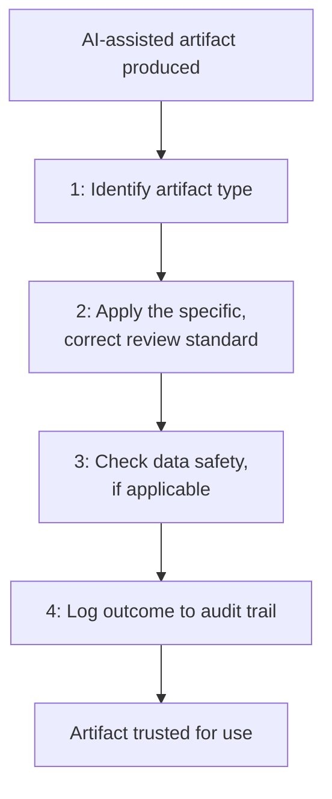

# Human Review Workflows and AI Quality Assurance

**Prerequisites**: You should already have completed [AI Security and Privacy Awareness](/learning-paths/ai-for-qa/ai-security-and-privacy-awareness).
**Leads to**: After this, you'll be ready for [Section 4 Review](/learning-paths/ai-for-qa/section-4-review), then Section 5 — Application Modules and Capstone.

Every module in this path so far taught one specific review standard — BVA review for test cases, automation-quality review for generated code, grounding verification for AI-feature hallucinations, a governance policy's per-artifact-type mapping. This module closes Section 4 by assembling all of it into one operational workflow: a QA team's actual, running process for routing any AI-assisted artifact to its correct review, every time, not ad hoc per situation.

## Why This Matters

**A team with scattered, inconsistent review.** AtlasBank's QA team, having learned every individual review standard this path teaches, applies them inconsistently in practice — one tester remembers to check AI-generated test cases against BVA, another doesn't; some AI-assisted automation code gets the full two-surface review, some gets a quick glance because the reviewer is busy. Each individual standard is sound, but nothing forces any of them to actually happen for a given artifact, and it's a matter of luck whether the right review gets applied to the right thing.

**A team with one operational workflow.** A different QA team builds a single, explicit workflow: for every AI-assisted artifact, first identify its type (test case, test data, code, root-cause suggestion, AI-feature response), then route it to the correct, specific review standard this path already established for that type, then log the outcome per [AI Governance for QA](/learning-paths/ai-for-qa/ai-governance-for-qa)'s audit-trail requirement. Nothing is left to individual memory or discretion about *whether* to review — only the already-learned standard for *how*.

Both teams know the same individual review standards. Only one of them has turned that knowledge into a process that actually runs reliably, every time, regardless of which tester happens to be involved.

## The Unified AI Quality Assurance Workflow

**Step 1 — Identify the artifact type.** Test case, test data, API/automation code, defect-triage suggestion, exploratory charter, or AI-feature response — each maps to a specific module's own review standard, not a generic catch-all.

**Step 2 — Apply the specific, correct review standard.** [AI-Assisted Test Case Generation](/learning-paths/ai-for-qa/ai-assisted-test-case-generation)'s BVA/Equivalence Partitioning check; [AI-Assisted Test Data Creation](/learning-paths/ai-for-qa/ai-assisted-test-data-creation)'s volume/shape/distribution/format-validity check; [AI-Assisted API and Automation Authoring](/learning-paths/ai-for-qa/ai-assisted-api-and-automation-authoring)'s two-surface check; [AI-Assisted Defect Analysis and Exploratory Testing](/learning-paths/ai-for-qa/ai-assisted-defect-analysis-and-exploratory-testing)'s hypothesis-verification; [Prompt Testing and Evaluation](/learning-paths/ai-for-qa/prompt-testing-and-evaluation)'s and [Hallucinations, Bias, Safety, and Reliability](/learning-paths/ai-for-qa/hallucinations-bias-safety-and-reliability)'s rubric-based evaluation.

**Step 3 — Check data safety, if applicable.** Per [AI Security and Privacy Awareness](/learning-paths/ai-for-qa/ai-security-and-privacy-awareness), confirm no unsafe data was involved in producing the artifact.

**Step 4 — Log the outcome.** Per [AI Governance for QA](/learning-paths/ai-for-qa/ai-governance-for-qa)'s audit-trail requirement — reviewer, standard applied, outcome — every time, not only when something goes wrong.

| Artifact Type | Correct Review Standard | Source Module |
|---|---|---|
| Test case | BVA / Equivalence Partitioning check | [AI-Assisted Test Case Generation](/learning-paths/ai-for-qa/ai-assisted-test-case-generation) |
| Test data | Volume/shape/distribution/format-validity | [AI-Assisted Test Data Creation](/learning-paths/ai-for-qa/ai-assisted-test-data-creation) |
| API/automation code | API accuracy + automation quality | [AI-Assisted API and Automation Authoring](/learning-paths/ai-for-qa/ai-assisted-api-and-automation-authoring) |
| Root-cause suggestion | Direct verification against real logs/data | [AI-Assisted Defect Analysis and Exploratory Testing](/learning-paths/ai-for-qa/ai-assisted-defect-analysis-and-exploratory-testing) |
| AI-feature response | Rubric evaluation + hallucination/bias/safety/reliability | [Prompt Testing and Evaluation](/learning-paths/ai-for-qa/prompt-testing-and-evaluation), [Hallucinations, Bias, Safety, and Reliability](/learning-paths/ai-for-qa/hallucinations-bias-safety-and-reliability) |

## How This Works on a Real Project

AtlasBank's QA team, applying this module's unified workflow, builds a simple, shared checklist template — not new technology, just a consistent, required routing step — attached to every AI-assisted work item entering the team's process. A new AI-drafted test case for a card-limit feature is automatically routed to the BVA/Equivalence Partitioning standard; a new AI-generated automation script is routed to the two-surface code review; a new AI Support Assistant response under evaluation is routed to the rubric-based process.

Six months after adopting this workflow, the team reviews their own audit trail and finds a striking consistency: unlike the earlier, ad hoc period reflected in this module's opening scenario, review coverage is now effectively 100% across every AI-assisted artifact type — not because individual testers became more careful, but because the workflow itself no longer depends on any individual remembering to apply the right standard. The specific reviews haven't changed at all; what changed is that they now happen reliably, every time, for everyone.

## Common Mistakes

**Mistake 1: Knowing every individual review standard but having no consistent process for applying the right one to the right artifact.**
This module's opening scenario's entire gap traces to exactly this — sound individual knowledge, unreliable collective application.

**Mistake 2: Treating this module's workflow as new content rather than an assembly of everything already taught.**
Nothing here is a new review standard — it's the operational structure that makes the standards from Sections 1–4 actually run consistently, every time.

**Mistake 3: Skipping the audit-trail logging step for artifacts that "obviously" passed review.**
Per [AI Governance for QA](/learning-paths/ai-for-qa/ai-governance-for-qa)'s own reasoning, an unlogged review that happened is indistinguishable, later, from a review that never happened — logging matters precisely because it's the only way to tell the difference after the fact.

**Mistake 4: Building a workflow so heavyweight that testers route around it under time pressure.**
The AtlasBank example's success specifically depended on the workflow being a simple, attached checklist — not a burdensome new process competing with actual delivery pressure.

## Best Practices

**Practice 1: Build one unified routing step — identify artifact type, apply its specific standard — rather than relying on individual memory across scattered standards.**
This is the single change that took AtlasBank's team from inconsistent to effectively complete review coverage.

**Practice 2: Keep the workflow lightweight enough that it doesn't get bypassed under real delivery pressure.**
A workflow that's too heavy to actually follow provides no more real protection than having no workflow at all.

**Practice 3: Log every review outcome, not just the ones that found a problem.**
A complete audit trail is what lets a team later confirm coverage was actually complete, not just assumed.

**Practice 4: Treat this workflow as the operational expression of everything this path has taught, not a separate, additional thing to learn.**
Every review standard inside it should already be familiar — this module is about consistent application, not new technique.

:::note From the Field
A software engineering organization documented a comprehensive, well-written set of AI code-review guidelines, distributed broadly and generally well-regarded by the teams who read it. An internal audit a year later found actual review-guideline adherence varied enormously by team — some teams had built it into their pull-request templates and enforced it consistently; others had read the document once and never operationalized it into their actual daily workflow at all. The guidelines themselves weren't the gap — the missing piece was exactly this module's subject: a consistent, structural way to make the guidelines actually run, every time, regardless of which team or individual was involved.
:::

:::tip Senior QA Insight
A newer tester considers their AI-assisted-QA education complete once they know every individual review standard this path teaches. A senior tester recognizes that knowing the standards and having them reliably applied, every time, across an entire team, are two different achievements — and builds the second deliberately, rather than assuming it follows automatically from the first.
:::

## Mini Challenge

**Scenario**: Your team knows every individual AI-review standard this path has taught, but review is currently applied inconsistently — some AI-assisted artifacts get thorough review, others get skipped under deadline pressure.

**Your task**: Sketch a lightweight, four-step workflow (per this module's structure) your team could realistically adopt, and describe what would make it likely to actually be followed under real time pressure, not just correct in theory.

## Key Takeaways

- This module introduces no new review standards — it assembles every standard from Sections 1–4 into one consistent, operational workflow.
- The workflow's four steps: identify artifact type, apply the specific correct review standard, check data safety, log the outcome.
- Knowing individual review standards and having them reliably applied across an entire team are different achievements — the second requires deliberate, lightweight structure, not just knowledge.
- A workflow too heavyweight to survive real delivery pressure provides no more actual protection than having no workflow at all.

---

## What You Just Learned

- How to assemble every review standard this path has taught into one unified, four-step AI quality assurance workflow
- Why knowing individual standards doesn't guarantee they're consistently applied across a team
- The specific routing logic — artifact type to correct review standard — that makes this workflow operationally reliable
- How AtlasBank's QA team moved from inconsistent to effectively complete review coverage by building one lightweight, consistently-applied workflow

**Next:** [Section 4 Review](/learning-paths/ai-for-qa/section-4-review)

## Related Topics

- [AI Governance for QA](/learning-paths/ai-for-qa/ai-governance-for-qa) — The policy and audit-trail structure this module's workflow operationalizes
- [Responsible AI Usage and Human-in-the-Loop QA](/learning-paths/ai-for-qa/responsible-ai-usage-and-human-in-the-loop-qa) — The foundational review principle this module turns into a consistent, running process
- [AI-Assisted Defect Analysis and Exploratory Testing](/learning-paths/ai-for-qa/ai-assisted-defect-analysis-and-exploratory-testing) — One of several specific review standards this module's workflow routes artifacts to

## Interview Questions

**Q1: Your team knows all the right AI-review practices, but review quality is inconsistent across the team. What would you do?**

*What to look for*: A candidate who describes building a consistent, lightweight, structural workflow — routing each artifact type to its known correct standard — rather than simply reminding the team to "be more careful," which repeats the exact gap this module identifies as insufficient.

:::note Common Interview Mistake
Many candidates respond to inconsistent review quality with a plan to communicate standards more clearly or train the team again. A strong answer recognizes that the standards are already known in this scenario — the actual gap is a consistent operational process for applying them, not more documentation or training.
:::

**Q2: Why is logging every AI-assisted artifact's review outcome important, not just the ones where a problem was found?**

*What to look for*: A candidate who explains that a complete audit trail is the only way to later confirm review coverage was actually complete — an unlogged "clean" review is indistinguishable, after the fact, from a review that never happened at all.

---

## Glossary

No new terms are introduced in this module — every concept used above is defined in its linked source module.

## Quick Revision

Remember these five points:

✓ This module assembles every review standard from Sections 1–4 into one unified, four-step workflow — no new standards.
✓ The four steps: identify artifact type, apply the correct specific review, check data safety, log the outcome.
✓ Knowing review standards and having them consistently applied across a team are different achievements.
✓ A workflow too heavyweight for real delivery pressure provides no more actual protection than no workflow.
✓ Log every review outcome, not just problem findings — an unlogged clean review is indistinguishable from no review at all.
