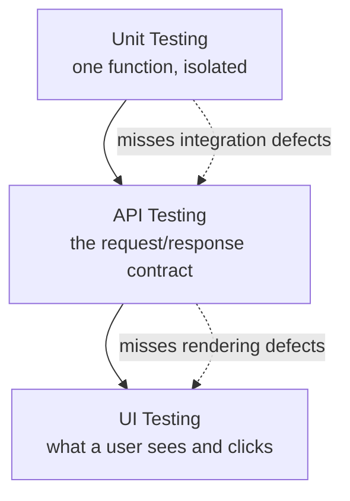

# What Is API Testing?

**Prerequisites**: You should already have completed [Manual Testing and Test Design](/learning-paths/manual-testing/test-design-fundamentals), especially [Test Design Fundamentals](/learning-paths/manual-testing/test-design-fundamentals), [Boundary Value Analysis](/learning-paths/manual-testing/boundary-value-analysis), and [Equivalence Partitioning](/learning-paths/manual-testing/equivalence-partitioning).
**Leads to**: After this, you'll be ready for [HTTP Fundamentals](/learning-paths/api-testing/http-fundamentals).

A checkout page can look completely correct — the confirmation screen renders, the order number appears, the success message shows — while the API call underneath it silently returns the wrong tax amount, one the UI never displays back to the customer for comparison. A tester who only clicks through the screen has no way to catch that. A tester who also sends the same request the UI sends, and reads the response directly, catches it in seconds. That's the entire case for API testing in one example: some defects are only visible below the screen, in the data actually moving between systems.

## Why This Matters

**A tester working UI-only.** Testing an AtlasBank fund transfer feature, a tester fills in the transfer form, submits it, and confirms the success screen appears with the right confirmation number. The feature "works." What the tester never sees: the transfer API response includes a `status: "pending_review"` field the UI simply doesn't render anywhere — the transfer hasn't actually completed, it's sitting in a compliance queue, and the success screen is technically lying about the outcome. The UI was built to show a generic success message for any 200-status response, without checking the response body's actual content.

**A tester working at the API layer, in addition to the UI.** A different tester runs the same transfer, but also inspects the raw API response instead of trusting the screen. The `status: "pending_review"` field is immediately visible — a defect the first tester's approach structurally could not have found, no matter how carefully they looked at the screen, because the information was never rendered there at all.

This isn't a case for abandoning UI testing — a real defect might just as easily live in how the UI renders a correct API response. It's a case for testing at *both* layers, because each one can hide defects the other layer can't see.

## What API Testing Covers

**API testing** means sending requests directly to an application's API — the interface other systems (including the UI you'd otherwise click through) use to talk to the backend — and verifying the response: status code, response body, headers, timing, and any resulting side effect (a record created, a balance updated, a notification queued). It skips the UI layer entirely, testing the system's actual contract with anything that calls it.

This is distinct from two things it's often confused with:

| | API Testing | UI Testing | Unit Testing |
|---|---|---|---|
| **What it exercises** | The API contract — requests and responses | What a user sees and clicks | A single function or class, in isolation |
| **Catches** | Wrong status codes, malformed responses, broken contracts, auth/authorization gaps, backend logic errors surfaced through the API | Rendering defects, broken user flows, UI-layer validation gaps | Logic errors inside one unit of code, before integration |
| **Speed** | Fast — no browser rendering required | Slower — requires rendering a full page | Fastest — no network, no integration |
| **Blind spot** | Can't catch a defect that only exists in how the UI renders a correct response | Can't catch a defect hidden in a response field the UI never displays | Can't catch a defect that only appears when units are integrated |

None of these three replaces the others — they catch different, real defect classes, and a mature test approach uses all three at the layer where each is strongest.

## When API Testing Matters Most

- **Any feature with a UI built on top of an API you can call directly** — which is nearly every modern web or mobile feature. Testing the API independently isolates whether a defect lives in the backend logic or in how the UI presents it.
- **Systems with no UI at all** — internal services, webhooks, integrations between two backend systems — where API testing is the *only* way to test the feature, not a supplement to UI testing.
- **Anything where a UI could plausibly mask a backend defect** — a generic success screen that doesn't reflect the actual response content, exactly like this module's opening transfer example.
- **Regression testing at scale** — an API test typically runs in a fraction of the time a UI test does, since there's no page rendering involved, making API-layer regression suites far cheaper to run frequently.

API testing matters less as a *replacement* for UI testing on features where the actual risk is genuinely in the rendering or user flow itself — a confusing multi-step form, for instance, is a UI-layer risk an API test structurally cannot evaluate.

## How This Works on a Real Project

AtlasBank is building a beneficiary-management feature: customers add a beneficiary's account details before they can send them a transfer, and the system runs a validation check against the beneficiary's bank routing details before saving. A tester assigned to this feature starts, as usual, by clicking through the UI — adding a beneficiary with valid details, confirming it saves, adding one with an invalid routing number, confirming an error appears.

Testing at the API layer directly adds something the UI pass didn't reveal: sending the exact same "add beneficiary" request the UI sends, but with the routing-number field omitted entirely rather than left blank, returns a `500 Internal Server Error` with a raw stack trace in the response body — instead of the `400 Bad Request` with a clean validation message the UI's own missing-field case produces. The UI never lets a user submit the form with that field truly absent (client-side validation blocks it), so no amount of UI clicking would ever have found this. But the API itself is reachable by anything else that can send an HTTP request — another internal service, a future mobile client with a different validation implementation, or someone probing the API directly — and none of those callers get the UI's protection.

This is caught specifically because API testing exercises the actual contract, not just the paths the current UI happens to allow through.

## Common Mistakes

**Mistake 1: Treating API testing as only relevant to dedicated API/backend testers.**
Any tester working on a feature with an API underneath it benefits from testing at that layer directly — this isn't a specialized skill reserved for a separate role, it's an extension of the same test-design thinking already covered in Manual Testing.

**Mistake 2: Assuming a passing UI test means the API is correct.**
As the opening example shows, a UI can render a generic success state regardless of what the API response actually contains — a passing UI test provides no evidence about response-body correctness at all.

**Mistake 3: Only testing the requests the UI happens to send.**
The beneficiary example's missing-field case wasn't reachable through the UI at all, but was fully reachable by anything else calling the same API — testing only UI-originated requests leaves that entire surface unchecked.

**Mistake 4: Re-deriving test design from scratch instead of applying what Manual Testing already taught.**
Boundary Value Analysis, Equivalence Partitioning, Decision Tables, and State Transition Testing all apply directly to API parameters and payload fields — this path builds on that toolkit rather than replacing it, a connection made explicit throughout, including directly in [Applying API Testing: AtlasBank Loan and KYC Flow](/learning-paths/api-testing/applying-api-testing-loan-kyc-flow) and the [API Testing Capstone](/learning-paths/api-testing/api-testing-capstone).

:::note From the Field
A team migrating a mobile app's checkout flow ran their existing UI test suite against the new backend and it passed cleanly — every screen rendered, every confirmation appeared. Two weeks after launch, a support ticket surfaced a customer double-charged for one order. The API itself had a real, findable duplicate-transaction bug the entire UI suite never touched, because the UI only ever sent one request per checkout and never exercised the retry path a flaky mobile connection actually triggers in production. Nobody had tested the API directly; everyone had tested the screen built on top of it.
:::

:::tip Senior QA Insight
A newer tester, handed an API for the first time, tends to treat it as a faster way to set up UI test data — call the API to create a user, then go test the actual feature through the screen. A senior tester treats the API as a first-class thing to test in its own right, with its own test plan, independent of whatever UI happens to be built on top of it that week. The API is often the more stable, longer-lived contract; the UI is what changes.
:::

## Best Practices

**Practice 1: Read the actual response body, not just the status code.**
A 200 status code confirms the request didn't fail outright — it says nothing about whether the response body's content is correct, as the opening transfer example shows directly.

**Practice 2: Test requests a UI would never send, not only the ones it does.**
A UI's client-side validation is not a security or correctness boundary — anything reachable by a direct API call needs its own test coverage, independent of what the current UI happens to allow.

**Practice 3: Treat API testing as complementary to UI testing, not a replacement for it.**
Each layer catches real defects the other structurally cannot — a mature approach tests both, at the layer where each risk actually lives.

**Practice 4: Apply prior test-design technique instead of testing API fields ad hoc.**
The same discipline that separated a systematic tester from an ad hoc one in Manual Testing's first module applies here too — identify a field's real dimensions and boundaries before picking test values, rather than trying values that happen to come to mind.

## Mini Challenge

**Scenario**: AtlasBank's "add beneficiary" API accepts a JSON body with `accountNumber`, `routingNumber`, `beneficiaryName`, and an optional `nickname` field. The UI form currently requires all fields except `nickname` before allowing submission.

**Your task**: List three requests you'd send directly to the API that the UI's own client-side validation would never let you send through the form. For each, note what you'd check in the response to confirm the API handles it correctly.

## Key Takeaways

- API testing exercises the request/response contract directly, catching defects a UI-only pass structurally cannot see — like a response field the UI never renders.
- API testing, UI testing, and unit testing each catch different real defect classes; a mature approach uses all three, not one as a replacement for the others.
- Anything reachable by a direct API call needs its own coverage, independent of what the current UI's client-side validation happens to allow through.
- This path builds directly on Manual Testing's test-design toolkit — it doesn't re-teach test design, it applies it to a new surface.

---

## What You Just Learned

- What API testing is, and how it differs from UI testing and unit testing
- Why a passing UI test provides no evidence that an API response is actually correct
- Why requests reachable only via direct API calls need their own test coverage
- That this path applies Manual Testing's existing test-design toolkit to APIs, rather than starting over

**Next:** [HTTP Fundamentals](/learning-paths/api-testing/http-fundamentals)

## Related Topics

- [Test Design Fundamentals](/learning-paths/manual-testing/test-design-fundamentals) — The systematic test-design mindset this path applies to a new surface
- [HTTP Fundamentals](/learning-paths/api-testing/http-fundamentals) — The request/response mechanics every later module in this path assumes
- [REST Architecture and API Design Principles](/learning-paths/api-testing/rest-architecture-and-api-design-principles) — How a well-designed API's structure shapes what's worth testing

## Interview Questions

**Q1: Why would you test an API directly instead of only testing through the UI built on top of it?**

*What to look for*: A candidate who names a specific defect class — like a response field the UI never renders, or a request the UI's client-side validation blocks — rather than a generic "it's faster" answer.

:::note Common Interview Mistake
Many candidates answer "because it's faster than UI testing." That's true but incomplete — it misses the actual reason API testing is necessary, not just convenient: some defects are only visible at the API layer, regardless of speed. A strong answer names a defect class the UI structurally cannot catch, the way this module's transfer and beneficiary examples do.
:::

**Q2: If a UI test passes, what does that tell you about the API underneath it?**

*What to look for*: A candidate who recognizes the answer is "very little" — a passing UI test confirms the UI rendered something it considers success, not that the underlying response content is correct.

---

## Glossary

**API (Application Programming Interface)**: The interface a system exposes for other systems — including its own UI, other services, or external clients — to interact with it, typically by sending requests and receiving structured responses.

**API Testing**: Testing performed by sending requests directly to a system's API and verifying the response, independent of any UI built on top of it.

**Contract (API)**: The agreed shape of a request and its response — expected fields, types, and status codes — that any caller of the API can rely on.

## Quick Revision

Remember these five points:

✓ API testing exercises the request/response contract directly, independent of any UI.
✓ A passing UI test provides no evidence that the API response underneath it is actually correct.
✓ Requests reachable only via direct API calls (not through the UI's validation) need their own test coverage.
✓ API testing, UI testing, and unit testing catch different defect classes — use all three, not one instead of the others.
✓ This path applies Manual Testing's test-design toolkit to APIs; it doesn't re-teach test design from zero.
