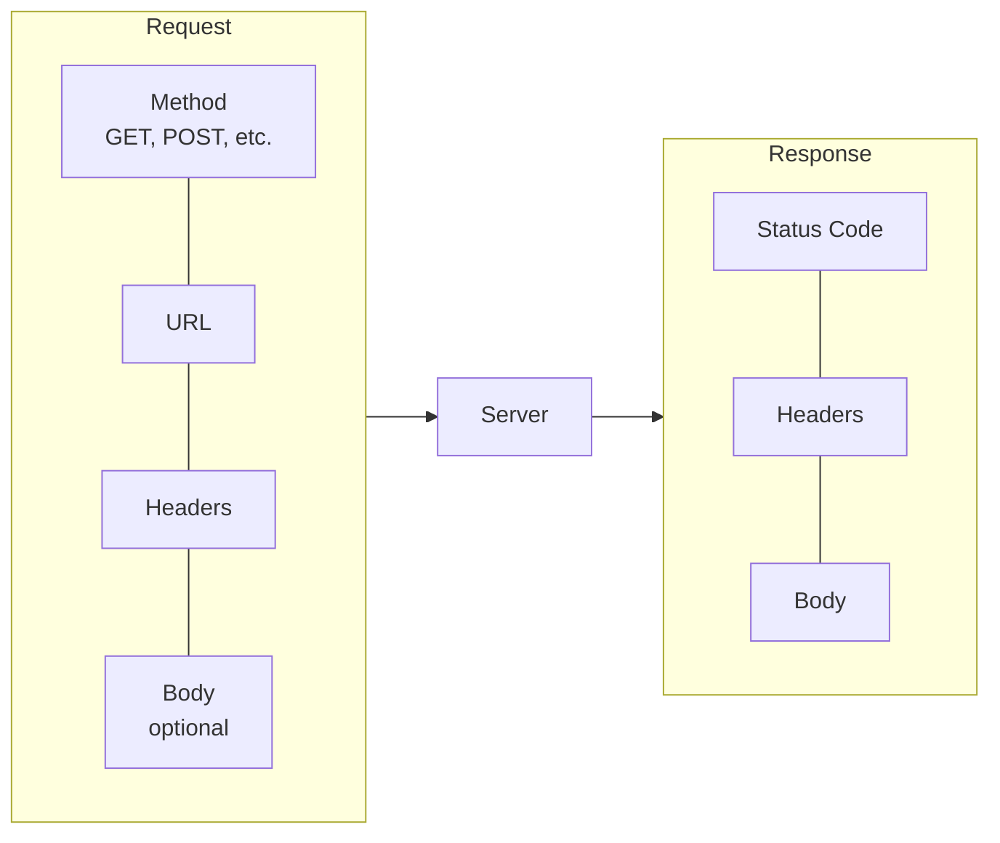

# HTTP Fundamentals

**Prerequisites**: You should already understand [What Is API Testing?](/learning-paths/api-testing/what-is-api-testing).
**Leads to**: After this, you'll be ready for [REST Architecture and API Design Principles](/learning-paths/api-testing/rest-architecture-and-api-design-principles).

A developer reading an HTTP response mostly cares whether the request succeeded. A tester reading the same response is looking for something different — not just whether it succeeded, but whether it succeeded *for the right reason*, with the right status code, the right headers, and a body that matches what was actually asked for. This module is about reading a request and response the way a tester needs to: precisely, and skeptically.

## Why This Matters

**A tester who skims for success.** Testing AtlasBank's account-balance API, a tester sends a request and sees the response come back quickly with what looks like balance data in it. Good enough, they conclude, and move on. What they didn't check: the response's actual status code is `201 Created` — the code for a new resource being created, not `200 OK` for a successful read. The balance endpoint is, for reasons no one caught during development, incorrectly returning a "created" status for a read-only request. Nothing about the visible balance data hints at this; only checking the status code itself reveals it.

**A tester who reads precisely.** A different tester checks three things on every response, as a habit: the status code, the headers relevant to the request, and the body's structure and values — not just whether *a* response came back, but whether every part of it is what it should actually be. The wrong status code on the balance endpoint is caught immediately, before the feature ships, because status code was never treated as a formality to skip past.

The difference isn't tooling — both testers could use the exact same API client. It's whether reading the response is a habit of precision or a glance for "did something come back."

## What HTTP Fundamentals Covers

**HTTP methods** state the intent of a request — what the caller is asking the server to do:

| Method | Intent | Typical Use |
|---|---|---|
| `GET` | Retrieve data, no side effects | Fetching an account balance, a transaction history |
| `POST` | Create something new | Submitting a new fund transfer, adding a beneficiary |
| `PUT` | Replace an existing resource entirely | Updating a full customer profile |
| `PATCH` | Update part of an existing resource | Changing just a customer's phone number |
| `DELETE` | Remove a resource | Removing a saved beneficiary |

A tester's job includes checking that a method's actual behavior matches its stated intent — a `GET` request that has a side effect (like the balance-endpoint's incorrect `201` in this module's opening example hints at) is itself a defect worth flagging, independent of whether the visible data looks correct.

**Status codes** tell you what actually happened, grouped by their first digit:

| Range | Meaning | Common Examples |
|---|---|---|
| `2xx` | Success | `200 OK`, `201 Created`, `204 No Content` |
| `3xx` | Redirection | `301 Moved Permanently`, `304 Not Modified` |
| `4xx` | Client error — the request itself was wrong | `400 Bad Request`, `401 Unauthorized`, `403 Forbidden`, `404 Not Found` |
| `5xx` | Server error — the request was fine, the server failed | `500 Internal Server Error`, `503 Service Unavailable` |

A tester's real skill is knowing which specific code *should* apply to a given scenario, not just recognizing whether a code falls in the success or error range. A missing beneficiary lookup returning `500` instead of `404` is a real defect — the server is failing on a case it should be handling cleanly, and the difference matters to anything calling the API (a `500` typically signals "retry might help," a `404` signals "this genuinely doesn't exist").

**Headers** carry metadata about the request or response, separate from the actual data in the body — `Content-Type` (what format the body is in), `Authorization` (credentials for the request), `Cache-Control` (how the response should be cached). Testing headers matters wherever the header itself carries a real contract — an API documented to always return `Content-Type: application/json` that occasionally returns `text/plain` on an error path is a real defect a body-only check would miss entirely.

**The body** is the actual data — typically JSON for a modern API — and is where most testers focus first, correctly, since it's usually where the most defects live. But as this module's opening example shows, a correct-looking body doesn't mean the response as a whole is correct.

## When Precise HTTP Reading Matters Most

- **Any response that looks successful at a glance** — the balance-endpoint example is exactly this: fast, populated with plausible data, and wrong in a way only the status code reveals.
- **Error paths specifically** — a `4xx` versus `5xx` distinction on the exact same failure scenario tells a caller whether the problem is on their end or the server's, and getting this wrong misleads anything (a UI, another service) that reacts differently to each range.
- **APIs documented with a specific header contract** — `Content-Type`, rate-limit headers, caching headers — wherever the header itself is part of what callers are told to rely on.
- **Any request with a method that shouldn't have a side effect** — verifying a `GET` genuinely has none is a real, checkable test, not an assumption to take on faith.

Precise HTTP reading matters less for quick, exploratory smoke checks early in development, where confirming "something responds" is a reasonable first pass before deeper testing begins — precision earns its place once a feature is stable enough to test properly, echoing Manual Testing's own risk-based judgment about when full rigor is worth the investment.

## How This Works on a Real Project

AtlasBank's transaction-history API is being tested ahead of release. A tester requests a customer's transaction history for a date range with no transactions in it — a genuinely empty result, not an error. The response comes back with a `200 OK` status and an empty array, `[]`, in the body. That's correct: an empty result for a valid query is a successful request, not an error, and the tester confirms the status code reflects that correctly rather than assuming an empty body must mean something went wrong.

Testing further, the tester requests transaction history for an account number that doesn't exist at all — a case with a meaningfully different meaning than "no transactions in this range." The response comes back `200 OK` with the same empty array, `[]`. This is the real defect: a nonexistent account and a valid account with zero transactions are producing an identical response, with no way for a caller to distinguish "this account has no transactions" from "this account doesn't exist" — a distinction that matters, since one is a normal state and the other likely indicates a typo'd account number a user should be told about directly. The fix isn't a body change; it's a status code change — the nonexistent-account case should return `404`, not `200` with an empty result.

This defect is invisible to anyone checking only "does the body look reasonable" — both responses have a perfectly reasonable-looking empty array. It's caught specifically because the tester checked whether the status code correctly distinguished two scenarios that are meaningfully different, even though their bodies happened to look the same.

## Common Mistakes

**Mistake 1: Treating any response in the 2xx range as interchangeable.**
`200`, `201`, and `204` mean different things — a `POST` that creates a resource and returns `200` instead of `201`, or a `DELETE` that returns a body when `204 No Content` is the correct, empty response, are both real deviations from the code's actual meaning, not harmless variation.

**Mistake 2: Assuming an empty or minimal-looking body means something went wrong.**
As the transaction-history example shows, an empty array can be the *correct* response for a valid, empty result — the mistake is checking the status code instead of assuming.

**Mistake 3: Not distinguishing 4xx from 5xx on error paths.**
A `500` on a case that should cleanly return `404` misleads anything reacting to the error range — this is a real, reportable defect, not a cosmetic detail.

**Mistake 4: Skipping headers entirely and testing only the body.**
Wherever an API's documentation makes a specific claim about headers (`Content-Type`, caching, rate limits), that claim is testable and worth checking — skipping it leaves part of the API's actual contract unverified.

:::note From the Field
A payments team once shipped a "successful" refund flow where every test — manual and automated — checked only that the response body contained the refunded amount. It did, every time. What nobody checked was the status code: a background job silently returned `202 Accepted` (queued, not yet complete) while the test suite's assertions only looked at the body, which already showed the expected refund amount populated optimistically. Refunds that failed during actual processing left the customer's money in limbo with every test still green.
:::

:::tip Senior QA Insight
A newer tester reads a response by asking "does the data look right." A senior tester reads a response by asking "does the status code, the headers, and the data all agree with each other and with what I actually asked for" — three separate questions, not one. The data looking right is necessary but never sufficient on its own.
:::

## Best Practices

**Practice 1: Check status code, headers, and body on every response, as a habit — not just when something looks wrong.**
The balance-endpoint and transaction-history examples both show a defect invisible to a body-only check — precision has to be the default, not something reserved for when a response looks suspicious.

**Practice 2: Know which specific status code should apply before checking what actually came back.**
Recognizing "this should be a 404, not a 500" requires knowing the correct code in advance — checking only whether a code falls in the error range isn't precise enough to catch a wrong-but-still-error code.

**Practice 3: Test cases where two different real scenarios might produce the same-looking body.**
The transaction-history example's two empty-array responses are the clearest illustration — a tester who only compares bodies would call these identical when they represent meaningfully different situations.

**Practice 4: Verify a method's actual behavior matches its documented intent.**
A `GET` with a side effect, or a `DELETE` that doesn't actually remove the resource, are both real defects independent of what status code or body come back — the method's contract itself is testable.

## Mini Challenge

**Scenario**: AtlasBank's beneficiary API returns `200 OK` with `{"beneficiaries": []}` both when a customer has genuinely added zero beneficiaries, and when a customer ID sent in the request doesn't exist at all.

**Your task**: State what's wrong with this behavior, what the correct response should be for each of the two cases, and how you'd write this up as a test case that specifically catches a regression if the two cases start being conflated again.

## Key Takeaways

- A tester reads a response for precision — status code, headers, and body together — not just for whether something plausible came back.
- Status codes carry real meaning testers must verify matches the actual scenario, not just whether a code falls in the success or error range.
- Two meaningfully different real scenarios can produce identical-looking response bodies — checking only the body can miss a defect the status code would reveal immediately.
- HTTP methods carry a stated intent (no side effects for `GET`, for example) that's itself testable, independent of the response content.

---

## What You Just Learned

- How to read HTTP methods, status codes, headers, and body with a tester's precision
- Why two different real scenarios can produce identical response bodies while requiring different status codes
- How a real transaction-history defect was caught by checking status codes on cases with similar-looking bodies
- Why a response's method, status code, headers, and body all need checking — not the body alone

**Next:** [REST Architecture and API Design Principles](/learning-paths/api-testing/rest-architecture-and-api-design-principles)

## Related Topics

- [What Is API Testing?](/learning-paths/api-testing/what-is-api-testing) — Why testing at this layer catches defects UI testing structurally cannot
- [REST Architecture and API Design Principles](/learning-paths/api-testing/rest-architecture-and-api-design-principles) — How a well-designed API's structure shapes what a tester should expect from status codes and responses
- [Boundary Value Analysis](/learning-paths/manual-testing/boundary-value-analysis) — The technique this path applies to numeric and bounded API fields in later modules

## Interview Questions

**Q1: What's the difference between a 4xx and a 5xx status code, and why does the distinction matter to a tester?**

*What to look for*: A candidate who explains that 4xx signals a problem with the request itself while 5xx signals a server-side failure on an otherwise valid request — and who recognizes that returning the wrong range for a given scenario is a real, reportable defect, not a cosmetic detail.

:::note Common Interview Mistake
Many candidates answer "4xx is client error, 5xx is server error" and stop there. That's the correct definition but incomplete as an interview answer — it misses why a tester specifically cares: a wrong-range status code misleads anything that reacts differently to each range (like retry logic that only retries on 5xx). A strong answer connects the definition to a concrete testing consequence.
:::

**Q2: How would you test an API endpoint that's supposed to return an empty result for a valid, empty query?**

*What to look for*: A candidate who specifically checks that a genuinely empty result (like this module's zero-transactions case) is distinguishable from an invalid or nonexistent request (like the nonexistent-account case) — not someone who treats "returns an empty array" as sufficient verification on its own.

---

## Glossary

**HTTP Method**: The verb in an HTTP request (`GET`, `POST`, `PUT`, `PATCH`, `DELETE`) stating the caller's intent for what the server should do.

**Status Code**: A three-digit code in an HTTP response indicating the outcome of a request, grouped by its first digit into ranges with distinct meanings (success, redirection, client error, server error).

**Header**: Metadata attached to an HTTP request or response, separate from the body, carrying information like content type, authentication credentials, or caching rules.

**Idempotent (HTTP context)**: A request that produces the same server-side result no matter how many times it's repeated — `GET`, `PUT`, and `DELETE` are expected to be idempotent; `POST` is not.

## Quick Revision

Remember these five points:

✓ Check status code, headers, and body on every response — not the body alone.
✓ Status codes carry specific meaning; verify the exact code matches the scenario, not just its success/error range.
✓ Two meaningfully different real scenarios can produce identical-looking bodies — a status code can be the only thing that distinguishes them.
✓ An HTTP method's stated intent (like `GET` having no side effects) is itself testable.
✓ A 4xx-vs-5xx mismatch is a real, reportable defect, since it misleads anything reacting differently to each range.
