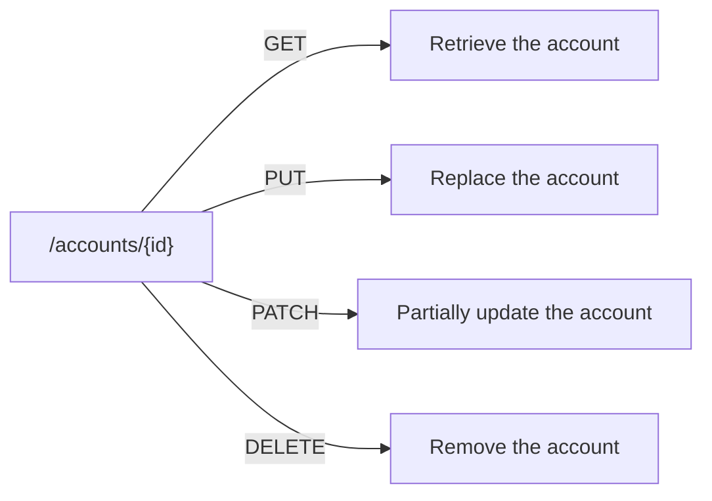

# REST Architecture and API Design Principles

**Prerequisites**: You should already understand [HTTP Fundamentals](/learning-paths/api-testing/http-fundamentals).
**Leads to**: After this, you'll be ready for [API Requests and Responses](/learning-paths/api-testing/api-requests-and-responses).

A well-designed REST API makes a set of implicit promises before you've read a single line of its documentation — a resource named in the URL, a method stating intent, a status code confirming outcome. Those promises are exactly what makes an API predictable to test. This module is about what those promises actually are, so that when one is broken, you recognize it as a real, specific defect rather than "something feels off."

## Why This Matters

**A tester with no design model.** Testing AtlasBank's account API, a tester exploring an unfamiliar endpoint set pokes at whatever routes the documentation lists, checking that each one "works" in isolation. Nothing about how the routes relate to each other stands out as worth testing — `/getAccountBalance`, `/account/update`, `/deleteTheAccount` each get checked on their own terms, and an inconsistency across them (one uses a verb in the URL, one doesn't, one uses `POST` for what's actually a deletion) doesn't register as a defect, because there's no expected pattern to compare against.

**A tester who knows REST conventions.** A different tester, seeing the same three routes, immediately flags the inconsistency: a RESTful API is expected to name *resources*, not actions, in its URLs (`/accounts/{id}`, not `/getAccountBalance`), and to let the HTTP method carry the action (`GET` to retrieve, `DELETE` to remove) rather than encoding it in the path or misusing `POST` for a delete. This inconsistency isn't just an aesthetic complaint — an API that doesn't follow its own stated conventions is harder for every future caller to predict, and often signals the underlying implementation is similarly inconsistent in ways that produce real defects (as this module's later example shows directly).

Knowing the convention is what turns "this feels inconsistent" into a specific, actionable, testable observation.

## What REST Architecture Covers

**REST (Representational State Transfer)** is an architectural style, not a protocol or a standard with a formal spec — it's a set of conventions that, followed consistently, make an API predictable. The core ideas:

**Resources, identified by URLs.** A REST API's URLs name *things* (nouns), not actions (verbs) — `/accounts/{id}`, `/beneficiaries/{id}`, `/transfers/{id}`. The action comes from the HTTP method, not the URL path.

**Methods carry the verb.** `GET /accounts/{id}` retrieves an account; `DELETE /accounts/{id}` removes it; `POST /accounts` creates a new one. The same resource path, different methods, different actions — this is the pattern a tester should expect and can specifically test for consistency against.

**Statelessness.** Each request contains everything the server needs to process it — the server doesn't rely on remembering anything from a previous request (session state lives in the client, typically via a token sent with each request). This matters to testing directly: a stateless API should behave identically whether a request is the first one sent or the hundredth, and a tester can specifically probe for accidental state leakage between requests as a real defect class.

**Consistent, meaningful status codes.** A RESTful API is expected to use status codes according to their actual HTTP meaning (covered in [HTTP Fundamentals](/learning-paths/api-testing/http-fundamentals)) — not a custom, inconsistent scheme buried in the response body instead.

**Resource nesting reflects real relationships.** `/accounts/{id}/transactions` reads as "the transactions belonging to this account" — nesting that should match a genuine ownership or containment relationship, not an arbitrary grouping.

| REST Convention | What It Promises a Caller | What Violating It Looks Like |
|---|---|---|
| Resource-named URLs | The URL tells you *what*, the method tells you *what to do with it* | `/getAccountBalance` — action baked into the URL, inconsistent with sibling routes |
| Method carries the verb | Same URL, different method, predictable different action | `POST /account/delete` — a delete disguised as a create |
| Statelessness | Identical requests behave identically, regardless of history | A second identical request behaves differently because of hidden server-side session state |
| Consistent status codes | The HTTP status itself tells you the outcome | A `200 OK` with `{"success": false}` buried in the body instead |

## When Knowing REST Conventions Matters Most

- **Exploring an unfamiliar API before writing any test cases** — recognizing the convention (or its absence) shapes what you should expect to test, exactly as this module's opening example shows.
- **Reviewing an API's design itself, not just its behavior** — a tester in a design-review conversation who can name a specific convention violation (verb-in-URL, inconsistent status code use) contributes something a purely behavioral test pass wouldn't surface.
- **Testing for statelessness violations** — hidden session state is a real, specific defect class this module's convention gives you a name and a reason to look for.
- **Predicting where an inconsistent API is likely to have other defects** — as the real-project example below shows, a design inconsistency is often a signal, not just an isolated cosmetic issue.

## When NOT to Assume Strict REST Conventions

- **Working with an API that's intentionally not RESTful** — RPC-style APIs, GraphQL, and other styles have their own conventions; forcing REST's expectations onto a non-REST API produces false "violations" that aren't actually design flaws.
- **A legacy API predating a team's current design standards** — flagging every convention deviation as a fresh defect on an API that was never intended to be strictly RESTful, and isn't being redesigned, wastes review time on something not actually actionable.
- **Internal-only APIs where the calling team explicitly agreed on a different convention** — REST's conventions exist to make an API predictable to *unfamiliar* callers; a tightly coupled internal API with its own documented convention doesn't automatically owe REST's specific promises.

## How This Works on a Real Project

AtlasBank's beneficiary API is being reviewed ahead of a new mobile client integration. A tester going through the route list notices `POST /beneficiaries/{id}/deactivate` alongside `DELETE /beneficiaries/{id}` — two different routes that both appear, from their names, to remove a beneficiary in some sense. Applying REST convention knowledge, the tester recognizes these should mean different things (`DELETE` removes the resource entirely; a `POST ...  /deactivate` action-style route, while not strictly RESTful in the pure resource-noun sense, is at least a defensible pattern for a state change short of deletion) — but the documentation doesn't actually clarify which one a caller should use for "the customer removed this beneficiary," and testing both reveals they currently do the exact same thing: a hard delete.

This is a real defect the convention knowledge specifically surfaced: `deactivate` implies a *reversible* state change (the beneficiary should be recoverable, per what the name promises), but it's wired to the same irreversible deletion logic as the `DELETE` endpoint. A caller — the new mobile client being integrated — would reasonably assume `deactivate` is safe to call more casually than a hard delete, based on the name alone, and would be wrong. The fix isn't just documentation; it's that `deactivate` needs to actually behave the way its name promises, or be removed as a redundant, misleadingly-named route.

## Common Mistakes

**Mistake 1: Treating REST convention violations as purely cosmetic.**
As the beneficiary example shows, a naming inconsistency (`deactivate` implying reversibility it doesn't have) can point directly at a real behavioral defect, not just an inconsistent-looking API.

**Mistake 2: Applying REST expectations to an API that was never meant to be RESTful.**
Flagging a GraphQL or RPC-style API for "not following REST conventions" is applying the wrong model — the convention only tells you something when the API is meant to follow it.

**Mistake 3: Only testing each route in isolation, never comparing conventions across routes.**
The opening example's inconsistent URL naming across three routes is only visible when you look at them together, not one at a time.

**Mistake 4: Assuming statelessness without testing for it.**
A stateless API is a design goal, not a guarantee — testing whether identical requests behave identically regardless of what came before is a real, specific test, not something to take on faith.

:::note From the Field
An internal platform team once maintained two nearly-identical endpoints, `/api/getUserOrders` and `/api/v2/orders/{userId}`, built by different engineers on different sprints, each following a different convention. A mobile client integrated against the older one; a web client integrated against the newer one. When the team finally deprecated the older endpoint, the mobile app broke in production for a full release cycle before anyone traced it back to the inconsistent naming nobody had flagged as a real risk — it had just been living quietly as "an old endpoint," not recognized as a convention violation worth resolving before it caused an outage.
:::

:::tip Senior QA Insight
A newer tester treats an inconsistent URL as an aesthetic complaint — worth a comment, not a bug. A senior tester treats it as a lead: an API that doesn't follow its own conventions is often a signal the underlying implementation is similarly inconsistent somewhere that actually matters, and goes looking for what that inconsistency might be hiding before dismissing it as cosmetic.
:::

## Best Practices

**Practice 1: Learn an API's own conventions before writing test cases against it.**
Whether or not it's strictly RESTful, knowing what pattern it's *trying* to follow tells you what a violation would even look like.

**Practice 2: Compare routes to each other, not just each route to its own documentation.**
Cross-route inconsistency, like this module's `deactivate`/`DELETE` example, is often invisible when testing routes one at a time.

**Practice 3: Treat a naming or convention inconsistency as a lead worth investigating, not just a style note.**
A misleading route name is frequently a symptom of a deeper behavioral inconsistency, not just a cosmetic issue to mention in passing.

**Practice 4: Know when REST conventions don't apply, and don't force them.**
Forcing REST's specific expectations onto a non-REST or legacy API produces noise, not real findings — apply the right model for what you're actually testing.

## Mini Challenge

**Scenario**: AtlasBank's card API has two routes: `POST /cards/{id}/freeze` and `PUT /cards/{id}` (used generally to update a card's status field, including to `"frozen"`).

**Your task**: Identify what a tester should specifically check to confirm these two routes don't produce inconsistent results for the same intended outcome (freezing a card), and state what convention-based expectation makes this worth testing in the first place.

## Key Takeaways

- REST is a set of conventions — resource-named URLs, methods carrying the verb, statelessness, consistent status codes — not a formal protocol, but a testable pattern once you know it.
- A convention violation is often a lead pointing at a real behavioral defect, not just a cosmetic inconsistency, as the beneficiary `deactivate`/`DELETE` example shows.
- REST conventions only apply where an API is actually meant to be RESTful — forcing them onto a non-REST or legacy API produces false findings.
- Comparing routes to each other, not just each route to its own documentation, is where cross-route inconsistencies actually surface.

---

## What You Just Learned

- The core REST conventions — resource-named URLs, method-carried verbs, statelessness, consistent status codes — and what each one promises a caller
- Why a naming inconsistency across routes can point directly at a real behavioral defect, not just a style issue
- When REST conventions apply, and when forcing them onto a non-REST or legacy API produces noise instead of real findings
- How comparing routes to each other, not testing each in isolation, surfaces defects a single-route pass would miss

**Next:** [API Requests and Responses](/learning-paths/api-testing/api-requests-and-responses)

## Related Topics

- [HTTP Fundamentals](/learning-paths/api-testing/http-fundamentals) — The status code and method literacy this module's conventions build directly on
- [What Is API Testing?](/learning-paths/api-testing/what-is-api-testing) — Why testing at the API layer catches defects a UI pass structurally cannot
- [Test Design Fundamentals](/learning-paths/manual-testing/test-design-fundamentals) — The systematic, pattern-based thinking this module applies to API design itself

## Interview Questions

**Q1: What does it mean for an API to be RESTful, and why does that matter to a tester?**

*What to look for*: A candidate who names specific conventions (resource-named URLs, method-carried verbs, statelessness) rather than a vague "it uses HTTP" — and who connects the conventions to what they make testable, not just describes them as an abstract standard.

:::note Common Interview Mistake
Many candidates answer "REST means it uses HTTP methods and JSON." That's true but misses what actually matters for testing — a strong answer names the specific conventions (nouns in URLs, verbs in methods, statelessness) and explains how a *violation* of one is a real, findable defect, not just a definition to recite.
:::

**Q2: How would you test whether an API is genuinely stateless?**

*What to look for*: A candidate who describes a concrete approach — sending the same request multiple times, or in a different order relative to other requests, and checking whether the response or behavior changes in a way it shouldn't — rather than treating statelessness as something to assume from the documentation alone.

---

## Glossary

**REST (Representational State Transfer)**: An architectural style for APIs built around resources identified by URLs, actions carried by HTTP methods, and stateless requests — a set of conventions, not a formal protocol.

**Resource**: The "thing" an API URL identifies — an account, a beneficiary, a transfer — as opposed to an action, which is carried by the HTTP method instead.

**Statelessness**: The property of an API where each request contains everything needed to process it, with no reliance on the server remembering anything from a previous request.

## Quick Revision

Remember these five points:

✓ REST is a set of conventions — resource-named URLs, method-carried verbs, statelessness, consistent status codes — not a formal protocol.
✓ A naming or convention inconsistency across routes is often a lead pointing at a real behavioral defect, not just cosmetic noise.
✓ Compare routes to each other, not just each route to its own documentation — cross-route inconsistencies are invisible one route at a time.
✓ REST conventions only apply where an API is meant to be RESTful — don't force them onto GraphQL, RPC-style, or legacy APIs.
✓ Statelessness is a testable claim, not something to assume — send identical requests in different contexts and check for unexpected behavior differences.
