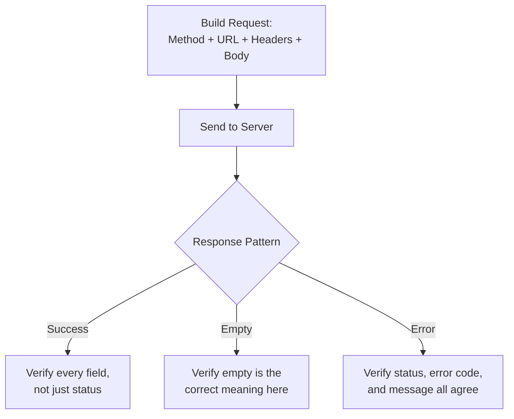

# API Requests and Responses

**Prerequisites**: You should already understand [REST Architecture and API Design Principles](/learning-paths/api-testing/rest-architecture-and-api-design-principles) and the rest of [Section 1](/learning-paths/api-testing/section-1-review).
**Leads to**: After this, you'll be ready for [Headers, Parameters, and Payload Validation](/learning-paths/api-testing/headers-parameters-and-payload-validation).

Section 1 gave you the vocabulary — methods, status codes, REST conventions. This module puts that vocabulary to work by following one real request from the moment it's built to the moment its response is fully read, and by naming the handful of response *patterns* that recur across almost every API — success, empty, and error — so you recognize each one on sight instead of reasoning about it from scratch every time.

## Why This Matters

**A tester who checks the destination only.** Testing AtlasBank's fund-transfer API, a tester sends a request, sees a `200 OK` come back, and calls the test passed. What they skipped: whether the request itself was actually well-formed for what the test was supposed to exercise. The test was meant to verify a transfer *without* a memo field — but the test data still had a leftover `memo: ""` from a copied request, an empty string rather than the field's true absence. The response looks identical either way, so the test "passes," without ever actually exercising the no-memo case it was written for.

**A tester who verifies the whole lifecycle.** A different tester checks the outgoing request as carefully as the incoming response — confirming the memo field is genuinely absent from the JSON body, not just empty, before treating the response as evidence of anything. The mistake in the first tester's test data is caught immediately, because the request itself was inspected, not just its result.

A request/response pair is one connected unit — testing only half of it means half your test's actual meaning is unverified.

## What This Module Covers

**The request lifecycle**, as a tester needs to see it, has four parts worth deliberately checking, not just assembling on autopilot:

1. **Method** — states the intent (`GET`, `POST`, `PUT`, `PATCH`, `DELETE`), covered in [HTTP Fundamentals](/learning-paths/api-testing/http-fundamentals).
2. **URL** — identifies the resource, and often carries parameters (covered in depth in the next module).
3. **Headers** — carry request metadata (also covered in depth next module).
4. **Body** — the actual data being sent, present on `POST`/`PUT`/`PATCH`, absent on a typical `GET`.

**URL anatomy**, using a real AtlasBank endpoint:

```text
POST /api/v1/accounts/ACC-4471829/transfers
     └─ version   └─ resource   └─ path param   └─ sub-resource (action)
```

A tester reads this and immediately knows: this creates something (`POST`), under a specific account (`ACC-4471829` as a path parameter, not a query parameter — meaning it identifies *which* resource, not a filter or option), in the transfers sub-resource of that account.

**Request body**, for the same transfer:

```json
{
  "beneficiaryId": "BEN-88213",
  "amount": 250.00,
  "currency": "USD"
}
```

**A representative success response**:

```json
{
  "transferId": "TXN-902214",
  "status": "completed",
  "amount": 250.00,
  "currency": "USD",
  "processedAt": "2026-08-04T14:22:03Z"
}
```

**Three response patterns recur across nearly every API**, and recognizing each one on sight is a genuine time-saver:

| Pattern | What It Looks Like | What a Tester Checks |
|---|---|---|
| **Success** | `2xx` status, body matches the requested resource's shape | Every field present and correctly valued, not just "a body came back" |
| **Empty** | `2xx` status, body is `[]`, `{}`, or a field set to `null`/`0` | Whether "empty" is the *correct* meaning here, or masking a different real state (as in [HTTP Fundamentals](/learning-paths/api-testing/http-fundamentals)' transaction-history example) |
| **Error** | `4xx`/`5xx` status, body typically contains an error code and message | Whether the status code, error code, and message all agree with each other and with the actual cause |



## When Lifecycle-Level Verification Matters Most

- **Any test where the request's exact shape is part of what's being tested** — as the opening memo example shows, an unverified request can silently fail to exercise the scenario the test was written for.
- **Any response that appears empty** — distinguishing a correct empty state from a masked error is a recurring, real defect class, not a one-off concern.
- **Any error response** — the body's error code and message should agree with the status code and with the actual cause; a mismatch misleads anything parsing the error programmatically.
- **Regression suites built by copying and modifying existing requests** — the opening example's leftover `memo: ""` is exactly the kind of defect that creeps in through copy-and-modify test data, not through building a request from scratch.

Full lifecycle verification matters less for a quick exploratory check confirming an endpoint is reachable at all — that's a legitimate first pass, not the final word on correctness.

## How This Works on a Real Project

AtlasBank's statements API (`GET /api/v1/accounts/{accountId}/statements?month=2026-07`) is being tested for a customer with no transactions in the requested month. The response comes back `200 OK` with:

```json
{
  "accountId": "ACC-4471829",
  "month": "2026-07",
  "transactions": [],
  "openingBalance": 5000.00,
  "closingBalance": 5000.00
}
```

A tester checking only the status code would call this correct — success, empty transaction list, seems reasonable. Reading the full response against what the request actually asked for reveals a real defect: `openingBalance` and `closingBalance` are identical, which is only correct if genuinely nothing happened in the account all month — but this specific test account has interest accrual configured to post automatically at month-end, even with zero customer-initiated transactions. The two balances being identical means interest accrual silently didn't run for this account, an inconsistency invisible unless you check the response body's *internal consistency*, not just its structure.

This is caught specifically because the response was read as a whole — checking whether its fields agree with each other and with what the request should have produced, not just whether a plausible-looking body came back.

## Common Mistakes

**Mistake 1: Treating "a response came back" as sufficient verification.**
As the statements example shows, a structurally valid, plausible-looking response can still contain an internal inconsistency only visible by checking fields against each other.

**Mistake 2: Not verifying the request itself before trusting the response as evidence.**
The opening memo example: an unverified request can silently fail to test what it was written to test, making the response's "pass" meaningless.

**Mistake 3: Treating every empty response the same way.**
An empty array can be correct or a masked error, exactly as [HTTP Fundamentals](/learning-paths/api-testing/http-fundamentals) covered — each empty response needs its own judgment about which case applies.

**Mistake 4: Not checking whether an error response's code, message, and status agree with the actual cause.**
A `400 Bad Request` with an error message describing an authorization failure is internally inconsistent — the wrong error code for what actually happened, misleading to anything parsing it.

:::note From the Field
A regression suite for an inventory API was rebuilt after a framework migration, and every test was copied over quickly to hit a deadline. Months later, someone noticed half the "successful update" test cases were actually sending a request body left over from a different, older test case — still returning `200 OK`, because the endpoint happily accepted the wrong fields and ignored the rest. The suite had been green the entire time while silently testing almost nothing about the actual update logic it was named after.
:::

:::tip Senior QA Insight
A newer tester, copying an existing test case to build a new one quickly, checks that the new test passes and moves on. A senior tester checks that the new test's *request* actually matches the new scenario's intent — field by field — before trusting a passing result as evidence of anything, because a copied request is exactly where a stale, unintended value hides longest.
:::

## Best Practices

**Practice 1: Verify the request before trusting the response.**
Especially in copied or reused test data, confirm the request genuinely represents the scenario under test — the opening memo example is the exact failure mode this catches.

**Practice 2: Read a response for internal consistency, not just structural validity.**
The statements example's matching opening/closing balances is only a red flag once you're checking fields against each other and against domain knowledge (interest accrual should have changed the balance).

**Practice 3: Classify every response into success, empty, or error before deciding what to check.**
Each pattern has a different verification focus — treating all three the same way misses what's specific to each.

**Practice 4: Confirm an error response's code, status, and message all agree.**
A mismatch between any two of these is a real, reportable defect independent of whether the request was correctly rejected.

## When NOT to Verify the Full Lifecycle

- **Smoke-testing that an endpoint is reachable at all**, early in a feature's development — confirming a response comes back is a legitimate, deliberately shallow first check before deeper testing is warranted.
- **A response whose only meaningful content is the status code** (e.g., a `204 No Content` on a successful `DELETE`) — there's no body to read for internal consistency, so lifecycle verification here is naturally lighter.

## Mini Challenge

**Scenario**: AtlasBank's card-freeze endpoint (`POST /api/v1/cards/{cardId}/freeze`) returns `200 OK` with `{"cardId": "CARD-5521", "status": "frozen", "frozenAt": null}`.

**Your task**: Identify the internal inconsistency in this response, and state what you'd check on the request side to rule out a test-data problem before reporting it as a response defect.

## Key Takeaways

- A request and its response are one connected unit — verifying only the response half of it can make a test's "pass" meaningless if the request itself wasn't what the test intended.
- Success, empty, and error are the three response patterns nearly every API produces, and each needs a different verification focus.
- Reading a response for internal consistency (fields agreeing with each other and with domain knowledge) catches defects a structural-validity check alone misses.
- An error response's status code, error code, and message should all agree with the actual cause — a mismatch is a real, reportable defect.

---

## What You Just Learned

- How to read a request's full lifecycle — method, URL, headers, body — with a tester's precision
- The three response patterns (success, empty, error) that recur across nearly every API, and what each one requires you to check
- Why verifying the request itself matters as much as verifying the response, especially in copied or reused test data
- How a real internal-consistency defect (mismatched account balances) was caught by reading a response as a whole, not just checking its structure

**Next:** [Headers, Parameters, and Payload Validation](/learning-paths/api-testing/headers-parameters-and-payload-validation)

## Related Topics

- [HTTP Fundamentals](/learning-paths/api-testing/http-fundamentals) — The status code and method literacy this module's response patterns build on directly
- [REST Architecture and API Design Principles](/learning-paths/api-testing/rest-architecture-and-api-design-principles) — The URL and resource conventions this module's URL anatomy example applies
- [Headers, Parameters, and Payload Validation](/learning-paths/api-testing/headers-parameters-and-payload-validation) — Where this module's request anatomy gets examined field by field

## Interview Questions

**Q1: What would make you distrust a response even though its status code and body both look correct?**

*What to look for*: A candidate who describes checking internal consistency — fields agreeing with each other and with domain knowledge — like this module's statements example, rather than stopping at "status code and body look fine."

:::note Common Interview Mistake
Many candidates answer "I'd check the status code and make sure the body has the right fields." That's necessary but incomplete — it misses internal consistency entirely. A strong answer names a specific check, like whether two related fields (opening/closing balance, a status field and its timestamp) actually agree with each other.
:::

**Q2: Why might verifying the request matter as much as verifying the response?**

*What to look for*: A candidate who recognizes that an unverified request can silently fail to exercise the scenario a test was written for, making a "passing" response meaningless — ideally citing a concrete example like reused test data carrying over an unintended field value.

---

## Glossary

**Request Lifecycle**: The full path of one API interaction — building the request (method, URL, headers, body), sending it, and receiving and verifying the response.

**Response Pattern**: One of the recurring shapes an API response takes — success, empty, or error — each requiring a different verification focus.

**Internal Consistency**: Whether a response's own fields agree with each other and with domain knowledge, independent of whether the response is structurally valid.

## Quick Revision

Remember these five points:

✓ A request and response are one connected unit — verify both, not just the response.

✓ Classify every response as success, empty, or error, and check what's specific to that pattern.

✓ Read a response for internal consistency — fields agreeing with each other and with domain knowledge — not just structural validity.

✓ An error response's status code, error code, and message should all agree with the actual cause.

✓ Verifying the request itself matters most in copied or reused test data, where an unintended field value can silently invalidate what a test is actually exercising.
