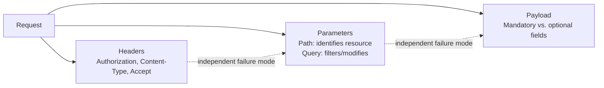

# Headers, Parameters, and Payload Validation

**Prerequisites**: You should already understand [API Requests and Responses](/learning-paths/api-testing/api-requests-and-responses).
**Leads to**: After this, you'll be ready for [Data Validation and Response Verification](/learning-paths/api-testing/data-validation-and-response-verification).


A request can be malformed in three genuinely different places — its headers, its parameters, or its body — and each failure mode looks different, gets caught (or missed) differently, and points at a different part of the implementation. This module treats each one as its own testable surface, rather than lumping "the request was wrong" into one undifferentiated category.

## Why This Matters

**A tester who tests only the body.** Testing AtlasBank's transfer API, a tester spends real effort on payload edge cases — missing amount, negative amount, wrong currency — and calls the request-validation testing complete. What never gets tested: what happens when the `Authorization` header is present but expired, or when `Content-Type` says `text/plain` while the body is actually JSON. Both are real, common failure modes with nothing to do with the payload itself, and neither gets any coverage.

**A tester who tests all three surfaces.** A different tester treats headers, parameters, and body as three separate checklists. Testing the expired-token case directly reveals a real defect: the API returns `200 OK` with stale cached data instead of `401 Unauthorized` — a defect entirely invisible to anyone testing only payload edge cases, because it has nothing to do with the payload at all.

Each surface fails independently, so each needs its own deliberate coverage — not just extra effort on whichever surface happens to feel most interesting.

## What This Module Covers

**Request headers worth testing deliberately**:

| Header | Purpose | What to Test |
|---|---|---|
| `Authorization` | Carries credentials (e.g., `Bearer <token>`) | Missing, malformed, expired, and valid-but-wrong-user tokens |
| `Content-Type` | States the body's format | Correct value, missing header, mismatched value (header says JSON, body isn't) |
| `Accept` | States what format the client wants back | Requesting a format the server doesn't support |
| Correlation/Request ID | Traces a request across services (e.g., `X-Request-ID`) | Present in both request and response, useful for tying a defect report to server-side logs |

**Response headers worth testing deliberately**: the same `Content-Type` claim should hold on every response — including error responses, a case easy to overlook, as [Section 1's Knowledge Check](/learning-paths/api-testing/section-1-solutions) covered directly.

**Path parameters vs. query parameters** — a distinction with real testing implications, not just a syntax difference:

```text
GET /api/v1/accounts/ACC-4471829/transactions?type=debit&limit=20
                      └── path parameter ──┘  └──── query parameters ────┘
```

**Path parameters** identify *which* resource (`ACC-4471829` — this specific account; without it, there's no resource to act on). **Query parameters** filter, sort, or modify a request against an already-identified resource (`type=debit`, `limit=20`) and are typically optional, with the server expected to apply sensible defaults when they're absent.

| | Path Parameter | Query Parameter |
|---|---|---|
| **Role** | Identifies the resource | Filters/modifies the request |
| **Typically** | Required — the URL doesn't resolve without it | Optional, with a sensible default |
| **What breaks if invalid** | Usually a `404` (resource doesn't exist) | Usually a `400` (the request itself is malformed) — a genuinely different failure mode worth confirming |

**Request payload validation** — the JSON body itself:

```json
{
  "beneficiaryId": "BEN-88213",
  "amount": 250.00,
  "currency": "USD",
  "memo": "Rent payment"
}
```

For a payload like this, a tester's job is identifying which fields are **mandatory** (`beneficiaryId`, `amount`, `currency` — the transfer can't be processed without them) versus **optional** (`memo` — nice to have, absence shouldn't block the request), and testing both the missing-mandatory-field case (should reject cleanly) and the missing-optional-field case (should succeed without it) as two genuinely distinct scenarios.



## When Testing All Three Surfaces Matters Most

- **Any endpoint accepting authentication** — the header surface's expired/malformed/wrong-user cases are a distinct, recurring defect class, exactly as the opening example shows.
- **Endpoints with both path and query parameters** — confirming each behaves according to its role (required-and-404-on-invalid vs. optional-and-400-on-malformed) catches a real category of implementation mistakes.
- **Any payload with a mix of mandatory and optional fields** — testing only the "happy path with everything filled in" leaves the mandatory/optional boundary completely unverified.
- **APIs where a UI's client-side validation might mask a header, parameter, or payload issue** — as [What Is API Testing?](/learning-paths/api-testing/what-is-api-testing) established, anything reachable by direct API call needs its own coverage independent of what a UI happens to allow.

## How This Works on a Real Project

AtlasBank's beneficiary-list endpoint (`GET /api/v1/accounts/{accountId}/beneficiaries?status=active`) is being tested. Path parameter testing confirms an invalid `accountId` correctly returns `404`. Query parameter testing checks what happens when `status` is omitted entirely (should default to returning all beneficiaries, active and inactive) versus set to an invalid value like `status=archived`, a value the API doesn't actually support.

The real defect surfaces here: omitting `status` correctly returns all beneficiaries, but `status=archived` — an invalid value — also silently returns all beneficiaries, with a `200 OK`, instead of a `400 Bad Request` flagging the unsupported filter value. A caller who mistypes the filter value gets no signal that their filter was ignored; they see a full beneficiary list and reasonably assume the filter was applied correctly, when it silently wasn't. This is a real defect a tester who only checked "does providing a query parameter work" would miss — it's only visible when specifically testing an *invalid* query parameter value, not just its presence or absence.

## Common Mistakes

**Mistake 1: Testing only the payload, skipping headers and parameters entirely.**
As the opening authorization example shows, header-layer defects have nothing to do with the payload and get zero coverage from payload-focused testing alone.

**Mistake 2: Treating "provide a query parameter" and "provide an invalid query parameter value" as the same test.**
The beneficiary `status=archived` example is caught only by testing an actual invalid value, not just confirming the parameter is accepted at all.

**Mistake 3: Not distinguishing mandatory from optional fields before testing missing-field cases.**
Testing a missing optional field expecting rejection, or a missing mandatory field expecting success, both produce a confusing, incorrect test result if the mandatory/optional boundary was never explicitly identified first.

**Mistake 4: Assuming a path parameter and a query parameter should fail the same way when invalid.**
An invalid path parameter (resource doesn't exist) and an invalid query parameter (malformed filter) are different failure modes and typically warrant different status codes — treating them identically misses a real distinction worth testing.

:::note From the Field
A search API accepted a `sortBy` query parameter with a small set of valid values. A client integration once sent `sortBy=priceAsc` — a value that looked plausible but wasn't in the actual allowed set (`price_asc` was correct). The API silently ignored the unrecognized value and returned results in default order instead of erroring. The client team spent most of a day debugging their own sorting logic before realizing the API had never validated the parameter at all — it just quietly accepted anything and did nothing with values it didn't recognize.
:::

:::tip Senior QA Insight
A newer tester tests a parameter by confirming a valid value works. A senior tester also tests an *invalid* value and checks what actually happens to it — accepted and ignored, or rejected with a clear error — because "accepted and silently ignored" is a specific, common failure mode that a valid-value-only test will never surface.
:::

## Best Practices

**Practice 1: Maintain three separate mental checklists — headers, parameters, payload — for every endpoint.**
Each surface fails independently, exactly as this module's opening example shows; a single combined "request testing" pass tends to under-cover whichever surface feels least interesting.

**Practice 2: Explicitly test an invalid (not just missing) value for every query parameter.**
The beneficiary example's real defect was only visible by testing an actual invalid value, not by confirming the parameter's presence works.

**Practice 3: Identify a payload's mandatory/optional boundary before writing missing-field test cases.**
This turns "test missing fields" from a vague instruction into a specific, complete set of test cases — one per mandatory field (expect rejection) and one per optional field (expect success without it).

**Practice 4: Confirm response headers, not just request headers.**
`Content-Type` and similar claims should hold on every response, including error paths — a claim worth verifying explicitly, not assuming.

## When NOT to Test Every Header

- **Headers with no documented contract or business meaning** (some purely infrastructural headers added by a load balancer or proxy) — testing these provides little value unless there's a specific, stated reason to care about their content.
- **A stable, previously-verified authentication mechanism reused unchanged across many endpoints** — full authorization-header testing belongs on the authentication module itself (Section 3) and doesn't need to be re-run exhaustively on every single endpoint that happens to require it, provided the mechanism itself is tested thoroughly once.

## Mini Challenge

**Scenario**: AtlasBank's transfer-history endpoint (`GET /api/v1/accounts/{accountId}/transfers?from={date}&to={date}&status=pending`) is new. The `status` parameter accepts `pending`, `completed`, or `failed`.

**Your task**: List one test case for the path parameter, one for a query parameter's missing case, one for a query parameter's invalid-value case, and one for a header. For each, state what specific defect class it's designed to catch.

## Key Takeaways

- Headers, path/query parameters, and the request payload are three independent validation surfaces — a defect in one is invisible to tests targeting only another.
- Path parameters identify the resource (typically required, invalid usually means `404`); query parameters filter or modify the request (typically optional, invalid usually means `400`) — a real distinction worth testing separately.
- Testing only "does a query parameter work" misses defects only visible when testing an actual invalid value, as the beneficiary `status=archived` example shows.
- Identifying a payload's mandatory/optional field boundary before writing missing-field test cases turns a vague instruction into a specific, complete set of test cases.

---

## What You Just Learned

- Why headers, parameters, and payload are three independent validation surfaces, each needing its own deliberate test coverage
- The real difference between path parameters (identify the resource) and query parameters (filter/modify the request), including their typically different failure modes
- How to identify a payload's mandatory/optional field boundary before writing missing-field test cases
- How a real defect (a silently-ignored invalid filter value) was caught by testing an invalid query parameter value specifically, not just its presence or absence

**Next:** [Data Validation and Response Verification](/learning-paths/api-testing/data-validation-and-response-verification)

## Related Topics

- [API Requests and Responses](/learning-paths/api-testing/api-requests-and-responses) — The full request/response lifecycle this module examines surface by surface
- [What Is API Testing?](/learning-paths/api-testing/what-is-api-testing) — Why requests unreachable through a UI's validation still need their own coverage
- [Data Validation and Response Verification](/learning-paths/api-testing/data-validation-and-response-verification) — Where this module's payload literacy extends into field-level type, format, and business-rule validation

## Interview Questions

**Q1: What's the difference between a path parameter and a query parameter, and why does it matter for testing?**

*What to look for*: A candidate who explains path parameters identify the resource (typically required) while query parameters filter or modify the request (typically optional) — and who connects this to different expected failure modes (404 vs. 400) rather than treating the two as interchangeable syntax.

:::note Common Interview Mistake
Many candidates answer "path parameters are in the URL path and query parameters come after the question mark" — a syntactic answer that misses the testing implication entirely. A strong answer explains *why* the distinction matters: each typically fails differently when invalid, and that difference is itself testable.
:::

**Q2: How would you test a query parameter that filters results by a fixed set of allowed values?**

*What to look for*: A candidate who explicitly tests an invalid value (not just a valid one, and not just the parameter's absence), similar to this module's `status=archived` example — recognizing that "does the parameter work" and "what happens with an invalid value" are two different, both-necessary tests.

---

## Glossary

**Path Parameter**: A value embedded directly in a URL's path that identifies a specific resource, typically required for the URL to resolve at all.

**Query Parameter**: A key-value pair appended to a URL after `?`, typically used to filter, sort, or modify a request against an already-identified resource, typically optional.

**Mandatory Field**: A payload field without which a request cannot be meaningfully processed and should be rejected.

**Optional Field**: A payload field whose absence should not prevent a request from succeeding.

## Quick Revision

Remember these five points:

✓ Headers, parameters, and payload are three independent validation surfaces — test each deliberately, not just the one that feels most interesting.
✓ Path parameters identify the resource (usually required, invalid usually means 404); query parameters filter/modify the request (usually optional, invalid usually means 400).
✓ Test an actual invalid query parameter value, not just its presence or absence — a real defect can hide specifically in the invalid-value case.
✓ Identify a payload's mandatory/optional field boundary before writing missing-field test cases.
✓ Response headers (like Content-Type) deserve the same verification as request headers, including on error paths.
