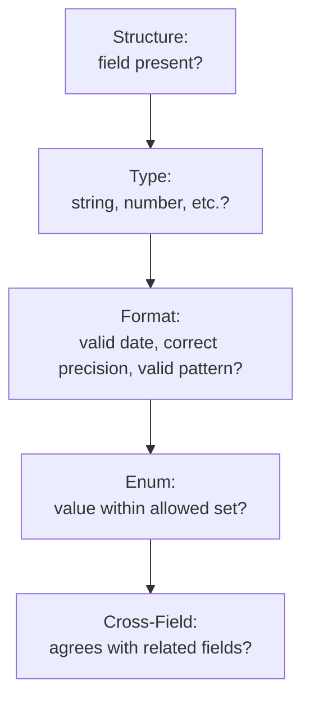

# Data Validation and Response Verification

**Prerequisites**: You should already understand [Headers, Parameters, and Payload Validation](/learning-paths/api-testing/headers-parameters-and-payload-validation).
**Leads to**: After this, you'll be ready for [API Authentication](/learning-paths/api-testing/api-authentication).

The previous module asked whether a request was structurally well-formed. This module asks a deeper question: even when a response is structurally perfect — every field present, every type correct — is the *data itself* actually right? A field can have exactly the right shape and still be wrong in a way structure alone can't catch. This is where response verification gets genuinely precise.

## Why This Matters

**A tester who checks structure only.** Testing AtlasBank's account-details API, a tester confirms every expected field is present (`accountId`, `balance`, `currency`, `interestRate`) and each has the right type (string, number, string, number). Structurally, the response is flawless. What goes unchecked: `balance` is `1234.5` — a number, correctly typed, but with only one decimal place for a currency field that should always carry exactly two (`1234.50`). Nothing about the type check catches this; a number is a number whether it's `1234.5` or `1234.50` to a type validator.

**A tester who validates data, not just structure.** A different tester specifically checks decimal precision on every currency field, not just its type. The single-decimal-place value is caught immediately — a real defect, since a downstream system expecting exactly two decimal places (a standard financial-data assumption) could misinterpret or reject this value.

Structure tells you a field exists and has the right shape. It tells you nothing about whether the value inside that shape is actually correct.

## What This Module Covers

**Type validation** confirms a field's declared type matches what it actually contains — a `string` field shouldn't silently contain a number-as-string that breaks downstream parsing, a `number` field shouldn't contain a string.

**Format validation** goes one level past type — a string can be correctly typed and still be the wrong *format*: a date string that isn't valid ISO 8601, an account number that doesn't match the expected pattern.

**Enum validation** checks that a field restricted to a fixed set of values (`status: "pending" | "completed" | "failed"`) never contains a value outside that set — a response returning `status: "processing"` when the documented enum doesn't include it is a real contract violation, not a minor variance.

**Null and empty-collection handling** — a `null` value and a missing field are not the same thing, and neither is the same as an empty array `[]` or empty object `{}`. Each carries a distinct meaning a tester needs to verify is used correctly and consistently:

| Value | Typical Meaning | What to Verify |
|---|---|---|
| Field absent entirely | The field genuinely doesn't apply here | Documented as expected, not an accidental omission |
| `null` | The field applies but has no current value | Distinguished from "doesn't apply" — a real, deliberate distinction worth testing |
| `[]` (empty array) | Zero items exist, the query itself was valid | Distinguished from an error masked as an empty result (per [HTTP Fundamentals](/learning-paths/api-testing/http-fundamentals)) |
| `0` / `""` | A genuine zero-value or empty string | Distinguished from a missing value that should have been `null` instead |

**Nested objects and arrays** need the same field-by-field rigor applied recursively — a `beneficiary` object nested inside a `transfer` response needs its own type, format, and enum checks, not just a check that the nested object exists.

```json
{
  "transferId": "TXN-902214",
  "status": "completed",
  "amount": 250.00,
  "beneficiary": {
    "beneficiaryId": "BEN-88213",
    "accountNumber": "****4821",
    "bankCode": "ATLB-US-01"
  }
}
```

Here, `beneficiary.accountNumber` deserves its own format check (masked correctly? consistent masking pattern across the API?) independent of whether the outer `transfer` object is otherwise correct.

**Cross-field (business rule) validation** checks relationships *between* fields, which no single-field check can catch on its own — this module's earlier statements example (opening balance equals closing balance despite expected interest accrual) is exactly this category, and it recurs constantly in financial APIs: a `completedAt` timestamp earlier than a `createdAt` timestamp, a `discountedTotal` greater than `originalTotal`, a `status: "completed"` transfer with `processedAt: null`.



## When Deep Data Validation Matters Most

- **Financial fields specifically** — currency amounts, decimal precision, and cross-field balance consistency, exactly as this module's opening and statements examples show, since a subtly wrong number is often the costliest kind of API defect.
- **Any field restricted to a documented enum** — a value outside the documented set is a contract violation that can break anything (a UI dropdown, a downstream service) written to expect only the documented values.
- **Nested objects and arrays**, applied with the same rigor as top-level fields — a nested object "existing" is not the same as its own fields being individually correct.
- **Any pair of fields with a logical relationship** — timestamps that should be ordered, totals that should reconcile, a status that should imply a corresponding set of other field values.

Full field-by-field data validation matters less on a field with no meaningful internal structure or cross-field relationship to check (a simple, unconstrained free-text `memo` field, for instance) — effort is better spent where a real, checkable rule actually exists.

## How This Works on a Real Project

AtlasBank's fund-transfer response includes a nested `exchangeRate` object for international transfers:

```json
{
  "transferId": "TXN-902215",
  "status": "completed",
  "sourceAmount": 500.00,
  "sourceCurrency": "USD",
  "exchangeRate": {
    "rate": 0.9123,
    "targetAmount": 456.15,
    "targetCurrency": "EUR"
  }
}
```

Type and format validation confirm every field is correctly typed and formatted. Cross-field validation goes further: does `sourceAmount × rate` actually equal `targetAmount`? Calculating it — `500.00 × 0.9123 = 456.15` — confirms it does, for this transfer. But testing a second transfer with a less "clean" amount, `$333.33`, reveals the real defect: `333.33 × 0.9123 = 304.09...`, and the response's `targetAmount` shows `304.10` — rounded up, when the currency-conversion rule the business actually specifies is to always round *down* (in the business's favor, per AtlasBank's stated compliance policy on currency conversion), never up. The first transfer's round-number amount happened to not expose the rounding-direction bug at all; only a deliberately messier value — precisely the kind of realistic, non-round test data [Test Data Design](/learning-paths/manual-testing/test-data-design) already taught you to prefer — surfaces it.

## Common Mistakes

**Mistake 1: Stopping at type validation and treating it as complete data validation.**
As the opening balance example shows, a correctly-typed number can still have the wrong precision — type and format are two separate checks.

**Mistake 2: Testing only clean, round test values.**
The exchange-rate example's real rounding defect only appears with a realistic, non-round amount — clean test data ($500.00 exactly) hid it entirely.

**Mistake 3: Checking that a nested object exists without validating its own fields.**
A `beneficiary` or `exchangeRate` object "being present" says nothing about whether its own contents are individually correct — nested structures need the same field-level rigor as the top level.

**Mistake 4: Treating `null`, a missing field, and an empty value as interchangeable.**
Each carries a distinct, real meaning; conflating them either in the API's own implementation or in how a tester interprets a response can hide or misreport a real defect.

:::note From the Field
A billing system's test suite validated invoice totals using round test amounts — $100.00, $250.00 — for months, all passing. A production customer with a genuinely irregular subscription (prorated mid-cycle, a partial refund applied) received an invoice off by one cent, traced back to a rounding function that truncated instead of rounding on values with more than two significant decimal digits internally. Every clean test amount happened to avoid the exact condition that triggered it.
:::

:::tip Senior QA Insight
A newer tester picks test data that's easy to verify by hand — round numbers, clean values. A senior tester deliberately picks messy, realistic values specifically *because* they're harder to verify by hand, knowing that's exactly where a calculation or rounding defect is most likely to be hiding, undisturbed by any test that never used a value like it.
:::

## Best Practices

**Practice 1: Validate in layers — structure, then type, then format, then enum, then cross-field — deliberately, not all at once.**
Each layer catches something the one before it can't, exactly as this module's diagram lays out; skipping straight to "looks right" tends to stop at whichever layer feels sufficient rather than actually working through all of them.

**Practice 2: Use realistic, non-round test data specifically for numeric and financial fields.**
The exchange-rate rounding defect is invisible with clean values and immediately visible with realistic ones — a direct application of [Test Data Design](/learning-paths/manual-testing/test-data-design)'s own lesson to the API layer.

**Practice 3: Recurse into nested objects and arrays with the same rigor as the top level.**
A nested object deserves its own type/format/enum checks, not just a presence check — treating it as "just another field" undercounts what's actually inside it.

**Practice 4: Identify cross-field business rules explicitly before testing a response, not just after noticing something looks odd.**
Knowing in advance that `sourceAmount × rate` should equal `targetAmount`, or that a completed status implies a non-null timestamp, turns cross-field validation into a deliberate check rather than a lucky catch.

## When NOT to Validate Every Field This Deeply

- **Fields with no format constraint or cross-field relationship** — a genuinely free-text field (an internal admin note, for instance) doesn't have a format or business rule to validate beyond its type and reasonable length.
- **Fields already exhaustively covered by dedicated schema/contract tooling** — if a separate automated contract test already enforces every field's type and format on every build, a manual pass re-verifying the same structural checks by hand adds little; manual effort is better spent on cross-field and business-rule validation that automated schema checks typically can't express.

## Mini Challenge

**Scenario**: AtlasBank's loan-application response includes `principalAmount: 50000.00`, `interestRate: 0.0725`, `termMonths: 60`, and `monthlyPayment: 998.15`.

**Your task**: Identify the cross-field relationship worth validating here, and describe how you'd choose test data that's likely to expose a rounding or calculation defect a round-number test case would hide.

## Key Takeaways

- Structural correctness (field present, right type) says nothing about whether the value inside is actually correct — format, enum, and cross-field checks each catch something the layer before them can't.
- Financial and numeric fields deserve realistic, non-round test data specifically, since clean values can hide rounding and calculation defects entirely, as this module's exchange-rate example shows.
- Nested objects and arrays need the same field-by-field rigor as top-level fields — their presence alone verifies nothing about their contents.
- `null`, a missing field, and an empty value each carry a distinct, real meaning and should never be treated as interchangeable.

---

## What You Just Learned

- The layered structure of data validation — structure, type, format, enum, and cross-field — and what each layer catches that the ones before it can't
- Why realistic, non-round test data is specifically necessary for catching rounding and calculation defects in financial fields
- How to apply the same field-level rigor to nested objects and arrays that you'd apply at the top level of a response
- How a real currency-conversion rounding defect was caught specifically by testing a non-round transfer amount

**Next:** [API Authentication](/learning-paths/api-testing/api-authentication)

## Related Topics

- [Headers, Parameters, and Payload Validation](/learning-paths/api-testing/headers-parameters-and-payload-validation) — The request-side validation this module's response-side validation directly complements
- [Test Data Design](/learning-paths/manual-testing/test-data-design) — The realistic, non-round test data principle this module applies directly to numeric and financial API fields
- [API Requests and Responses](/learning-paths/api-testing/api-requests-and-responses) — The response-pattern literacy (success, empty, error) this module's field-level validation builds on

## Interview Questions

**Q1: A response field has the correct type and is present as expected. What else would you check before considering it verified?**

*What to look for*: A candidate who names format, enum constraints, or cross-field relationships as further necessary checks — like this module's decimal-precision and exchange-rate-calculation examples — rather than treating "correct type, field present" as sufficient verification.

:::note Common Interview Mistake
Many candidates answer "I'd check that the value makes sense" without naming a specific, repeatable check. That's too vague to demonstrate real skill. A strong answer names a concrete validation layer — decimal precision, an enum's allowed set, or a specific cross-field relationship like a calculated total — the way this module's examples do.
:::

**Q2: Why might a test with round, clean numbers pass while the same feature has a real rounding defect?**

*What to look for*: A candidate who explains that round numbers can produce a calculation result that happens to not expose a rounding-direction or precision bug, while a realistic, non-round value forces the actual rounding behavior to surface — directly citing the value of deliberately messy test data.

---

## Glossary

**Format Validation**: Confirming a correctly-typed value also matches its expected shape or pattern — a valid date format, correct decimal precision, a matching regular expression.

**Enum Validation**: Confirming a field restricted to a documented, fixed set of values never contains a value outside that set.

**Cross-Field Validation**: Confirming a logical relationship between two or more fields in the same response holds true — a calculated total matching its inputs, a timestamp ordering, a status implying a corresponding field state.

## Quick Revision

Remember these five points:

✓ Structural correctness (field present, right type) says nothing about whether the value itself is actually correct.
✓ Use realistic, non-round test data for numeric and financial fields — clean values can hide rounding and calculation defects entirely.
✓ Validate nested objects and arrays with the same field-by-field rigor as the top level — their presence alone verifies nothing.
✓ `null`, a missing field, and an empty value each carry a distinct, real meaning — never treat them as interchangeable.
✓ Identify cross-field business rules in advance (a calculated total, a timestamp ordering) rather than relying on noticing something looks odd after the fact.
