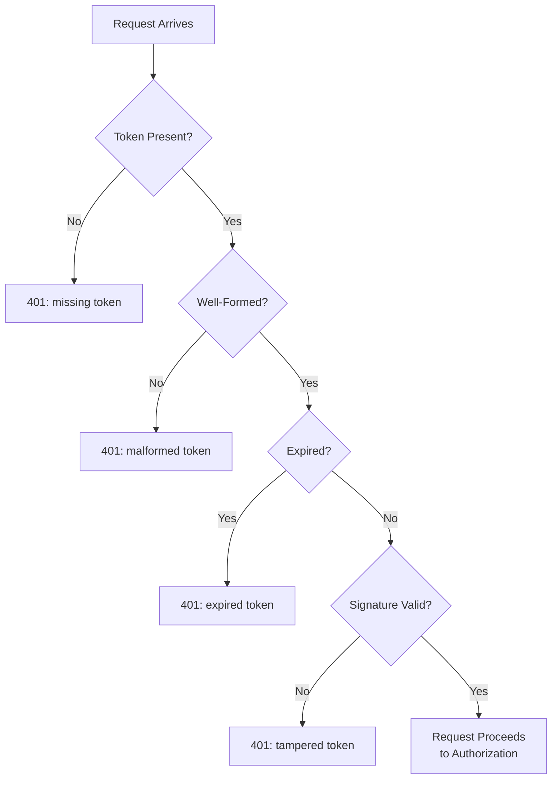

# API Authentication

**Prerequisites**: You should already understand [Data Validation and Response Verification](/learning-paths/api-testing/data-validation-and-response-verification) and the rest of [Section 2](/learning-paths/api-testing/section-2-review).
**Leads to**: After this, you'll be ready for [Authorization and Access Control](/learning-paths/api-testing/authorization-and-access-control).

Authentication answers one question: *who is calling this API?* Everything Sections 1 and 2 covered assumed a request was allowed to reach the server at all — this module is about testing the gate itself, and the specific ways it can fail open (letting someone in who shouldn't be) or fail closed (locking out someone who should).

## Why This Matters

**A tester who confirms login works.** Testing AtlasBank's customer login API, a tester confirms a valid username and password returns an access token, and an invalid password is rejected. Authentication testing complete, they conclude. What never gets tested: what happens when a *valid* token that's simply expired is sent — does the API correctly reject it, or does some code path accept it anyway because the expiration check was only wired into one of several endpoints that use the token?

**A tester who tests the whole authentication surface.** A different tester specifically tests an expired token against several different endpoints, not just login itself. The transfer-initiation endpoint correctly rejects it with `401 Unauthorized` — but the account-balance endpoint accepts it and returns data anyway, a real defect: expiration enforcement was implemented inconsistently across endpoints, not universally as the security design assumed.

Authentication isn't one gate — in a real API, it's enforced separately at every protected endpoint, and a tester who tests only the login flow itself never finds out whether that enforcement is actually consistent everywhere it needs to be.

## Why This Matters (continued): Authentication vs. Authorization

These two terms are frequently confused, and the distinction matters directly to how you test each one:

| | Authentication | Authorization |
|---|---|---|
| **Question it answers** | Who are you? | What are you allowed to do? |
| **Failure looks like** | `401 Unauthorized` — identity couldn't be established | `403 Forbidden` — identity is known, but this action isn't permitted |
| **Tested by** | Valid/invalid/expired/missing credentials | Role- and ownership-based access checks (covered next module) |

This module covers authentication only — proving identity. [Authorization and Access Control](/learning-paths/api-testing/authorization-and-access-control) covers what an authenticated identity is actually permitted to do.

## What This Module Covers

**API Keys** — a static credential (often sent as a header, e.g., `X-API-Key: ak_live_...`) identifying the calling application rather than an individual user. Testable failure modes: a missing key, an invalid key, a revoked key still being accepted, and a key scoped to one environment (test) working against another (production) when it shouldn't.

**Bearer Tokens** — sent as `Authorization: Bearer <token>`, proving the caller holds a valid, previously-issued credential. The token itself is opaque to the caller; the server validates it against its own store or, for a self-contained token, decodes and verifies it directly.

**JWT (JSON Web Token)** — a specific, common bearer-token format: a signed, self-contained token encoding claims (user ID, roles, expiration) directly in the token itself, verifiable without a server-side lookup. A tester doesn't need to implement JWT signing, but does need to know a JWT carries a genuine expiration claim (`exp`) worth testing directly, and that a tampered JWT (a claim modified after signing) should fail signature verification and be rejected — a real, testable security boundary.

**OAuth 2.0 (high level)** — an authorization framework (despite the name) commonly used to issue access tokens, often via a redirect-based flow where a user grants a client application permission, and the client receives an access token (and often a refresh token) in exchange. As a tester, the relevant testable surface is the tokens it produces — access token expiration, refresh token behavior, and what happens when a granted permission ("scope") is revoked — not the redirect flow's implementation details.

**Access Tokens vs. Refresh Tokens**: an access token is short-lived and sent with every request; a refresh token is longer-lived and used only to obtain a new access token once the current one expires, without forcing the user to log in again.

```json
{
  "accessToken": "eyJhbGciOiJIUzI1NiIs...",
  "refreshToken": "rt_9f8e7d6c5b4a...",
  "expiresIn": 900,
  "tokenType": "Bearer"
}
```

**Authentication failure scenarios worth testing on every protected endpoint, not just login**:

| Scenario | Expected Response | Real Defect Class It Catches |
|---|---|---|
| Missing token entirely | `401 Unauthorized` | An endpoint accidentally left unprotected |
| Malformed token (not valid JWT structure) | `401 Unauthorized` | Server crashing (`500`) instead of cleanly rejecting bad input |
| Expired token | `401 Unauthorized` | Expiration enforced inconsistently across endpoints, exactly as this module's opening example shows |
| Valid token, wrong signature (tampered) | `401 Unauthorized` | Signature verification skipped or misconfigured |
| Valid token for a different, unrelated application/audience | `401 Unauthorized` | Token scope/audience not actually checked |



## When Authentication Testing Matters Most

- **Every protected endpoint individually, not just the login flow** — as this module's opening example shows, enforcement can be inconsistent across endpoints even when the login flow itself is correctly tested.
- **Token expiration specifically** — a common, real defect class where expiration logic exists but isn't consistently wired into every endpoint that should check it.
- **Refresh token behavior** — confirming a refresh token can only be used to obtain a new access token, and that it's itself invalidated after use or after a reasonable lifetime, not treated as a permanently reusable credential.
- **Any endpoint accessible with an API key** — confirming a revoked or environment-mismatched key is actually rejected, not just that a valid key works.

Deep authentication testing matters less on endpoints explicitly designed to be public (a health-check endpoint, public product documentation) — confirming these correctly require *no* authentication is itself the relevant test, not applying the failure-scenario checklist above.

## How This Works on a Real Project

AtlasBank's mobile app issues a short-lived access token (15 minutes) and a longer-lived refresh token (30 days) at login. A tester systematically works through the failure-scenario table above against the account-balance endpoint, confirming each one correctly returns `401`. All pass.

Testing refresh token behavior specifically surfaces a real defect: after using a refresh token once to obtain a new access token, the *same* refresh token is used a second time — and it succeeds again, issuing another new access token pair, instead of being rejected. The intended design (confirmed with the team) is that a refresh token should be single-use — invalidated immediately after producing a new token pair, both as a security measure (a stolen refresh token should only be usable once before triggering re-authentication) and to detect token theft (a legitimate client and an attacker both trying to reuse the same refresh token is a detectable signal). The implementation never enforced single-use, silently allowing indefinite reuse of the same refresh token. This is caught specifically because refresh token behavior was tested as its own scenario, not assumed to be "probably fine" because access token expiration was already confirmed working correctly.

## Common Mistakes

**Mistake 1: Testing authentication only at the login endpoint.**
As the opening example shows, enforcement can differ across endpoints even when login itself is correctly tested — every protected endpoint needs its own pass through the failure-scenario checklist.

**Mistake 2: Not testing expired-token behavior specifically, only missing/invalid tokens.**
Expiration is a distinct failure mode from "no token" or "wrong token," and — as this module's examples show twice — is a common place for inconsistent enforcement to hide.

**Mistake 3: Assuming a refresh token behaves correctly because access tokens do.**
The real-project example's refresh-token-reuse defect existed entirely independently of access token expiration working correctly — each token type needs its own dedicated testing.

**Mistake 4: Treating a `500` error on a malformed token as "the request was rejected, close enough."**
A malformed token should produce a clean `401`, not a server crash — a `500` here indicates the server didn't handle malformed input gracefully, a real robustness defect distinct from whether the request was ultimately rejected.

:::note From the Field
A mobile banking app's session tokens were valid for 15 minutes, but the logout endpoint only cleared the token on the client side — the server never actually invalidated it. A security review months after launch discovered that any token captured before logout (a shared device, a debugging proxy left running) remained fully valid for its original lifetime, regardless of how many times the "logged out" user logged back in and out again elsewhere. Every functional test had only ever checked that the app's own UI stopped showing the logged-in screen.
:::

:::tip Senior QA Insight
A newer tester verifies login works and stops there, treating authentication as a single pass/fail gate. A senior tester treats every protected endpoint as its own, separate authentication test — because enforcement is implemented per endpoint, and a senior tester has seen enough real APIs where one endpoint's expired-token check was correct and a neighboring endpoint's simply wasn't wired up the same way.
:::

## Best Practices

**Practice 1: Run the full failure-scenario checklist against every protected endpoint, not just once against login.**
This is the single most important habit this module teaches — authentication enforcement is per-endpoint, not path-independent, until proven otherwise.

**Practice 2: Test access tokens and refresh tokens as two separate, dedicated test areas.**
They have different lifetimes, different expected behaviors, and — as the real-project example shows — can fail independently of each other.

**Practice 3: Confirm expired-token rejection specifically, not just missing/invalid-token rejection.**
Expiration enforcement is frequently the piece most likely to be inconsistently wired across a codebase's endpoints.

**Practice 4: Distinguish a clean `401` rejection from a server error on malformed input.**
A malformed or tampered token should be handled gracefully — a `500` response signals a robustness gap worth its own defect report, separate from the authentication logic itself.

## When NOT to Apply the Full Authentication Checklist

- **Explicitly public, unauthenticated endpoints** — the relevant test here is confirming no authentication is required and no accidental restriction was added, the inverse of this module's checklist.
- **Internal service-to-service calls behind a network boundary already covered by infrastructure-level security testing** — full endpoint-by-endpoint authentication testing is more valuable on caller-facing APIs than on internal calls already protected by a separately-tested network boundary, though this is a judgment call to make explicitly, not assume.

## Mini Challenge

**Scenario**: AtlasBank's API key system issues keys scoped to either "sandbox" or "production" environments. A tester has a valid sandbox-scoped key.

**Your task**: List three test cases specifically targeting the sandbox/production scope boundary (not just "does the key work"), and state what real defect each one would catch if it failed.

## Key Takeaways

- Authentication answers "who are you," failing as `401`; authorization (next module) answers "what are you allowed to do," failing as `403` — a distinction that shapes what each is tested for.
- Authentication enforcement should be tested at every protected endpoint individually, not assumed consistent because the login flow itself works correctly.
- Expired-token and refresh-token behavior are common, distinct places for inconsistent or missing enforcement to hide, as this module's two examples both show.
- A malformed or tampered token should produce a clean `401`, not a server error — the two are different defect classes worth distinguishing.

---

## What You Just Learned

- The distinction between authentication and authorization, and why each fails with a different status code
- The core authentication mechanisms (API keys, bearer tokens, JWTs, OAuth 2.0) from a tester's vantage point
- A complete failure-scenario checklist (missing, malformed, expired, tampered, wrong-audience tokens) to run against every protected endpoint
- How a real refresh-token reuse defect was caught by testing refresh token behavior as its own dedicated scenario, not assuming it worked because access tokens did

**Next:** [Authorization and Access Control](/learning-paths/api-testing/authorization-and-access-control)

## Related Topics

- [Data Validation and Response Verification](/learning-paths/api-testing/data-validation-and-response-verification) — The layered validation approach this module applies to authentication failure scenarios
- [Authorization and Access Control](/learning-paths/api-testing/authorization-and-access-control) — What an authenticated identity is actually permitted to do, tested once identity itself is established
- [What Is API Testing?](/learning-paths/api-testing/what-is-api-testing) — Why testing at the API layer catches defects a UI's login screen alone cannot

## Interview Questions

**Q1: What's the difference between authentication and authorization, and how does that affect what status code you'd expect?**

*What to look for*: A candidate who clearly separates "who are you" (`401` on failure) from "what are you allowed to do" (`403` on failure) — and ideally notes that confusing the two in an API's actual implementation is itself a testable defect.

:::note Common Interview Mistake
Many candidates answer "authentication is login and authorization is permissions" without connecting either to a specific status code or test approach. That's a correct but shallow answer. A strong answer ties each concept to its expected failure status code and to a concrete test scenario, like an expired token or a role-based access check.
:::

**Q2: Why would you test an expired token against every protected endpoint instead of just one?**

*What to look for*: A candidate who recognizes that authentication enforcement is typically implemented per-endpoint and can be inconsistent, citing a scenario like this module's expired-token example where one endpoint correctly enforced expiration and another didn't.

---

## Glossary

**Authentication**: The process of establishing who is making a request, typically via a credential like an API key or bearer token.

**Bearer Token**: A credential sent in an `Authorization: Bearer <token>` header, proving the caller holds a previously-issued token.

**JWT (JSON Web Token)**: A signed, self-contained bearer token format encoding claims (like user ID and expiration) directly in the token, verifiable without a server-side lookup.

**Refresh Token**: A longer-lived credential used to obtain a new access token without requiring the user to log in again, typically expected to be single-use or otherwise tightly controlled.

## Quick Revision

Remember these five points:

✓ Authentication answers "who are you" (fails as 401); authorization answers "what are you allowed to do" (fails as 403).

✓ Test authentication enforcement at every protected endpoint individually — it's often inconsistent across endpoints even when login itself works.

✓ Expired-token behavior is a common, distinct place for enforcement to be missing or inconsistent.

✓ Test access tokens and refresh tokens as two separate areas — they can fail independently of each other.

✓ A malformed or tampered token should return a clean 401, not a server error — the two are different, both-reportable defect classes.
