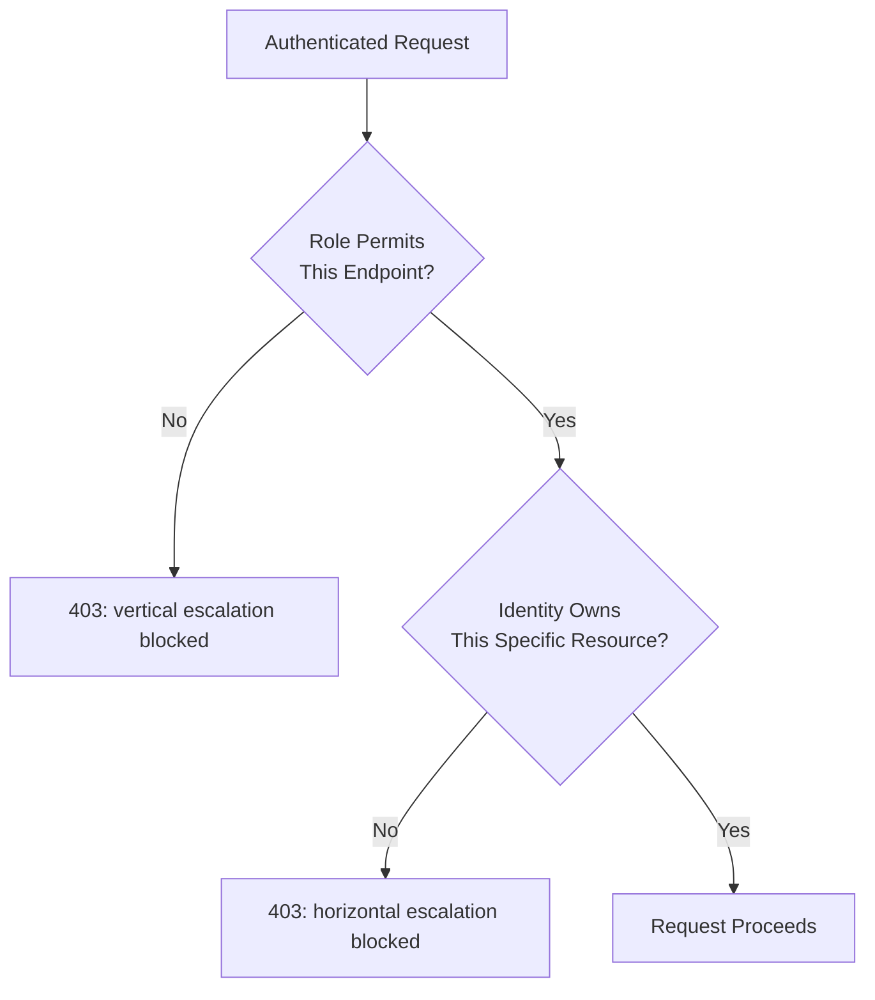

# Authorization and Access Control

**Prerequisites**: You should already understand [API Authentication](/learning-paths/api-testing/api-authentication).
**Leads to**: After this, you'll be ready for [Rate Limiting, Throttling, and Session Management](/learning-paths/api-testing/rate-limiting-throttling-and-session-management).

A valid, unexpired token proves who's calling — it says nothing about what that person is allowed to touch. This module is about the second gate: once identity is established, does the API correctly enforce what that specific identity is permitted to do, and does it correctly refuse everything else? This is where some of the most serious, most commonly missed API defects live.

## Why This Matters

**A tester who tests with one account.** Testing AtlasBank's account-details API, a tester logs in as a customer, retrieves their own account details, and confirms the response is correct. Authorization testing complete, they conclude. What never gets tested: whether that same valid, correctly-authenticated customer can retrieve a *different* customer's account details, simply by changing the account ID in the URL.

**A tester who tests across accounts.** A different tester, still authenticated as the same customer, requests `GET /api/v1/accounts/ACC-9938201/details` — an account ID belonging to a different customer entirely. The response comes back `200 OK` with that other customer's real account data. This is a severe, real defect: the API correctly authenticated the caller but never checked whether the *authenticated* caller actually owns the *requested* resource — an authorization check that's silently missing entirely, not just implemented incorrectly.

Authentication testing (previous module) and authorization testing ask genuinely different questions, and a system can pass one completely while failing the other catastrophically — exactly what this example shows.

## What This Module Covers

**Role-Based Access Control (RBAC)** assigns each identity one or more roles (`customer`, `support-agent`, `admin`), and each role is permitted a specific set of actions. AtlasBank's admin portal APIs, for instance, should be reachable only by `admin` or `support-agent` roles — a `customer`-role token presented to an admin endpoint should be rejected, even though it's a perfectly valid, unexpired, correctly-signed token.

**Customer vs. Admin APIs**: testing the boundary between these two surfaces directly — can a customer-role token reach any admin-only endpoint at all? This is a distinct, coarser-grained check from the resource-ownership check in this module's opening example, and both need their own dedicated testing.

**Resource ownership** is the specific check this module's opening example is missing: even within a single role (`customer`), does the API confirm the authenticated identity actually owns the specific resource being requested, or does it trust whatever ID appears in the URL? This is the single most common, most severe authorization defect class in real APIs.

**Horizontal vs. vertical privilege escalation** — two distinct escalation directions, both worth testing separately:

| | Horizontal Escalation | Vertical Escalation |
|---|---|---|
| **What it means** | Accessing another user's data *at the same privilege level* | Accessing functionality reserved for a *higher* privilege level |
| **AtlasBank example** | Customer A viewing Customer B's account details (this module's opening example) | A `customer`-role token reaching an admin-only endpoint (e.g., freezing another customer's account) |
| **Root cause, typically** | Missing resource-ownership check | Missing or bypassable role check |

**IDOR (Insecure Direct Object Reference)** is the specific vulnerability class this module's opening example demonstrates: an API accepts a resource identifier directly from the request (a URL path parameter, a query parameter, a payload field) and uses it to fetch data without verifying the authenticated caller is actually entitled to that specific resource. Testing for IDOR means deliberately substituting a resource ID belonging to someone else, exactly as the opening example does.

**Least privilege** is the design principle IDOR and vertical escalation both violate when they succeed: every identity should be able to do only what its role and ownership genuinely entitle it to, nothing more — and a tester's job is specifically to try exceeding that boundary and confirm the attempt fails.

## When Authorization Testing Matters Most

- **Every endpoint that accepts a resource ID from the caller** — the opening example's IDOR pattern is testable on nearly any endpoint following the shape `GET /resource/{id}`, and needs testing on each one individually, not assumed consistent.
- **Any admin or elevated-privilege endpoint** — confirming a lower-privilege token is actually rejected, not just that a higher-privilege token works.
- **APIs handling sensitive or regulated data** — an authorization gap here (as in [Applying Test Design Across Domains: Healthcare and Insurance](/learning-paths/manual-testing/applying-test-design-healthcare-insurance)'s compliance-traceability lesson) carries consequences well beyond a typical functional defect.
- **Any endpoint newly added or recently modified** — authorization checks are easy to omit accidentally when a new endpoint is built by copying an existing one that happened to already have the check, or when it wasn't copied from anywhere at all.

Authorization testing matters somewhat less on endpoints with no meaningful resource-ownership concept at all (a public, non-personalized reference-data endpoint) — though role-based access still deserves testing wherever a role distinction genuinely exists.

## How This Works on a Real Project

AtlasBank's support-agent portal lets support staff look up a customer's account to assist with a service call. A tester, authenticated as a `support-agent`-role identity, confirms account lookup works correctly for a given customer. Testing further, the tester specifically checks whether a `support-agent` can also *modify* account settings (e.g., changing a customer's registered phone number) — an action the role is meant to be restricted from, per the documented least-privilege design (only `admin` should be able to modify account settings; `support-agent` should be read-only).

The real defect: `PATCH /api/v1/accounts/{accountId}/settings` succeeds with a `support-agent` token, silently allowing an action the role documentation explicitly says shouldn't be permitted. This is a vertical-escalation defect distinct from the module's opening horizontal-escalation example — the `support-agent` role is legitimately allowed to *read* this account (there's no ownership violation), but shouldn't be allowed to *write* to it, and the write-path's role check was never implemented, only the read-path's.

This is caught specifically because role permissions were tested action-by-action, not just endpoint-reachability in general — confirming a role *can* do what it should is necessary, but confirming it *can't* do what it shouldn't is the check that actually catches an over-permissive implementation.

## Common Mistakes

**Mistake 1: Testing authorization with only one account or role.**
As the opening example shows, this makes an IDOR defect completely invisible — the check only exists by testing across two different identities against the same resource.

**Mistake 2: Confirming a role can do what it should without confirming it can't do what it shouldn't.**
The real-project example's `support-agent` write-access defect is only caught by explicitly testing the negative case — that a restricted action correctly fails, not just that a permitted one correctly succeeds.

**Mistake 3: Treating role-based access and resource-ownership as the same check.**
They're genuinely independent — an endpoint can correctly enforce role (rejecting the wrong role entirely) while still failing to enforce ownership (accepting any ID within the correct role), or vice versa; both need dedicated testing.

**Mistake 4: Only testing authorization on new endpoints, not endpoints modified for an unrelated reason.**
An authorization check can regress during a change that had nothing to do with authorization at all — a refactor that touches the same code path is a real risk moment worth re-testing, not just newly built endpoints.

:::note From the Field
A healthcare scheduling platform's patient-record API correctly enforced that a clinician could only view patients assigned to their own care team — verified, tested, working. A later performance optimization introduced a caching layer keyed only by patient ID, without accounting for which clinician's session had requested it. For a narrow window after the change shipped, a second clinician requesting the same patient ID shortly after the first got served the cached response — bypassing the ownership check entirely, not because the check itself broke, but because a cache sitting in front of it never knew the check existed.
:::

:::tip Senior QA Insight
A newer tester considers authorization "done" once it's been tested and passed. A senior tester treats it as something to re-verify after *any* change that touches the same code path, performance work included, because an authorization check can be silently bypassed by something built entirely outside the authorization logic itself — as the caching example shows directly.
:::

## Best Practices

**Practice 1: Test every ID-accepting endpoint with a resource ID belonging to a different, real identity.**
This is the single most effective, most repeatable IDOR test — substitute an ID you know belongs to someone else, and confirm the request is rejected.

**Practice 2: For every role, test both what it should be able to do and what it explicitly shouldn't.**
The real-project example shows why the negative case matters as much as the positive one — an over-permissive implementation only fails the test that actually tries the disallowed action.

**Practice 3: Treat role checks and ownership checks as two separate test dimensions.**
Design test cases that isolate each — same role, different resource owner (horizontal); different role, same resource (vertical) — rather than one combined "authorization works" pass.

**Practice 4: Re-test authorization on any endpoint touched by an unrelated change.**
Authorization checks can regress silently during refactors that weren't about authorization at all — treat any modification as a reason to re-verify, not just new endpoints.

## When NOT to Apply Full Authorization Testing

- **Genuinely public, non-personalized endpoints** — reference data, public product listings — where no ownership or role concept meaningfully applies.
- **Endpoints already covered by a comprehensive, automated authorization test suite run on every build** — manual exploratory effort is often better spent on newly built or recently modified endpoints, where regression risk is highest, rather than re-manually-verifying endpoints an automated suite already covers thoroughly.

## Mini Challenge

**Scenario**: AtlasBank's beneficiary API has `GET /api/v1/accounts/{accountId}/beneficiaries/{beneficiaryId}`. A customer is authenticated and owns `accountId=ACC-1001`, which has `beneficiaryId=BEN-501`.

**Your task**: Design two test cases that each test a different authorization dimension using this endpoint — one testing horizontal escalation, one testing whether the account-ID and beneficiary-ID ownership checks are both independently enforced (not just one of the two).

## Key Takeaways

- Authentication proves identity; authorization determines what that identity can do — a system can pass one completely while catastrophically failing the other, as this module's opening IDOR example shows.
- Horizontal privilege escalation (another user's data, same role) and vertical privilege escalation (functionality above your role) are distinct failure directions, each needing its own dedicated test cases.
- Testing that a role *can* do what it should is necessary but insufficient — testing that it *can't* do what it shouldn't is what catches an over-permissive implementation.
- Authorization checks can regress during changes unrelated to authorization itself — re-testing on any modified endpoint, not just new ones, is a real, worthwhile habit.

---

## What You Just Learned

- The difference between authentication and authorization, and why a system can pass one while failing the other
- Horizontal vs. vertical privilege escalation, and how to design test cases that isolate each
- What IDOR is and how to test for it directly, by substituting a resource ID belonging to a different identity
- How a real over-permissive-role defect was caught specifically by testing what a role *shouldn't* be able to do, not just what it should

**Next:** [Rate Limiting, Throttling, and Session Management](/learning-paths/api-testing/rate-limiting-throttling-and-session-management)

## Related Topics

- [API Authentication](/learning-paths/api-testing/api-authentication) — The identity-proving layer this module's authorization checks assume is already correctly enforced
- [Applying Test Design Across Domains: Healthcare and Insurance](/learning-paths/manual-testing/applying-test-design-healthcare-insurance) — Why authorization gaps in regulated domains carry compliance weight beyond a typical functional defect
- [Rate Limiting, Throttling, and Session Management](/learning-paths/api-testing/rate-limiting-throttling-and-session-management) — The abuse-prevention layer this section closes with, once identity and permission are both correctly enforced

## Interview Questions

**Q1: What's IDOR, and how would you test for it?**

*What to look for*: A candidate who explains that IDOR happens when an API trusts a caller-supplied resource ID without verifying ownership, and who describes a concrete test — substituting an ID belonging to a different, real identity and confirming the request is rejected — rather than a purely definitional answer.

:::note Common Interview Mistake
Many candidates define IDOR correctly but, when asked how they'd test for it, answer vaguely ("I'd check for security issues"). That's incomplete — a strong answer names the specific, repeatable test: authenticate as one identity, request a resource ID known to belong to a different identity, and confirm the request is rejected rather than succeeding.
:::

**Q2: Why would you specifically test that a role *cannot* perform an action, not just that it can perform the actions it should?**

*What to look for*: A candidate who recognizes that confirming permitted actions work says nothing about whether restricted actions are actually blocked — citing a scenario like this module's over-permissive support-agent write-access example, where the positive case passed while the negative case silently failed.

---

## Glossary

**Authorization**: The process of determining what an already-authenticated identity is permitted to do.

**RBAC (Role-Based Access Control)**: An authorization model where permissions are granted based on a role assigned to an identity, rather than to the identity individually.

**IDOR (Insecure Direct Object Reference)**: A vulnerability where an API uses a caller-supplied resource identifier to fetch data without verifying the authenticated caller actually owns or is entitled to that specific resource.

**Horizontal Privilege Escalation**: Accessing another identity's data at the same privilege level, typically via a missing resource-ownership check.

**Vertical Privilege Escalation**: Accessing functionality reserved for a higher privilege level than the authenticated identity actually holds.

## Quick Revision

Remember these five points:

✓ Authentication proves who you are; authorization determines what you can do — a system can pass one while failing the other completely.
✓ Horizontal escalation (another user's data) and vertical escalation (higher-privilege functionality) are distinct failure directions, each needing dedicated test cases.
✓ Test IDOR directly by substituting a resource ID belonging to a different, real identity and confirming rejection.
✓ Confirm a role can't do what it shouldn't, not just that it can do what it should — the negative case catches over-permissive implementations.
✓ Re-test authorization on any endpoint touched by a change, even one unrelated to authorization itself — regressions can happen silently.
