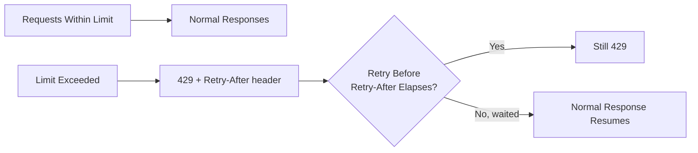

# Rate Limiting, Throttling, and Session Management

**Prerequisites**: You should already understand [Authorization and Access Control](/learning-paths/api-testing/authorization-and-access-control).
**Leads to**: After this, you'll be ready for [Testing Service Integrations](/learning-paths/api-testing/testing-service-integrations).

Authentication and authorization both assume a caller is legitimate but ask different questions about them. This module assumes the caller might not be — or might simply be behaving badly, intentionally or not — and covers the defenses an API uses to stay usable and secure anyway: rate limits that stop abuse, and session handling that makes sure access actually ends when it's supposed to.

## Why This Matters

**A tester who never tests the limits.** Testing AtlasBank's transaction-history API, a tester confirms a single request returns correct data quickly. Rate limiting isn't part of the plan — it's assumed to be "an infrastructure concern," not something functional testing needs to touch. What never gets tested: sending a rapid burst of requests reveals the API has no rate limiting at all on this specific endpoint, even though every other endpoint in the same service correctly enforces one. A single overlooked endpoint is now a viable target for abuse — repeated automated requests against it face no resistance.

**A tester who tests the limits directly.** A different tester deliberately sends a burst of rapid requests to every endpoint being tested, not just the "obviously abuse-prone" ones. The transaction-history endpoint's missing rate limit is caught immediately — a real, reportable gap, found specifically because rate limiting was tested as its own dimension, not assumed to be handled somewhere outside the scope of functional testing.

Rate limiting and session handling aren't purely infrastructure concerns — they're testable, and they fail in specific, findable ways, exactly like any other part of an API's contract.

## What This Module Covers

**Why rate limiting exists**: to protect an API from being overwhelmed (accidentally, by a buggy client retrying too aggressively, or deliberately, by abuse) and to keep the service available and fair across all callers. A tester's job is confirming the limit actually works as designed, not just that it exists in documentation.

**HTTP 429 (Too Many Requests)** is the status code a correctly rate-limited response should return once a caller exceeds their allowed request rate — distinct from a `403` (which signals a permissions problem, not a rate problem) and from silently dropping or slowing requests with no clear signal at all.

**Retry-After header**: a well-designed rate-limited response tells the caller how long to wait before retrying, typically via a `Retry-After` header (in seconds, or an HTTP date):

```http
HTTP/1.1 429 Too Many Requests
Retry-After: 30
Content-Type: application/json

{"error": "rate_limit_exceeded", "message": "Too many requests. Retry after 30 seconds."}
```

A tester's job includes confirming this value is accurate — that waiting the stated duration and retrying actually succeeds, and that retrying *before* it succeeds is still correctly rejected.

**Burst limits vs. sustained limits**: many real rate-limiting designs distinguish a short-term burst allowance (e.g., 10 requests in any 1-second window) from a longer sustained limit (e.g., 1000 requests per hour) — two independent limits that need independent testing, since an implementation can correctly enforce one while missing the other entirely.

**Concurrent requests**: a related but distinct scenario from rate limiting over time — what happens when the *same* caller sends several requests at effectively the same instant, rather than in rapid succession? This matters specifically for non-idempotent operations (a fund transfer, discussed further in a later section) where two truly simultaneous requests could both be processed before either one's effect is visible to the other, a race condition distinct from anything a simple rate-limit counter would catch.

**Session timeout and idle timeout**: a session (whether cookie-based or reflected in a token's own lifetime) should expire after a defined period — either an absolute maximum duration, or after a period of inactivity (idle timeout). A tester's job is confirming both actually happen, not just one of the two if both are documented.

**Token revocation and logout validation**: when a user explicitly logs out, or an admin explicitly revokes a session, the associated token should stop working immediately — a tester should confirm a token used successfully before logout is genuinely rejected afterward, not just that the client-side app stops sending it (which says nothing about server-side enforcement).

**Multiple device sessions**: many real products allow a user to be logged in on several devices simultaneously — a tester's job includes confirming this works as intended (or is correctly restricted, if the product's design says only one active session is allowed) and that revoking one device's session doesn't unintentionally revoke, or fail to revoke, sessions on other devices.



## When Rate Limiting and Session Testing Matters Most

- **Any publicly reachable, authenticated endpoint** — as this module's opening example shows, a single unprotected endpoint in an otherwise well-protected service is a real, exploitable gap.
- **Endpoints performing a sensitive or costly action** (login attempts, fund transfers, password resets) — these specifically benefit from tighter limits than general read endpoints, and a tester should confirm the limit is actually tighter, not just present.
- **Explicit logout and session-revocation flows** — confirming server-side enforcement, not just client-side token deletion, is the real test here.
- **Any product supporting multi-device sessions** — confirming per-device revocation behaves as intended is a real, easy-to-miss scenario.

Rate limiting testing matters less on internal, trusted service-to-service calls behind a separately-secured network boundary, where the abuse scenario rate limiting defends against doesn't meaningfully apply the same way.

## How This Works on a Real Project

AtlasBank's login endpoint (`POST /api/v1/auth/login`) is being tested for rate-limiting behavior, specifically to prevent credential-stuffing attacks (automated rapid-fire login attempts with different password guesses). A tester sends repeated failed login attempts for the same username and confirms the API correctly returns `429` after five attempts within a minute, with a `Retry-After` header.

Testing further, the tester tries the same rapid-attempt pattern but rotates through several different, but still real, usernames on each attempt instead of retrying the same one. This reveals a real defect: the rate limit is keyed only to the specific username being attempted, not to the calling IP address or client — meaning an attacker can bypass the entire protection simply by spreading attempts across many different target usernames, never exceeding any single username's limit. The rate limit correctly stops one specific, narrow attack pattern (repeatedly guessing one account's password) while leaving open the broader, more realistic attack pattern (credential stuffing across many accounts) the limit was actually meant to defend against.

This is caught specifically because the tester tested the rate limit's actual *scope* — what it's keyed to — not just whether a limit exists and triggers under the most obvious test pattern.

## Common Mistakes

**Mistake 1: Treating rate limiting as purely an infrastructure concern outside functional testing's scope.**
As the opening example shows, a missing or inconsistent rate limit on a specific endpoint is a real, findable functional defect, not something to leave entirely to a separate team or tool.

**Mistake 2: Testing that a rate limit triggers, without testing what it's actually keyed to.**
The login-endpoint example's real defect — a limit that works for one attack pattern but not the realistic one — is only caught by testing the limit's scope directly, not just confirming it exists.

**Mistake 3: Confirming client-side logout without confirming server-side token revocation.**
A client deleting a stored token locally says nothing about whether the server would still accept that same token if it were replayed — the server-side check is the one that actually matters.

**Mistake 4: Not distinguishing burst limits from sustained limits.**
An implementation can correctly enforce one while completely missing the other — each deserves its own dedicated test, not one combined "rate limiting works" check.

:::note From the Field
An e-commerce API's login endpoint was rate-limited per account, correctly blocking repeated password guesses against any single username. During a real credential-stuffing incident, attackers rotated through a list of thousands of leaked usernames, one or two attempts each, from a rotating pool of IP addresses — never tripping the per-username limit even once. The protection had been tested and confirmed working against exactly the attack pattern it was built to demonstrate, and nobody had tested the pattern real attackers actually used.
:::

:::tip Senior QA Insight
A newer tester confirms a rate limit exists by sending enough requests to trigger it once. A senior tester asks a second question afterward — *what* is this limit actually keyed to — and specifically tests whether spreading the same volume of requests across that key's boundary (different usernames, different IPs) defeats the protection entirely.
:::

## Best Practices

**Practice 1: Test rate limiting on every publicly reachable endpoint, especially sensitive ones like login and transfers.**
Don't assume it's uniformly applied — the opening and real-project examples both show gaps hiding on specific endpoints or specific attack patterns.

**Practice 2: Test what a rate limit is actually keyed to, not just that it triggers.**
The login-endpoint example shows this directly — a limit keyed too narrowly (to username alone, rather than IP or client) can be trivially bypassed while still "working" under a naive test.

**Practice 3: Confirm token revocation server-side, by replaying a token after logout.**
This is the only test that actually verifies revocation — checking the client no longer sends the token verifies nothing about server enforcement.

**Practice 4: Test burst limits and sustained limits as two separate scenarios.**
Design one test that sends a rapid burst within a short window, and a separate test that sends a steady stream over a longer period, to confirm both limits independently.

## When NOT to Apply Full Rate-Limiting and Session Testing

- **Low-risk, read-only, unauthenticated public endpoints** with no realistic abuse scenario tied to a security or cost concern — full rate-limit boundary testing here is lower-value than on authenticated or sensitive endpoints.
- **Internal, network-isolated service calls** already covered by a separate infrastructure-level rate-limiting or network-security review, where duplicating that testing at the API-functional level adds little.

## Mini Challenge

**Scenario**: AtlasBank's password-reset endpoint (`POST /api/v1/auth/password-reset`) sends a reset email and is rate-limited to 3 requests per email address per hour.

**Your task**: Design two test cases beyond "does the limit trigger after 3 requests" — one testing the limit's actual scope (similar to this module's login example), and one testing session/token behavior once a password reset actually completes.

## Key Takeaways

- Rate limiting and session management are testable, functional concerns with specific, findable failure modes — not purely infrastructure topics outside a tester's scope.
- A correct `429` response should include a `Retry-After` value, and both waiting-then-retrying (should succeed) and retrying-too-soon (should still fail) are worth testing.
- What a rate limit is actually keyed to matters as much as whether it triggers — a limit scoped too narrowly can be bypassed while still appearing to "work," as this module's login-endpoint example shows.
- Server-side token revocation, verified by replaying a token after logout, is the only real test of whether a session actually ends — client-side token deletion alone proves nothing.

---

## What You Just Learned

- Why rate limiting is a testable functional concern, not purely infrastructure, and how a gap on a single endpoint can undermine an otherwise well-protected service
- How to test a rate limit's actual scope (what it's keyed to), not just whether it triggers under an obvious test pattern
- The difference between burst limits and sustained limits, and why each needs its own dedicated test
- How to verify session and token revocation is genuinely enforced server-side, by replaying a token after logout rather than trusting client-side behavior

**Next:** [Testing Service Integrations](/learning-paths/api-testing/testing-service-integrations)

## Related Topics

- [Authorization and Access Control](/learning-paths/api-testing/authorization-and-access-control) — The permission layer this module's abuse-prevention and session controls work alongside
- [API Authentication](/learning-paths/api-testing/api-authentication) — The token lifecycle this module's revocation and session-expiry testing directly extends
- [What Is API Testing?](/learning-paths/api-testing/what-is-api-testing) — Why testing at the API layer catches abuse-prevention gaps a UI-only pass would never exercise

## Interview Questions

**Q1: How would you test whether an API's rate limiting actually prevents the abuse scenario it's meant to defend against?**

*What to look for*: A candidate who describes testing the limit's actual scope — what it's keyed to (IP, user, endpoint) — rather than just confirming a `429` eventually appears, ideally citing a scenario like credential stuffing across multiple usernames bypassing a per-username limit.

:::note Common Interview Mistake
Many candidates answer "I'd send a lot of requests quickly and check for a 429." That confirms a limit exists but says nothing about whether it actually defends against the realistic abuse pattern. A strong answer specifically tests what the limit is keyed to, as this module's login example demonstrates.
:::

**Q2: How would you verify that logging out actually revokes a session, rather than just clearing the token from the client?**

*What to look for*: A candidate who describes replaying the previously-valid token against a protected endpoint after logout and confirming it's rejected — recognizing that client-side token deletion alone proves nothing about server-side enforcement.

---

## Glossary

**Rate Limiting**: Restricting how many requests a caller can make within a given time window, to protect an API from abuse or overload.

**Throttling**: Slowing or limiting request processing, often used alongside or interchangeably with rate limiting, though throttling can also refer to controlled request delay rather than outright rejection.

**Idle Timeout**: A session or token expiring after a period of inactivity, distinct from an absolute maximum session duration.

**Token Revocation**: Explicitly invalidating a previously-valid token (via logout or administrative action) so it's rejected on any subsequent use, verified by testing server-side enforcement directly.

## Quick Revision

Remember these five points:

✓ Rate limiting is a testable functional concern — test it directly, don't leave it entirely to infrastructure.

✓ A correct 429 includes a Retry-After value; test both retrying-too-soon (should fail) and waiting-then-retrying (should succeed).

✓ Test what a rate limit is actually keyed to, not just whether it triggers — a narrowly-scoped limit can be bypassed while appearing to work.

✓ Burst limits and sustained limits are independent and need separate test cases.

✓ Verify token revocation by replaying a token after logout — client-side deletion alone proves nothing about server-side enforcement.
