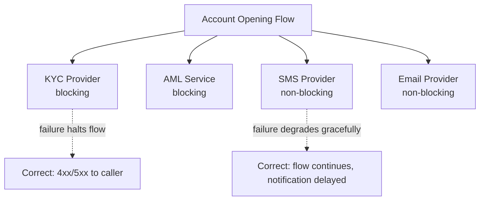

# Testing Service Integrations

**Prerequisites**: You should already understand [Rate Limiting, Throttling, and Session Management](/learning-paths/api-testing/rate-limiting-throttling-and-session-management) and the rest of [Section 3](/learning-paths/api-testing/section-3-review).
**Leads to**: After this, you'll be ready for [Cascading Failures, Error Handling, and Fault Tolerance](/learning-paths/api-testing/cascading-failures-error-handling-and-fault-tolerance).

Every module so far tested one API in isolation — its own request, its own response, its own logic. Real APIs rarely stand alone: AtlasBank's transfer endpoint calls a payment gateway; its onboarding flow calls a KYC provider; its notifications call an SMS and email service. This module is about the specific ways testing changes once a single endpoint's correctness depends on systems you don't control.

## Why This Matters

**A tester who tests the endpoint in isolation.** Testing AtlasBank's fund-transfer API, a tester confirms a request with valid data produces a completed transfer, correctly, every time it's run in the test environment. The dependency it calls — an external payment gateway — happens to respond quickly and successfully in every test run so far, so its behavior never gets deliberately varied. The feature ships.

**A tester who tests the dependency's behavior deliberately.** A different tester specifically simulates the payment gateway responding slowly, or with an error, or not responding at all — not because these are exotic edge cases, but because a gateway is a real, external system that genuinely does all three in production, regularly. Testing a deliberately delayed gateway response reveals a real defect: the transfer API has no timeout configured on its call to the gateway, so a slow gateway response leaves the customer-facing request hanging indefinitely instead of failing predictably.

Most of an integration's *normal* behavior is exactly what a single-endpoint test already covers. What's missing is deliberately exercising the dependency's *abnormal* behavior — because in production, abnormal is not rare.

## What This Module Covers

**Internal vs. external APIs**: an internal API (another AtlasBank service, like an internal ledger service) is one your team can typically influence, monitor, and coordinate testing with directly. An external API (a third-party payment gateway, a KYC provider) is outside that control — its behavior, uptime, and even its documentation accuracy are things you can only test against, not change.

**Upstream and downstream services**: from the perspective of the API under test, an **upstream** dependency is something it calls to do its job (AtlasBank's transfer API calling a payment gateway is upstream of the transfer API). A **downstream** consumer is something that calls the API under test. The same service can be upstream of one call and downstream of another — the terms describe a relationship, not a fixed category.

**Dependency mapping**: before testing an integration-heavy feature, know what it actually depends on. AtlasBank's account-opening flow, for instance, might depend on:

| Dependency | Role | Failure Impact if Unavailable |
|---|---|---|
| KYC Provider | Verifies customer identity documents | Account opening cannot complete at all |
| AML Service | Screens for anti-money-laundering risk flags | Account opening cannot complete at all |
| SMS Provider | Sends verification codes | Verification step blocked, but may have a fallback (email) |
| Email Provider | Sends confirmation and welcome messages | Account can likely still complete; notification is delayed, not blocking |

This table is itself a testing tool: it tells you which dependency failures should be *blocking* (correctly halt the flow) and which should be *non-blocking* (correctly degrade gracefully) — and both are testable, specific expectations, not guesses.

**Service contracts**: the same contract concept from earlier modules applies between AtlasBank and each dependency — a documented request/response shape both sides are expected to honor. Testing an integration means confirming AtlasBank's code actually handles the dependency's contract correctly, including its documented error responses, not just its happy path.

**Timeout scenarios**: as the opening example shows, a dependency call needs an explicit timeout — and a tester's job includes confirming one exists and behaves as expected (the caller gives up and returns a predictable error, rather than hanging indefinitely).

**Mocking (high-level concept)**: since external dependencies aren't always reliably reproducible for testing (you can't always make a real third-party payment gateway return a specific error on demand), teams commonly use a **mock** — a stand-in that simulates the dependency's behavior, including its failure modes, in a controlled way. As a tester, you don't need to build the mocking infrastructure — you need to know it's a legitimate, necessary tool for testing dependency failure scenarios that are difficult or risky to trigger against the real external system.

**Partial failures and eventual consistency (introduction)**: sometimes a request succeeds partway — AtlasBank's transfer completes on the ledger side but the SMS confirmation fails to send. This isn't necessarily a defect; it may be an intentionally accepted **eventual consistency** design, where the notification is expected to arrive shortly after, via a retry, rather than atomically with the transfer itself. A tester's job is confirming the actual behavior matches the *intended* design, whichever one it is — not assuming every partial failure is automatically wrong.

**Webhook basics**: some integrations work in reverse — instead of AtlasBank calling a dependency and waiting for a response, the dependency calls AtlasBank later, asynchronously, when something happens (a payment gateway sending a webhook once a payment clears, potentially minutes after the original request). Testing a webhook-based integration means testing both directions: the initial request, and the system's correct handling of the later, asynchronous webhook call — including what happens if the webhook never arrives, or arrives twice.

## When Integration Testing Matters Most

- **Any feature calling a third-party or external service** — payment gateways, KYC/AML providers, exchange rate feeds — where abnormal behavior (slow, erroring, unavailable) is a realistic, recurring production condition, not a rare edge case.
- **Any feature with a documented blocking vs. non-blocking dependency distinction** — confirming each behaves as its documented role requires is a specific, checkable test.
- **Webhook-based integrations** — testing the asynchronous callback path specifically, including a missing or duplicate webhook, which a synchronous-only test would never exercise.
- **Features recently integrated with a new dependency** — new integrations carry the highest risk of an untested failure path, since the "happy path only" test is often the first and only test run before launch pressure moves on.

Integration testing matters less for features with no external or cross-service dependency at all — a purely self-contained calculation or lookup has no integration surface to test in the sense this module covers.

## How This Works on a Real Project

AtlasBank's international transfer feature calls an external exchange-rate service to get a live conversion rate before completing a transfer. A tester, applying dependency mapping, confirms the exchange-rate service is a blocking dependency — a transfer can't proceed without a rate. Testing the documented error contract, the tester simulates the exchange-rate service returning its documented "rate temporarily unavailable" error.

The real defect: AtlasBank's transfer API, on receiving this specific error, doesn't return a clean failure to the customer — instead, it silently falls back to the *last successfully cached* exchange rate, which could be several hours old, and completes the transfer anyway, with no clear indication to the customer that a stale rate was used. This wasn't caught by any happy-path test, because the happy path never triggers the fallback code path at all — it's only reachable by deliberately forcing the dependency's documented error response, exactly the scenario a single-endpoint, dependency-isolated test would never exercise.

This is a real defect independent of whether the fallback behavior itself is intentional — even if using a cached rate is an accepted design decision for availability reasons, the customer-facing lack of disclosure about it is a real gap, caught specifically because the dependency's error path was deliberately tested, not assumed to be rare enough to skip.

## Common Mistakes

**Mistake 1: Testing an integration only via its dependency's happy path.**
As the opening example shows, a dependency that responds quickly and successfully in every test run tells you nothing about how the caller behaves when it doesn't — which, in production, it eventually won't.

**Mistake 2: Not distinguishing blocking from non-blocking dependencies before testing failure behavior.**
Without the dependency-mapping table's distinction, a tester can't tell whether a given dependency's failure *should* halt the flow or *should* degrade gracefully — and can't judge whether observed behavior is correct either way.

**Mistake 3: Assuming a partial failure is always a defect.**
As the eventual-consistency discussion notes, some partial failures (a delayed notification, for instance) are an intentional design choice — the real test is whether behavior matches the *documented intent*, not an assumption that anything less than fully atomic is automatically wrong.

**Mistake 4: Not testing the webhook path in a webhook-based integration.**
Testing only the initial synchronous request leaves the entire asynchronous callback path — including missing or duplicate webhook delivery — completely unverified.

:::note From the Field
A subscription billing platform integrated with a third-party payment processor entirely through webhooks — a payment's real outcome only ever arrived asynchronously, sometimes minutes later. The integration was tested extensively against the processor's sandbox, which always delivered a webhook promptly and exactly once. In production, the processor occasionally delivered the same webhook twice under its own retry logic — a documented, expected behavior on the processor's side — and the billing platform, never tested against a duplicate, applied the payment twice.
:::

:::tip Senior QA Insight
A newer tester considers an integration tested once the happy-path request/response cycle works end to end. A senior tester treats a dependency's documented failure modes and retry behaviors as required test cases, not optional edge cases — because in production, a dependency's "unusual" behavior is not unusual at all, it is a routine, expected part of operating at scale.
:::

## Best Practices

**Practice 1: Map a feature's dependencies and their blocking/non-blocking status before testing failure scenarios.**
This turns "test integration failures" from a vague instruction into a specific checklist of which failures should halt the flow and which should degrade gracefully.

**Practice 2: Deliberately trigger a dependency's documented error responses, not just its happy path.**
The exchange-rate fallback defect is invisible without this — mocking or otherwise forcing a documented error is what actually exercises the fallback code path.

**Practice 3: Confirm a timeout exists and behaves predictably for every external dependency call.**
An unbounded wait on a slow dependency is a real, common production incident source — confirming a timeout exists (and what happens when it fires) is a specific, testable requirement.

**Practice 4: For webhook-based integrations, test the callback path as thoroughly as the initial request.**
A missing webhook, a duplicate webhook, and a webhook arriving out of order are all realistic scenarios worth their own dedicated test cases.

## When NOT to Deep-Test an Integration

- **A dependency with no realistic failure mode relevant to the feature under test** — an internal, tightly-controlled configuration service with an extremely high reliability guarantee and no meaningful blocking impact may not warrant the same failure-scenario depth as an external payment gateway.
- **Integrations already covered by a dedicated, automated contract or integration test suite** run on every build — manual exploratory effort is often better spent on integrations without that coverage, or on newly added dependencies.

## Mini Challenge

**Scenario**: AtlasBank's bill-payment feature calls an external billing aggregator to fetch a customer's current bill amount before payment, and separately calls an SMS provider to send a payment confirmation.

**Your task**: Classify each dependency as blocking or non-blocking, and design one failure-scenario test case for each that reflects its correct classification.

## Key Takeaways

- Most of what makes an integration different from a single-endpoint test is deliberately exercising a dependency's *abnormal* behavior — slow, erroring, unavailable — which is realistic and recurring in production, not a rare edge case.
- Dependency mapping, including a blocking vs. non-blocking classification, turns "test integration failures" into a specific, checkable test plan rather than a vague instruction.
- A partial failure isn't automatically a defect — the real test is whether observed behavior matches the documented, intended design (an accepted eventual-consistency trade-off, or a real gap).
- Webhook-based integrations need their asynchronous callback path tested as thoroughly as the initial synchronous request, including missing and duplicate delivery.

---

## What You Just Learned

- The distinction between internal and external dependencies, and upstream vs. downstream relationships
- How to map a feature's dependencies and classify each as blocking or non-blocking before testing failure scenarios
- Why deliberately triggering a dependency's documented error responses (not just its happy path) is necessary to exercise fallback and error-handling code paths
- How a real, customer-facing stale-rate defect was caught specifically by forcing an exchange-rate service's documented error response

**Next:** [Cascading Failures, Error Handling, and Fault Tolerance](/learning-paths/api-testing/cascading-failures-error-handling-and-fault-tolerance)

## Related Topics

- [API Requests and Responses](/learning-paths/api-testing/api-requests-and-responses) — The response-pattern literacy (success, empty, error) this module extends across a dependency boundary
- [Cascading Failures, Error Handling, and Fault Tolerance](/learning-paths/api-testing/cascading-failures-error-handling-and-fault-tolerance) — What happens when a dependency failure isn't handled gracefully, and propagates further than it should
- [Rate Limiting, Throttling, and Session Management](/learning-paths/api-testing/rate-limiting-throttling-and-session-management) — The abuse-prevention layer this module's dependency-timeout concerns parallel, applied to outbound calls instead of inbound ones

## Interview Questions

**Q1: How would you test a feature that depends on an external, third-party service you don't control?**

*What to look for*: A candidate who describes deliberately simulating the dependency's abnormal behavior — slow responses, documented error codes, unavailability — rather than only testing the feature while the dependency happens to be healthy, ideally mentioning mocking as a legitimate tool for this.

:::note Common Interview Mistake
Many candidates answer "I'd test it the same way as any other endpoint." That misses what's actually different about integration testing — a strong answer specifically names testing the dependency's failure modes, not just confirming the integration works when everything is healthy.
:::

**Q2: What's the difference between a blocking and a non-blocking dependency, and why does that distinction matter for testing?**

*What to look for*: A candidate who explains that a blocking dependency's failure should halt the overall flow while a non-blocking dependency's failure should degrade gracefully — and who recognizes that testing each requires confirming the *correct* behavior for its specific classification, not just "did it fail or not."

---

## Glossary

**Upstream Dependency**: A service that an API under test calls to complete its own request, from that API's perspective.

**Downstream Consumer**: A service or client that calls the API under test.

**Blocking Dependency**: A dependency whose failure should correctly prevent the overall request from completing.

**Non-Blocking Dependency**: A dependency whose failure should correctly allow the overall request to complete, typically with graceful degradation of some secondary behavior.

**Mock (Testing Context)**: A controlled stand-in for a real dependency, used to simulate specific behaviors — including failure modes — that are difficult or risky to trigger against the real external system.

## Quick Revision

Remember these five points:

✓ Deliberately test a dependency's abnormal behavior (slow, erroring, unavailable) — this is realistic and recurring in production, not a rare edge case.
✓ Map a feature's dependencies and classify each as blocking or non-blocking before testing failure scenarios.
✓ A partial failure isn't automatically a defect — check whether it matches the documented, intended design.
✓ Confirm a timeout exists and behaves predictably for every external dependency call.
✓ Test a webhook's asynchronous callback path as thoroughly as the initial request, including missing and duplicate delivery.
