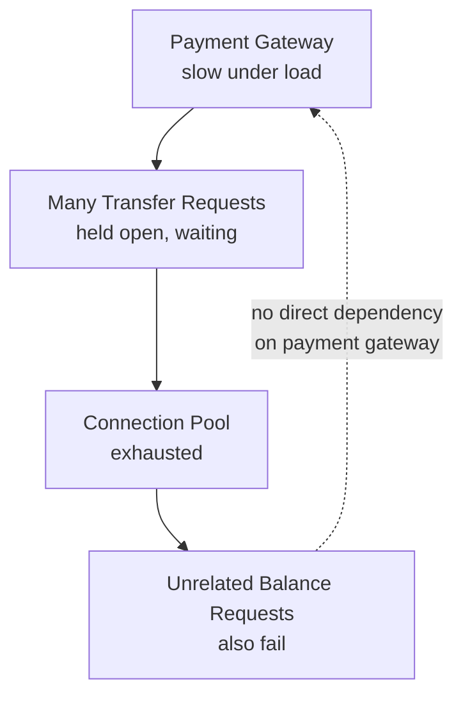

# Cascading Failures, Error Handling, and Fault Tolerance

**Prerequisites**: You should already understand [Testing Service Integrations](/learning-paths/api-testing/testing-service-integrations).
**Leads to**: After this, you'll be ready for [Idempotency, Retry Logic, and Duplicate Request Prevention](/learning-paths/api-testing/idempotency-retry-logic-and-duplicate-request-prevention).


The previous module tested whether AtlasBank's code handles *one* dependency's failure correctly. This module asks a bigger question: when that failure happens, does it stay contained, or does it spread? A single slow dependency, handled badly, can take down services that have nothing to do with it — and testing for that spread is a distinct skill from testing any one integration in isolation.

## Why This Matters

**A tester who tests one failure at a time.** Testing AtlasBank's transfer API, a tester confirms the payment gateway's slow-response scenario is handled correctly — the transfer request times out and returns a clean error to the customer, exactly as designed. Each dependency's failure, tested individually, behaves correctly. The feature ships.

**A tester who tests failure under concurrent load.** A different tester simulates the payment gateway being slow *while many transfer requests are in flight simultaneously* — closer to what a real, brief gateway outage actually looks like in production, rather than one isolated slow call. This reveals a real defect: each slow, still-pending request is holding a server-side connection open while waiting, and enough concurrent slow requests exhaust the connection pool entirely — at which point even completely unrelated API calls (account balance lookups, having nothing to do with transfers or the payment gateway) start failing too, because there are no connections left to serve them.

One failure handled correctly in isolation says nothing about whether many simultaneous instances of that same failure stay contained — this is exactly what cascading failure testing is for.

## What This Module Covers

**Cascading failure**: a failure in one component that propagates and causes failures in components that don't directly depend on the original failing one — as in the opening example, where a payment-gateway slowdown caused unrelated balance-lookup requests to fail, purely through shared resource exhaustion (the connection pool), not any direct logical dependency.

**Timeout propagation**: if Service A calls Service B, which calls Service C, and C is slow, does A eventually time out on its own reasonable schedule — or does it wait indefinitely for B, which itself is waiting indefinitely for C? A well-designed system's timeouts should be intentionally layered (A's timeout for calling B should account for B's own timeout for calling C), and testing this means tracing a slow response through the actual chain, not just testing each hop's timeout independently.

**Circuit breaker concept**: a circuit breaker is a pattern where, after a dependency fails repeatedly within a short window, the calling service stops even attempting to call it for a cooldown period — "failing fast" with an immediate, predictable error instead of continuing to send requests to a dependency that's clearly already struggling (which would only add more load to an already-failing system). A tester's job: confirm the circuit breaker actually trips after the documented failure threshold, and that it correctly resets (allows requests through again) after the documented cooldown.

**Graceful degradation**: when a non-blocking dependency fails (per the previous module's blocking/non-blocking distinction), the overall feature should continue working with reduced functionality, not fail outright — AtlasBank's account dashboard showing balance and transaction data correctly even if a "spending insights" widget's own dependency is down, rather than the entire dashboard failing to load because one non-essential widget's data source is unavailable.

**Retry storms**: a well-intentioned but dangerous pattern — many clients (or many internal retries) all retrying a failing request at roughly the same time, which can itself overwhelm a dependency that was only briefly struggling and turn a minor blip into a sustained outage. Testing for this means checking whether retries use a sensible strategy (like exponential backoff with jitter — randomized delay, so many callers don't all retry at the exact same instant) rather than immediate, synchronized retries.

**Fail-fast behavior**: related to circuit breakers — when a dependency is known to be unavailable, does the system return an error immediately, or does every individual request still wait out its full timeout before failing? Fail-fast behavior is what a correctly-tripped circuit breaker enables, and it's specifically what protects a system from the opening example's connection-pool-exhaustion scenario.

**Standardized error responses**: across every endpoint (not just integration-adjacent ones), an error response should follow one consistent shape:

```json
{
  "error": {
    "code": "GATEWAY_TIMEOUT",
    "message": "The payment gateway did not respond in time. Please try again.",
    "traceId": "trc-88213-af02",
    "timestamp": "2026-08-04T14:22:03Z"
  }
}
```

A **traceId** (or correlation ID) is specifically valuable in a distributed, multi-service failure: it lets a support engineer or another tester trace one specific failed request across every service it touched, which is often the only practical way to diagnose *where* in a chain of calls a cascading failure actually originated.



## When Cascading Failure Testing Matters Most

- **Any dependency shared across multiple, otherwise-unrelated features** — the opening example's connection pool is exactly this shape: a shared resource whose exhaustion by one feature's failure spreads to features with no logical connection to it.
- **Systems under realistic concurrent load, not just one request at a time** — a cascading failure is fundamentally a concurrency phenomenon; testing failures one at a time, as the opening example shows, can miss it entirely.
- **Any system with automatic retry logic** — confirming retries use backoff and jitter, not synchronized immediate retries, is directly testable and directly relevant to whether a retry storm can occur.
- **High-traffic, high-availability services** where the cost of an unhandled cascading failure is highest — a feature used rarely, by few concurrent users, has proportionally lower cascading risk.

Full cascading-failure testing matters less for a low-traffic internal tool with no shared, contended resources and no realistic path to concurrent-load-induced failure.

## How This Works on a Real Project

AtlasBank's KYC provider experiences a brief, real production slowdown — average response time jumps from 200ms to 8 seconds for about four minutes. A tester, investigating the incident afterward to build a regression test, discovers the account-opening service had no circuit breaker configured for its KYC provider call — every single account-opening request during the slowdown window waited the full 8 seconds before either succeeding or timing out, none of them failing fast.

Reproducing this in a test environment with a simulated slow KYC response confirms the real defect: without a circuit breaker, the account-opening service's own thread pool became fully occupied by requests waiting on the slow KYC call, and — exactly like the opening example's connection pool — this caused an unrelated feature (existing customers checking their account balance, a request that doesn't call KYC at all) to also start failing, because the account-opening service and the balance-check service shared the same underlying thread pool infrastructure. The fix: implementing a circuit breaker on the KYC call specifically, so that after a handful of slow/failed KYC calls, subsequent account-opening requests fail fast with a clean "service temporarily unavailable, try again shortly" response instead of tying up a shared resource waiting on a dependency already known to be struggling.

## Common Mistakes

**Mistake 1: Testing failure scenarios only one request at a time.**
Cascading failure is fundamentally a concurrent-load phenomenon — a single slow request handled correctly says nothing about what happens when many happen simultaneously, exactly as both this module's examples show.

**Mistake 2: Assuming a shared resource (connection pool, thread pool) is infinite for testing purposes.**
The real defect in both examples traces directly to a shared, finite resource being exhausted by one feature's failure and starving an unrelated feature — this is invisible unless the shared-resource dimension is specifically considered.

**Mistake 3: Not testing whether retries use backoff and jitter.**
Synchronized, immediate retries from many callers can turn a brief dependency blip into a sustained outage — a real, testable retry-storm risk, not a theoretical concern.

**Mistake 4: Treating "the error message is correct" as sufficient error-handling testing.**
A correct error message on one request says nothing about whether the system fails fast under sustained dependency failure, or whether that failure stays contained to the feature that triggered it.

:::note From the Field
A retailer's checkout service called an inventory service on every add-to-cart action. During a flash sale, the inventory service slowed under load, and checkout's calls to it — each waiting out a generous 30-second timeout — piled up and exhausted the checkout service's own connection pool. Product search, an entirely unrelated feature sharing the same pool, went down for twenty minutes during the platform's highest-traffic hour of the year, even though search never called inventory at all. The postmortem's single fix — a short timeout and a circuit breaker on the inventory call — took an afternoon; diagnosing that search's outage traced back to inventory took most of the incident.
:::

:::tip Senior QA Insight
A newer tester tests one slow dependency call at a time and confirms it fails gracefully. A senior tester asks what else shares the resource that call is holding onto while it waits — a connection pool, a thread pool — and tests what happens to *that*, under realistic concurrent load, because that shared resource is where a contained failure turns into an outage.
:::

## Best Practices

**Practice 1: Test dependency failures under concurrent, realistic load, not just one request at a time.**
This is the single change that turns "does this handle a slow dependency" into "does this handle a slow dependency without spreading the damage" — the actual question cascading failure testing answers.

**Practice 2: Identify shared resources (connection pools, thread pools) between features before testing failure scenarios.**
Knowing two features share an underlying resource is what makes the opening and real-project examples' failures predictable and testable in advance, rather than surprising after the fact.

**Practice 3: Confirm a circuit breaker trips at its documented threshold and resets at its documented cooldown.**
Both halves matter — a circuit breaker that trips correctly but never resets is its own kind of defect, permanently blocking a dependency that's since recovered.

**Practice 4: Verify retries use backoff and jitter, not immediate, synchronized retry.**
This is directly observable by testing retry timing and confirming it isn't fixed-interval and identical across simulated concurrent callers.

## When NOT to Test for Cascading Failure

- **Features with no shared resource or dependency contention risk** — a fully isolated feature with its own dedicated infrastructure has no realistic cascading path to test.
- **Very early-stage features under active, rapid development**, where the architecture (and therefore what's actually shared) is still changing — full cascading-failure testing is more valuable once the integration architecture is stable enough that findings won't be immediately obsoleted by the next redesign.

## Mini Challenge

**Scenario**: AtlasBank's bill-payment feature and its merchant-payment feature both call the same internal ledger service to record a completed transaction.

**Your task**: Describe a test scenario that would reveal whether a slowdown in the ledger service, triggered by a spike in bill-payment traffic, could cause the unrelated merchant-payment feature to also fail — and state what shared resource you'd specifically investigate.

## Key Takeaways

- A cascading failure spreads from one component to others that don't directly depend on it, typically through a shared, finite resource like a connection or thread pool — exactly the mechanism in this module's two examples.
- Testing a dependency failure one request at a time can miss a cascading failure entirely, since it's fundamentally a concurrent-load phenomenon.
- A circuit breaker's fail-fast behavior is what prevents a struggling dependency from continuing to consume shared resources — testing it means confirming both that it trips at its threshold and resets at its cooldown.
- Retries without backoff and jitter can turn a brief dependency blip into a sustained outage — a testable, real retry-storm risk.

---

## What You Just Learned

- What a cascading failure is, and how it can spread through a shared resource to features with no direct dependency on the original failure
- Why testing dependency failures under realistic concurrent load, not one request at a time, is necessary to catch cascading failure risk
- How circuit breakers, fail-fast behavior, and retry backoff/jitter each specifically defend against different parts of a cascading failure
- How a real production incident's shared-thread-pool defect was reproduced and understood by testing a slow dependency under concurrent load

**Next:** [Idempotency, Retry Logic, and Duplicate Request Prevention](/learning-paths/api-testing/idempotency-retry-logic-and-duplicate-request-prevention)

## Related Topics

- [Testing Service Integrations](/learning-paths/api-testing/testing-service-integrations) — The single-dependency failure testing this module extends into concurrent, system-wide failure behavior
- [Idempotency, Retry Logic, and Duplicate Request Prevention](/learning-paths/api-testing/idempotency-retry-logic-and-duplicate-request-prevention) — What happens when a client or server retries a request after exactly this kind of timeout or failure
- [Rate Limiting, Throttling, and Session Management](/learning-paths/api-testing/rate-limiting-throttling-and-session-management) — A related resource-protection concern, defending against abuse rather than dependency failure specifically

## Interview Questions

**Q1: What's a cascading failure, and how would you test for one?**

*What to look for*: A candidate who explains that a cascading failure spreads to components with no direct dependency on the original failure, typically via a shared resource — and who describes testing under concurrent load specifically, not just one request at a time, ideally citing a shared-resource mechanism like a connection or thread pool.

:::note Common Interview Mistake
Many candidates answer "a cascading failure is when one service going down causes other services to go down" without explaining the mechanism. That's incomplete — a strong answer names the shared-resource mechanism (a connection pool, a thread pool) and describes a concurrent-load test that would actually reveal it, not just a one-request test.
:::

**Q2: What's the purpose of a circuit breaker, and what would you test to confirm it works correctly?**

*What to look for*: A candidate who explains fail-fast behavior — stopping calls to a struggling dependency instead of continuing to send requests that add load — and who names both halves worth testing: that it trips at its documented threshold, and that it resets at its documented cooldown.

---

## Glossary

**Cascading Failure**: A failure that propagates from one component to others that don't directly depend on it, typically through a shared, finite resource.

**Circuit Breaker**: A pattern where a service stops calling a repeatedly-failing dependency for a cooldown period, failing fast instead of continuing to add load to a struggling system.

**Retry Storm**: Many callers retrying a failing request at roughly the same time, potentially overwhelming a dependency that was only briefly struggling.

**Graceful Degradation**: A system continuing to function with reduced capability when a non-blocking dependency fails, rather than failing outright.

## Quick Revision

Remember these five points:

✓ A cascading failure spreads through a shared resource to components with no direct dependency on the original failure.

✓ Test dependency failures under realistic concurrent load — cascading failure is fundamentally a concurrency phenomenon, invisible in one-request-at-a-time testing.

✓ Confirm a circuit breaker both trips at its documented threshold and resets at its documented cooldown.

✓ Verify retries use backoff and jitter, not immediate synchronized retry, to avoid retry storms.

✓ A standardized error response with a trace ID is what makes diagnosing where a cascading failure originated actually practical.
