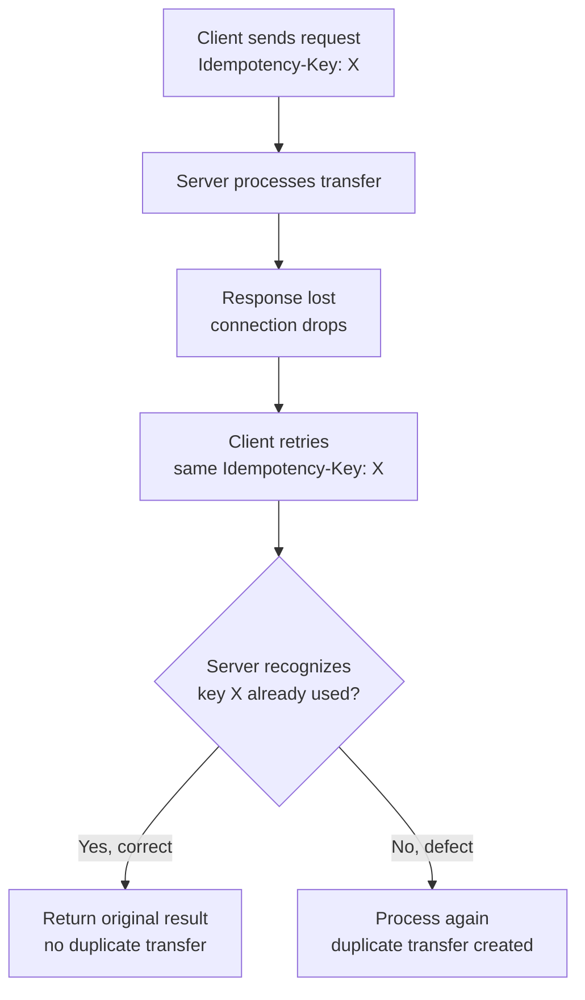

# Idempotency, Retry Logic, and Duplicate Request Prevention

**Prerequisites**: You should already understand [Cascading Failures, Error Handling, and Fault Tolerance](/learning-paths/api-testing/cascading-failures-error-handling-and-fault-tolerance).
**Leads to**: After this, you'll be ready for [API Security Fundamentals](/learning-paths/api-testing/api-security-fundamentals).

The previous two modules tested what happens when a dependency fails. This module tests what happens next — when a client, having seen a failure or a timeout, retries the same request. For most APIs, a safe retry is a convenience. For a fund transfer, an unsafe retry is a customer charged twice. This is the highest-stakes topic in this section for exactly that reason.

## Why This Matters

**A tester who tests retries only for correctness of the final state.** Testing AtlasBank's fund-transfer API, a tester sends a transfer request, the network connection drops before a response arrives, and the client (following its own retry logic) sends the identical request again. The second attempt succeeds with a clean `200 OK`. The tester confirms the transfer completed and the money arrived — looks correct, test passed.

**A tester who checks for duplication, not just completion.** A different tester checks the account's full transaction history after the same scenario, not just whether *a* transfer completed. This reveals a severe real defect: both the original request (which had actually succeeded server-side, despite the client never receiving the response before the connection dropped) and the retried request were processed as two separate, real transfers — the customer was charged twice for one transfer they intended to make once.

A retry "succeeding" tells you nothing about whether it was safe. The only way to know is to check whether the *effect* happened once or twice — exactly the check the first tester skipped.

## What This Module Covers

**Why idempotency matters, and financial transaction risks specifically**: an **idempotent** operation produces the same result no matter how many times it's performed — retrying it is always safe. A **non-idempotent** operation (like "transfer $250," naively implemented) produces a new effect every time it's performed — retrying it duplicates the effect, exactly as the opening example shows. Financial transactions are the clearest, highest-stakes case where this distinction has direct, real monetary consequences, but the same risk applies to any operation with a real side effect: sending a notification twice, applying a discount code twice, creating a duplicate account.

**Idempotency keys** are the standard solution: the client generates a unique key (typically a UUID) for a given logical operation and sends it with the request. The server checks whether it has already processed a request with that exact key — if so, it returns the *original* result without re-executing the operation; if not, it processes the request normally and remembers the key.

```json
POST /api/v1/accounts/ACC-4471829/transfers
Idempotency-Key: 7c9e6679-7425-40de-944b-e07fc1f90ae7

{
  "beneficiaryId": "BEN-88213",
  "amount": 250.00,
  "currency": "USD"
}
```

Retrying this exact request with the *same* idempotency key should be safe, returning the original transfer's result without creating a second transfer — this is precisely what a tester needs to confirm actually happens, not just assume because the header is documented as supported.

**Safe retries vs. duplicate requests**: a "safe retry" is a retry using the same idempotency key for what is genuinely the same logical attempt. A "duplicate request" is a *new* request — potentially generated with a fresh idempotency key — representing what the client (correctly or incorrectly) believes is a new, distinct operation. Testing the boundary between these two is where a real defect like the opening example lives: does the client's retry logic correctly reuse the same key on retry, or does it generate a new one each time, defeating the entire protection?

**Network interruptions, client retries, and server retries**: a request can fail to complete for several genuinely different reasons — the request never reached the server at all (safe to retry with a new attempt), the request reached the server but the response never reached the client (the exact scenario in the opening example — the operation may have already succeeded), or the server itself timed out or errored before completing the operation (also potentially unsafe to retry without an idempotency key, depending on how far processing got before the failure). A tester needs to test all three, not just the case where retry is obviously safe.

**Race conditions (testing perspective)**: even with an idempotency key, a narrow timing window exists where two identical requests, sent within a few milliseconds of each other, could both reach the server before either one has finished recording that its idempotency key was used — a genuine race condition, not a logic bug in the ordinary sense. Testing for this means deliberately sending the same idempotency-keyed request twice, as close to simultaneously as your testing tools allow, and confirming only one transfer results.

**Replay prevention**: related to idempotency but distinct — replay prevention specifically guards against a *malicious* resend of a previously valid request (potentially by an attacker who captured it), not just an accidental client retry. An idempotency key defends against both, but a system's replay-prevention design (sometimes involving request timestamps and expiry) is worth understanding as a related, adjacent concern.

**Exactly-once vs. at-least-once (concepts)**: "at-least-once" delivery means a request might be received and processed more than once (which is why idempotency matters — it's what makes at-least-once delivery *safe*). "Exactly-once" delivery is the ideal but is genuinely difficult to guarantee across a real distributed system — in practice, most systems achieve the *effect* of exactly-once by combining at-least-once delivery with idempotent processing, rather than truly guaranteeing exactly-once at the network level. A tester doesn't need to implement either — knowing which one a given system claims, and testing that the claim actually holds, is the relevant skill.



## When Idempotency Testing Matters Most

- **Any financial or otherwise costly-to-duplicate operation** — fund transfers, international transfers, bill payments, merchant payments — exactly the AtlasBank examples this module centers on, where a duplication defect has direct monetary consequences.
- **Any client known to retry automatically on timeout or network failure** — if the client retries, the server-side protection against duplication needs to actually work, not just exist in documentation.
- **Any operation reachable over an unreliable network path** (mobile clients specifically, where connection drops are common and expected) — this is precisely the scenario the opening example represents.
- **Systems claiming "exactly-once" processing** — this claim is directly testable, and worth deliberately trying to break via the race-condition scenario above.

Idempotency testing matters less for genuinely read-only operations (a `GET` request, which is naturally idempotent by REST convention, as covered in [REST Architecture and API Design Principles](/learning-paths/api-testing/rest-architecture-and-api-design-principles)) — though confirming a `GET` truly has no side effect, rather than assuming it from the method name alone, remains worthwhile.

## How This Works on a Real Project

AtlasBank's merchant-payment feature (customers paying a merchant via a QR code) supports idempotency keys, generated by the mobile app for each payment attempt. A tester confirms the documented behavior: retrying with the same key correctly returns the original result without a duplicate charge.

Testing the race-condition scenario specifically — sending two requests with the identical idempotency key as close to simultaneously as possible, simulating a double-tap on a slow mobile connection — reveals a real defect: under this specific timing, both requests are processed as separate payments, because the server checks for an existing idempotency key *before* beginning to process the request, but doesn't atomically reserve that key at the same moment — leaving a narrow window where two near-simultaneous requests both pass the "has this key been used" check before either one finishes recording that it's now in use. The fix requires the key-check-and-reserve to be a single atomic operation, not two separate steps with a gap between them where a second request can slip through.

This is caught specifically because idempotency was tested under near-simultaneous timing, not just as a sequential retry-after-failure scenario — a real, narrow, but genuinely exploitable race condition that a slower, sequential test would never trigger.

## Common Mistakes

**Mistake 1: Confirming a retry "succeeds" without checking whether the underlying effect happened once or twice.**
As the opening example shows, this is the exact gap that let a real double-charge defect through — success of the retried request says nothing about duplication on its own.

**Mistake 2: Testing idempotency only as a sequential retry-after-failure scenario, never near-simultaneous.**
The merchant-payment race condition is invisible to sequential testing — it only appears under the specific timing the real-project example deliberately created.

**Mistake 3: Assuming an idempotency key automatically prevents all duplication, without testing the actual implementation.**
Documentation claiming idempotency-key support says nothing about whether the check-and-reserve logic is correctly atomic — exactly the gap the real-project example found.

**Mistake 4: Treating every retry scenario the same, regardless of what actually failed.**
A request that never reached the server, one that reached the server but lost its response, and one that failed mid-processing are three genuinely different scenarios with different safety implications — testing only one doesn't cover the others.

:::note From the Field
A ride-hailing app's driver-payout job retried failed payout batches automatically on any error, without an idempotency key — the assumption being that a "failed" batch obviously hadn't paid anyone yet. A partial failure (the batch processed the first 40 of 50 payouts, then the connection to the banking partner dropped) was retried from the start, re-paying those first 40 drivers a second time. The retry logic wasn't wrong about retrying; it was wrong about assuming "failed" always meant "nothing happened."
:::

:::tip Senior QA Insight
A newer tester asks "does the retry eventually succeed." A senior tester asks "what did the *first* attempt actually do before it failed" — because a retry's safety depends entirely on whether the original attempt had a partial, real effect already, not on whether the retry itself looks clean.
:::

## Best Practices

**Practice 1: After any retry test, check the full resulting state, not just whether the retried request "succeeded."**
This is the single habit that catches the opening example's duplication defect — checking transaction history, not just the retried response's status code.

**Practice 2: Test idempotency under near-simultaneous timing, not just sequential retry-after-failure.**
A real race condition, like the merchant-payment example, is only reachable this way — sequential testing alone will miss it.

**Practice 3: Test all three retry-triggering scenarios — request never arrived, response never arrived, processing failed mid-way — as distinct cases.**
Each represents a genuinely different point of failure with different safety implications for whether a retry is actually safe.

**Practice 4: For any system claiming exactly-once processing, deliberately attempt to break the claim.**
This module's race-condition test is exactly this kind of deliberate attempt — treating a strong claim as something to verify, not accept at face value.

## When NOT to Apply Full Idempotency Testing

- **Naturally idempotent operations by design** (a `GET`, or a `PUT` that fully replaces a resource with the same data every time) — these don't carry the same duplication risk a `POST` creating a new resource does, though confirming the "naturally idempotent" assumption holds in the actual implementation is still worthwhile.
- **Low-stakes, easily-correctable operations** where an accidental duplicate has minimal real consequence and is trivially reversible — full race-condition-level rigor is better spent on financial and otherwise high-consequence operations, per this module's own emphasis.

## Mini Challenge

**Scenario**: AtlasBank's bill-payment feature lets a customer pay a biller and supports an `Idempotency-Key` header. A customer's mobile connection drops immediately after tapping "Pay," and the app automatically retries with the same key three seconds later.

**Your task**: Design a test that verifies this scenario doesn't result in a duplicate payment, and describe what you'd check beyond the retried request's own response to confirm it.

## Key Takeaways

- A retry "succeeding" tells you nothing about whether it was safe — the only real test is checking whether the underlying effect (a charge, a transfer) happened once or twice.
- Idempotency keys let a server recognize a retried request and return the original result instead of reprocessing — but this needs testing directly, not assumed from documentation alone.
- Race conditions in idempotency logic are only reachable by testing near-simultaneous requests, not sequential retry-after-failure — a real, narrow, but genuinely exploitable gap, as this module's merchant-payment example shows.
- A request that never reached the server, one whose response was lost, and one that failed mid-processing are three distinct retry scenarios, each worth its own dedicated test.

---

## What You Just Learned

- Why a retry "succeeding" says nothing about whether the underlying operation was duplicated, and what to check instead
- How idempotency keys work, and how to test whether a server's check-and-reserve logic actually prevents duplication under real conditions
- Why testing near-simultaneous requests, not just sequential retries, is necessary to catch a real idempotency race condition
- How a real merchant-payment race-condition defect was caught by deliberately sending two identically-keyed requests as close to simultaneously as possible

**Next:** [API Security Fundamentals](/learning-paths/api-testing/api-security-fundamentals)

## Related Topics

- [Cascading Failures, Error Handling, and Fault Tolerance](/learning-paths/api-testing/cascading-failures-error-handling-and-fault-tolerance) — The timeout and failure scenarios that trigger the client retries this module tests for safety
- [REST Architecture and API Design Principles](/learning-paths/api-testing/rest-architecture-and-api-design-principles) — Where natural idempotency (GET, PUT) versus non-idempotent operations (POST) was first introduced
- [Testing Service Integrations](/learning-paths/api-testing/testing-service-integrations) — Where dependency-call timeouts, one trigger for client-side retries, were covered directly

## Interview Questions

**Q1: How would you test whether an API's idempotency-key implementation actually prevents duplicate transactions?**

*What to look for*: A candidate who describes checking the resulting state (transaction history, account balance) after a retry, not just the retried request's own response — and ideally mentions testing near-simultaneous requests specifically to catch a race condition, not just sequential retries.

:::note Common Interview Mistake
Many candidates answer "I'd send the same request twice with the same idempotency key and check that it doesn't fail." That confirms the retry doesn't *error*, but says nothing about duplication — the exact gap this module's opening example demonstrates. A strong answer specifically checks whether the underlying effect happened once or twice.
:::

**Q2: What's the difference between at-least-once and exactly-once delivery, and why does it matter for API testing?**

*What to look for*: A candidate who explains that at-least-once delivery means a request might be processed more than once, which is why idempotent processing matters — and who recognizes that most systems achieve exactly-once *effect* by combining at-least-once delivery with idempotency, rather than truly guaranteeing exactly-once at the network level, and that this claim is directly testable.

---

## Glossary

**Idempotent Operation**: An operation that produces the same result no matter how many times it's performed, making retries safe.

**Idempotency Key**: A unique, client-generated identifier sent with a request, allowing a server to recognize and safely handle a retry of the same logical operation without reprocessing it.

**Race Condition (Idempotency Context)**: A narrow timing window where two near-simultaneous requests with the same idempotency key both pass a duplication check before either one finishes recording that it's in use, resulting in duplicate processing despite an idempotency key being present.

**At-Least-Once Delivery**: A delivery guarantee where a request might be received and processed more than once, requiring idempotent processing to be safe in practice.

## Quick Revision

Remember these five points:

✓ A retry "succeeding" says nothing about safety — check whether the underlying effect happened once or twice, not just the retried response.
✓ Idempotency keys let a server recognize a retry and return the original result — test this directly, don't assume it from documentation.
✓ Test near-simultaneous requests, not just sequential retries, to catch a real idempotency race condition.
✓ Treat "request never arrived," "response never arrived," and "processing failed mid-way" as three distinct, individually-testable retry scenarios.
✓ Financial and other high-consequence operations deserve the deepest idempotency testing — duplication risk there has direct, real cost.
