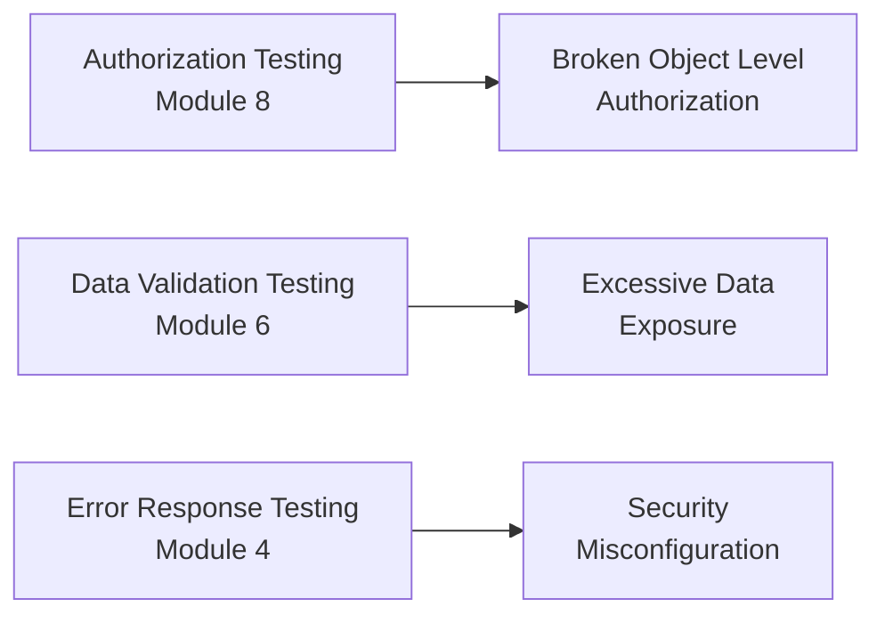

# API Security Fundamentals

**Prerequisites**: You should already understand [Idempotency, Retry Logic, and Duplicate Request Prevention](/learning-paths/api-testing/idempotency-retry-logic-and-duplicate-request-prevention) and the rest of [Section 4](/learning-paths/api-testing/section-4-review).
**Leads to**: After this, you'll be ready for [Injection and Input-Based Attacks](/learning-paths/api-testing/injection-and-input-based-attacks).

This section is not about penetration testing or building exploits — that's a specialized discipline of its own. It's about something narrower and, for most QA engineers, more immediately useful: recognizing the specific, common ways an API's security controls fail, using the same functional-testing skills this path has built all along. Many of the defects this section covers are things you're already positioned to catch, simply by testing with the right questions in mind.

## Why This Matters

**A tester who tests security as someone else's job.** Testing AtlasBank's customer-profile API, a tester confirms the happy path, the validation rules, and the authorization checks from earlier sections — all correct. Security testing, they assume, is handled separately by a dedicated security team before release. What never gets asked, because it felt outside scope: does the response return *only* the fields the requesting screen actually needs, or does it return the customer's full internal record — including fields like an internal risk score or a partial government ID number — because it was easier to return one shared object than to build a screen-specific one?

**A tester who asks security-shaped questions as part of ordinary testing.** A different tester, reviewing the same response, specifically checks what fields are actually present against what the calling screen displays. The response includes `internalRiskScore` and `governmentIdLast4` — neither shown anywhere in the UI, both sensitive, both being sent to the client regardless. This is a real, reportable defect (excessive data exposure) caught with nothing more exotic than reading a response carefully, exactly the skill [Data Validation and Response Verification](/learning-paths/api-testing/data-validation-and-response-verification) already built.

Most of what this section teaches isn't a new skill — it's the same precise-reading, same boundary-testing discipline from earlier in this path, deliberately pointed at security-relevant questions.

## What This Module Covers

**The CIA Triad (high level)**: three properties security testing generally protects — **Confidentiality** (only authorized parties see data), **Integrity** (data isn't altered in unauthorized ways), **Availability** (the system remains usable). Most of what a QA engineer tests day-to-day already touches these — an authorization gap is a confidentiality failure; the idempotency defects from the previous section are integrity failures; a cascading failure is an availability failure. This section adds the vocabulary to name what you're already looking for.

**The API attack surface**: everything reachable by a caller — every endpoint, every parameter, every header — is a potential attack surface. A tester's job isn't to think like an attacker in the adversarial, exploit-building sense; it's to recognize that anything reachable needs validation, exactly the mindset [What Is API Testing?](/learning-paths/api-testing/what-is-api-testing) established from the start of this path.

**OWASP API Security Top 10 (overview)**: a widely referenced, regularly updated list of the most common API security risk categories, maintained by the Open Web Application Security Project. As a tester, you don't need to memorize the list — you need to recognize the handful of categories a functional tester is best positioned to catch, covered directly in this module: broken object-level authorization, excessive data exposure, and security misconfiguration.

**Authentication vs. Authorization (review)**: [API Authentication](/learning-paths/api-testing/api-authentication) and [Authorization and Access Control](/learning-paths/api-testing/authorization-and-access-control) already covered these in depth — worth restating here because a large share of real API security incidents trace back to exactly these two categories, not to anything exotic.

**Sensitive data exposure**: any response returning more data than the caller is entitled to or needs — this module's opening example is exactly this category. Sensitive fields include obvious ones (passwords, full card numbers, government IDs) and less obvious ones (internal scores, another customer's identifiers, infrastructure details in an error message).

**Broken Object Level Authorization (BOLA)**: the formal OWASP name for the IDOR pattern [Authorization and Access Control](/learning-paths/api-testing/authorization-and-access-control) already covered — a caller supplying a resource ID they don't own, and the API failing to verify ownership before returning data. It's listed here specifically because it's consistently the single most common real API security finding, worth restating as the top of this module's priority list, not a one-off item.

**Excessive data exposure**: distinct from BOLA — this is about a response containing more *fields* than needed, even for a resource the caller genuinely owns. This module's opening example is excessive data exposure, not BOLA: the customer legitimately owns their own profile, but the response still over-shares fields the UI never uses.

**Security misconfiguration**: a broad category covering things like verbose error messages leaking stack traces or internal paths, default credentials left active, or an API documentation/debug endpoint accidentally left reachable in production. A tester's job: check error responses specifically for leaked internal detail, and confirm no debug or admin tooling is reachable without authentication.

**Security headers (overview)**: response headers like `Strict-Transport-Security`, `X-Content-Type-Options`, and `Content-Security-Policy` communicate security-relevant instructions to a calling browser. A tester's role here is awareness-level — confirming documented security headers are actually present — not deep header-configuration expertise.

**Secrets management (tester awareness)**: API keys, credentials, and tokens should never appear in a URL (URLs are commonly logged in plaintext by proxies and browser history), in a client-side error message, or in a public repository. A tester's job is noticing when a secret leaks somewhere it shouldn't — in a URL, a log, a response — not managing the secrets infrastructure itself.

**Logging sensitive data**: a related, easily-missed risk — an API might correctly protect a sensitive field in its *response* while still writing that same field, unmasked, into application logs. This is worth asking about even when it isn't directly observable through the API response itself.

| OWASP Category (Selected) | What a Functional Tester Checks |
|---|---|
| Broken Object Level Authorization | Substitute a resource ID belonging to a different, real identity — covered fully in Module 8 |
| Excessive Data Exposure | Compare a response's actual fields against what the calling screen genuinely uses |
| Security Misconfiguration | Read error responses for leaked stack traces/internal paths; confirm no unauthenticated debug endpoints |

## When Security-Focused Testing Matters Most

- **Any endpoint returning a data object shared across multiple screens or clients** — the opening example's excessive-data-exposure pattern is common exactly where a backend team reuses one full object rather than building screen-specific responses.
- **Any endpoint accepting a caller-supplied resource ID** — BOLA testing, already covered in Module 8, remains the single highest-value security check a functional tester performs.
- **Error paths specifically** — verbose, leaky error messages are a common, easily-checked misconfiguration, and error paths are frequently under-tested relative to happy paths.
- **Any endpoint intended for internal or debug use only** — confirming it's genuinely unreachable without proper authentication, not just undocumented.

Deep security-focused testing matters less on endpoints with no sensitive data and no elevated-privilege action — a public reference-data endpoint has little exposure risk to test for in this module's sense.

## How This Works on a Real Project

AtlasBank's loan-application status endpoint (`GET /api/v1/loans/{loanId}/status`) is being reviewed by a tester specifically for excessive data exposure, having already confirmed BOLA protection is in place (a different customer's loan ID is correctly rejected). Comparing the response against what the loan-status screen actually displays (application status, submitted date, expected decision date) reveals the response also includes the applicant's full annual income figure and an internal `creditRiskTier` field — neither shown anywhere in the UI, both sensitive.

This matters beyond the immediate exposure: the loan-status screen is reachable earlier in the application process, before a final decision, and a customer inspecting their own network traffic (something increasingly common, not an exotic scenario) would see their own internal risk classification before AtlasBank has communicated any decision — a real customer-trust and potentially regulatory concern, not just a technical over-sharing issue. The fix is straightforward once found: return only the fields the status screen actually uses, not the full internal loan record.

This is caught using nothing beyond the field-by-field comparison discipline from [Data Validation and Response Verification](/learning-paths/api-testing/data-validation-and-response-verification), deliberately applied with a security-relevant question in mind: not just "is this field correct," but "should this field be here at all."

## Common Mistakes

**Mistake 1: Treating security testing as entirely outside a functional tester's scope.**
As the opening and real-project examples show, several of the most common, most consequential security findings are caught with the exact same skills this path has already built — reading a response precisely, testing ownership boundaries.

**Mistake 2: Confusing BOLA with excessive data exposure.**
They're different defect classes with different fixes — BOLA is about *whose* data is returned (an ownership check), excessive data exposure is about *how much* data is returned for a resource the caller does legitimately own (a field-selection issue).

**Mistake 3: Not reading error responses for leaked internal detail.**
A verbose stack trace or internal file path in an error message is a common, easily-overlooked misconfiguration, invisible unless error paths get the same scrutiny as success paths.

**Mistake 4: Assuming a field's absence from the UI means it's already excluded from the API response.**
This module's two examples both show the opposite is common — a backend object is frequently over-inclusive, with the UI simply choosing not to render every field it receives.

:::note From the Field
A ride-sharing app's driver-profile endpoint, used by the rider-facing app to show a driver's name and rating before a trip, was found during a routine security review to also return the driver's full phone number and home-registered vehicle's exact license plate — fields the rider app never displayed, but present in every response, reachable by anyone willing to inspect their own network traffic. Nobody had added them maliciously; the endpoint simply returned the driver's entire internal profile object, and the field list had grown over several unrelated feature additions with no one asking whether each new field belonged in a rider-facing response.
:::

:::tip Senior QA Insight
A newer tester treats "security testing" as a separate activity from their usual functional testing. A senior tester runs the exact same field-by-field response comparison they already use for data validation, just with one additional question added to it: should this field be reachable by this caller at all — turning an existing habit into a security check, not learning a new one.
:::

## Best Practices

**Practice 1: Compare a response's actual fields against what the calling screen genuinely uses, as a deliberate, separate check.**
This is the single check that caught both this module's examples — not a new skill, but a specific question (should this field even be here) added to existing data-validation testing.

**Practice 2: Read error responses specifically for leaked internal detail — stack traces, file paths, internal identifiers.**
Error paths deserve the same scrutiny success paths get, and are commonly under-tested by comparison.

**Practice 3: Treat BOLA testing (substituting a resource ID) as a standing, default check on every ID-accepting endpoint.**
Given how consistently common this finding is in real APIs, it deserves default inclusion in any new endpoint's test plan, not just when explicitly requested.

**Practice 4: Report a security finding through the same clear, evidence-based process as any other defect.**
Precise reproduction steps, actual vs. expected data exposed, and severity reasoning — the exact discipline [Writing Effective Bug Reports](/learning-paths/manual-testing/writing-effective-bug-reports) already taught — applies directly, with severity typically weighted higher for data exposure than an equivalent purely functional defect.

## When NOT to Extend Testing Into Deep Security Analysis

- **Exploit development or active penetration testing** — this is a distinct, specialized discipline requiring explicit authorization and scope, not something to attempt informally as part of ordinary functional testing.
- **Infrastructure-level security concerns** (network segmentation, server hardening) — outside a functional API tester's scope; flag to the appropriate team rather than attempting to test directly.

## Mini Challenge

**Scenario**: AtlasBank's customer-search endpoint (used internally by support agents) returns a full customer record for every search result, including fields like date of birth and mailing address, when the support-agent UI only displays name and account number in the results list.

**Your task**: Identify what category of finding this is, explain why it's a real defect even though support agents are an authorized, internal audience, and describe how you'd verify whether it's BOLA, excessive data exposure, or both.

## Key Takeaways

- Several of the most common, most consequential API security findings — BOLA and excessive data exposure especially — are caught using the same precise-reading and boundary-testing skills this path already built, not a separate specialized discipline.
- BOLA (wrong ownership) and excessive data exposure (too many fields, even for legitimately owned data) are distinct defect classes with distinct fixes.
- Comparing a response's actual fields against what the calling screen genuinely uses is a deliberate, specific check worth adding to ordinary data-validation testing.
- Error responses deserve the same scrutiny as success responses — leaked stack traces and internal details are a common, easily-missed misconfiguration.

---

## What You Just Learned

- The CIA Triad at a level relevant to functional testing, and how earlier modules in this path already touch each property
- The OWASP API Security Top 10 categories a functional tester is best positioned to catch: BOLA, excessive data exposure, and security misconfiguration
- The distinction between BOLA (wrong ownership) and excessive data exposure (too many fields for legitimately owned data)
- How a real loan-status excessive-data-exposure defect was caught using the same field-by-field comparison discipline from earlier in this path

**Next:** [Injection and Input-Based Attacks](/learning-paths/api-testing/injection-and-input-based-attacks)

## Related Topics

- [Authorization and Access Control](/learning-paths/api-testing/authorization-and-access-control) — Where BOLA (there called IDOR) was first covered in full testing depth
- [Data Validation and Response Verification](/learning-paths/api-testing/data-validation-and-response-verification) — The field-by-field response discipline this module points at security-relevant questions specifically
- [Injection and Input-Based Attacks](/learning-paths/api-testing/injection-and-input-based-attacks) — Where this module's attack-surface awareness extends into testing how an API handles malicious or malformed input

## Interview Questions

**Q1: What's the difference between Broken Object Level Authorization and excessive data exposure?**

*What to look for*: A candidate who clearly distinguishes "wrong resource owner" (BOLA) from "too many fields returned for a resource the caller does own" (excessive data exposure), ideally with a concrete example of each, like this module's loan-status income/risk-tier example for the latter.

:::note Common Interview Mistake
Many candidates treat "security testing" as entirely someone else's job and can't name a specific category they've personally tested for. That's a missed opportunity in an interview — a strong answer names BOLA specifically (substituting a resource ID) as a check they already perform as part of ordinary authorization testing, connecting security awareness to concrete, everyday functional testing.
:::

**Q2: How would you test for excessive data exposure in an API response?**

*What to look for*: A candidate who describes comparing the response's actual fields against what the calling UI or use case genuinely needs, rather than assuming the API only returns what's displayed — citing that backend objects are frequently over-inclusive by default.

---

## Glossary

**CIA Triad**: Confidentiality, Integrity, and Availability — the three properties most security testing aims to protect.

**BOLA (Broken Object Level Authorization)**: A resource-ownership authorization failure where an API returns data for a resource the caller doesn't actually own, given a valid-looking but incorrect resource ID — also known as IDOR.

**Excessive Data Exposure**: A response returning more fields than the caller needs or is entitled to, even for a resource they legitimately own.

**Security Misconfiguration**: A broad category of security weaknesses arising from incorrect or overly permissive configuration — verbose error messages, exposed debug endpoints, default credentials — rather than a logic flaw.

## Quick Revision

Remember these five points:

✓ Several common, high-impact API security findings (BOLA, excessive data exposure) are caught with the same skills this path already taught, not a separate discipline.
✓ BOLA is about wrong ownership; excessive data exposure is about too many fields, even for correctly-owned data.
✓ Compare a response's actual fields against what the calling screen genuinely uses, as a deliberate, specific check.
✓ Read error responses for leaked internal detail (stack traces, file paths) as carefully as success responses.
✓ Report a security finding with the same precise, evidence-based structure as any other defect — typically at higher severity for real data exposure.
