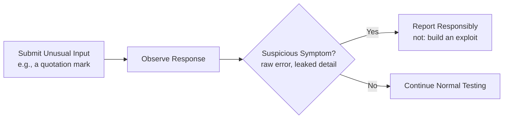

# Injection and Input-Based Attacks

**Prerequisites**: You should already understand [API Security Fundamentals](/learning-paths/api-testing/api-security-fundamentals).
**Leads to**: After this, you'll be ready for [Transport Security, CORS, and Secure Communication](/learning-paths/api-testing/transport-security-cors-and-secure-communication).


This module has one clear boundary, stated up front: it teaches how to **recognize** signs that an API might be vulnerable to input-based attacks, not how to build a working exploit. That distinction matters — identifying a suspicious symptom (an unhandled special character causing a server error, for instance) and reporting it for a security specialist to investigate further is squarely a QA engineer's job. Building and running an actual attack payload against a system is a different, specialized discipline requiring explicit authorization and scope.

## Why This Matters

**A tester who tests only valid, well-formed input.** Testing AtlasBank's beneficiary-nickname field, a tester confirms letters, numbers, and common punctuation are accepted and stored correctly. Input validation testing complete, they conclude. What never gets tested: what happens when the field contains a single unescaped quotation mark — a character with no business meaning in a nickname, but with special meaning to some backend data-handling code if it isn't properly handled.

**A tester who probes with unusual, boundary-breaking characters.** A different tester specifically includes a lone quotation mark, an ampersand, and a few other characters with special meaning in common data formats, as a standard part of input-field testing — not to build an attack, but because these characters are exactly the ones most likely to reveal how carelessly input is being handled. Submitting the nickname `O'Brien's Account` (a genuinely realistic name containing an apostrophe) triggers a `500 Internal Server Error` with a raw database error message in the response body — a strong, specific signal that this input isn't being safely handled before reaching a data layer, worth an immediate, responsibly-reported finding.

Realistic input often contains exactly the characters that reveal a validation gap — testing only "clean" input misses this by construction, not by bad luck.

## What This Module Covers

**Input validation, revisited with a security lens**: [Data Validation and Response Verification](/learning-paths/api-testing/data-validation-and-response-verification) covered type, format, and enum validation for *correctness*. This module asks a related but distinct question: what happens when input is not just wrong, but actively unusual — containing characters or structures that might interact badly with how the backend processes it?

**SQL Injection (testing perspective)**: a class of vulnerability where unsanitized input reaches a database query in a way that lets the input change the query's actual structure, rather than being treated as pure data. A tester's role is *symptom recognition*, not exploit construction: submitting a single quotation mark (a character with real, legitimate uses — names, contractions) and observing whether it causes a database-level error message, rather than being safely handled as ordinary text, is the standard, responsible test. A `500` with a raw SQL error in the response is the signal worth reporting; actually crafting a query to extract unauthorized data is outside a functional tester's scope.

**NoSQL Injection (overview)**: a related concept for non-relational databases, where a request body's *structure* itself (not just a string value) can sometimes be manipulated — for instance, submitting a JSON object where a string was expected for a field. A tester's job is confirming the API validates field *types* strictly (per [Data Validation and Response Verification](/learning-paths/api-testing/data-validation-and-response-verification)'s type-validation coverage), rejecting a structurally unexpected value rather than passing it through unmodified.

**Command Injection (overview)**: a vulnerability where input reaches a system-level command. Rare in typical API business logic, but worth being aware of on any endpoint that might plausibly shell out to an external process (a file-conversion or report-generation feature, for instance) — the same symptom-recognition approach applies: does unusual input in such a field produce an unexpected error revealing system-level detail?

**Header Injection**: input reflected into a response header without proper handling could allow an attacker to inject additional headers or manipulate the response in unintended ways. A tester's check: does a field that gets reflected back into a response header (a redirect URL, for instance) properly reject or encode newline characters, rather than passing them through unmodified?

**JSON Injection (concepts)**: submitting a value that, if inserted unsanitized into a JSON structure server-side, could break the JSON's structure — for instance, a string field containing an unescaped quotation mark and brace character that could corrupt the response's own JSON formatting if string values aren't properly escaped before being embedded in a response.

**Parameter Tampering**: modifying a request parameter to a value the client-side UI would never send but the API might not validate — a price field changed to a negative or unexpectedly low number, a quantity field changed after client-side validation but before the request reaches the server. This connects directly to [Headers, Parameters, and Payload Validation](/learning-paths/api-testing/headers-parameters-and-payload-validation)'s core lesson: anything reachable by direct API call needs its own validation, independent of client-side checks.

**Mass Assignment**: a specific, common defect where an API accepts a request body and applies *every* field in it directly to an internal object, without restricting which fields the caller is actually allowed to set. A customer profile-update request intended to let a customer change their display name might, if mass assignment isn't prevented, also let the same request body set an `accountTier` or `isVerified` field — fields the API never intended to expose as caller-settable, but which happen to match an internal field name.

```json
PATCH /api/v1/customers/{id}/profile
{
  "displayName": "New Name",
  "accountTier": "premium"
}
```

A tester's job: try including a field that shouldn't be caller-settable (like `accountTier` here) in an otherwise-legitimate request, and confirm the API ignores it rather than silently applying it.

**File Upload validation**: for any endpoint accepting a file (a KYC document upload, for instance), a tester should confirm the API validates file type and size *server-side* — not just via client-side UI restrictions — and specifically test uploading a file with a mismatched extension and actual content (a file named `document.pdf` that isn't actually a valid PDF) to confirm the server verifies actual content, not just the filename.

**Payload fuzzing (introduction)**: sending a wide range of unexpected, malformed, or boundary-breaking values (extremely long strings, unexpected data types, unusual characters, empty payloads where data is expected) to see what breaks. At a QA level, this means deliberately trying a handful of these characters on any field — a systematic extension of the boundary-testing mindset from [Boundary Value Analysis](/learning-paths/manual-testing/boundary-value-analysis), not a full automated fuzzing campaign (which belongs to a dedicated security testing effort).

**Safe testing practices**: test only systems you're explicitly authorized to test (your own team's test environments, never production systems or third-party services without clear authorization), never attempt to extract, modify, or exfiltrate real customer data even if a vulnerability seems present, and report a suspected vulnerability immediately and responsibly rather than continuing to probe it further alone.



## When Input-Based Attack Awareness Matters Most

- **Any free-text field accepting realistic user input** — names, addresses, and notes fields realistically contain apostrophes, ampersands, and other special characters, exactly the input this module's opening example shows is both realistic *and* revealing.
- **Any endpoint accepting a request body with more fields than the caller should be able to set** — mass assignment testing is directly relevant to any `PATCH`/`PUT`/`POST` endpoint, not just obviously sensitive ones.
- **File upload endpoints, specifically for server-side content validation** — client-side-only validation is trivially bypassed by anything calling the API directly.
- **Any field reflected back into a response, header, or downstream system** — the header and JSON injection concepts apply specifically where input doesn't just get stored, but gets echoed somewhere else.

Deep input-based attack testing matters less for tightly-constrained, enum-restricted, or numeric-only fields already covered thoroughly by the type/format/enum validation from [Data Validation and Response Verification](/learning-paths/api-testing/data-validation-and-response-verification) — though confirming that constraint is actually enforced server-side, not just client-side, remains worthwhile.

## How This Works on a Real Project

AtlasBank's customer-profile update endpoint (`PATCH /api/v1/customers/{id}/profile`) is being tested for mass assignment specifically. The documented, intended-settable fields are `displayName`, `phoneNumber`, and `preferredLanguage`. A tester deliberately includes an additional, undocumented field in the request body — `kycVerified: true` — a field the tester knows exists internally (visible in a separate, authorized API response) but was never intended to be caller-settable.

The real defect: the request succeeds, and a follow-up `GET` on the same customer confirms `kycVerified` was actually set to `true` by the request — a customer's KYC verification status, something that should only ever be set by AtlasBank's internal verification process, can be set directly by the customer themselves through an endpoint never intended to expose it. This is caught specifically because the tester deliberately tested a field *not* in the documented request schema, rather than only testing the documented fields — mass assignment defects are, by definition, invisible to a test plan that only exercises the intended, documented behavior.

## Common Mistakes

**Mistake 1: Testing only "clean," well-formed input, never realistic input containing special characters.**
As the opening example shows, realistic input (an apostrophe in a real name) is often exactly the input that reveals a validation gap — testing only sanitized-looking input misses this category entirely.

**Mistake 2: Testing only documented request fields, never additional undocumented ones.**
The mass-assignment example's real defect is invisible to any test plan that only exercises the documented schema — deliberately testing beyond it is what catches this defect class.

**Mistake 3: Treating a raw database or system error as "just an ugly error message" rather than a security-relevant finding.**
A leaked stack trace or database error is both a security misconfiguration (Module 13) and often a strong symptom of an underlying injection vulnerability — worth reporting with that context, not dismissed as a cosmetic issue.

**Mistake 4: Attempting to go beyond symptom recognition into building or running an actual exploit.**
This is explicitly outside a functional QA engineer's scope and authorization — the correct action on a suspicious symptom is a responsible, prompt report, not further independent probing.

:::note From the Field
A QA engineer testing a customer-profile update form, purely as part of a routine functional pass, entered a customer's last name as "O'Malley" and got back a raw database error with a visible table name and column list instead of a validation message. The engineer reported it immediately with exact reproduction steps and stopped there. The security team confirmed a real, serious injection vulnerability within the hour — found not by anyone hunting for security flaws, but by a functional tester using realistic test data as a matter of routine, then recognizing an abnormal response for what it was.
:::

:::tip Senior QA Insight
A newer tester sees an ugly error message and moves on, treating it as a cosmetic annoyance to mention in passing. A senior tester treats an unexpected system-level error as the most interesting result of the day — it's rarely "just an ugly message," and reporting it precisely, immediately, is worth more than ten passing test cases.
:::

## Best Practices

**Practice 1: Include realistic special characters (apostrophes, ampersands, quotation marks) in text-field testing as standard practice, not an afterthought.**
This module's opening example shows these aren't exotic test cases — they're realistic input that happens to also be revealing.

**Practice 2: Deliberately test fields outside the documented request schema on write endpoints.**
Mass assignment is only caught by testing input beyond what's officially documented — a real, repeatable technique worth applying to every `PATCH`/`PUT`/`POST` endpoint.

**Practice 3: Treat a raw system error as a priority finding, reported with full reproduction detail immediately.**
Don't continue probing independently — a suspicious symptom like a database error is exactly the point to stop, document precisely, and escalate.

**Practice 4: Validate file uploads by content, not filename, and confirm server-side (not just client-side) enforcement.**
A mismatched extension-to-content test is a simple, repeatable, non-exploitative way to confirm real server-side validation exists.

## When NOT to Extend Testing Further

- **Beyond symptom recognition into exploit construction** — always outside scope for functional QA testing; escalate to a security specialist instead.
- **Against any system without explicit authorization** — a shared staging environment, a third-party service, or production are never appropriate targets for this kind of probing without clear, prior authorization.

## Mini Challenge

**Scenario**: AtlasBank's fund-transfer memo field accepts free text up to 100 characters. A tester wants to check for injection-related symptoms responsibly.

**Your task**: List three specific, non-exploitative test inputs you'd try in this field, and for each, describe what response would count as a "suspicious symptom" worth reporting versus a properly-handled response.

## Key Takeaways

- This module's scope is recognizing symptoms of input-handling weaknesses and reporting them responsibly — not building or running exploits, which is a distinct, specialized discipline requiring explicit authorization.
- Realistic input (an apostrophe in a name, for instance) is often exactly the input that reveals a validation gap — testing only "clean" input misses this by construction.
- Mass assignment is caught only by deliberately testing fields outside a request's documented schema, a distinct and repeatable technique worth applying to every write endpoint.
- A raw system error in a response is both a security misconfiguration and often a strong symptom of a deeper injection vulnerability — a priority finding, reported immediately rather than probed further independently.

---

## What You Just Learned

- The clear boundary between symptom recognition (a QA engineer's role) and exploit construction (outside scope, requiring specialized authorization)
- How realistic special-character input often reveals validation gaps that "clean" input testing misses entirely
- How to test for mass assignment by deliberately including undocumented fields in a write request
- How a real mass-assignment defect (a customer setting their own KYC verification status) was caught by testing beyond the documented request schema

**Next:** [Transport Security, CORS, and Secure Communication](/learning-paths/api-testing/transport-security-cors-and-secure-communication)

## Related Topics

- [API Security Fundamentals](/learning-paths/api-testing/api-security-fundamentals) — The OWASP-category vocabulary and responsible-reporting mindset this module builds on directly
- [Headers, Parameters, and Payload Validation](/learning-paths/api-testing/headers-parameters-and-payload-validation) — The parameter and payload testing this module extends with a security-symptom lens
- [Transport Security, CORS, and Secure Communication](/learning-paths/api-testing/transport-security-cors-and-secure-communication) — Where this module's input-handling awareness extends into how data is protected in transit

## Interview Questions

**Q1: How would you test for a potential injection vulnerability without building an actual exploit?**

*What to look for*: A candidate who clearly describes symptom recognition — submitting a character with special meaning (like a quotation mark) and observing whether it produces a raw system error — and who explicitly states that going further (building a working exploit) is outside a functional tester's scope and requires specialized authorization.

:::note Common Interview Mistake
Some candidates, trying to sound thorough, describe attempting to actually extract data or bypass authentication during a routine functional test. That's a red flag, not a strong answer — a strong answer clearly draws the line at symptom recognition and responsible reporting, showing judgment about scope and authorization, not just technical curiosity.
:::

**Q2: What is mass assignment, and how would you test for it?**

*What to look for*: A candidate who explains that mass assignment happens when an API applies every field in a request body to an internal object without restriction, and who describes the concrete test: including an undocumented, sensitive field name in an otherwise-legitimate request and confirming it's ignored, not silently applied.

---

## Glossary

**Injection**: A class of vulnerability where unsanitized input changes the structure or behavior of a downstream system (a database query, a command, a document format) rather than being treated as pure data.

**Mass Assignment**: A defect where an API applies every field present in a request body to an internal object, without restricting which fields a caller is actually permitted to set.

**Payload Fuzzing**: Sending a range of unexpected, malformed, or boundary-breaking input values to observe how a system responds, used here at an awareness level distinct from full automated security fuzzing.

**Symptom Recognition**: Identifying signs that a system might be vulnerable (a raw error message, unexpected behavior) without constructing or executing an actual exploit — the scope boundary this module works within.

## Quick Revision

Remember these five points:

✓ This module's scope is symptom recognition and responsible reporting — not building or running exploits, which requires specialized authorization.
✓ Realistic input (apostrophes, special characters in real names) often reveals validation gaps that "clean" input testing misses.
✓ Test mass assignment by deliberately including undocumented fields in a write request and confirming they're ignored.
✓ A raw system error in a response is a priority finding — report it immediately with full reproduction detail, don't probe further independently.
✓ Validate file uploads by actual content, not filename, and confirm enforcement is server-side, not just client-side.
