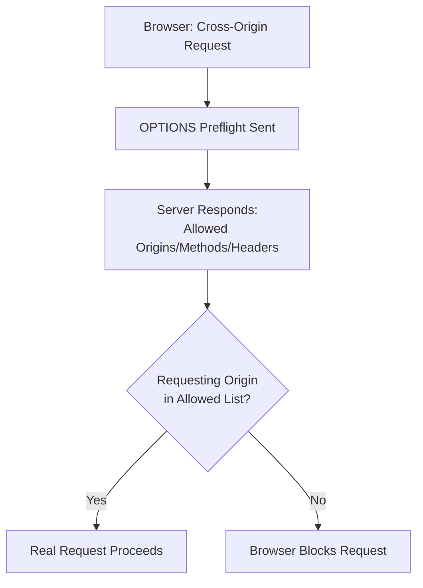

# Transport Security, CORS, and Secure Communication

**Prerequisites**: You should already understand [Injection and Input-Based Attacks](/learning-paths/api-testing/injection-and-input-based-attacks).
**Leads to**: After this, you'll be ready for [Performance Testing APIs](/learning-paths/api-testing/performance-testing-apis).

The previous two modules covered what happens to data at rest and in a request's content. This module closes the section by covering data *in transit* — whether a connection is actually secure, and which callers are actually allowed to reach an API from a browser. Both are testable at an awareness level, without needing deep cryptography or infrastructure expertise.

## Why This Matters

**A tester who assumes HTTPS is simply "on."** Testing AtlasBank's API, a tester notices every request in their test setup uses `https://` and moves on — transport security, they assume, is a solved, binary condition. What never gets tested: whether the *same* API is still reachable over plain, unencrypted `http://` as a fallback, something a browser address bar wouldn't obviously reveal during ordinary testing, since typing `https://` by habit never actually exercises the `http://` path.

**A tester who deliberately tests the insecure path.** A different tester specifically requests the same endpoint over `http://` instead of `https://`. The request succeeds — the API accepts and responds over an unencrypted connection instead of rejecting it or redirecting to HTTPS. This is a real, meaningful defect: any data sent this way (including an `Authorization` header carrying a bearer token) travels in plain text, readable by anything positioned to observe the network traffic between client and server.

Transport security isn't "on" or "off" as a whole — it's enforced (or not) on a per-connection basis, and the only way to know the insecure path is actually blocked is to deliberately try it.

## What This Module Covers

**HTTPS and TLS fundamentals**: HTTPS is HTTP layered over TLS (Transport Layer Security), which encrypts data between client and server and verifies the server's identity via a certificate. A tester doesn't need to understand TLS's cryptographic details — the relevant, testable question is simpler: does the API *require* HTTPS, actively rejecting or redirecting plain HTTP, rather than merely supporting HTTPS as one option among several?

**Certificates (high level)**: a TLS certificate proves a server's identity and is issued by a trusted certificate authority. A tester's practical check: does a request against the API correctly fail (rather than silently succeeding) if the certificate is invalid, expired, or self-signed in a context where that shouldn't be trusted? Most HTTP client tooling will flag this automatically — the relevant tester habit is not disabling or ignoring certificate validation warnings just to make a test run "succeed" more conveniently, since that defeats the exact check that matters.

**HSTS awareness (HTTP Strict Transport Security)**: a response header (`Strict-Transport-Security`) that tells a browser to *only* ever connect to this domain over HTTPS in the future, even if a user later types or is linked to a plain `http://` URL. A tester's check is straightforward: is this header actually present on responses, matching what the API's documented security posture claims?

**Mixed content (concepts)**: a page served over HTTPS that then loads a resource (a script, an image, an API call) over plain HTTP creates a "mixed content" situation, undermining the outer page's own security guarantee. Most directly relevant to browser-based clients calling an API — worth a tester's awareness when testing a web frontend's calls to a backend API, less directly relevant to server-to-server API testing itself.

**CORS fundamentals (Cross-Origin Resource Sharing)**: by default, a browser's **Same-Origin Policy** blocks a web page from one origin (`https://app.atlasbank.com`) from making a request to an API on a different origin (`https://api.atlasbank.com`) unless the API explicitly allows it. CORS is the mechanism by which an API grants that permission — via response headers stating which origins, methods, and headers are allowed.

```http
Access-Control-Allow-Origin: https://app.atlasbank.com
Access-Control-Allow-Methods: GET, POST, PUT, DELETE
Access-Control-Allow-Credentials: true
```

**Allowed Origins**: the specific, real risk in CORS testing is an overly permissive configuration — `Access-Control-Allow-Origin: *` (any origin at all) combined with credentialed requests is a particularly dangerous pattern, since it would let a malicious website make authenticated requests to AtlasBank's API using a logged-in visitor's own credentials. A tester's check: confirm the API's allowed origins list is specific (AtlasBank's own known domains) rather than wildcarded, especially on any endpoint that also allows credentials.

**Credentialed requests**: a CORS request that includes cookies or an `Authorization` header is "credentialed," and browsers apply an extra restriction — `Access-Control-Allow-Origin` cannot be `*` for a credentialed request to succeed; it must name a specific origin. A tester's check: confirm this restriction is actually respected by the API's configuration, not bypassed by some other misconfiguration.

**Preflight requests**: for many cross-origin requests (anything beyond a simple `GET`, or requests with custom headers), a browser first sends an automatic `OPTIONS` request — the "preflight" — asking the server which origins, methods, and headers are actually allowed, before sending the real request. A tester's check: does the preflight response correctly reflect the same allowed-origins policy as the actual request, and does the server correctly reject the real request if the preflight indicates it shouldn't be allowed?

**Secure cookie concepts (tester awareness)**: for APIs using cookies (rather than solely bearer tokens) for session handling, a tester should be aware of three flags worth checking for on any session cookie: `Secure` (cookie only sent over HTTPS), `HttpOnly` (cookie inaccessible to client-side JavaScript, reducing certain attack surfaces), and `SameSite` (restricts whether the cookie is sent on cross-site requests). Confirming these flags are present is a quick, high-value check.



## When Transport and CORS Testing Matters Most

- **Any API reachable over the public internet** — confirming plain HTTP is actually rejected, not just that HTTPS is supported, exactly as this module's opening example shows.
- **Any API called directly from browser-based JavaScript** — CORS configuration is directly relevant here in a way it isn't for pure server-to-server calls.
- **Any endpoint allowing credentialed cross-origin requests** — the wildcard-origin-plus-credentials combination is a specific, high-severity misconfiguration worth deliberately checking for.
- **Any API using cookies for session management** — the `Secure`/`HttpOnly`/`SameSite` flag check is quick and directly meaningful.

Transport and CORS testing matters less for purely internal, server-to-server APIs never called from a browser context — CORS specifically is a browser-enforced mechanism and doesn't apply to non-browser clients the same way.

## How This Works on a Real Project

AtlasBank's new customer-facing spending-insights widget is a JavaScript component embedded on `https://app.atlasbank.com`, calling `https://api.atlasbank.com/v1/insights`. A tester checks the API's CORS configuration and finds `Access-Control-Allow-Origin: *` — permissive, but the endpoint doesn't require authentication, so this alone isn't yet the real issue AtlasBank's security review is concerned about.

Testing further, the tester discovers the same wildcard configuration is applied *globally* across the API gateway — including on `/v1/accounts/{id}/balance`, an authenticated, credentialed endpoint that should never be reachable cross-origin from an arbitrary website. Because the balance endpoint uses cookie-based session authentication and the browser would (per the credentialed-request rule) normally block a wildcard-origin response from succeeding with credentials — except the API's actual configuration turns out to dynamically reflect *any* requesting origin back as the allowed origin, rather than literally sending `*`, a common workaround some frameworks apply to make wildcard-like behavior work even for credentialed requests. This defeats the browser's own protection: any malicious website could make an authenticated balance request on behalf of a logged-in AtlasBank customer visiting that malicious site, and receive the customer's real account balance in the response.

This is a severe, real defect, caught specifically because the tester didn't stop at the first (lower-risk) endpoint's permissive CORS configuration, but checked whether the same misconfiguration extended to a credentialed, sensitive endpoint where the consequences are entirely different.

## Common Mistakes

**Mistake 1: Confirming HTTPS is supported without confirming plain HTTP is rejected.**
As the opening example shows, these are two different, independently testable claims — an API can support HTTPS while still also, insecurely, accepting HTTP.

**Mistake 2: Treating a wildcard CORS origin as low-risk without checking whether it applies to credentialed endpoints.**
The real-project example's severity comes entirely from the wildcard-equivalent configuration reaching an authenticated, sensitive endpoint — the same configuration on a public, unauthenticated endpoint is a much smaller concern.

**Mistake 3: Disabling certificate validation in test tooling to make tests "pass" more easily.**
This defeats the exact check that matters — a test environment's convenience shortcut can mask a real defect that would matter in production.

**Mistake 4: Not testing the preflight response separately from the actual request.**
A preflight can advertise one policy while the actual endpoint enforces something different (or nothing) — worth confirming they agree, not just that the overall cross-origin call succeeds or fails.

:::note From the Field
A fintech dashboard's API gateway was configured with a wildcard CORS policy during early development, "temporarily," to unblock a frontend team working across several local dev origins. The ticket to tighten it before launch was filed, deprioritized, and forgotten for over a year. It was only caught during an unrelated third-party security audit — by which point several authenticated, credentialed endpoints had been reachable from any website on the internet the entire time, with zero incidents reported only because nobody malicious had happened to notice yet.
:::

:::tip Senior QA Insight
A newer tester checks whether HTTPS "works" by confirming a request over `https://` succeeds. A senior tester also checks whether the *insecure* path is actually blocked — sending the same request over plain `http://` and confirming it's rejected or redirected — because "HTTPS is supported" and "HTTP is refused" are two different claims, and only one of them is a real security guarantee.
:::

## Best Practices

**Practice 1: Deliberately test the plain-HTTP path, not just confirm HTTPS works.**
This is the only way to know the insecure fallback is actually blocked, exactly as this module's opening example demonstrates.

**Practice 2: Check CORS configuration on every endpoint independently, especially credentialed ones, not just once for the API as a whole.**
The real-project example's severity was only found by extending the check beyond the first, lower-risk endpoint.

**Practice 3: Check for a dynamically-reflected origin, not just a literal wildcard.**
Some CORS misconfigurations achieve wildcard-like behavior by reflecting the requesting origin back dynamically, defeating the credentialed-request protection without ever sending a literal `*` — worth testing directly by sending an arbitrary, unexpected origin and checking whether it's reflected back as allowed.

**Practice 4: Confirm secure cookie flags (`Secure`, `HttpOnly`, `SameSite`) are present on any session cookie.**
A quick, high-value check, especially on any API relying on cookies rather than solely bearer tokens for session handling.

## When NOT to Apply Full Transport/CORS Testing

- **Purely internal, server-to-server APIs never called from a browser** — CORS specifically doesn't apply outside a browser context, though HTTPS enforcement remains worth testing regardless of caller type.
- **APIs already covered by infrastructure-level TLS enforcement testing** performed by a separate team or automated pipeline — duplicating deep certificate-validation testing manually adds less value than confirming the API-level behaviors (HTTP rejection, CORS configuration) this module focuses on.

## Mini Challenge

**Scenario**: AtlasBank's new merchant-payment API is called from a merchant-facing web dashboard at `https://merchants.atlasbank.com`. The API currently has no CORS headers configured at all.

**Your task**: Describe what would actually happen when the merchant dashboard tries to call this API (in terms of the browser's Same-Origin Policy), and list two specific things you'd test once CORS headers are added.

## Key Takeaways

- Transport security is enforced per-connection, not as a single on/off state — confirming plain HTTP is actually rejected requires deliberately testing that path, not just confirming HTTPS works.
- A wildcard or dynamically-reflected CORS origin is a much more severe finding on a credentialed, sensitive endpoint than on a public, unauthenticated one — the endpoint's own sensitivity changes the finding's real severity.
- Some CORS misconfigurations achieve wildcard-like behavior by dynamically reflecting the requesting origin, which can defeat the credentialed-request protection without ever using a literal wildcard — worth testing directly.
- Secure cookie flags (`Secure`, `HttpOnly`, `SameSite`) are a quick, high-value check on any API using cookie-based session handling.

---

## What You Just Learned

- How to test whether an API actually enforces HTTPS, rather than merely supporting it alongside an insecure fallback
- The CORS mechanism — Same-Origin Policy, allowed origins, credentialed requests, and preflight requests — and what a tester can verify without deep infrastructure expertise
- Why a permissive CORS configuration is far more severe on a credentialed, sensitive endpoint than a public one
- How a real, severe CORS misconfiguration (a dynamically-reflected origin defeating credentialed-request protection) was caught by extending testing beyond the first, lower-risk endpoint

**Next:** [Performance Testing APIs](/learning-paths/api-testing/performance-testing-apis)

## Related Topics

- [API Security Fundamentals](/learning-paths/api-testing/api-security-fundamentals) — The OWASP-category vocabulary and severity-reasoning this module's CORS findings apply directly
- [API Authentication](/learning-paths/api-testing/api-authentication) — The credentialed-request concept this module's CORS testing builds on directly
- [Injection and Input-Based Attacks](/learning-paths/api-testing/injection-and-input-based-attacks) — This section's other input/transport-focused module, completing Section 5's security coverage

## Interview Questions

**Q1: Why might a wildcard CORS configuration (`Access-Control-Allow-Origin: *`) be a serious problem on one endpoint but not on another?**

*What to look for*: A candidate who explains that the severity depends on whether the endpoint is credentialed and sensitive — a public, unauthenticated endpoint with a wildcard origin is low-risk, while the same configuration on an authenticated endpoint (or a dynamically-reflected-origin equivalent) can let a malicious site make authenticated requests on a victim's behalf.

:::note Common Interview Mistake
Many candidates answer "wildcard CORS is always bad and should never be used." That's an oversimplification — a strong answer explains that severity depends on context, specifically whether the endpoint is credentialed, and can name the more subtle risk of a dynamically-reflected origin achieving the same effect as a wildcard.
:::

**Q2: How would you test whether an API properly enforces HTTPS?**

*What to look for*: A candidate who describes deliberately sending a request over plain HTTP and confirming it's rejected or redirected, rather than just confirming HTTPS requests succeed — recognizing that supporting HTTPS and enforcing HTTPS are two different, independently testable claims.

---

## Glossary

**CORS (Cross-Origin Resource Sharing)**: The mechanism by which a server explicitly grants a browser permission for a web page on one origin to make requests to an API on a different origin.

**Same-Origin Policy**: The default browser restriction blocking a web page from making requests to a different origin unless explicitly permitted, typically via CORS.

**Preflight Request**: An automatic `OPTIONS` request a browser sends before certain cross-origin requests, asking the server which origins, methods, and headers are allowed.

**HSTS (HTTP Strict Transport Security)**: A response header instructing a browser to only ever connect to a domain over HTTPS in the future, even if a plain HTTP URL is later used.

## Quick Revision

Remember these five points:

✓ Confirm plain HTTP is actually rejected, not just that HTTPS works — the two are independently testable.
✓ A wildcard or dynamically-reflected CORS origin is far more severe on a credentialed, sensitive endpoint than a public one.
✓ Test for a dynamically-reflected origin specifically, since it can defeat credentialed-request protection without a literal wildcard.
✓ Never disable certificate validation in test tooling just to make a test pass more conveniently.
✓ Check for `Secure`, `HttpOnly`, and `SameSite` flags on any session cookie.
