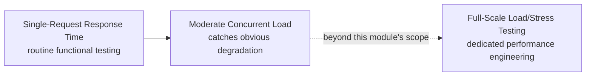

# Performance Testing APIs

**Prerequisites**: You should already understand [Transport Security, CORS, and Secure Communication](/learning-paths/api-testing/transport-security-cors-and-secure-communication) and the rest of [Section 5](/learning-paths/api-testing/section-5-review).
**Leads to**: After this, you'll be ready for [API Testing Tools](/learning-paths/api-testing/api-testing-tools).

Dedicated performance engineering — modeling realistic load, tuning infrastructure, running sustained multi-hour tests — is its own specialized discipline, outside this module's scope. What belongs here is narrower and squarely a functional tester's responsibility: recognizing when an API's response time or behavior under moderate load is a real problem, using the same precise, evidence-based habits this path has built throughout.

## Why This Matters

**A tester who only checks correctness.** Testing AtlasBank's transaction-history endpoint, a tester confirms the response is correct — right fields, right values, right status code — every time it's tested. Response time never gets recorded or compared, since the endpoint always "eventually" returns the right answer in a single-user test environment. The feature ships.

**A tester who checks correctness and response time together.** A different tester notices, almost incidentally while testing, that this specific endpoint consistently takes 4–5 seconds to respond, while every comparable endpoint in the same API responds in under 300 milliseconds. Investigating further reveals the transaction-history endpoint is fetching a customer's *entire* transaction history and filtering it in application code, rather than filtering at the database level — correct in every case tested, but a real, worsening problem as a customer's transaction volume grows over time, invisible in a test environment with only a handful of sample transactions per test account.

A response being *correct* and a response being *fast enough* are two independent claims — testing only the first misses a real, common defect class the second would catch immediately.

## What This Module Covers

**Response time**: how long a single request takes to complete, from sending it to receiving the full response. The most basic, most directly testable performance metric — most API testing tools report this automatically, making it nearly free to check as a routine part of functional testing, not an extra, separate effort.

**Throughput**: how many requests a system can handle in a given time period (often measured in requests per second). Distinct from response time — a system can have fast individual response times but low throughput if it can't handle many concurrent requests well, a distinction directly relevant to [Cascading Failures, Error Handling, and Fault Tolerance](/learning-paths/api-testing/cascading-failures-error-handling-and-fault-tolerance)'s shared-resource-exhaustion lessons.

**Behavior under load — a functional tester's version**: full load testing (simulating thousands of concurrent users over a sustained period) is specialized work, typically owned by a dedicated performance engineering function. What a functional tester can meaningfully do, without that specialized tooling, is test with a *moderate*, deliberately elevated number of concurrent requests — enough to reveal an obvious problem (a response time that degrades sharply, or a resource that clearly isn't being released) without needing production-scale infrastructure.

| Testing Level | What It Reveals | Who Typically Owns It |
|---|---|---|
| Single-request response time | An individual endpoint's basic responsiveness | Any functional tester, as routine practice |
| Moderate concurrent load (tens of requests) | An obvious degradation or resource-release problem | A functional tester, as an extension of existing testing |
| Full-scale load/stress testing | Precise capacity limits, sustained-load behavior, infrastructure tuning needs | A dedicated performance engineering function |

**Recognizing a performance defect versus a scale limitation**: not every slow response is a "defect" in the sense of something broken — sometimes a system is working exactly as designed but simply hasn't been provisioned for a given load level, which is a capacity-planning conversation, not a functional bug report. The distinction that *is* a tester's job to notice: whether response time scales *reasonably* with legitimate input size (a customer with 10,000 transactions taking longer than one with 10 is expected; taking 400 times longer instead of roughly proportionally longer suggests an actual inefficiency, like the opening example's unfiltered database fetch).

**Comparing an endpoint against its own siblings**: as the opening example shows, one of the simplest, most effective performance checks available to a functional tester is relative, not absolute — does this endpoint's response time look reasonable *compared to similar endpoints in the same API*, rather than measured against an arbitrary external benchmark. A significant, unexplained outlier is worth investigating even without a formal performance budget defined.

**Where performance and correctness intersect**: a slow response can itself cause a *correctness* problem elsewhere — a slow authentication check that causes a client-side timeout, triggering a retry (connecting directly to [Idempotency, Retry Logic, and Duplicate Request Prevention](/learning-paths/api-testing/idempotency-retry-logic-and-duplicate-request-prevention)'s concerns), or a slow response holding a database connection open longer than necessary, contributing to the kind of resource exhaustion [Cascading Failures, Error Handling, and Fault Tolerance](/learning-paths/api-testing/cascading-failures-error-handling-and-fault-tolerance) covered. Performance issues rarely stay purely a "performance" concern in isolation.

## When Performance Awareness Matters Most

- **Any endpoint whose response time depends on a variable amount of data** — a transaction history, a search, a report — where response time should scale reasonably with input size, exactly the opening example's pattern.
- **Comparing an endpoint against its own siblings in the same API** — a relative, low-effort check that doesn't require a formal performance budget to be useful.
- **Any scenario connecting a slow response to a downstream correctness risk** — a timeout-triggered retry, or resource exhaustion under moderate concurrent load — where performance and correctness testing genuinely intersect.
- **Newly built or recently modified endpoints**, where a performance regression is most likely to be introduced and least likely to have been caught yet by any dedicated performance testing cadence.

Deep performance investigation matters less for endpoints with fixed, small, non-scaling response payloads, where response time is unlikely to vary meaningfully regardless of usage — though a basic response-time sanity check remains cheap and worth keeping as routine practice.

## How This Works on a Real Project

AtlasBank's beneficiary-list endpoint is being tested. A tester, following the practice of comparing response times across similar endpoints, notices it takes roughly 1.2 seconds even for a test account with only three beneficiaries — while a comparably-shaped account-list endpoint responds in under 200 milliseconds. Investigating with a moderate concurrent-load test (twenty simultaneous requests, well short of a full load test), response time for the beneficiary-list endpoint climbs further, past 3 seconds per request, while the account-list endpoint's response time stays roughly flat.

The real defect: the beneficiary-list endpoint is making a separate downstream call to a fraud-screening service *for each individual beneficiary*, sequentially, rather than batching the check into a single call — meaning response time scales directly with beneficiary count, and under concurrent load, the sequential downstream calls compound the delay further. This wasn't visible in ordinary correctness testing, since the response was always correct, just slow — and it wasn't visible in a single-request test either, since three sequential fraud-screening calls, while slower than ideal, didn't look dramatically wrong until compared directly against a sibling endpoint and tested under moderate concurrent load.

## Common Mistakes

**Mistake 1: Testing correctness without ever recording or comparing response time.**
As the opening and real-project examples both show, a consistently correct response can still hide a real, worsening performance defect invisible to a correctness-only test.

**Mistake 2: Treating any slow response as automatically a "performance defect" worth a bug report.**
Some slowness reflects a genuine capacity or provisioning limitation, not a functional bug — the useful distinction is whether response time scales reasonably with legitimate input size, not whether a specific number "feels slow."

**Mistake 3: Only testing single requests, never moderate concurrent load.**
The beneficiary-list example's full severity — response time climbing further under concurrent load — was only visible once concurrent requests were introduced, not from a single-request test alone.

**Mistake 4: Attempting full-scale load testing without the appropriate specialized tooling or ownership.**
This module's scope is deliberately narrower — recognizing an obvious problem with moderate load, not replacing a dedicated performance engineering practice.

:::note From the Field
A media company's article-recommendation endpoint passed every functional test cleanly and shipped. Nobody had compared its response time against the article-detail endpoint sitting right next to it in the same API — recommendation quietly took four times as long, because it recalculated a full ranking on every request instead of reusing a cached one. It went unnoticed for months, discovered only when a traffic spike made recommendation the single slowest, most resource-hungry endpoint in the entire API, well after it had already shaped infrastructure costs for that whole period.
:::

:::tip Senior QA Insight
A newer tester considers performance someone else's job until a dashboard flags a problem. A senior tester glances at response time as a routine, nearly-free habit on every endpoint they touch, and compares it against similar endpoints in the same API — because a real, costly inefficiency often sits quietly correct and untested until someone happens to look at the number, not just the response.
:::

## Best Practices

**Practice 1: Record response time as a routine part of functional testing, not a separate, extra effort.**
Most API testing tools report this automatically — the habit of glancing at it, not just the response body, is nearly free and catches real defects, as this module's examples show.

**Practice 2: Compare an endpoint's response time against similar sibling endpoints in the same API.**
This relative check, used in the real-project example, doesn't require a formal performance budget to reveal a meaningful, worth-investigating outlier.

**Practice 3: Test with moderate concurrent load as a routine extension of endpoint testing, not just single requests.**
This is what revealed the beneficiary-list example's full severity — a defect that scales with concurrency, not just data volume alone.

**Practice 4: Distinguish "slow because of a real inefficiency" from "slow because of an untested capacity limit," and route each appropriately.**
The former is a functional defect report; the latter is a capacity-planning conversation — conflating them either overstates or understates the actual issue.

## When NOT to Extend Into Deep Performance Testing

- **Full-scale load, stress, or soak testing** — explicitly outside this module's scope; belongs to a dedicated performance engineering function with the appropriate specialized tooling and infrastructure.
- **Endpoints with fixed, minimal, non-scaling responses** — a basic sanity check remains worthwhile, but deep investigation is better spent where response time genuinely varies with input.

## Mini Challenge

**Scenario**: AtlasBank's statement-generation endpoint (`GET /api/v1/accounts/{accountId}/statements/{month}/download`) takes 800ms for a test account with minimal transaction history.

**Your task**: Describe two specific tests you'd run to determine whether this is a real performance concern worth reporting, drawing on this module's relative-comparison and moderate-concurrent-load techniques.

## Key Takeaways

- Correctness and adequate speed are two independent claims — a consistently correct response can still hide a real, worsening performance defect, as this module's two examples both show.
- Comparing an endpoint's response time against similar sibling endpoints is a simple, relative check that doesn't require a formal performance budget to be useful.
- Moderate concurrent load testing, well short of full-scale load testing, can reveal an obvious degradation invisible in single-request testing alone.
- Not every slow response is a functional defect — the useful distinction is whether response time scales reasonably with legitimate input size, versus reflecting an untested capacity limitation.

---

## What You Just Learned

- The difference between response time and throughput, and what a functional tester can meaningfully test without specialized load-testing infrastructure
- Why comparing an endpoint's response time against its own siblings is a simple, effective, low-effort performance check
- How to distinguish a real performance defect (disproportionate scaling with input size) from an untested capacity limitation
- How a real sequential-downstream-call defect was caught by combining relative comparison with moderate concurrent-load testing

**Next:** [API Testing Tools](/learning-paths/api-testing/api-testing-tools)

## Related Topics

- [Cascading Failures, Error Handling, and Fault Tolerance](/learning-paths/api-testing/cascading-failures-error-handling-and-fault-tolerance) — The shared-resource-exhaustion concerns this module's concurrent-load testing directly connects to
- [Idempotency, Retry Logic, and Duplicate Request Prevention](/learning-paths/api-testing/idempotency-retry-logic-and-duplicate-request-prevention) — Where a slow response triggering a client-side retry becomes a correctness concern, not just a performance one
- [API Testing Tools](/learning-paths/api-testing/api-testing-tools) — Where this module's response-time and moderate-load testing techniques connect to the tools that make them practical to run

## Interview Questions

**Q1: How would you test API performance without access to dedicated load-testing infrastructure?**

*What to look for*: A candidate who describes recording response time as routine practice, comparing an endpoint against similar sibling endpoints, and testing with moderate concurrent load — rather than either ignoring performance entirely or claiming to replace full-scale load testing without the appropriate tooling.

:::note Common Interview Mistake
Many candidates either say "performance testing isn't my job" or describe attempting full production-scale load simulation without appropriate tooling. Both miss the actual, practical middle ground this module teaches — a strong answer names specific, low-effort techniques (relative comparison, moderate concurrent load) a functional tester can genuinely apply.
:::

**Q2: A response is always correct but sometimes slow. How do you decide whether that's worth a bug report?**

*What to look for*: A candidate who describes checking whether response time scales reasonably with legitimate input size (proportional growth expected, dramatically disproportionate growth is a real concern) rather than judging "slow" by gut feeling alone.

---

## Glossary

**Response Time**: How long a single request takes to complete, from being sent to the full response being received.

**Throughput**: How many requests a system can handle in a given time period, typically measured in requests per second — distinct from response time.

**Moderate Concurrent Load**: A deliberately elevated but non-production-scale number of simultaneous requests, used by a functional tester to reveal an obvious performance problem without full load-testing infrastructure.

## Quick Revision

Remember these five points:

✓ Correctness and adequate speed are independent claims — record response time as routine practice, not an afterthought.
✓ Compare an endpoint's response time against similar sibling endpoints — a simple, effective relative check.
✓ Test with moderate concurrent load to catch a degradation invisible in single-request testing.
✓ Distinguish a real performance defect (disproportionate scaling) from an untested capacity limitation.
✓ Full-scale load and stress testing is outside this module's scope — it belongs to dedicated performance engineering.
