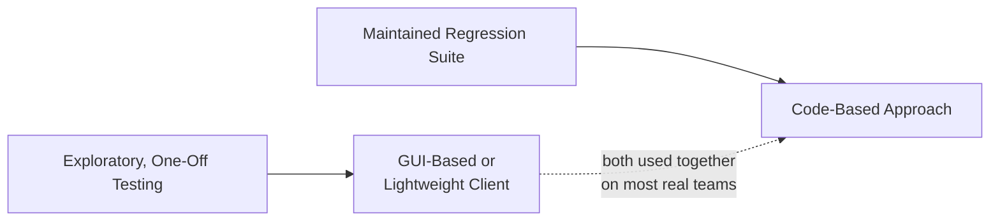

# API Testing Tools

**Prerequisites**: You should already understand [Performance Testing APIs](/learning-paths/api-testing/performance-testing-apis).
**Leads to**: After this, you'll be ready for [Applying API Testing: AtlasBank Cross-Border Payment Flow](/learning-paths/api-testing/applying-api-testing-cross-border-payment-flow).

Every technique this path has taught so far is tool-independent — BOLA testing, idempotency-key verification, CORS checking are all things you do, not things a specific tool does for you. This module is about the layer underneath: what you actually use to send requests and inspect responses, and how to choose sensibly rather than defaulting to whatever's already installed.

## Why This Matters

**A tester who uses whatever tool is already open.** A tester defaults to a GUI-based API client for every testing task — exploring a new endpoint, running a quick one-off check, and also maintaining AtlasBank's full regression suite for the transfer API, all in the same tool, because it's the one already familiar and open. The regression suite grows to hundreds of manually-configured requests, each one a separate, clickable item with no shared logic between them — changing a common header (like an API version) across the whole suite means editing every request individually.

**A tester who matches the tool to the task.** A different tester uses the same GUI tool for genuinely exploratory, one-off testing — quickly poking at a new endpoint, where a fast, visual, low-setup tool is exactly right. For the maintained regression suite, they use a code-based approach instead, where shared logic (a common header, a common base URL, reusable assertions) lives in one place and a single change propagates everywhere it's needed, and the suite can run automatically as part of a build pipeline rather than requiring someone to manually click through it.

Neither tool is objectively "better" — the real skill is recognizing which category of task you're doing, since exploratory testing and maintained regression testing have genuinely different needs.

## What This Module Covers

**GUI-based API clients (Postman and similar)**: visual tools for building and sending requests, inspecting responses, and organizing requests into collections. Strengths: fast to start with, no coding required, good for exploring an unfamiliar API and for manual, one-off verification. Limitations: collections of many requests become harder to maintain consistently than code (as the opening example shows), and they're less naturally suited to running automatically as part of a CI/CD pipeline, though most support some form of command-line or pipeline integration.

**Lightweight REST clients (REST Client extensions, Bruno, and similar)**: a related category, often more minimal — sometimes plain-text request definitions stored directly in a project's version control (an increasingly common pattern, since it lets request definitions be reviewed and diffed like code, without requiring a full programming language). A reasonable middle ground between a full GUI tool and a fully code-based approach.

**Code-based approaches**: writing API tests in a general-purpose programming language, using an HTTP client library and a test framework. Strengths: full programming-language power (loops, conditionals, shared setup/teardown, reusable assertion logic), natural fit for version control and code review, and straightforward integration into an automated build pipeline. Limitations: a higher setup cost and a genuine coding skill requirement, which matters for a team without that background, or for fast, one-off exploratory checks where writing code is overkill.

| | GUI-Based Client | Lightweight REST Client | Code-Based Approach |
|---|---|---|---|
| **Best for** | Exploring an unfamiliar API, quick manual checks | A middle ground — version-controllable, still low-setup | A maintained regression suite, CI/CD integration |
| **Setup cost** | Low | Low–moderate | Higher |
| **Maintainability at scale** | Weakest — as the opening example shows | Moderate | Strongest — shared logic lives in one place |
| **Requires coding skill** | No | Minimal | Yes |

**How to choose, not a feature-by-feature comparison**: the decision that actually matters is less "which specific tool" and more "which category of task is this" — a genuinely one-off, exploratory check almost always favors a GUI or lightweight client, regardless of which specific product; a suite meant to run repeatedly, unattended, as part of a release process almost always favors a code-based approach, regardless of which specific language or framework. Memorizing every feature of a specific tool matters far less than recognizing which category a given testing task actually falls into.

**A hybrid, realistic workflow**: many real teams use *both*, for genuinely different purposes — a GUI or lightweight client for daily exploratory testing and quick manual verification, and a code-based suite for the maintained, automatically-run regression tests. This isn't an inconsistency; it's matching each tool to the task it's actually strongest at, exactly as the "tester who matches the tool to the task" in this module's opening example does.

## When Deliberate Tool Choice Matters Most

- **Building a suite meant to run repeatedly and unattended** — as the opening example shows, a GUI-only approach's maintenance cost compounds badly at this scale, exactly where a code-based approach's upfront cost pays for itself.
- **Exploring a genuinely new, unfamiliar endpoint or API** — a fast, visual tool's low setup cost is a real advantage here, and reaching for a full code-based setup for a single exploratory check is its own kind of over-investment.
- **A team with mixed coding backgrounds**, where forcing everyone into a code-based approach for all testing may create an unnecessary skill barrier for the exploratory-testing portion of the work specifically.
- **Any suite requiring integration into an automated build pipeline** — a code-based (or pipeline-integrable lightweight) approach is close to a requirement here, not just a preference.

Deliberate tool choice matters less for a single, truly one-time verification that will never be run again — almost any available tool is adequate for that, and optimizing tool choice for a one-off task is effort better spent elsewhere.

## How This Works on a Real Project

AtlasBank's QA team has, over time, accumulated a 200-request GUI-tool collection covering the transfer, beneficiary, and account APIs, built up incrementally by several different testers. A new compliance requirement means every request needs an additional header. Updating this manually across 200 individual requests is both slow and error-prone — a tester doing it by hand misses a handful of requests, and the gap isn't caught until a later, unrelated test run fails confusingly against an endpoint that, it turns out, was still sending the old header shape.

The team's response isn't to abandon the GUI tool entirely — it remains genuinely useful for new, exploratory testing on features still in active development. Instead, they migrate the *maintained, repeatedly-run regression portion* of the suite to a code-based framework, where the new header is defined once, in a shared request-setup function, and applies automatically to every test using it. The next time a similar cross-cutting change is needed, it's a single-line edit, not a 200-request manual pass — and the risk of an inconsistently-missed update, exactly what caused the original confusing test failure, is structurally eliminated rather than relying on careful manual diligence.

## Common Mistakes

**Mistake 1: Using one tool category for every testing task regardless of fit.**
As the opening and real-project examples both show, a GUI tool's maintenance cost compounds badly for a large, repeatedly-run suite — the mismatch, not the tool itself, is the actual problem.

**Mistake 2: Treating tool choice as a one-time decision made once and never revisited.**
The real-project example's team correctly re-evaluated their approach as the suite's actual usage pattern (large, repeated, cross-cutting changes) diverged from what the original tool choice was suited for.

**Mistake 3: Over-investing in a code-based setup for genuinely one-off, exploratory testing.**
The inverse mismatch is just as real — forcing a quick, single exploratory check through a full code-based setup adds friction without a corresponding benefit.

**Mistake 4: Choosing a tool based on team familiarity alone, without considering the task's actual maintenance needs.**
"This is the tool I already know" is a reasonable factor, but not sufficient on its own when the task is a suite that will be run and maintained repeatedly, where the wrong category choice creates real, compounding cost later.

:::note From the Field
A team's entire GUI-tool collection lived in one person's local export, backed up occasionally, never version-controlled. When that person left the company, the most recent working copy was two months stale, and nobody else had visibility into which of dozens of requests had been quietly updated since. The team spent a week reconstructing test coverage from memory and old bug tickets — a maintenance cost nobody had budgeted for, because the tool choice had never been evaluated against what happens when the one person who understands it is unavailable.
:::

:::tip Senior QA Insight
A newer tester picks whatever tool is fastest to get started with today. A senior tester asks who else needs to run this, review it, and maintain it after today — because a tool choice that's fine for a solo, one-off check can quietly become the team's biggest maintenance liability once it's expected to survive turnover, scale, and six months of accumulated requests.
:::

## Best Practices

**Practice 1: Match tool category to task category — exploratory versus maintained/repeated — as the primary decision.**
This is the actual decision that matters, more than comparing specific products' individual features.

**Practice 2: Use a GUI or lightweight client for exploratory testing, and a code-based approach for a maintained regression suite, deliberately, not by default inertia.**
Many real teams benefit from using both, each for what it's genuinely strongest at.

**Practice 3: Re-evaluate tool choice when a suite's actual usage pattern changes.**
The real-project example's migration wasn't a mistake corrected — it was a reasonable, deliberate response to the suite outgrowing its original tool's maintainability.

**Practice 4: For any cross-cutting change (a new required header, a changed base URL), evaluate how many individual places it needs to be updated.**
A large number is itself a signal the current tool choice may not be well-matched to the suite's actual maintenance needs going forward.

## When NOT to Over-Invest in Tool Choice

- **A single, genuinely one-time verification** — almost any available tool is adequate; optimizing tool selection here is effort better spent elsewhere.
- **Early-stage, rapidly-changing exploratory testing on a feature still under active development** — a lightweight, low-setup tool is usually right here regardless of what the eventual maintained suite will use, since the exploratory phase's needs are genuinely different from the maintained-suite phase's needs.

## Mini Challenge

**Scenario**: AtlasBank is starting to test a brand-new KYC-verification API, currently changing rapidly as the team iterates on its design. Once stable, this API will need a maintained regression suite integrated into the CI/CD pipeline.

**Your task**: Recommend a tool approach for right now, during active early-stage exploration, and a tool approach for once the API stabilizes — explain the reasoning for each, not just the choice.

## Key Takeaways

- No single tool category is objectively best — the real skill is matching the tool to the task, exploratory versus maintained/repeated, not comparing feature checklists.
- GUI-based clients are strong for fast, low-setup exploratory testing but become harder to maintain consistently at scale, as this module's 200-request example shows directly.
- Code-based approaches have a higher setup cost but let shared logic live in one place, making cross-cutting changes and CI/CD integration far more reliable.
- Many real teams deliberately use both categories together, each for what it's genuinely strongest at, rather than treating the choice as all-or-nothing.

---

## What You Just Learned

- The three main tool categories for API testing — GUI-based clients, lightweight REST clients, and code-based approaches — and each one's genuine strengths and limitations
- Why matching tool category to task category (exploratory versus maintained/repeated) is the decision that actually matters, more than comparing specific tools feature by feature
- How a real cross-cutting-change maintenance failure led a team to deliberately split their approach: a GUI tool for exploration, a code-based framework for their maintained regression suite
- Why re-evaluating tool choice as a suite's actual usage pattern changes is a reasonable, deliberate decision, not a sign the original choice was a mistake

**Next:** [Applying API Testing: AtlasBank Cross-Border Payment Flow](/learning-paths/api-testing/applying-api-testing-cross-border-payment-flow)

## Related Topics

- [Performance Testing APIs](/learning-paths/api-testing/performance-testing-apis) — The moderate-concurrent-load testing this module's tool choice (particularly a code-based approach) makes more practical to script and repeat
- [What Is API Testing?](/learning-paths/api-testing/what-is-api-testing) — The foundational testing mindset this module's tool choice serves, not replaces
- [Idempotency, Retry Logic, and Duplicate Request Prevention](/learning-paths/api-testing/idempotency-retry-logic-and-duplicate-request-prevention) — A testing scenario (near-simultaneous requests) that specifically benefits from a code-based approach's precise timing control

## Interview Questions

**Q1: How would you decide between a GUI-based tool like Postman and a code-based approach for API testing?**

*What to look for*: A candidate who frames the decision around the task category — exploratory versus maintained/repeated — rather than a general preference for one tool, ideally citing a maintenance-cost consideration like a cross-cutting change becoming harder to apply consistently across many individual GUI-tool requests.

:::note Common Interview Mistake
Many candidates answer with a flat preference ("I always use Postman" or "code is always better") without connecting it to the task at hand. That misses the actual skill being assessed. A strong answer explains that the right choice depends on whether the work is one-off exploration or a maintained, repeatedly-run suite.
:::

**Q2: What's a real cost of maintaining a large API test suite in a GUI-only tool?**

*What to look for*: A candidate who names a specific, concrete cost — like a cross-cutting change (a new required header, a changed endpoint) needing to be applied manually across every individual request, with a real risk of inconsistently missing some of them — rather than a vague "it doesn't scale well."

---

## Glossary

**GUI-Based API Client**: A visual tool for building, sending, and organizing API requests without writing code, strong for fast, low-setup exploratory testing.

**Code-Based API Testing**: Writing API tests in a general-purpose programming language, enabling shared logic, version control, and automated pipeline integration.

**Cross-Cutting Change**: A change (like a new required header) that needs to be applied consistently across many requests or tests at once — a key factor in evaluating a tool's maintainability at scale.

## Quick Revision

Remember these five points:

✓ Match tool category to task category — exploratory versus maintained/repeated — as the primary decision, not a feature checklist.
✓ GUI-based clients are strong for fast exploration but harder to maintain consistently at scale.
✓ Code-based approaches have higher setup cost but centralize shared logic and integrate naturally into CI/CD pipelines.
✓ Many real teams deliberately use both categories together, each for what it's genuinely strongest at.
✓ Re-evaluate tool choice as a suite's actual usage pattern changes — this is a reasonable response, not a reversal of a past mistake.
